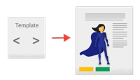

# [返回主目录](Readme.md)

# 目录 <!-- omit in toc --> 
- [返回主目录](#返回主目录)
- [组件简介](#组件简介)
  - [组件元数据](#组件元数据)
  - [模板与视图](#模板与视图)
  - [模板语法](#模板语法)
    - [数据绑定](#数据绑定)
    - [管道](#管道)
    - [指令](#指令)
      - [结构型指令](#结构型指令)
      - [属性型指令](#属性型指令)


# 组件简介
**组件控制**屏幕上被称为**视图的一小片区域**。比如：

- 带有导航链接的应用根组件。

- 英雄列表。

- 英雄编辑器


在**类中定义组件的应用逻辑**，为视图提供支持。 组件通过一些由**属性和方法**组成的 API **与视图交互**。  

比如，**HeroListComponent** 中有一个 名为**heroes的属性**，它**储存着一个数组**的**英雄数据**。 HeroListComponent 还有一个 **selectHero() 方法**，当用户从列表中选择一个英雄时，它会**设置 selectedHero 属性的值**。 该组件会**从服务获取英雄列表**，它是一个 TypeScript 的**构造器参数型属性**。本服务通过**依赖注入系统提供给该组件**。  

```ts
export class HeroListComponent implements OnInit {
  heroes: Hero[];
  selectedHero: Hero;

  constructor(private service: HeroService) { }

  ngOnInit() {
    this.heroes = this.service.getHeroes();
  }

  selectHero(hero: Hero) { this.selectedHero = hero; }
}
```

应用可以通过一些可选的**生命周期钩子（比如ngOnInit()）来在每个特定的时机采取行动**。  

## 组件元数据 

**@Component 装饰器**会指出紧随其后的那个类是个组件类，并为其指定元数据。

一个类，**加上了 @Component 装饰器，它才变成了组件**。  


组件的元数据告诉 Angular 到哪里获取它需要的主要构造块，以创建和展示这个组件及其视图。   

组件的元数据把一个**模板**（无论是直接内联在代码中还是引用的外部文件）和该**组件**关联起来。 该**组件及其模板，共同描述了一个视图**。

@Component 的元数据还会配置要**如何在 HTML 中引用该组件**，以及**该组件需要哪些服务**等等。  

```ts
@Component({
  selector:    'app-hero-list',
  templateUrl: './hero-list.component.html',
  styleUrls: ['./hero-list.component.scss']
  providers:  [ HeroService ]
})
export class HeroListComponent implements OnInit {
/* . . . */
}
```

- **selector**：是一个 **CSS 选择器**，它会告诉 Angular，一旦在模板 HTML 中找到了这个选择器**对应的标签**，就**创建并插入该组件的一个实例**。 比如，如果应用的 HTML 中包含 <app-hero-list></app-hero-list>，Angular 就会在这些标签中插入一个 HeroListComponent 实例的视图。  

- **templateUrl**：该**组件的 HTML 模板文件相对于这个组件文件的地址**。 另外，你**还可以用 template 属性的值来提供内联的 HTML 模板**。 这个模板定义了该组件的宿主视图。  

- **styleUrls**: 该**组件的HTML模板文件所对应的样式表文件的一个数据**。该样式表数组仅适用于该组件，不会影响其他组件的样式。  

- **providers**：当前**组件所需的服务提供商的一个数组**。在这个例子中，它告诉 Angular 该如何提供一个 HeroService 实例，以获取要显示的英雄列表。

## 模板与视图

你要通过组件的配套**模板来定义其视图**。**模板就是一种 HTML**，它会告诉 Angular 如何渲染该组件。  

**视图**通常会分层次进行组织，让你能**以 UI 分区或页面为单位进行修改、显示或隐藏**。

与**组件直接关联的模板**会定义该组件的**宿主视图**。该组件还可以定义一个**带层次结构的视图**，它**包含一些内嵌的视图作为其它组件的宿主**。  


**带层次结构的视图**可以**包含同一模块（NgModule）中组件的视图**，**也可以（而且经常会）包含其它模块中定义的组件的视图**。  

## 模板语法
 你的模板可以使用**数据绑定**来协调应用和 DOM 中的数据，  
 使用**管道**在显示出来之前对其进行转换，  
 使用**指令**来把程序逻辑应用到要显示的内容上。  

```ts
h2>Hero List</h2>

<p><i>Pick a hero from the list</i></p>
<ul>
  <li *ngFor="let hero of heroes" (click)="selectHero(hero)">
    {{hero.name}}
  </li>
</ul>

<app-hero-detail *ngIf="selectedHero" [hero]="selectedHero"></app-hero-detail>
```

**`*ngFor，{{hero.name}}，click、[hero] 和 <app-hero-detail>`**。这些模板语法元素告诉 Angular 该如何根据程序逻辑和数据在屏幕上渲染 HTML。  

- **`*ngFor`** 指令告诉 Angular 在一个列表上进行迭代。

- **`{{hero.name}}、(click) 和 [hero]`** 把程序数据绑定到及绑定回 DOM，以响应用户的输入。

- 模板中的 **`<app-hero-detail> `标签是一个代表新组件** HeroDetailComponent 的元素。 

### 数据绑定
Angular 支持**双向数据绑定**，这是一种对模板中的各个部件与组件中的各个部件进行协调的机制。   
下图显示了**数据绑定标记的四种形式**。每种形式都有一个方向 —— 从组件到 DOM、从 DOM 到组件或双向。


例如：
```ts
<li>{{hero.name}}</li>
<app-hero-detail [hero]="selectedHero"></app-hero-detail>
<li (click)="selectHero(hero)"></li>
<input [(ngModel)]="hero.name">
```
- `{{hero.name}}`**插值表达式**在` <li> `标签中显示组件的 hero.name 属性的值。

- `[hero]`**属性绑定**把父组件的 selectedHero 的值传到子组件的 hero 属性中。

- 当用户点击时，`(click)` **事件绑定**会调用组件的 selectHero 方法。
- `[(ng-model)]="property"` **双向数据绑定**（主要用于模板驱动表单中），它会把属性绑定和事件绑定组合成一种单独的写法。  


在**双向绑定**中，**数据属性值通过属性绑定从组件流到输入框。用户的修改通过事件绑定流回组件**，把属性值设置为最新的值。

### 管道
Angular 的**管道**可以让你**在模板中声明显示值的转换逻辑**。
带有 **@Pipe 装饰器的类**中会定义一个转换函数，用来把输入值转换成供视图显示用的输出值。

**Angular 自带了很多管道**，比如 date 管道和 currency 管道，你也可以**自己定义一些新管道**。
要在 HTML 模板中**指定值的转换方式**，请使用 **管道操作符 (|)**。

`{{interpolated_value | pipe_name}}`

可以把**管道串联起来**，把一个管道函数的输出送给另一个管道函数进行转换。 管道**还能接收一些参数**，来控制它该如何进行转换。

```html
<!-- Default format: output 'Jun 15, 2015'-->

 <p>Today is {{today | date}}</p>

<!-- fullDate format: output 'Monday, June 15, 2015'-->

<p>The date is {{today | date:'fullDate'}}</p>

 <!-- shortTime format: output '9:43 AM'-->

 <p>The time is {{today | date:'shortTime'}}</p>
```

### 指令

Angular 的**模板是动态的**。当 Angular 渲染它们的时候，会**根据指令给出的指示对 DOM 进行转换**。 指令就是一个**带有 @Directive() 装饰器的类**。

**组件**从技术角度上说就**是一个指令**，但是由于组件对 Angular 应用来说非常独特、非常重要，因此 Angular 专门定义了 @Component() 装饰器，它使用一些面向模板的特性扩展了 @Directive() 装饰器。

除组件外，还有两种指令：**结构型指令**和**属性型指令**。  Angular 本身定义了一系列这两种类型的指令，你也可以**使用 @Directive() 装饰器来定义自己的指令**。

像组件一样，**指令的元数据把它所装饰的指令类和一个 selector 关联起来，selector 用来把该指令插入到 HTML 中**。 在模板中，**指令通常作为属性出现在元素标签上，可能仅仅作为名字出现，也可能作为赋值目标或绑定目标出现**。

#### 结构型指令
**结构型指令通过添加、移除或替换 DOM 元素来修改布局**。
```html
<li *ngFor="let hero of heroes"></li>
<app-hero-detail *ngIf="selectedHero"></app-hero-detail>
```
- ***ngFor 是一个迭代器**，它要求 Angular 为 heroes 列表中的每个英雄渲染出一个 `<li>`。

- ***ngIf 是个条件语句**，只有当选中的英雄存在时，它才会包含 HeroDetail 组件。

#### 属性型指令
**属性型指令会修改现有元素的外观或行为**。 
**ngModel 指令就是属性型指令**的一个例子，它实现了双向数据绑定。  
```html
<input [(ngModel)]="hero.name">
```

Angular 还有很多预定义指令既不修改布局结构（比如 **ngSwitch**），也不修改 DOM 元素和组件的样子（比如 **ngStyle** 和 **ngClass**）。


