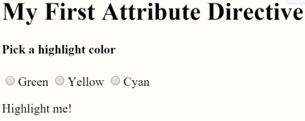

# [返回主目录](Readme.md)<!-- omit in toc --> 

# 目录 <!-- omit in toc --> 
- [属性型指令](#%e5%b1%9e%e6%80%a7%e5%9e%8b%e6%8c%87%e4%bb%a4)
- [指令概览](#%e6%8c%87%e4%bb%a4%e6%a6%82%e8%a7%88)
- [创建一个简单的属性型指令](#%e5%88%9b%e5%bb%ba%e4%b8%80%e4%b8%aa%e7%ae%80%e5%8d%95%e7%9a%84%e5%b1%9e%e6%80%a7%e5%9e%8b%e6%8c%87%e4%bb%a4)
  - [编写指令代码](#%e7%bc%96%e5%86%99%e6%8c%87%e4%bb%a4%e4%bb%a3%e7%a0%81)
- [使用属性型指令](#%e4%bd%bf%e7%94%a8%e5%b1%9e%e6%80%a7%e5%9e%8b%e6%8c%87%e4%bb%a4)
- [响应用户引发的事件](#%e5%93%8d%e5%ba%94%e7%94%a8%e6%88%b7%e5%bc%95%e5%8f%91%e7%9a%84%e4%ba%8b%e4%bb%b6)
- [使用@Input数据绑定向指令传递值](#%e4%bd%bf%e7%94%a8input%e6%95%b0%e6%8d%ae%e7%bb%91%e5%ae%9a%e5%90%91%e6%8c%87%e4%bb%a4%e4%bc%a0%e9%80%92%e5%80%bc)
  - [绑定到 @Input 属性](#%e7%bb%91%e5%ae%9a%e5%88%b0-input-%e5%b1%9e%e6%80%a7)
  - [绑定到@Input别名](#%e7%bb%91%e5%ae%9a%e5%88%b0input%e5%88%ab%e5%90%8d)
- [写个测试程序实验一下](#%e5%86%99%e4%b8%aa%e6%b5%8b%e8%af%95%e7%a8%8b%e5%ba%8f%e5%ae%9e%e9%aa%8c%e4%b8%80%e4%b8%8b)
- [绑定到第二个属性](#%e7%bb%91%e5%ae%9a%e5%88%b0%e7%ac%ac%e4%ba%8c%e4%b8%aa%e5%b1%9e%e6%80%a7)
- [小结](#%e5%b0%8f%e7%bb%93)
  - [附录：为什么要加@Input？](#%e9%99%84%e5%bd%95%e4%b8%ba%e4%bb%80%e4%b9%88%e8%a6%81%e5%8a%a0input)


# 属性型指令
属性型指令用于改变一个 DOM 元素的外观或行为。

# 指令概览
在 Angular 中**有三种类型的指令**：

1. 组件 — **拥有模板的指令**
2. 结构型指令 — **通过添加和移除 DOM 元素改变 DOM 布局的指令**
3. 属性型指令 — **改变元素、组件或其它指令的外观和行为的指令**。

**组件**是这三种指令中最常用的。

**结构型指令修改视图的结构**。例如，NgFor 和 NgIf。

**属性型指令改变一个元素的外观或行为**。例如，内置的 NgStyle 指令可以同时修改元素的多个样式。

# 创建一个简单的属性型指令

属性型指令**至少需要一个带有 @Directive 装饰器的控制器类**。**该装饰器指定了一个用于标识属性的选择器。 控制器类实现了指令需要的指令行为**。

展示了如何创建一个简单的属性型指令 appHighlight ，当用户把鼠标悬停在一个元素上时，改变它的背景色。你可以这样用它：

```html
<p appHighlight>Highlight me!</p>
```
**注意，指令不支持命名空间。**
```html
<!-- ERROR -->
<p app:Highlight>This is invalid</p>
```

## 编写指令代码
在命令行窗口下用 CLI 命令 ng generate directive 创建指令类文件。
```pwsh
ng generate directive highlight
```

CLI 会创建 src/app/highlight.directive.ts 及相应的测试文件（src/app/highlight.directive.spec.ts），并且在根模块 AppModule 中声明这个指令类。

> 和组件一样，这些指令也必须在Angular 模块中进行声明。

生成的 src/app/highlight.directive.ts 文件如下：
```ts
import { Directive } from '@angular/core';

@Directive({
  selector: '[appHighlight]'
})
export class HighlightDirective {
  constructor() { }
}
```
这里导入的 Directive 符号提供了 Angular 的 @Directive 装饰器。

@Directive 装饰器的配置属性中指定了该指令的 CSS 属性型选择器 [appHighlight]

**这里的方括号([])表示它的属性型选择器**。 Angular 会在模板中定位每个拥有名叫 appHighlight 属性的元素，并且为这些元素加上本指令的逻辑。

正因如此，这类指令被称为 属性选择器 。

> ## 为什么不直接叫"highlight"？  
> 尽管 highlight 是一个比 appHighlight 更简洁的名字，而且它确实也能工作。 但是最佳实践是在选择器名字前面添加前缀，以确保它们不会与标准 HTML 属性冲突。 它同时减少了与第三方指令名字发生冲突的危险。  
> 确认你没有给 highlight 指令添加ng前缀。 那个前缀属于 Angular，使用它可能导致难以诊断的 bug。例如，这个简短的前缀 app 可以帮助你区分自定义指令。  

**紧跟在 @Directive 元数据之后的就是该指令的控制器类，名叫 HighlightDirective，它包含了该指令的逻辑（目前为空逻辑）。然后导出 HighlightDirective，以便它能在别处访问到。**

现在，把刚才生成的 src/app/highlight.directive.ts 编辑成这样：

```ts
import { Directive, ElementRef } from '@angular/core';

@Directive({
  selector: '[appHighlight]'
})
export class HighlightDirective {
    constructor(el: ElementRef) {
       el.nativeElement.style.backgroundColor = 'yellow';
    }
}
```
import 语句还从 Angular 的 core 库中导入了一个 ElementRef 符号。

你可以在指令的构造函数中使用 ElementRef 来注入宿主 DOM 元素的引用，也就是你放置 appHighlight 的那个元素。

ElementRef 通过其 nativeElement 属性给你了直接访问宿主 DOM 元素的能力。

这里的第一个实现把宿主元素的背景色设置为了黄色。

# 使用属性型指令
要想使用这个新的 HighlightDirective，就往根组件 AppComponent 的模板中添加一个`<p> `元素，并把该指令作为一个属性使用。

```html
<p appHighlight>Highlight me!</p>
```

Angular 在宿主元素 `<p>` 上发现了一个 appHighlight 属性。 然后它创建了一个 HighlightDirective 类的实例，并把所在元素的引用注入到了指令的构造函数中。 在构造函数中，该指令把 `<p>` 元素的背景设置为了黄色。

# 响应用户引发的事件
当前，appHighlight 只是简单的设置元素的颜色。 这个指令应该在用户鼠标悬浮一个元素时，设置它的颜色。

先把 HostListener 加进导入列表中。

```ts
import { Directive, ElementRef, HostListener } from '@angular/core';
```
然后使用 HostListener 装饰器添加两个事件处理器，它们会在鼠标进入或离开时进行响应。
```ts
@HostListener('mouseenter') onMouseEnter() {
  this.highlight('yellow');
}

@HostListener('mouseleave') onMouseLeave() {
  this.highlight(null);
}

private highlight(color: string) {
  this.el.nativeElement.style.backgroundColor = color;
}
```
@HostListener 装饰器让你订阅某个属性型指令所在的宿主 DOM 元素的事件，在这个例子中就是 `<p>`。

> 当然，你可以通过标准的 JavaScript 方式手动给宿主 DOM 元素附加一个事件监听器。 但这种方法至少有三个问题：
> 1. 必须正确的书写事件监听器。
> 2. 当指令被销毁的时候，必须拆卸事件监听器，否则会导致内存泄露。
> 3. 必须直接和 DOM API 打交道，应该避免这样做。

这些处理器委托了一个辅助方法来为 DOM 元素（el）设置颜色。

这个辅助方法（highlight）被从构造函数中提取了出来。 修改后的构造函数只负责声明要注入的元素 el: ElementRef。

```ts
constructor(private el: ElementRef) { }
```
下面是修改后的指令代码：
```ts
import { Directive, ElementRef, HostListener } from '@angular/core';
 
@Directive({
  selector: '[appHighlight]'
})
export class HighlightDirective {
  constructor(private el: ElementRef) { }
 
  @HostListener('mouseenter') onMouseEnter() {
    this.highlight('yellow');
  }
 
  @HostListener('mouseleave') onMouseLeave() {
    this.highlight(null);
  }
 
  private highlight(color: string) {
    this.el.nativeElement.style.backgroundColor = color;
  }
}
```
运行本应用并确认：当把鼠标移到 p 上的时候，背景色就出现了，而移开时就消失了。


# 使用@Input数据绑定向指令传递值

高亮的颜色目前是硬编码在指令中的，这不够灵活。 在这一节中，你应该让指令的使用者可以指定要用哪种颜色进行高亮。

先从 @angular/core 中导入 Input。
```ts
import { Directive, ElementRef, HostListener, Input } from '@angular/core';
```

然后把 highlightColor 属性添加到指令类中，就像这样：

```ts
@Input() highlightColor: string;
```
## 绑定到 @Input 属性

注意看 @Input 装饰器。它往类上添加了一些元数据，从而让该指令的 highlightColor 能用于绑定。

它之所以称为输入属性，是因为数据流是从绑定表达式流向指令内部的。 如果没有这个元数据，Angular 就会拒绝绑定

试试把下列指令绑定变量添加到 AppComponent 的模板中：

```html
<p appHighlight highlightColor="yellow">Highlighted in yellow</p>
<p appHighlight [highlightColor]="'orange'">Highlighted in orange</p>
```
把 color 属性添加到 AppComponent 中：

```ts
export class AppComponent {
  color = 'yellow';
}
```

让它通过属性绑定来控制高亮颜色。

```html
<p appHighlight [highlightColor]="color">Highlighted with parent component's color</p>
```
很不错，但如果可以在应用该指令时在同一个属性中设置颜色就更好了，就像这样：
```html
<p [appHighlight]="color">Highlight me!</p>
```
[appHighlight] 属性同时做了两件事：把这个高亮指令应用到了 `<p>` 元素上，并且通过属性绑定设置了该指令的高亮颜色。 你复用了该指令的属性选择器 [appHighlight] 来同时完成它们。 这是清爽、简约的语法。

你还要把该指令的 highlightColor 改名为 appHighlight，因为它是颜色属性目前的绑定名。
```ts
@Input() appHighlight: string;
```
**这可不好。因为 appHighlight 是一个糟糕的属性名，而且不能反映该属性的意图。**

## 绑定到@Input别名
你可以随意命名该指令的属性，并且给它指定一个用于绑定的别名。

恢复原始属性名，并在 @Input 的参数中把该选择器指定为别名。

```ts
@Input('appHighlight') highlightColor: string;
```
在指令内部，该属性叫 highlightColor，在外部，你绑定到它地方，它叫 appHighlight。

这是最好的结果：理想的内部属性名，理想的绑定语法：
```html
<p [appHighlight]="color">Highlight me!</p>
```

现在，你通过别名绑定到了 highlightColor 属性，并修改 onMouseEnter() 方法来使用它。 如果有人忘了绑定到 appHighlightColor，那就用红色进行高亮。

```ts
@HostListener('mouseenter') onMouseEnter() {
  this.highlight(this.highlightColor || 'red');
}
```
**这是最终版本的指令类。**
```ts
import { Directive, ElementRef, HostListener, Input } from '@angular/core';

@Directive({
  selector: '[appHighlight]'
})
export class HighlightDirective {

  constructor(private el: ElementRef) { }

  @Input('appHighlight') highlightColor: string;

  @HostListener('mouseenter') onMouseEnter() {
    this.highlight(this.highlightColor || 'red');
  }

  @HostListener('mouseleave') onMouseLeave() {
    this.highlight(null);
  }

  private highlight(color: string) {
    this.el.nativeElement.style.backgroundColor = color;
  }
}
```
# 写个测试程序实验一下
凭空想象该指令如何工作可不容易。 在本节，你将把 AppComponent 改成一个测试程序，它让你可以通过单选按钮来选取高亮颜色，并且把你选取的颜色绑定到指令中。

把 app.component.html 修改成这样：
```html
<h1>My First Attribute Directive</h1>

<h4>Pick a highlight color</h4>
<div>
  <input type="radio" name="colors" (click)="color='lightgreen'">Green
  <input type="radio" name="colors" (click)="color='yellow'">Yellow
  <input type="radio" name="colors" (click)="color='cyan'">Cyan
</div>
<p [appHighlight]="color">Highlight me!</p>
```
修改 AppComponent.color，让它不再有初始值。
```ts
export class AppComponent {
  color: string;
}
```
下面是测试程序和指令的动图。



# 绑定到第二个属性
指令只有一个可定制属性，真实的应用通常需要更多。

目前，默认颜色（它在用户选取了高亮颜色之前一直有效）被硬编码为红色。应该允许模板的开发者设置默认颜色。

把第二个名叫 defaultColor 的输入属性添加到 HighlightDirective 中：

```ts
@Input() defaultColor: string;
```
修改该指令的 onMouseEnter，让它首先尝试使用 highlightColor 进行高亮，然后用 defaultColor，如果它们都没有指定，那就用红色作为后备。

```ts
@HostListener('mouseenter') onMouseEnter() {
  this.highlight(this.highlightColor || this.defaultColor || 'red');
}
```
当已经绑定过 appHighlight 属性时，要如何绑定到第二个属性呢？

像组件一样，你也可以绑定到指令的很多属性，只要把它们依次写在模板中就行了。 开发者可以绑定到 AppComponent.color，并且用紫罗兰色作为默认颜色，代码如下：

```html
<p [appHighlight]="color" defaultColor="violet">
  Highlight me too!
</p>
```

Angular 之所以知道 defaultColor 绑定属于 HighlightDirective，是因为你已经通过 @Input 装饰器把它设置成了公共属性。

当这些代码完成时，测试程序工作时的动图如下：


# 小结

本章介绍了如何：

- **构建一个属性型指令，它用于修改一个元素的行为。**

- **把一个指令应用到模板中的某个元素上。**

- **响应事件以改变指令的行为。**

- **把值绑定到指令中。**

最终的源码如下：
```ts
//app.component.ts
import { Component } from '@angular/core';

@Component({
  selector: 'app-root',
  templateUrl: './app.component.html'
})
export class AppComponent {
  color: string;
}
```
```html
<!-- app.component.html-->
<h1>My First Attribute Directive</h1>
 
<h4>Pick a highlight color</h4>
<div>
  <input type="radio" name="colors" (click)="color='lightgreen'">Green
  <input type="radio" name="colors" (click)="color='yellow'">Yellow
  <input type="radio" name="colors" (click)="color='cyan'">Cyan
</div>
<p [appHighlight]="color">Highlight me!</p>
 
<p [appHighlight]="color" defaultColor="violet">
  Highlight me too!
</p>
```
```ts
//highlight.directive.ts
/* tslint:disable:member-ordering */
import { Directive, ElementRef, HostListener, Input } from '@angular/core';
 
@Directive({
  selector: '[appHighlight]'
})
export class HighlightDirective {
 
  constructor(private el: ElementRef) { }
 
  @Input() defaultColor: string;
 
  @Input('appHighlight') highlightColor: string;
 
  @HostListener('mouseenter') onMouseEnter() {
    this.highlight(this.highlightColor || this.defaultColor || 'red');
  }
 
  @HostListener('mouseleave') onMouseLeave() {
    this.highlight(null);
  }
 
  private highlight(color: string) {
    this.el.nativeElement.style.backgroundColor = color;
  }
}
```
```ts
//app.module.ts
import { NgModule } from '@angular/core';
import { BrowserModule } from '@angular/platform-browser';
 
import { AppComponent } from './app.component';
import { HighlightDirective } from './highlight.directive';
 
@NgModule({
  imports: [ BrowserModule ],
  declarations: [
    AppComponent,
    HighlightDirective
  ],
  bootstrap: [ AppComponent ]
})
export class AppModule { }
```
## 附录：为什么要加@Input？
在这个例子中 hightlightColor 是 HighlightDirective 的一个输入型属性。你见过它没有用别名时的代码：
```ts
@Input() highlightColor: string;
```
也见过用别名时的代码：
```ts
@Input('appHighlight') highlightColor: string;
```
**无论哪种方式，@Input 装饰器都告诉 Angular，该属性是公共的，并且能被父组件绑定。 如果没有 @Input，Angular 就会拒绝绑定到该属性。**

但你以前也曾经把模板 HTML 绑定到组件的属性，而且从来没有用过 @Input。 差异何在？

> 差异在于信任度不同。 Angular 把组件的模板看做从属于该组件的。 组件和它的模板默认会相互信任。 这也就是意味着，组件自己的模板可以绑定到组件的任意属性，无论是否使用了 @Input 装饰器。

> 但组件或指令不应该盲目的信任其它组件或指令。 因此组件或指令的属性默认是不能被绑定的。 从 Angular 绑定机制的角度来看，它们是私有的，而当添加了 @Input 时，Angular 绑定机制才会把它们当成公共的。 只有这样，它们才能被其它组件或属性绑定。

你可以根据属性名在绑定中出现的位置来判定是否要加 @Input。

- **当它出现在等号右侧的模板表达式中时，它属于模板所在的组件，不需要 @Input 装饰器。**

- **当它出现在等号左边的方括号（[ ]）中时，该属性属于其它组件或指令，它必须带有 @Input 装饰器。**

试用此原理分析下列范例：
```html
<p [appHighlight]="color">Highlight me!</p>
```
- color 属性位于右侧的绑定表达式中，它属于模板所在的组件。 该模板和组件相互信任。因此 color 不需要 @Input 装饰器。

- appHighlight 属性位于左侧，它引用了 HighlightDirective 中一个带别名的属性，它不是模板所属组件的一部分，因此存在信任问题。 所以，该属性必须带 @Input 装饰器。