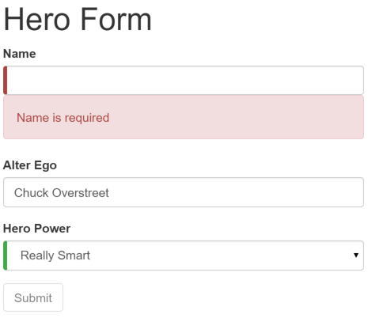
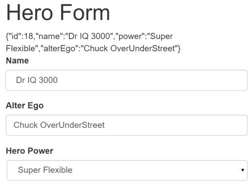

# [返回主目录](Readme.md)<!-- omit in toc --> 

# 目录 <!-- omit in toc --> 
- [模板驱动表单简介](#%e6%a8%a1%e6%9d%bf%e9%a9%b1%e5%8a%a8%e8%a1%a8%e5%8d%95%e7%ae%80%e4%bb%8b)
- [模板驱动表单](#%e6%a8%a1%e6%9d%bf%e9%a9%b1%e5%8a%a8%e8%a1%a8%e5%8d%95)
- [创建 Hero 模型类](#%e5%88%9b%e5%bb%ba-hero-%e6%a8%a1%e5%9e%8b%e7%b1%bb)
- [创建表单组件](#%e5%88%9b%e5%bb%ba%e8%a1%a8%e5%8d%95%e7%bb%84%e4%bb%b6)
- [修改app.module.ts](#%e4%bf%ae%e6%94%b9appmodulets)
- [修改app.component.ts](#%e4%bf%ae%e6%94%b9appcomponentts)
- [常见初始HTML表单模板](#%e5%b8%b8%e8%a7%81%e5%88%9d%e5%a7%8bhtml%e8%a1%a8%e5%8d%95%e6%a8%a1%e6%9d%bf)
- [用ngFor添加超能力](#%e7%94%a8ngfor%e6%b7%bb%e5%8a%a0%e8%b6%85%e8%83%bd%e5%8a%9b)
- [使用ngModel进行双向数据绑定](#%e4%bd%bf%e7%94%a8ngmodel%e8%bf%9b%e8%a1%8c%e5%8f%8c%e5%90%91%e6%95%b0%e6%8d%ae%e7%bb%91%e5%ae%9a)
  - [NgForm 指令](#ngform-%e6%8c%87%e4%bb%a4)
- [通过 ngModel 跟踪修改状态与有效性验证](#%e9%80%9a%e8%bf%87-ngmodel-%e8%b7%9f%e8%b8%aa%e4%bf%ae%e6%94%b9%e7%8a%b6%e6%80%81%e4%b8%8e%e6%9c%89%e6%95%88%e6%80%a7%e9%aa%8c%e8%af%81)
- [添加用于视觉反馈的自定义CSS](#%e6%b7%bb%e5%8a%a0%e7%94%a8%e4%ba%8e%e8%a7%86%e8%a7%89%e5%8f%8d%e9%a6%88%e7%9a%84%e8%87%aa%e5%ae%9a%e4%b9%89css)
- [显示和隐藏错误信息](#%e6%98%be%e7%a4%ba%e5%92%8c%e9%9a%90%e8%97%8f%e9%94%99%e8%af%af%e4%bf%a1%e6%81%af)
- [使用ngSubmit提交该表单](#%e4%bd%bf%e7%94%a8ngsubmit%e6%8f%90%e4%ba%a4%e8%af%a5%e8%a1%a8%e5%8d%95)
- [切换连个表单区域](#%e5%88%87%e6%8d%a2%e8%bf%9e%e4%b8%aa%e8%a1%a8%e5%8d%95%e5%8c%ba%e5%9f%9f)
- [小结](#%e5%b0%8f%e7%bb%93)

# 模板驱动表单简介

开发表单需要设计能力（那超出了本章的范围），而框架支持**双向数据绑定、变更检测、验证和错误处理**，而本章你将会学到它们。

这个页面演示了如何从草稿构建一个简单的表单。这个过程中你将学会如何：
- 用组件和模板构建 Angular 表单

- 用 ngModel 创建双向数据绑定，以读取和写入输入控件的值

- 跟踪状态的变化，并验证表单控件

- 使用特殊的 CSS 类来跟踪控件的状态并给出视觉反馈

- 向用户显示验证错误提示，以及启用/禁用表单控件

- 使用模板引用变量在 HTML 元素之间共享信息

# 模板驱动表单
通常，**使用 Angular 模板语法编写模板，结合本章所描述的表单专用指令和技术来构建表单**。

> 你还可以使用响应式（也叫模型驱动）的方式来构建表单。不过本章中只介绍模板驱动表单。

利用 Angular 模板，可以构建几乎所有表单 — 登录表单、联系人表单…… 以及任何的商务表单。 可以创造性地摆放各种控件、把它们绑定到数据、指定校验规则、显示校验错误、有条件的禁用或 启用特定的控件、触发内置的视觉反馈等等，不胜枚举。

它用起来很简单，这是因为 Angular 处理了大多数重复、单调的任务，这让你可以不必亲自操刀、身陷其中。

你将学习构建如下的“模板驱动”表单：


这里是英雄职业介绍所，使用这个表单来维护候选英雄们的个人信息。每个英雄都需要一份工作。 公司的使命就是让合适的英雄去应对恰当的危机！

表单中的三个字段，其中两个是必填的。必填的字段在左侧有个绿色的竖条，方便用户分辨哪些是必填项。

如果删除了英雄的名字，表单就会用醒目的样式把验证错误显示出来。



注意，提交按钮被禁用了，而且输入控件左侧的“必填”条从绿色变为了红色。

> 稍后，会使用标准 CSS 来定制“必填”条的颜色和位置。

你将一点点构建出此表单：

1. 创建 Hero 模型类

2. 创建控制此表单的组件。

3. 创建具有初始表单布局的模板。

4. 使用 ngModel 双向数据绑定语法把数据属性绑定到每个表单输入控件。

5. 往每个表单输入控件上添加 name 属性 (attribute)。

6. 添加自定义 CSS 来提供视觉反馈。

7. 显示和隐藏有效性验证的错误信息。

8. 使用 ngSubmit 处理表单提交。

9. 禁用此表单的提交按钮，直到表单变为有效。

# 创建 Hero 模型类

最简单的模型是个“属性包”，用来存放应用中一件事物的事实。 这里使用三个必备字段 (id、name、power)，和一个可选字段 (alterEgo，译注：中文含义是第二人格，例如 X 战警中的 Jean / 黑凤凰)。

使用 Angular CLI 命令 ng generate class 生成一个名叫 Hero 的新类：

```
ng generate class Hero
```

内容如下：

```ts
export class Hero {

  constructor(
    public id: number,
    public name: string,
    public power: string,
    public alterEgo?: string
  ) {  }

}
```
这是一个少量需求和零行为的贫血模型。对演示来说很完美。

TypeScript 编译器为每个 public 构造函数参数生成一个公共字段，在创建新的英雄实例时，自动把参数值赋给这些公共字段。

alterEgo 是可选的，调用构造函数时可省略，注意 alterEgo? 中的问号 (?)。

可以这样创建新英雄：

```ts
let myHero =  new Hero(42, 'SkyDog',
                       'Fetch any object at any distance',
                       'Leslie Rollover');
console.log('My hero is called ' + myHero.name); // "My hero is called SkyDog"
```

# 创建表单组件

**Angular 表单分为两部分：基于 HTML 的模板和组件类**，用来程序处理数据和用户交互。 先从组件类开始，是因为它可以简要说明英雄编辑器能做什么。


使用 Angular CLI 命令 ng generate component 生成一个名叫 HeroForm 的新组件：

```
ng generate component HeroForm
```
内容如下：
```ts
import { Component } from '@angular/core';

import { Hero }    from '../hero';

@Component({
  selector: 'app-hero-form',
  templateUrl: './hero-form.component.html',
  styleUrls: ['./hero-form.component.css']
})
export class HeroFormComponent {

  powers = ['Really Smart', 'Super Flexible',
            'Super Hot', 'Weather Changer'];

  model = new Hero(18, 'Dr IQ', this.powers[0], 'Chuck Overstreet');

  submitted = false;

  onSubmit() { this.submitted = true; }

  // TODO: Remove this when we're done
  get diagnostic() { return JSON.stringify(this.model); }
}
```
只要用前面章节中学过的 Angular 概念，就可以完全理解这个组件：
- 这段代码导入了 Angular 核心库以及你刚刚创建的 Hero 模型。

- @Component 选择器“hero-form”表示可以用 <app-hero-form> 标签把这个表单放进父模板。

- templateUrl 属性指向一个独立的 HTML 模板文件。

- 你定义了一些用来演示的，关于 model 和 powers 的模拟数据。

接下来，你可以注入一个数据服务，以获取或保存真实的数据，或者把这些属性暴露为输入属性和输出属性,来绑定到一个父组件。这不是现在需要关心的问题，未来的更改不会影响到这个表单。

- 你添加一个 diagnostic 属性，以返回这个模型的 JSON 形式。在开发过程中，它用于调试，最后清理时会丢弃它。

# 修改app.module.ts
app.module.ts 定义了应用的根模块。其中标识即将用到的外部模块，以及声明属于本模块中的组件，例如 HeroFormComponent。

因为模板驱动的表单位于它们自己的模块，所以在使用表单之前，需要将 FormsModule 添加到应用模块的 imports 数组中。

对它做如下修改：
```ts
import { NgModule }      from '@angular/core';
import { BrowserModule } from '@angular/platform-browser';
import { FormsModule }   from '@angular/forms';

import { AppComponent }  from './app.component';
import { HeroFormComponent } from './hero-form/hero-form.component';

@NgModule({
  imports: [
    BrowserModule,
    FormsModule
  ],
  declarations: [
    AppComponent,
    HeroFormComponent
  ],
  providers: [],
  bootstrap: [ AppComponent ]
})
export class AppModule { }
```
> 有两处更改
> 1. 导入 FormsModule。
> 2. 把 FormsModule 添加到 ngModule 装饰器的 imports 列表中，这样应用就能访问模板驱动表单的所有特性，包括 ngModel。

> 如果某个组件、指令或管道是属于 imports 中所导入的某个模块的，那就不能再把它再声明到本模块的 declarations 数组中。 如果它是你自己写的，并且确实属于当前模块，才应该把它声明在 declarations 数组中。

# 修改app.component.ts
AppComponent 是应用的根组件，HeroFormComponent 将被放在其中。

把模板中的内容替换成如下代码：
```html
<app-hero-form></app-hero-form>
```
# 常见初始HTML表单模板
```html
<!--hero-form.component.html-->
<div class="container">
    <h1>Hero Form</h1>
    <form>
      <div class="form-group">
        <label for="name">Name</label>
        <input type="text" class="form-control" id="name" required>
      </div>

      <div class="form-group">
        <label for="alterEgo">Alter Ego</label>
        <input type="text" class="form-control" id="alterEgo">
      </div>

      <button type="submit" class="btn btn-success">Submit</button>

    </form>
</div>
```
这只是一段普通的旧式 HTML 5 代码。这里有两个 Hero 字段，name 和 alterEgo，供用户输入。

Name `<input>` 控件具有 HTML5 的 required 属性；但 Alter Ego `<input>` 控件没有，因为 alterEgo 字段是可选的。

在底部添加个 Submit 按钮，它还带一些 CSS 样式类。

你还没有真正用到 Angular。没有绑定，没有额外的指令，只有布局。


> 在模板驱动表单中，你只要导入了 FormsModule 就不用对 `<form>`做任何改动来使用 FormsModule。接下来你会看到它的原理。

container、form-group、form-control 和 btn 类来自 Twitter Bootstrap。这些类纯粹是装饰品。 Bootstrap 为这个表单提供了一些样式。

ANGULAR 表单不需要任何样式库

Angular 不需要 container、form-group、form-control 和 btn 类， 或者外部库的任何样式。Angular 应用可以使用任何 CSS 库…… ，或者啥都不用。

要添加样式表，就打开 styles.css，并把下列代码添加到顶部：

```css
@import url('https://unpkg.com/bootstrap@3.3.7/dist/css/bootstrap.min.css');
```
# 用ngFor添加超能力

英雄必须从认证过的固定列表中选择一项超能力。 这个列表位于 HeroFormComponent 中。

在表单中添加 select，用 ngFor 把 powers 列表绑定到列表选项。 之前的显示数据一章中见过 ngFor。

在 Alter Ego 的紧下方添加如下 HTML：

```html
<div class="form-group">
  <label for="power">Hero Power</label>
  <select class="form-control" id="power" required>
    <option *ngFor="let pow of powers" [value]="pow">{{pow}}</option>
  </select>
</div>
```
列表中的每一项超能力都会渲染成 `<option>` 标签。 模板输入变量 pow 在每个迭代指向不同的超能力，使用双花括号插值表达式语法来显示它的名称。

# 使用ngModel进行双向数据绑定
如果立即运行此应用，你将会失望。


因为还没有绑定到某个英雄，所以看不到任何数据。 解决方案见前面的章节。 显示数据介绍了属性绑定。 用户输入介绍了如何通过事件绑定来监听 DOM 事件，以及如何用显示值更新组件的属性。

现在，需要同时进行显示、监听和提取。

虽然可以在表单中再次使用这些技术。 但是，这里将介绍个新东西，[(ngModel)] 语法，使表单绑定到模型的工作变得超级简单。

找到 Name 对应的 `<input>` 标签，并且像这样修改它：
```html
<input type="text" class="form-control" id="name"
       required
       [(ngModel)]="model.name" name="name">
TODO: remove this: {{model.name}}
```
在 input 标签后添加用于诊断的插值表达式，以看清正在发生什么事。 给自己留个备注，提醒你完成后移除它。

聚焦到绑定语法 [(ngModel)]="..." 上。

你需要更多的工作来显示数据。在表单中声明一个模板变量。往 <form> 标签中加入 #heroForm="ngForm"，代码如下：
```html
<form #heroForm="ngForm">
```

heroForm 变量是一个到 NgForm 指令的引用，它代表该表单的整体。

## NgForm 指令

什么是 NgForm 指令？ 但你明明没有添加过NgForm指令啊！

> Angular 替你做了。Angular 会在 <form> 标签上自动创建并附加一个 NgForm 指令。

> NgForm 指令为 form 增补了一些额外特性。 它会控制那些带有 ngModel 指令和 name 属性的元素，监听他们的属性（包括其有效性）。 它还有自己的 valid 属性，这个属性只有在它包含的每个控件都有效时才是真。

如果现在运行这个应用，开始在姓名输入框中键入，添加和删除字符，将看到它们从插值结果中显示和消失。 某一瞬间，它可能是这样的：


诊断信息可以证明，数据确实从输入框流动到模型，再反向流动回来。

**注意，`<input>` 标签还添加了 name 属性 (attribute)，并设置为 "name"，表示英雄的名字。 使用任何唯一的值都可以，但使用具有描述性的名字会更有帮助。 当在表单中使用 [(ngModel)] 时，必须要定义 name 属性。**

**在内部，Angular 创建了一些 FormControl，并把它们注册到 Angular 附加到 `<form>` 标签上的 NgForm 指令。 注册每个 FormControl 时，使用 name 属性值作为键值。**
  
为第二人格和超能力属性添加类似的 [(ngModel)] 绑定和 name 属性。 抛弃输入框的绑定消息，在组件顶部添加到 diagnostic 属性的新绑定。 这样就能确认双向数据绑定在整个 Hero 模型上都能正常工作了。

修改之后，这个表单的核心是这样的：
```html
{{diagnostic}}
<div class="form-group">
  <label for="name">Name</label>
  <input type="text" class="form-control" id="name"
         required
         [(ngModel)]="model.name" name="name">
</div>

<div class="form-group">
  <label for="alterEgo">Alter Ego</label>
  <input type="text"  class="form-control" id="alterEgo"
         [(ngModel)]="model.alterEgo" name="alterEgo">
</div>

<div class="form-group">
  <label for="power">Hero Power</label>
  <select class="form-control"  id="power"
          required
          [(ngModel)]="model.power" name="power">
    <option *ngFor="let pow of powers" [value]="pow">{{pow}}</option>
  </select>
</div>
```

- 每个 input 元素都有 id 属性，label 元素的 for 属性用它来匹配到对应的输入控件。

- 每个 input 元素都有 name 属性，Angular 表单用它注册控件。

如果现在运行本应用，修改 Hero 模型的每个属性，表单是这样的：



表单顶部的诊断信息反映出所做的一切更改。

表单顶部的 {{diagnostic}} 绑定已经完成了它的使命，删除它。

# 通过 ngModel 跟踪修改状态与有效性验证
在表单中使用 ngModel 可以获得比仅使用双向数据绑定更多的控制权。它还会告诉你很多信息：用户碰过此控件吗？它的值变化了吗？数据变得无效了吗？

**NgModel 指令不仅仅跟踪状态。它还使用特定的 Angular CSS 类来更新控件，以反映当前状态。 可以利用这些 CSS 类来修改控件的外观，显示或隐藏消息。**


状态 | 为真时的 CSS 类 | 为假时的 CSS 类
--|--|--
控件被访问过。|	ng-touched|	ng-untouched
控件的值变化了。	|ng-dirty|	ng-pristine
控件的值有效。	|ng-valid|	ng-invalid

往姓名 `<input>` 标签上添加名叫 spy 的临时模板引用变量， 然后用这个 spy 来显示它上面的所有 CSS 类。

```html
<input type="text" class="form-control" id="name"
  required
  [(ngModel)]="model.name" name="name"
  #spy>
<br>TODO: remove this: {{spy.className}}
```

现在，运行本应用，并让姓名输入框获得焦点。 然后严格按照下面四个步骤来做：

1. 查看输入框，但别碰它。

2. 点击输入框，然后点击输入框外面。

3. 在名字的末尾添加些斜杠。

4. 删除名字。

动作和它对应的效果如下：


你会看到下列转换及其类名：


(ng-valid | ng-invalid)这一对是最有趣的部分，因为当数据变得无效时，你希望发出强力的视觉信号， 还想要标记出必填字段。可以通过加入自定义 CSS 来提供视觉反馈。

删除模板引用变量 #spy 和 TODO，因为它们已经完成了使命。

# 添加用于视觉反馈的自定义CSS
可以在输入框的左侧添加带颜色的竖条，用于标记必填字段和无效输入：


在新建的 forms.css 文件中，添加两个样式来实现这一效果。把这个文件添加到项目中，与 index.html 相邻。

```css
.ng-valid[required], .ng-valid.required  {
  border-left: 5px solid #42A948; /* green */
}

.ng-invalid:not(form)  {
  border-left: 5px solid #a94442; /* red */
}
```

修改 index.html 中的 `<head>`，以包含这个样式表：

```html
<link rel="stylesheet" href="assets/forms.css">
```

# 显示和隐藏错误信息
你还能做的更好。“Name” 输入框是必填的，清空它会让左侧的条变红。这表示某些东西是错的，但用户不知道错在哪里，或者如何纠正。 可以借助 ng-invalid 类来给出有用的提示。

当用户删除姓名时，应该是这样的：


要达到这个效果，在 `<input>` 标签中添加：

- 模板引用变量

- “is required”消息，放在邻近的 `<div>` 元素中，只有当控件无效时，才显示它。

下面这个例子中把一条错误信息添加到了name输入框中：
```html
<label for="name">Name</label>
<input type="text" class="form-control" id="name"
       required
       [(ngModel)]="model.name" name="name"
       #name="ngModel">
<div [hidden]="name.valid || name.pristine"
     class="alert alert-danger">
  Name is required
</div>
```

模板引用变量可以访问模板中输入框的 Angular 控件。 这里，创建了名叫 name 的变量，并且赋值为 "ngModel"。

> 为什么是 “ngModel”？ 指令的 exportAs 属性告诉 Angular 如何链接模板引用变量到指令。 这里把 name 设置为 ngModel 是因为 ngModel 指令的 exportAs 属性设置成了 “ngModel”。

你把 div 元素的 hidden 属性绑定到 name 控件的属性，这样就可以控制“姓名”字段错误信息的可见性了。

```html
<div [hidden]="name.valid || name.pristine"
     class="alert alert-danger">
```

上例中，当控件是有效的 (valid) 或全新的 (pristine) 时，隐藏消息。 “全新的”意味着从它显示在表单中开始，用户还从未修改过它的值。

这种用户体验取决于开发人员的选择。有些人会希望任何时候都显示这条消息。 如果忽略了 pristine 状态，就会只在值有效时隐藏此消息。 如果往这个组件中传入全新（空）的英雄，或者无效的英雄，将立刻看到错误信息 —— 虽然你还啥都没做。

有些人会为这种行为感到不安。它们希望只有在用户做出无效的更改时才显示这个消息。 如果当控件是“全新”状态时也隐藏消息，就能达到这个目的。 在往表单中添加新英雄时，将看到这种选择的重要性。

英雄的第二人格是可选项，所以不用改它。

英雄的超能力选项是必填的。 只要愿意，可以往 `<select>` 上添加相同的错误处理。 但没有必要，这个选择框已经限制了“超能力”只能选有效值。

现在，你要在这个表单中添加新的英雄。 在表单的底部放置“New Hero（新增英雄）”按钮，并把它的点击事件绑定到组件上的 newHero 方法。

```html
<button type="button" class="btn btn-default" (click)="newHero()">New Hero</button>
```
```ts
newHero() {
  this.model = new Hero(42, '', '');
}
```
再次运行应用，点击 New Hero 按钮，表单被清空了。 输入框左侧的必填项竖条是红色的，表示 name 和 power 属性是无效的。 这可以理解，因为有一些必填字段。 错误信息是隐藏的，因为表单还是全新的，还没有修改任何东西。

输入名字，再次点击 New Hero 按钮。 这次，出现了错误信息！为什么？你不希望显示新（空）的英雄时，出现错误信息。

使用浏览器工具审查这个元素就会发现，这个 name 输入框并不是全新的。 表单记得你在点击 New Hero 前输入的名字。 更换了英雄对象并不会重置控件的“全新”状态。

你必须清除所有标记，在调用 newHero() 方法后调用表单的 reset() 方法即可。

```html
<button type="button" class="btn btn-default" (click)="newHero(); heroForm.reset()">New Hero</button>
```
现在点击“New Hero”重设表单和它的控制标记。

# 使用ngSubmit提交该表单

在填表完成之后，用户还应该能提交这个表单。 “Submit（提交）”按钮位于表单的底部，它自己不做任何事，但因为有特殊的 type 值 (type="submit")，所以会触发表单提交。

现在这样仅仅触发“表单提交”是没用的。 要让它有用，就要把该表单的 ngSubmit 事件属性绑定到英雄表单组件的 onSubmit() 方法上：

```html
<form (ngSubmit)="onSubmit()" #heroForm="ngForm">
```

你已经定义了一个模板引用变量 #heroForm，并且把赋值为“ngForm”。 现在，就可以在“Submit”按钮中访问这个表单了。

你要把表单的总体有效性通过 heroForm 变量绑定到此按钮的 disabled 属性上，代码如下：

```html
<button type="submit" class="btn btn-success" [disabled]="!heroForm.form.valid">Submit</button>
```

重新运行应用。表单打开时，状态是有效的，按钮是可用的。

现在，如果你删除姓名，就会违反“必填姓名”规则，就会像以前那样显示出错误信息。同时，Submit 按钮也被禁用了。

没感觉吗？再想一会儿。如果没有 Angular NgForm 的帮助，又该怎么让按钮的禁用/启用状态和表单的有效性关联起来呢？

对你来说，它就是这么简单：

1. 定义模板引用变量，放在（强化过的）form 元素上

2. 从很多行之外的按钮上引用这个变量。

# 切换连个表单区域

提交表单还是不够激动人心。

来实现一些更炫的视觉效果吧。 隐藏掉数据输入框，显示一些别的东西。

先把表单包裹进 `<div>` 中，再把它的 hidden 属性绑定到 HeroFormComponent.submitted 属性。

```html
<div [hidden]="submitted">
  <h1>Hero Form</h1>
  <form (ngSubmit)="onSubmit()" #heroForm="ngForm">

     <!-- ... all of the form ... -->

  </form>
</div>
```
主表单从一开始就是可见的，因为 submitted 属性是 false，直到提交了这个表单。 来自 HeroFormComponent 的代码片段证实了这一点：

```ts
submitted = false;

onSubmit() { this.submitted = true; }
```

当点击 Submit 按钮时，submitted 标志会变成 true，并且表单像预想中一样消失了。

现在，当表单处于已提交状态时，需要显示一些别的东西。 在刚刚写的 `<div>` 包装下方，添加下列 HTML 语句：

```html
<div [hidden]="!submitted">
  <h2>You submitted the following:</h2>
  <div class="row">
    <div class="col-xs-3">Name</div>
    <div class="col-xs-9">{{ model.name }}</div>
  </div>
  <div class="row">
    <div class="col-xs-3">Alter Ego</div>
    <div class="col-xs-9">{{ model.alterEgo }}</div>
  </div>
  <div class="row">
    <div class="col-xs-3">Power</div>
    <div class="col-xs-9">{{ model.power }}</div>
  </div>
  <br>
  <button class="btn btn-primary" (click)="submitted=false">Edit</button>
</div>
```

英雄又出现了，它通过插值表达式绑定显示为只读内容。 这一小段 HTML 只在组件处于已提交状态时才会显示。

这段 HTML 包含一个 “Edit（编辑）”按钮，它的 click 事件绑定到了一个用于清除 submitted 标志的表达式。

当点 Edit 按钮时，这个只读块消失了，可编辑的表单重新出现了。

# 小结

本章讨论的 Angular 表单技术利用了下列框架特性来支持数据修改、验证和更多操作：

- Angular HTML 表单模板。

- 带有 @Component 装饰器的表单组件类。

- 通过绑定到 NgForm.ngSubmit 事件属性来处理表单提交。

- 模板引用变量，例如 #heroForm 和 #name。

- [(ngModel)] 语法用来实现双向数据绑定。

- name 属性的用途是有效性验证和对表单元素的变更进行追踪。

- 指向 input 控件的引用变量上的 valid 属性，可用于检查控件是否有效、是否显示/隐藏错误信息。

- 通过绑定到 NgForm 的有效性状态，控制 Submit 按钮的禁用状态。

- 定制 CSS 类来给用户提供无效控件的视觉反馈。

下面是该应用最终版本的代码：

```ts
//hero-form.componet.ts
import { Component } from '@angular/core';

import { Hero }    from '../hero';

@Component({
  selector: 'app-hero-form',
  templateUrl: './hero-form.component.html',
  styleUrls: ['./hero-form.component.css']
})
export class HeroFormComponent {

  powers = ['Really Smart', 'Super Flexible',
            'Super Hot', 'Weather Changer'];

  model = new Hero(18, 'Dr IQ', this.powers[0], 'Chuck Overstreet');

  submitted = false;

  onSubmit() { this.submitted = true; }

  newHero() {
    this.model = new Hero(42, '', '');
  }
}
```
```html
<div class="container">
  <div [hidden]="submitted">
    <h1>Hero Form</h1>
    <form (ngSubmit)="onSubmit()" #heroForm="ngForm">
      <div class="form-group">
        <label for="name">Name</label>
        <input type="text" class="form-control" id="name"
               required
               [(ngModel)]="model.name" name="name"
               #name="ngModel">
        <div [hidden]="name.valid || name.pristine"
             class="alert alert-danger">
          Name is required
        </div>
      </div>

      <div class="form-group">
        <label for="alterEgo">Alter Ego</label>
        <input type="text" class="form-control" id="alterEgo"
               [(ngModel)]="model.alterEgo" name="alterEgo">
      </div>

      <div class="form-group">
        <label for="power">Hero Power</label>
        <select class="form-control" id="power"
                required
                [(ngModel)]="model.power" name="power"
                #power="ngModel">
          <option *ngFor="let pow of powers" [value]="pow">{{pow}}</option>
        </select>
        <div [hidden]="power.valid || power.pristine" class="alert alert-danger">
          Power is required
        </div>
      </div>

      <button type="submit" class="btn btn-success" [disabled]="!heroForm.form.valid">Submit</button>
      <button type="button" class="btn btn-default" (click)="newHero(); heroForm.reset()">New Hero</button>
    </form>
  </div>

  <div [hidden]="!submitted">
    <h2>You submitted the following:</h2>
    <div class="row">
      <div class="col-xs-3">Name</div>
      <div class="col-xs-9">{{ model.name }}</div>
    </div>
    <div class="row">
      <div class="col-xs-3">Alter Ego</div>
      <div class="col-xs-9">{{ model.alterEgo }}</div>
    </div>
    <div class="row">
      <div class="col-xs-3">Power</div>
      <div class="col-xs-9">{{ model.power }}</div>
    </div>
    <br>
    <button class="btn btn-primary" (click)="submitted=false">Edit</button>
  </div>
</div>
```
```ts
//hero.ts
export class Hero {

  constructor(
    public id: number,
    public name: string,
    public power: string,
    public alterEgo?: string
  ) {  }

}
```
```ts
//app.module.ts
import { NgModule }      from '@angular/core';
import { BrowserModule } from '@angular/platform-browser';
import { FormsModule }   from '@angular/forms';

import { AppComponent }  from './app.component';
import { HeroFormComponent } from './hero-form/hero-form.component';

@NgModule({
  imports: [
    BrowserModule,
    FormsModule
  ],
  declarations: [
    AppComponent,
    HeroFormComponent
  ],
  providers: [],
  bootstrap: [ AppComponent ]
})
export class AppModule { }
```
```html
<!--app.conmponent.html-->
<app-hero-form></app-hero-form>
```
```ts
//app.component.ts
import { Component } from '@angular/core';

@Component({
  selector: 'app-root',
  templateUrl: './app.component.html',
  styleUrls: ['./app.component.css']
})
export class AppComponent { }
```
```ts
//main.ts
import { enableProdMode } from '@angular/core';
import { platformBrowserDynamic } from '@angular/platform-browser-dynamic';

import { AppModule } from './app/app.module';
import { environment } from './environments/environment';

if (environment.production) {
  enableProdMode();
}

platformBrowserDynamic().bootstrapModule(AppModule);
```
```css
/*forms.css */
.ng-valid[required], .ng-valid.required  {
  border-left: 5px solid #42A948; /* green */
}

.ng-invalid:not(form)  {
  border-left: 5px solid #a94442; /* red */
}
```