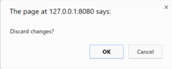
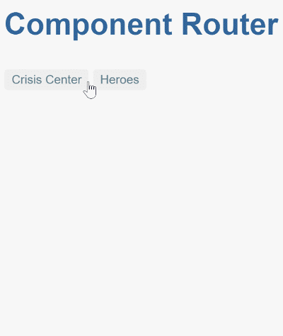
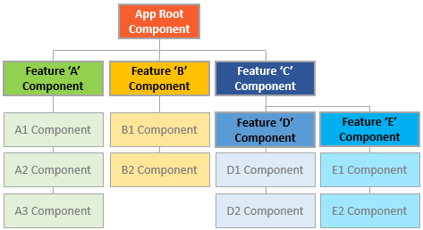

# [返回主目录](Readme.md)<!-- omit in toc --> 

# 目录 <!-- omit in toc --> 

- [路由与导航](#路由与导航)
- [概览](#概览)
- [基础知识](#基础知识)
  - [`<base href>` 元素](#base-href-元素)
  - [从路由库中导入](#从路由库中导入)
  - [配置](#配置)
  - [路由出口(RouterOutlet)](#路由出口routeroutlet)
  - [路由器链接](#路由器链接)
  - [路由链接的激活状态](#路由链接的激活状态)
  - [路由器状态](#路由器状态)
  - [激活的路由](#激活的路由)
  - [路由事件](#路由事件)
  - [总结一下](#总结一下)
- [范例应用](#范例应用)
  - [范例程序的动图](#范例程序的动图)
- [里程碑 1：起步](#里程碑-1起步)
  - [定义路由](#定义路由)
  - [注册路由器与路由定义](#注册路由器与路由定义)
  - [添加路由出口](#添加路由出口)
  - [定义通配符路由](#定义通配符路由)
  - [设置跳转](#设置跳转)
  - [“起步阶段”总结](#起步阶段总结)
- [里程碑 2：路由模块](#里程碑-2路由模块)
  - [把路由集成到应用中](#把路由集成到应用中)
  - [你需要路由模块吗？](#你需要路由模块吗)
- [里程碑 3: 英雄特征区](#里程碑-3-英雄特征区)
  - [添加英雄管理功能](#添加英雄管理功能)
    - [英雄特性区的路由需求](#英雄特性区的路由需求)
    - [移除重复的“英雄管理”路由](#移除重复的英雄管理路由)
  - [导入模块的顺序很重要](#导入模块的顺序很重要)
  - [路由参数](#路由参数)
    - [带参数的路由定义](#带参数的路由定义)
    - [路由参数：必须的还是可选的？](#路由参数必须的还是可选的)
    - [在列表视图中设置路由参数](#在列表视图中设置路由参数)
  - [Activated Route 实战](#activated-route-实战)
    - [ParamMap API](#parammap-api)
    - [参数的可观察对象（Observable）与组件复用](#参数的可观察对象observable与组件复用)
    - [Snapshot（快照）：当不需要 Observable 时的替代品](#snapshot快照当不需要-observable-时的替代品)
  - [导航回列表组件](#导航回列表组件)
    - [路由参数：必须还是可选？](#路由参数必须还是可选)
    - [英雄列表：选定一个英雄（也可不选）](#英雄列表选定一个英雄也可不选)
  - [ActivatedRoute 服务中的路由参数](#activatedroute-服务中的路由参数)
  - [添加路由动画](#添加路由动画)
    - [为路由组件添加动画](#为路由组件添加动画)
  - [里程碑 3 的总结](#里程碑-3-的总结)
- [里程碑 4：危机中心](#里程碑-4危机中心)
  - [子路由组件](#子路由组件)
  - [子路由配置](#子路由配置)
  - [把危机中心模块导入到 AppModule 的路由中](#把危机中心模块导入到-appmodule-的路由中)
  - [相对导航](#相对导航)
  - [使用相对 URL 导航到危机列表](#使用相对-url-导航到危机列表)
  - [用命名出口（outlet）显示多重路由](#用命名出口outlet显示多重路由)
    - [第二路由](#第二路由)
    - [添加第二路由](#添加第二路由)
    - [第二路由导航：在导航期间合并路由](#第二路由导航在导航期间合并路由)
    - [清除第二路由](#清除第二路由)
- [里程碑 5：路由守卫](#里程碑-5路由守卫)
  - [CanActivate: 要求认证](#canactivate-要求认证)
    - [守护“管理特性”区](#守护管理特性区)
    - [教 AuthGuard 进行认证](#教-authguard-进行认证)
    - [添加 LoginComponent](#添加-logincomponent)
  - [CanActivateChild：保护子路由](#canactivatechild保护子路由)
  - [CanDeactivate：处理未保存的更改](#candeactivate处理未保存的更改)
    - [取消与保存](#取消与保存)
  - [Resolve: 预先获取组件数据](#resolve-预先获取组件数据)
    - [导航前预先加载路由信息](#导航前预先加载路由信息)
  - [查询参数及片段](#查询参数及片段)
- [里程碑 6：异步路由](#里程碑-6异步路由)
  - [惰性加载路由配置](#惰性加载路由配置)
  - [CanLoad 守卫：保护对特性模块的未授权加载](#canload-守卫保护对特性模块的未授权加载)
  - [预加载：特性区的后台加载](#预加载特性区的后台加载)
    - [预加载的工作原理](#预加载的工作原理)
    - [惰性加载危机中心](#惰性加载危机中心)
    - [CanLoad 会阻塞预加载](#canload-会阻塞预加载)
  - [自定义预加载策略](#自定义预加载策略)
- [使用重定向迁移 URL](#使用重定向迁移-url)
  - [把 /heroes 修改为 /superheros](#把-heroes-修改为-superheros)
- [审查路由器配置](#审查路由器配置)

## 路由与导航

在用户使用应用程序时，Angular 的路由器能让用户从一个视图导航到另一个视图。

## 概览

浏览器具有熟悉的导航模式：

- 在地址栏输入 URL，浏览器就会导航到相应的页面。

- 在页面中点击链接，浏览器就会导航到一个新页面。

- 点击浏览器的前进和后退按钮，浏览器就会在你的浏览历史中向前或向后导航。

Angular 的 Router（即“路由器”）借鉴了这个模型。它把浏览器中的 URL 看做一个操作指南， 据此导航到一个由客户端生成的视图，并可以把参数传给支撑视图的相应组件，帮它决定具体该展现哪些内容。 你可以为页面中的链接绑定一个路由，这样，当用户点击链接时，就会导航到应用中相应的视图。 当用户点击按钮、从下拉框中选取，或响应来自任何地方的事件时，你也可以在代码控制下进行导航。 路由器还在浏览器的历史日志中记录下这些活动，这样浏览器的前进和后退按钮也能照常工作。

## 基础知识

本章包括一系列里程碑，从一个单模块、两个页面的简单程序逐步走向带有多个子路由的多视图设计。

先对路由的一些核心概念做一个介绍，它能帮你逐步过渡到细节。

### `<base href>` 元素
大多数带路由的应用都要在index.html的 `<head>` 标签下先添加一个 `<base>` 元素，来告诉路由器该如何合成导航用的 URL。

如果 app 文件夹是该应用的根目录（就像范例应用中一样），那就把 href 的值设置为下面这样：

```html
<!-- src/index.html(base-href) -->
<base href="/">
```
### 从路由库中导入
Angular 的路由器是一个可选的服务，它用来呈现指定的 URL 所对应的视图。 它并不是 Angular 核心库的一部分，而是在它自己的 @angular/router 包中。 像其它 Angular 包一样，你可以从它导入所需的一切。
```ts
import { RouterModule, Routes } from '@angular/router';
```

### 配置
每个带路由的 Angular 应用都有一个Router（路由器）服务的单例对象。 当浏览器的 URL 变化时，路由器会查找对应的 Route（路由），并据此决定该显示哪个组件。

路由器需要先配置才会有路由信息。 下面的例子创建了五个路由定义，并用 RouterModule.forRoot() 方法来配置路由器， 并把它的返回值添加到 AppModule 的 imports 数组中。
```ts
const appRoutes: Routes = [
  { path: 'crisis-center', component: CrisisListComponent },
  { path: 'hero/:id',      component: HeroDetailComponent },
  {
    path: 'heroes',
    component: HeroListComponent,
    data: { title: 'Heroes List' }
  },
  { path: '',
    redirectTo: '/heroes',
    pathMatch: 'full'
  },
  { path: '**', component: PageNotFoundComponent }
];

@NgModule({
  imports: [
    RouterModule.forRoot(
      appRoutes,
      { enableTracing: true } // <-- debugging purposes only
    )
    // other imports here
  ],
  ...
})
export class AppModule { }
```
这里的路由数组 appRoutes 描述如何进行导航。 把它传给 RouterModule.forRoot() 方法并传给本模块的 imports 数组就可以配置路由器。

每个 Route 都会把一个 URL 的 path 映射到一个组件。 注意，path 不能以斜杠（/）开头。 路由器会为解析和构建最终的 URL，这样当你在应用的多个视图之间导航时，可以任意使用相对路径和绝对路径。

第二个路由中的 :id 是一个路由参数的令牌(Token)。比如 /hero/42 这个 URL 中，“42”就是 id 参数的值。 此 URL 对应的 HeroDetailComponent 组件将据此查找和展现 id 为 42 的英雄。 在本章中稍后的部分，你将会学习关于路由参数的更多知识。

第三个路由中的 data 属性用来存放于每个具体路由有关的任意信息。该数据可以被任何一个激活路由访问，并能用来保存诸如 页标题、面包屑以及其它静态只读数据。本章稍后的部分，你将使用resolve 守卫来获取动态数据。

第四个路由中的空路径（''）表示应用的默认路径，当 URL 为空时就会访问那里，因此它通常会作为起点。 这个默认路由会重定向到 URL /heroes，并显示 HeroesListComponent。

最后一个路由中的 ** 路径是一个通配符。当所请求的 URL 不匹配前面定义的路由表中的任何路径时，路由器就会选择此路由。 这个特性可用于显示“404 - Not Found”页，或自动重定向到其它路由。

这些路由的定义顺序是刻意如此设计的。路由器使用先匹配者优先的策略来匹配路由，所以，具体路由应该放在通用路由的前面。在上面的配置中，带静态路径的路由被放在了前面，后面是空路径路由，因此它会作为默认路由。而通配符路由被放在最后面，这是因为它能匹配上每一个 URL，因此应该只有在前面找不到其它能匹配的路由时才匹配它。

如果你想要看到在导航的生命周期中发生过哪些事件，可以使用路由器默认配置中的 enableTracing 选项。它会把每个导航生命周期中的事件输出到浏览器的控制台。 这应该只用于调试。你只需要把 enableTracing: true 选项作为第二个参数传给 RouterModule.forRoot() 方法就可以了。

### 路由出口(RouterOutlet)
RouterOutlet 是一个来自路由模块中的指令，它的用法类似于组件。 它扮演一个占位符的角色，用于在模板中标出一个位置，路由器将会把要显示在这个出口处的组件显示在这里。

```html
<router-outlet></router-outlet>
<!-- Routed components go here -->
```
有了这份配置，当本应用在浏览器中的 URL 变为 /heroes 时，路由器就会匹配到 path 为 heroes 的 Route，并在宿主视图中的RouterOutlet之后显示 HeroListComponent 组件。

### 路由器链接
现在，你已经有了配置好的一些路由，还找到了渲染它们的地方，但又该如何导航到它呢？固然，从浏览器的地址栏直接输入 URL 也能做到，但是大多数情况下，导航是某些用户操作的结果，比如点击一个 A 标签。

考虑下列模板：
```html
<h1>Angular Router</h1>
<nav>
  <a routerLink="/crisis-center" routerLinkActive="active">Crisis Center</a>
  <a routerLink="/heroes" routerLinkActive="active">Heroes</a>
</nav>
<router-outlet></router-outlet>
```

a 标签上的 RouterLink 指令让路由器得以控制这个 a 元素。 这里的导航路径是固定的，因此可以把一个字符串赋给 routerLink（“一次性”绑定）。

如果需要更加动态的导航路径，那就把它绑定到一个返回链接参数数组的模板表达式。 路由器会把这个数组解析成完整的 URL。

### 路由链接的激活状态
RouterLinkActive 指令会基于当前的 RouterState 为活动的 RouterLink 切换所绑定的 css 类。

在每个 A 标签上，你会看到一个到 RouterLinkActive 的属性绑定，形如 routerLinkActive="..."。

等号右边的模板表达式包含一些用空格分隔的 CSS 类名，当这个链接激活时，路由器将会把它们加上去（并在处于非活动状态时移除）。你还可以把 RouterLinkActive 设置为一个类组成的字符串，如 [routerLinkActive]="'active fluffy'"，或把它绑定到一个返回类似字符串的组件属性。

路由链接的激活状态会向下级联到路由树中的每个层级，所以，父子路由链接可能会同时激活。要覆盖这种行为，可以把 [routerLinkActiveOptions] 绑定为 { exact: true } 表达式，这样 RouterLink 只有当 URL 与当前 URL 精确匹配时才会激活。
### 路由器状态

在导航时的每个生命周期成功完成时，路由器会构建出一个 ActivatedRoute 组成的树，它表示路由器的当前状态。 你可以在应用中的任何地方用 Router 服务及其 routerState 属性来访问当前的 RouterState 值。

RouterState 中的每个 ActivatedRoute 都提供了从任意激活路由开始向上或向下遍历路由树的一种方式，以获得关于父、子、兄弟路由的信息。

### 激活的路由

该路由的路径和参数可以通过注入进来的一个名叫ActivatedRoute的路由服务来获取。 它有一大堆有用的信息，包括：

属性|说明
-|-
url|路由路径的 Observable 对象，是一个由路由路径中的各个部分组成的字符串数组。
data|一个 Observable，其中包含提供给路由的 data 对象。也包含由解析守卫（resolve guard）解析而来的值。
paramMap|一个 Observable，其中包含一个由当前路由的必要参数和可选参数组成的map对象。用这个 map 可以获取来自同名参数的单一值或多重值。
queryParamMap|一个 Observable，其中包含一个对所有路由都有效的查询参数组成的map对象。 用这个 map 可以获取来自查询参数的单一值或多重值。
fragment|一个适用于所有路由的 URL 的 fragment（片段）的 Observable。
outlet|要把该路由渲染到的 RouterOutlet 的名字。对于无名路由，它的路由名是 primary，而不是空串。
routeConfig|用于该路由的路由配置信息，其中包含原始路径。
parent|当该路由是一个子路由时，表示该路由的父级 ActivatedRoute。
firstChild|包含该路由的子路由列表中的第一个 ActivatedRoute。
children|包含当前路由下所有已激活的子路由。

### 路由事件
在每次导航中，Router 都会通过 Router.events 属性发布一些导航事件。这些事件的范围涵盖了从开始导航到结束导航之间的很多时间点。下表中列出了全部导航事件：
路由器事件|说明
-|-
NavigationStart|本事件会在导航开始时触发。
RouteConfigLoadStart|本事件会在 Router 惰性加载 某个路由配置之前触发。
RouteConfigLoadEnd|本事件会在惰性加载了某个路由后触发。
RoutesRecognized|本事件会在路由器解析完 URL，并识别出了相应的路由时触发
GuardsCheckStart|本事件会在路由器开始 Guard 阶段之前触发。
ChildActivationStart|本事件会在路由器开始激活路由的子路由时触发。
ActivationStart|本事件会在路由器开始激活某个路由时触发。
GuardsCheckEnd|本事件会在路由器成功完成了 Guard 阶段时触发。
ResolveStart|本事件会在 Router 开始解析（Resolve）阶段时触发。
ResolveEnd|本事件会在路由器成功完成了路由的解析（Resolve）阶段时触发。
ChildActivationEnd|本事件会在路由器激活了路由的子路由时触发。
ActivationEnd|本事件会在路由器激活了某个路由时触发。
NavigationEnd|本事件会在导航成功结束之后触发。
NavigationCancel|本事件会在导航被取消之后触发。 这可能是因为在导航期间某个路由守卫返回了 false。
NavigationError|这个事件会在导航由于意料之外的错误而失败时触发。
Scroll|本事件代表一个滚动事件。

当启用了 enableTracing 选项时，这些事件也同时会记录到控制台中。

### 总结一下
该应用有一个配置过的路由器。 外壳组件中有一个 RouterOutlet，它能显示路由器所生成的视图。 它还有一些 RouterLink，用户可以点击它们，来通过路由器进行导航。

下面是一些路由器中的关键词汇及其含义：
路由器部件|含义
-|-
Router（路由器）|为激活的 URL 显示应用组件。管理从一个组件到另一个组件的导航
RouterModule|一个独立的 NgModule，用于提供所需的服务提供者，以及用来在应用视图之间进行导航的指令。
Routes（路由数组）|定义了一个路由数组，每一个都会把一个 URL 路径映射到一个组件。
Route（路由）|定义路由器该如何根据 URL 模式（pattern）来导航到组件。大多数路由都由路径和组件类构成。
RouterOutlet（路由出口）|该指令（`<router-outlet>`）用来标记出路由器该在哪里显示视图。
RouterLink（路由链接）|这个指令把可点击的 HTML 元素绑定到某个路由。点击带有 routerLink 指令（绑定到字符串或链接参数数组）的元素时就会触发一次导航。
RouterLinkActive（活动路由链接）|当 HTML 元素上或元素内的routerLink变为激活或非激活状态时，该指令为这个 HTML 元素添加或移除 CSS 类。
ActivatedRoute（激活的路由）|为每个路由组件提供的一个服务，它包含特定于路由的信息，比如路由参数、静态数据、解析数据、全局查询参数和全局碎片（fragment）。
RouterState（路由器状态）|路由器的当前状态包含了一棵由程序中激活的路由构成的树。它包含一些用于遍历路由树的快捷方法。
链接参数数组|这个数组会被路由器解释成一个路由操作指南。你可以把一个RouterLink绑定到该数组，或者把它作为参数传给Router.navigate方法。
路由组件|一个带有RouterOutlet的 Angular 组件，它根据路由器的导航来显示相应的视图。


## 范例应用

本章要讲的是如何开发一个带路由的多页面应用。 接下来会重点讲它的设计决策，并描述路由的关键特性，比如：

- 把应用的各个特性组织成模块。

- 导航到组件（Heroes 链接到“英雄列表”组件）。

- 包含一个路由参数（当路由到“英雄详情”时，把该英雄的 id 传进去）。

- 子路由（危机中心特性有一组自己的路由）。

- CanActivate 守卫（检查路由的访问权限）。

- CanActivateChild 守卫（检查子路由的访问权限）。

- CanDeactivate 守卫（询问是否丢弃未保存的更改）。

- Resolve 守卫（预先获取路由数据）。

- 惰性加载特性模块。

- CanLoad 守卫（在加载特性模块之前进行检查）。


如果打算一步步构建出本应用，本章就会经过一系列里程碑。 但是，本章并不是一个教程，它隐藏了构造 Angular 应用的细节，那些细节会在本文档的其它地方展开。

### 范例程序的动图
假设本程序会用来帮助“英雄管理局”运行他们的业务。 英雄们需要找工作，而“英雄管理局”为他们寻找待解决的危机。

本应用具有三个主要的特性区：

1. 危机中心用于维护要指派给英雄的危机列表。

2. 英雄区用于维护管理局雇佣的英雄列表。

3. 管理区会管理危机和英雄的列表。

等应用热身完毕，你就会看到一排导航按钮，以及一个英雄列表视图。


选择其中之一，该应用就会把你带到此英雄的编辑页面。


修改完名字，再点击“后退”按钮，应用又回到了英雄列表页，其中显示的英雄名已经变了。注意，对名字的修改会立即生效。

另外你也可以点击浏览器本身的后退按钮，这样也同样会回到英雄列表页。 在 Angular 应用中导航也会和标准的 Web 导航一样更新浏览器中的历史。

现在，点击危机中心链接，前往危机列表页。


选择其中之一，该应用就会把你带到此危机的编辑页面。 危机详情是当前页的子组件，就在列表的紧下方。

修改危机的名称。 注意，危机列表中的相应名称并没有修改。


这和英雄详情页略有不同。英雄详情会立即保存你所做的更改。 而危机详情页中，你的更改都是临时的 —— 除非按“保存”按钮保存它们，或者按“取消”按钮放弃它们。 这两个按钮都会导航回危机中心，显示危机列表。

先不要点击这些按钮。 而是点击浏览器的后退按钮，或者点击“Heroes”链接。

这时会弹出一个对话框。



你可以回答“确定”以放弃这些更改，或者回答“取消”来继续编辑。

这种行为的幕后是路由器的 CanDeactivate 守卫。 该守卫让你有机会进行清理工作或在离开当前视图之前请求用户的许可。

Admin 和 Login 按钮用于演示路由器的其它能力，本章稍后的部分会讲解它们。这里只是个简短的讲解。

这就开始本应用的第一个里程碑。

## 里程碑 1：起步

开始本应用的一个简版，它在两个空路由之间导航。


遵循这些步骤生成一个范例应用。

```shell
ng new angular-router-sample
```

### 定义路由

路由器必须用“路由定义”的列表进行配置。

每个定义都被翻译成了一个Route对象。该对象有一个 path 字段，表示该路由中的 URL 路径部分，和一个 component 字段，表示与该路由相关联的组件。

当浏览器的 URL 变化时或在代码中告诉路由器导航到一个路径时，路由器就会翻出它用来保存这些路由定义的注册表。

直白的说，你可以这样解释第一个路由：

- 当浏览器地址栏的 URL 变化时，如果它匹配上了路径部分 /crisis-center，路由器就会激活一个 CrisisListComponent 的实例，并显示它的视图。

- 当应用程序请求导航到路径 /crisis-center 时，路由器激活一个 CrisisListComponent 的实例，显示它的视图，并将该路径更新到浏览器地址栏和历史。

第一个配置定义了由两个路由构成的数组，它们用简单的路径指向了 CrisisListComponent 和 HeroListComponent。来生成 CrisisList 和 HeroList。
```shell
ng generate component crisis-list

ng generate component hero-list
```

### 注册路由器与路由定义

要使用路由器，必须先注册来自 @angular/router 包中的 RouterModule。 定义一个路由数组 appRoutes 并把它传给 RouterModule.forRoot() 方法。 它会返回一个模块，其中包含配置好的 Router 服务提供者，以及路由库所需的其它提供者。 一旦启动了应用，Router 就会根据当前的浏览器 URL 进行首次导航。

```ts
// app.module.ts
import { NgModule }             from '@angular/core';
import { BrowserModule }        from '@angular/platform-browser';
import { FormsModule }          from '@angular/forms';
import { RouterModule, Routes } from '@angular/router';

import { AppComponent }          from './app.component';
import { CrisisListComponent }   from './crisis-list/crisis-list.component';
import { HeroListComponent }     from './hero-list/hero-list.component';

const appRoutes: Routes = [
  { path: 'crisis-center', component: CrisisListComponent },
  { path: 'heroes', component: HeroListComponent },
];

@NgModule({
  imports: [
    BrowserModule,
    FormsModule,
    RouterModule.forRoot(
      appRoutes,
      { enableTracing: true } // <-- debugging purposes only
    )
  ],
  declarations: [
    AppComponent,
    HeroListComponent,
    CrisisListComponent,
  ],
  bootstrap: [ AppComponent ]
})
export class AppModule { }
```

> 作为简单的路由配置，将添加配置好的 RouterModule 到 AppModule 中就足够了。 随着应用的成长，你将需要将路由配置重构到单独的文件中，并创建路由模块 - 一种特别的、专门为特性模块的路由器服务的服务模块。

把 RouterModule.forRoot() 注册到 AppModule 的 imports 中，能让该 Router 服务在应用的任何地方都能使用。

### 添加路由出口

根组件 AppComponent 是本应用的壳。它在顶部有一个标题、一个带两个链接的导航条，在底部有一个路由器出口，路由器会在它所指定的位置上把组件切入或调出页面。就像下图中所标出的：


路由出口扮演一个占位符的角色，路由组件将会渲染在它的下方。

该组件所对应的模板是这样的：
```html
<h1>Angular Router</h1>
<nav>
  <a routerLink="/crisis-center" routerLinkActive="active">Crisis Center</a>
  <a routerLink="/heroes" routerLinkActive="active">Heroes</a>
</nav>
<router-outlet></router-outlet>
```

### 定义通配符路由

你以前在应用中创建过两个路由，一个是 /crisis-center，另一个是 /heroes。 所有其它 URL 都会导致路由器抛出错误，并让应用崩溃。

可以添加一个通配符路由来拦截所有无效的 URL，并优雅的处理它们。 通配符路由的 path 是两个星号（**），它会匹配任何 URL。 当路由器匹配不上以前定义的那些路由时，它就会选择这个路由。 通配符路由可以导航到自定义的“404 Not Found”组件，也可以重定向到一个现有路由。

> 路由器使用先匹配者优先的策略来选择路由。 通配符路由是路由配置中最没有特定性的那个，因此务必确保它是配置中的最后一个路由。

要测试本特性，请往 HeroListComponent 的模板中添加一个带 RouterLink 的按钮，并且把它的链接设置为 "/sidekicks"。

```html
<h2>HEROES</h2>
<p>Get your heroes here</p>

<button routerLink="/sidekicks">Go to sidekicks</button>
```
当用户点击该按钮时，应用就会失败，因为你尚未定义过 "/sidekicks" 路由。

不要添加 "/sidekicks" 路由，而是定义一个“通配符”路由，让它直接导航到 PageNotFoundComponent 组件。
```ts
{ path: '**', component: PageNotFoundComponent }
```

创建 PageNotFoundComponent，以便在用户访问无效网址时显示它。

```shell
ng generate component page-not-found
```
```html
<h2>Page not found</h2>
```
现在，当用户访问 /sidekicks 或任何无效的 URL 时，浏览器就会显示“Page not found”。 浏览器的地址栏仍指向无效的 URL。

### 设置跳转
应用启动时，浏览器地址栏中的初始 URL 是这样的：
```http
localhost:4200
```
它不能匹配上任何具体的路由，于是就会走到通配符路由中去，并且显示 PageNotFoundComponent。

这个应用需要一个有效的默认路由，在这里应该用英雄列表作为默认页。当用户点击"Heroes"链接或把 localhost:4200/heroes 粘贴到地址栏时，它应该导航到列表页。

首选方案是添加一个 redirect 路由来把最初的相对路径（''）转换成期望的默认路径（/heroes）。 浏览器地址栏会显示 .../heroes，就像你直接导航到那里一样。

在通配符路由上方添加一个默认路由。 在下方的代码片段中，它出现在通配符路由的紧上方，展示了这个里程碑的完整 appRoutes。

```ts
// app-rputing.module.ts(appRoutes)
const appRoutes: Routes = [
  { path: 'crisis-center', component: CrisisListComponent },
  { path: 'heroes',        component: HeroListComponent },
  { path: '',   redirectTo: '/heroes', pathMatch: 'full' },
  { path: '**', component: PageNotFoundComponent }
];
```

重定向路由需要一个 pathMatch 属性，来告诉路由器如何用 URL 去匹配路由的路径，否则路由器就会报错。 在本应用中，路由器应该只有在完整的 URL等于 '' 时才选择 HeroListComponent 组件，因此要把 pathMatch 设置为 'full'。


> 从技术角度说，pathMatch = 'full' 导致 URL 中剩下的、未匹配的部分必须等于 ''。 在这个例子中，跳转路由在一个顶层路由中，因此剩下的URL 和完整的URL 是一样的。
> pathMatch 的另一个可能的值是 'prefix'，它会告诉路由器：当剩下的URL 以这个跳转路由中的 prefix 值开头时，就会匹配上这个跳转路由。
> 在这里不能这么做！如果 pathMatch 的值是 'prefix'，那么每个URL 都会匹配上 ''。
> 尝试把它设置为 'prefix'，然后点击 Go to sidekicks 按钮。别忘了，它是一个无效 URL，本应显示“Page not found”页。 但是，你仍然在“英雄列表”页中。在地址栏中输入一个无效的 URL，你又被路由到了 /heroes。 每一个 URL，无论有效与否，都会匹配上这个路由定义。
> 默认路由应该只有在整个URL 等于 '' 时才重定向到 HeroListComponent，别忘了把重定向路由设置为 pathMatch = 'full'。

### “起步阶段”总结

你得到了一个非常基本的、带导航的应用，当用户点击链接时，它能在两个视图之间切换。

你学到了如何：

- 加载路由库

- 往壳组件的模板中添加一个导航条，导航条中有一些 A 标签、routerLink 指令和 routerLinkActive 指令

- 往壳组件的模板中添加一个 router-outlet 指令，视图将会被显示在那里

- 用 RouterModule.forRoot() 配置路由器模块

- 设置路由器，使其合成 HTML5 模式的浏览器 URL

- 使用通配符路由来处理无效路由

- 当应用在空路径下启动时，导航到默认路由

这个初学者应用的结构是这样的：


## 里程碑 2：路由模块

在原始的路由配置中，你提供了仅有两个路由的简单配置来设置应用的路由。对于简单的路由，这没有问题。 随着应用的成长，你用到了更多路由器特性，比如守卫、解析器和子路由等，你会很自然地想要重构路由。 我们建议将路由信息移到一个单独的特殊用途的模块，叫做路由模块。

路由模块有一系列特性：

- 把路由这个关注点从其它应用类关注点中分离出去。

- 测试特性模块时，可以替换或移除路由模块。

- 为路由服务提供者（包括守卫和解析器等）提供一个共同的地方。

- 不要声明组件。

### 把路由集成到应用中
路由应用范例中默认不包含路由。 要想在使用 Angular CLI 创建项目时支持路由，请为项目或应用的每个 NgModule 设置 --routing 选项。 当你用 CLI 命令 ng new 创建新项目或用 ng generate app 命令创建新应用，请指定 --routing 选项。这会告诉 CLI 包含上 @angular/router 包，并创建一个名叫 app-routing.module.ts 的文件。 然后你就可以在添加到项目或应用中的任何 NgModule 中使用路由功能了。

比如，可以用下列命令生成带路由的 NgModule。

```shell
ng generate module my-module --routing
```
这将创建一个名叫 my-module-routing.module.ts 的独立文件，来保存这个 NgModule 的路由信息。 该文件包含一个空的 Routes 对象，你可以使用一些指向各个组件和 NgModule 的路由来填充该对象。

将路由配置重构为路由模块

在 /app 目录下创建一个 AppRouting 模块，以包含路由配置。

```shell
ng generate module app-routing --module app --flat
```
导入 CrisisListComponent、HeroListComponent 和 PageNotFoundCompponent 组件，就像 app.module.ts 中那样。然后把 Router 的导入语句和路由配置以及 RouterModule.forRoot() 移入这个路由模块中。

把 Angular 的 RouterModule添加到该模块的 exports 数组中，以便再次导出它 。 通过再次导出 RouterModule，当在 AppModule 中导入了 AppRoutingModule 之后，那些声明在 AppModule 中的组件就可以访问路由指令了，比如 RouterLink 和 RouterOutlet。

做完这些之后，该文件变成了这样：
```ts
import { NgModule }              from '@angular/core';
import { RouterModule, Routes }  from '@angular/router';

import { CrisisListComponent }   from './crisis-list/crisis-list.component';
import { HeroListComponent }     from './hero-list/hero-list.component';
import { PageNotFoundComponent } from './page-not-found/page-not-found.component';

const appRoutes: Routes = [
  { path: 'crisis-center', component: CrisisListComponent },
  { path: 'heroes',        component: HeroListComponent },
  { path: '',   redirectTo: '/heroes', pathMatch: 'full' },
  { path: '**', component: PageNotFoundComponent }
];

@NgModule({
  imports: [
    RouterModule.forRoot(
      appRoutes,
      { enableTracing: true } // <-- debugging purposes only
    )
  ],
  exports: [
    RouterModule
  ]
})
export class AppRoutingModule {}
```
接下来，修改 app.module.ts 文件，从 imports 数组中移除 RouterModule.forRoot。
```ts
import { NgModule }       from '@angular/core';
import { BrowserModule }  from '@angular/platform-browser';
import { FormsModule }    from '@angular/forms';

import { AppComponent }     from './app.component';
import { AppRoutingModule } from './app-routing.module';

import { CrisisListComponent }   from './crisis-list/crisis-list.component';
import { HeroListComponent }     from './hero-list/hero-list.component';
import { PageNotFoundComponent } from './page-not-found/page-not-found.component';

@NgModule({
  imports: [
    BrowserModule,
    FormsModule,
    AppRoutingModule
  ],
  declarations: [
    AppComponent,
    HeroListComponent,
    CrisisListComponent,
    PageNotFoundComponent
  ],
  bootstrap: [ AppComponent ]
})
export class AppModule { }
```
应用继续照常运行，你可以把路由模块作为将来每个模块维护路由配置的中心位置。

### 你需要路由模块吗？

路由模块在根模块或者特性模块替换了路由配置。在路由模块或者在模块内部配置路由，但不要同时在两处都配置。

路由模块是设计选择，它的价值在配置很复杂，并包含专门守卫和解析器服务时尤其明显。 在配置很简单时，它可能看起来很多余。

在配置很简单时，一些开发者跳过路由模块（例如 AppRoutingModule），并将路由配置直接混合在关联模块中（比如 AppModule ）。

从中选择一种模式，并坚持模式的一致性。

大多数开发者都应该采用路由模块，以保持一致性。 它在配置复杂时，能确保代码干净。 它让测试特性模块更加容易。 它的存在让人一眼就能看出这个模块是带路由的。 开发者可以很自然的从路由模块中查找和扩展路由配置。

## 里程碑 3: 英雄特征区

你刚刚学习了如何用 RouterLink 指令进行导航。接下来要：

- 用模块把应用和路由组织为一些特性区

- 命令式的从一个组件导航到另一个

- 通过路由传递必要信息和可选信息



典型的应用具有多个特性区，每个特性区都专注于特定的业务用途。

虽然你也可以把文件都放在 src/app/ 目录下，但那样是不现实的，而且很难维护。 大部分开发人员更喜欢把每个特性区都放在它自己的目录下。

你准备把应用拆分成多个不同的特性模块，每个特有模块都有自己的关注点。 然后，你就会把它们导入到主模块中，并且在它们之间导航。

### 添加英雄管理功能

遵循下列步骤：

- 在 heroes 目录下创建一个带路由的 HeroesModule，并把它注册进 AppModule 中。 这里就是你实现英雄管理特性的地方。
  ```shell
  ng generate module heroes/heroes --module app --flat --routing
  ```
- 把 app 下占位用的 hero-list 移到 heroes 目录中。

- 从 教程的 "服务" 部分 / 下载范例把 heroes/heroes.component.html 的内容复制到 hero-list.component.html 模板中。

  - 给 `<h2>` 加文字，改成 `<h2>HEROES</h2>`。

  - 删除模板底部的 `<app-hero-detail>` 组件。

- 把现场演练中 heroes/heroes.component.css 文件的内容复制到 hero-list.component.css 文件中。

- 把现场演练中 heroes/heroes.component.ts 文件的内容复制到 hero-list.component.ts 文件中。
  - 把组件类名改为 HeroListComponent。

  - 把 selector 改为 app-hero-list。

  > 对于路由组件来说，这些选择器不是必须的，因为这些组件是在渲染页面时动态插入的，不过选择器对于在 HTML 元素树中标记和选中它们是很有用的。

- 把 hero-detail 目录中的 hero.ts、hero.service.ts 和 mock-heroes.ts 文件复制到 heroes 子目录下。

- 把 message.service.ts 文件复制到 src/app 目录下。

- 在 hero.service.ts 文件中修改导入 message.service 的相对路径。


接下来，还要修改 HeroesModule 的元数据。

- 导入 HeroDetailComponent 和 HeroListComponent，并添加到 HeroesModule 模块的 declarations 数组中。

```ts
import { NgModule }       from '@angular/core';
import { CommonModule }   from '@angular/common';
import { FormsModule }    from '@angular/forms';

import { HeroListComponent }    from './hero-list/hero-list.component';
import { HeroDetailComponent }  from './hero-detail/hero-detail.component';

import { HeroesRoutingModule } from './heroes-routing.module';

@NgModule({
  imports: [
    CommonModule,
    FormsModule,
    HeroesRoutingModule
  ],
  declarations: [
    HeroListComponent,
    HeroDetailComponent
  ]
})
export class HeroesModule {}
```
做完这些，你就有了四个英雄管理特性区的文件：


#### 英雄特性区的路由需求

“英雄”特性有两个相互协作的组件，列表和详情。 列表视图是自给自足的，你导航到它，它会自行获取英雄列表并显示他们。

详情视图就不同了。它要显示一个特定的英雄，但是它本身却无法知道显示哪一个，此信息必须来自外部。

当用户从列表中选择了一个英雄时，应用就导航到详情页以显示那个英雄。 通过把所选英雄的 id 编码进路由的 URL 中，就能告诉详情视图该显示哪个英雄。

从新位置 src/app/heroes/ 目录中导入英雄相关的组件，定义两个“英雄管理”路由。

现在，你有了 Heroes 模块的路由，还得在 RouterModule 中把它们注册给路由器，和 AppRoutingModule 中的做法几乎完全一样。

这里有少量但是关键的不同点。 在 AppRoutingModule 中，你使用了静态的 RouterModule.forRoot方法来注册路由和全应用级服务提供者。 在特性模块中，你要改用forChild静态方法。

> 只在根模块 AppRoutingModule 中调用 RouterModule.forRoot()（如果在 AppModule 中注册应用的顶层路由，那就在 AppModule 中调用）。 在其它模块中，你就必须调用RouterModule.forChild方法来注册附属路由。

修改后的 HeroesRoutingModule 是这样的：

```ts
import { NgModule }             from '@angular/core';
import { RouterModule, Routes } from '@angular/router';

import { HeroListComponent }    from './hero-list/hero-list.component';
import { HeroDetailComponent }  from './hero-detail/hero-detail.component';

const heroesRoutes: Routes = [
  { path: 'heroes',  component: HeroListComponent },
  { path: 'hero/:id', component: HeroDetailComponent }
];

@NgModule({
  imports: [
    RouterModule.forChild(heroesRoutes)
  ],
  exports: [
    RouterModule
  ]
})
export class HeroesRoutingModule { }
```
> 考虑让每个特性模块都有自己的路由配置文件。 在特性路由非常简单的早期阶段它看起来可能有点过度设计，但是，路由很容易变得更复杂，随着时间的推移，保持一致的模式会让你得到回报。

#### 移除重复的“英雄管理”路由

从 AppModule 的 declarations 中移除 HeroListComponent，因为它现在已经改由 HeroesModule 提供了。 你可以让“英雄”特性独立演化，添加更多的组件或各种各样的路由。 这就是为每个特性区创建独立模块后获得的核心优势。

经过这些步骤，AppModule 变成了这样：

```ts
import { NgModule }       from '@angular/core';
import { BrowserModule }  from '@angular/platform-browser';
import { FormsModule }    from '@angular/forms';
import { AppComponent }     from './app.component';
import { AppRoutingModule } from './app-routing.module';
import { HeroesModule }     from './heroes/heroes.module';

import { CrisisListComponent }   from './crisis-list/crisis-list.component';
import { PageNotFoundComponent } from './page-not-found/page-not-found.component';

@NgModule({
  imports: [
    BrowserModule,
    FormsModule,
    HeroesModule,
    AppRoutingModule
  ],
  declarations: [
    AppComponent,
    CrisisListComponent,
    PageNotFoundComponent
  ],
  bootstrap: [ AppComponent ]
})
export class AppModule { }
```
### 导入模块的顺序很重要
看看该模块的 imports 数组。注意，AppRoutingModule 是最后一个。最重要的是，它位于 HeroesModule 之后。

```ts
imports: [
  BrowserModule,
  FormsModule,
  HeroesModule,
  AppRoutingModule
],
```
路由配置的顺序很重要。 路由器会接受第一个匹配上导航所要求的路径的那个路由。

当所有路由都在同一个 AppRoutingModule 时，你要把默认路由和通配符路由放在最后（这里是在 /heroes 路由后面）， 这样路由器才有机会匹配到 /heroes 路由，否则它就会先遇到并匹配上该通配符路由，并导航到“页面未找到”路由。

这些路由不再位于单一文件中。他们分布在两个不同的模块中：AppRoutingModule 和 HeroesRoutingModule。

每个路由模块都会根据导入的顺序把自己的路由配置追加进去。 如果你先列出了 AppRoutingModule，那么通配符路由就会被注册在“英雄管理”路由之前。 通配符路由（它匹配任意URL）将会拦截住每一个到“英雄管理”路由的导航，因此事实上屏蔽了所有“英雄管理”路由。

> 反转路由模块的导入顺序，你就会看到当点击英雄相关的链接时被导向了“页面未找到”路由。

### 路由参数
#### 带参数的路由定义
回到 HeroesRoutingModule 并再次检查这些路由定义。 HeroDetailComponent 的路由有点特殊。
```ts
{ path: 'hero/:id', component: HeroDetailComponent }
```
注意路径中的 :id 令牌。它为路由参数在路径中创建一个“空位”。在这里，路由器把英雄的 id 插入到那个“空位”中。

如果要告诉路由器导航到详情组件，并让它显示“Magneta”，你会期望这个英雄的 id 像这样显示在浏览器的 URL 中：
```http
localhost:4200/hero/15
```
如果用户把此 URL 输入到浏览器的地址栏中，路由器就会识别出这种模式，同样进入“Magneta”的详情视图。

#### 路由参数：必须的还是可选的？
在这个场景下，把路由参数的令牌 :id 嵌入到路由定义的 path 中是一个好主意，因为对于 HeroDetailComponent 来说 id 是必须的， 而且路径中的值 15 已经足够把到“Magneta”的路由和到其它英雄的路由明确区分开。

#### 在列表视图中设置路由参数

然后导航到 HeroDetailComponent 组件。在那里，你期望看到所选英雄的详情，这需要两部分信息：导航目标和该英雄的 id。

因此，这个链接参数数组中有两个条目：目标路由的path（路径），和一个用来指定所选英雄 id 的路由参数。
```html
<a [routerLink]="['/hero', hero.id]">
```
路由器从该数组中组合出了目标 URL： localhost:3000/hero/15。

> 目标组件 HeroDetailComponent 该怎么知道这个 id 参数呢？ 当然不会是自己去分析 URL 了！那是路由器的工作。
> 路由器从 URL 中解析出路由参数（id:15），并通过 ActivatedRoute 服务来把它提供给 HeroDetailComponent 组件。

### Activated Route 实战

从路由器（router）包中导入 Router、ActivatedRoute 和 Params 类。
```ts
import { Router, ActivatedRoute, ParamMap } from '@angular/router';
```
这里导入 switchMap 操作符是因为你稍后将会处理路由参数的可观察对象 Observable。
```ts
import { switchMap } from 'rxjs/operators';
```
通常，你会直接写一个构造函数，让 Angular 把组件所需的服务注入进来，自动定义同名的私有变量，并把它们存进去。

```ts
constructor(
  private route: ActivatedRoute,
  private router: Router,
  private service: HeroService
) {}
```
然后，在 ngOnInit 方法中，你用 ActivatedRoute 服务来接收路由的参数，从参数中取得该英雄的 id，并接收此英雄用于显示。
```ts
ngOnInit() {
  this.hero$ = this.route.paramMap.pipe(
    switchMap((params: ParamMap) =>
      this.service.getHero(params.get('id')))
  );
}
```
paramMap 的处理过程有点稍复杂。当这个 map 的值变化时，你可以从变化之后的参数中 get() 到其 id 参数。

然后，让 HeroService 去获取一个具有此 id 的英雄，并返回这个 HeroService 请求的结果。

你可能想使用 RxJS 的 map 操作符。 但 HeroService 返回的是一个 `Observable<Hero>`。 所以你要改用 switchMap 操作符来打平这个 Observable。

switchMap 操作符还会取消以前未完成的在途请求。如果用户使用新的 id 再次导航到该路由，而 HeroService 仍在接受老 id 对应的英雄，那么 switchMap 就会抛弃老的请求，并返回这个新 id 的英雄信息。

这个可观察对象的 Subscription（订阅）将会由 AsyncPipe 处理，并且组件的 hero 属性将会设置为刚刚接收到的这个英雄。

#### ParamMap API

ParamMap API 是参照URLSearchParams 接口来设计的。它提供了一些方法来处理对路由参数（paramMap）和查询参数(queryParamMap)中的参数访问。

成员|说明
-|-
has(name)|如果参数名位于参数列表中，就返回 true 。
get(name)|如果这个 map 中有参数名对应的参数值（字符串），就返回它，否则返回 null。如果参数值实际上是一个数组，就返回它的第一个元素。
getAll(name)|如果这个 map 中有参数名对应的值，就返回一个字符串数组，否则返回空数组。当一个参数名可能对应多个值的时候，请使用 getAll。
keys|返回这个 map 中的所有参数名组成的字符串数组。

#### 参数的可观察对象（Observable）与组件复用
在这个例子中，你接收了路由参数的 Observable 对象。 这种写法暗示着这些路由参数在该组件的生存期内可能会变化。

确实如此！默认情况下，如果它没有访问过其它组件就导航到了同一个组件实例，那么路由器倾向于复用组件实例。如果复用，这些参数可以变化。

假设父组件的导航栏有“前进”和“后退”按钮，用来轮流显示英雄列表中中英雄的详情。 每次点击都会强制导航到带前一个或后一个 id 的 HeroDetailComponent 组件。

你不希望路由器仅仅从 DOM 中移除当前的 HeroDetailComponent 实例，并且用下一个 id 重新创建它。 那可能导致界面抖动。 更好的方式是复用同一个组件实例，并更新这些参数。

不幸的是，ngOnInit 对每个实例只调用一次。 你需要一种方式来检测在同一个实例中路由参数什么时候发生了变化。 而 params 属性这个可观察对象（Observable）干净漂亮地处理了这种情况。

> 当在组件中订阅一个可观察对象时，你通常总是要在组件销毁时取消这个订阅。
> 但是也有少数例外情况不需要取消订阅。 ActivateRoute 中的各种可观察对象就是属于这种情况。
> ActivateRoute 及其可观察对象都是由 Router 本身负责管理的。 Router 会在不再需要时销毁这个路由组件，而注入进去的 ActivateRoute 也随之销毁了。
> 不过，你仍然可以随意取消订阅，这不会造成任何损害，而且也不是一项坏的实践。

#### Snapshot（快照）：当不需要 Observable 时的替代品

本应用不需要复用 HeroDetailComponent。 用户总是会先返回英雄列表，再选择另一位英雄。 所以，不存在从一个英雄详情导航到另一个而不用经过英雄列表的情况。 这意味着路由器每次都会创建一个全新的 HeroDetailComponent 实例。

假如你很确定这个 HeroDetailComponent 组件的实例永远、永远不会被复用，那就可以使用快照来简化这段代码。

route.snapshot 提供了路由参数的初始值。 你可以通过它来直接访问参数，而不用订阅或者添加 Observable 的操作符。 这样在读写时就会更简单：

```ts
ngOnInit() {
  let id = this.route.snapshot.paramMap.get('id');

  this.hero$ = this.service.getHero(id);
}
```

### 导航回列表组件
HeroDetailComponent 组件有一个“Back”按钮，关联到它的 gotoHeroes 方法，该方法会导航回 HeroListComponent 组件。

路由的 navigate 方法同样接受一个单条目的链接参数数组，你也可以把它绑定到 [routerLink] 指令上。 它保存着到 HeroListComponent 组件的路径：
```ts
gotoHeroes() {
  this.router.navigate(['/heroes']);
}
```
#### 路由参数：必须还是可选？
如果想导航到 HeroDetailComponent 以对 id 为 15 的英雄进行查看并编辑，就要在路由的 URL 中使用路由参数来指定必要参数值。
```html
localhost:4200/hero/15
```

你也能在路由请求中添加可选信息。 比如，当从 hero-detail.component.ts 返回到列表时，如果能自动选中刚刚查看过的英雄就好了。


当从 HeroDetailComponent 返回时，你很快就会通过把正在查看的英雄的 id 作为可选参数包含在 URL 中来实现这个特性。

可选信息有很多种形式。搜索条件通常就不是严格结构化的，比如 name='wind*'；有多个值也很常见，如 after='12/31/2015'&before='1/1/2017'； 而且顺序无关，如 before='1/1/2017'&after='12/31/2015'，还可能有很多种变体格式，如 during='currentYear'。

这么多种参数要放在 URL 的路径中可不容易。即使你能制定出一个合适的 URL 方案，实现起来也太复杂了，得通过模式匹配才能把 URL 翻译成命名路由。

可选参数是在导航期间传送任意复杂信息的理想载体。 可选参数不涉及到模式匹配并在表达上提供了巨大的灵活性。

和必要参数一样，路由器也支持通过可选参数导航。 在你定义完必要参数之后，再通过一个独立的对象来定义可选参数。

通常，对于强制性的值（比如用于区分两个路由路径的）使用必备参数；当这个值是可选的、复杂的或多值的时，使用可选参数。

#### 英雄列表：选定一个英雄（也可不选）

当导航到 HeroDetailComponent 时，你可以在路由参数中指定一个所要编辑的英雄 id，只要把它作为链接参数数组中的第二个条目就可以了。
```html
<a [routerLink]="['/hero', hero.id]">
```
路由器在导航 URL 中内嵌了 id 的值，这是因为你把它用一个 :id 占位符当做路由参数定义在了路由的 path 中：

```ts
{ path: 'hero/:id', component: HeroDetailComponent }
```
当用户点击后退按钮时，HeroDetailComponent 构造了另一个链接参数数组，可以用它导航回 HeroListComponent。
```ts
gotoHeroes() {
  this.router.navigate(['/heroes']);
}
```
该数组缺少一个路由参数，这是因为你那时没有理由往 HeroListComponent 发送信息。

但现在有了。你要在导航请求中同时发送当前英雄的 id，以便 HeroListComponent 可以在列表中高亮这个英雄。 这是一个有更好，没有也无所谓的特性，就算没有它，列表照样能显示得很完美。

传送一个包含可选id 参数的对象。 为了演示，这里还在对象中定义了一个没用的额外参数（foo），HeroListComponent 应该忽略它。 下面是修改过的导航语句：
```ts
gotoHeroes(hero: Hero) {
  let heroId = hero ? hero.id : null;
  // Pass along the hero id if available
  // so that the HeroList component can select that hero.
  // Include a junk 'foo' property for fun.
  this.router.navigate(['/heroes', { id: heroId, foo: 'foo' }]);
}
```
该应用仍然能工作。点击“back”按钮返回英雄列表视图。

注意浏览器的地址栏。

它应该是这样的，不过也取决于你在哪里运行它：
```html
localhost:4200/heroes;id=15;foo=foo
```
id 的值像这样出现在 URL 中（;id=15;foo=foo），但不在 URL 的路径部分。 “Heroes”路由的路径部分并没有定义 :id。

可选的路由参数没有使用“？”和“&”符号分隔，因为它们将用在 URL 查询字符串中。 它们是用“;”分隔的。 这是矩阵 URL标记法 —— 你以前可能从未见过。

### ActivatedRoute 服务中的路由参数

英雄列表仍没有改变，没有哪个英雄列被加亮显示。

HeroListComponent 还完全不需要任何参数，也不知道该怎么处理它们。你可以改变这一点。

以前，当从 HeroListComponent 导航到 HeroDetailComponent 时，你通过 ActivatedRoute 服务订阅了路由参数这个 Observable，并让它能用在 HeroDetailComponent 中。 你把该服务注入到了 HeroDetailComponent 的构造函数中。

这次，你要进行反向导航，从 HeroDetailComponent 到 HeroListComponent。

首先，你扩展该路由的导入语句，以包含进 ActivatedRoute 服务的类；

```ts
import { ActivatedRoute } from '@angular/router';
```
导入 switchMap 操作符，在路由参数的 Observable 对象上执行操作
```ts
import { Observable } from 'rxjs';
import { switchMap } from 'rxjs/operators';
```
接着，你注入 ActivatedRoute 到 HeroListComponent 的构造函数中。
```ts
export class HeroListComponent implements OnInit {
  heroes$: Observable<Hero[]>;
  selectedId: number;

  constructor(
    private service: HeroService,
    private route: ActivatedRoute
  ) {}

  ngOnInit() {
    this.heroes$ = this.route.paramMap.pipe(
      switchMap(params => {
        // (+) before `params.get()` turns the string into a number
        this.selectedId = +params.get('id');
        return this.service.getHeroes();
      })
    );
  }
}
```
ActivatedRoute.paramMap 属性是一个路由参数的可观察对象。当用户导航到这个组件时，paramMap 会发射一个新值，其中包含 id。 在 ngOnInit 中，你订阅了这些值，设置到 selectedId，并获取英雄数据。

用 CSS 类绑定更新模板，把它绑定到 isSelected 方法上。 如果该方法返回 true，此绑定就会添加 CSS 类 selected，否则就移除它。 在 <li> 标记中找到它，就像这样：
```html
<h2>HEROES</h2>
<ul class="heroes">
  <li *ngFor="let hero of heroes$ | async"
    [class.selected]="hero.id === selectedId">
    <a [routerLink]="['/hero', hero.id]">
      <span class="badge">{{ hero.id }}</span>{{ hero.name }}
    </a>
  </li>
</ul>

<button routerLink="/sidekicks">Go to sidekicks</button>
```

当选中列表条目时，要添加一些样式。

```css
.heroes li.selected {
  background-color: #CFD8DC;
  color: white;
}
.heroes li.selected:hover {
  background-color: #BBD8DC;
}
```
当用户从英雄列表导航到英雄“Magneta”并返回时，“Magneta”看起来是选中的：
.png)

这儿可选的 foo 路由参数人畜无害，并继续被忽略。

### 添加路由动画
#### 为路由组件添加动画
这个“英雄”特性模块就要完成了，但这个特性还没有平滑的转场效果。

在这一节，你将为英雄详情组件添加一些动画。

首先导入 BrowserAnimationsModule，并添加到 imports 数组中：
```ts
import { BrowserAnimationsModule } from '@angular/platform-browser/animations';

@NgModule({
  imports: [
    BrowserAnimationsModule,
  ],
})
```
接下来，为指向 HeroListComponent 和 HeroDetailComponent 的路由定义添加一个 data 对象。 转场是基于 states 的，你将使用来自路由的 animation 数据为转场提供一个有名字的动画 state。
```ts
import { NgModule }             from '@angular/core';
import { RouterModule, Routes } from '@angular/router';

import { HeroListComponent }    from './hero-list/hero-list.component';
import { HeroDetailComponent }  from './hero-detail/hero-detail.component';

const heroesRoutes: Routes = [
  { path: 'heroes',  component: HeroListComponent, data: { animation: 'heroes' } },
  { path: 'hero/:id', component: HeroDetailComponent, data: { animation: 'hero' } }
];

@NgModule({
  imports: [
    RouterModule.forChild(heroesRoutes)
  ],
  exports: [
    RouterModule
  ]
})
export class HeroesRoutingModule { }
```
在根目录 src/app/ 下创建一个 animations.ts。内容如下：
```ts
import {
  trigger, animateChild, group,
  transition, animate, style, query
} from '@angular/animations';


// Routable animations
export const slideInAnimation =
  trigger('routeAnimation', [
    transition('heroes <=> hero', [
      style({ position: 'relative' }),
      query(':enter, :leave', [
        style({
          position: 'absolute',
          top: 0,
          left: 0,
          width: '100%'
        })
      ]),
      query(':enter', [
        style({ left: '-100%'})
      ]),
      query(':leave', animateChild()),
      group([
        query(':leave', [
          animate('300ms ease-out', style({ left: '100%'}))
        ]),
        query(':enter', [
          animate('300ms ease-out', style({ left: '0%'}))
        ])
      ]),
      query(':enter', animateChild()),
    ])
  ]);
```
该文件做了如下工作：

- 导入动画符号以构建动画触发器、控制状态并管理状态之间的过渡。

- 导出了一个名叫 slideInAnimation 的常量，并把它设置为一个名叫*routeAnimation 的动画触发器。

- 定义一个转场动画，当在 heroes 和 hero 路由之间来回切换时，如果进入（:enter）应用视图则让组件从屏幕的左侧滑入，如果离开（:leave）应用视图则让组件从右侧划出。

你还可以为其它路由组件用不同的转场效果创建更多触发器。现在这个触发器已经足够当前的里程碑用了。

回到 AppComponent，从 @angular/router 中导入 RouterOutlet 令牌，并从 './animations.ts 中导入 slideInDownAnimation。

把一个包含 slideInDownAnimation 的 animations 数组添加到 @Component 的元数据中。

```ts
import { RouterOutlet } from '@angular/router';
import { slideInAnimation } from './animations';

@Component({
  selector: 'app-root',
  templateUrl: 'app.component.html',
  styleUrls: ['app.component.css'],
  animations: [ slideInAnimation ]
})
```
为了使用路由动画，你需要把 RouterOutlet 包装到一个元素中。你要把 @routeAnimation 触发器绑定到该元素上。

为了把 @routeAnimation 转场转场到指定的状态，你需要从 ActivatedRoute 的 data 中提供它。 RouterOutlet 导出成了一个模板变量 outlet，这样你就可以绑定一个到路由出口的引用了。给这个变量取名做 routerOutlet 是一个理想的选择。
```html
<h1>Angular Router</h1>
<nav>
  <a routerLink="/crisis-center" routerLinkActive="active">Crisis Center</a>
  <a routerLink="/heroes" routerLinkActive="active">Heroes</a>
</nav>
<div [@routeAnimation]="getAnimationData(routerOutlet)">
  <router-outlet #routerOutlet="outlet"></router-outlet>
</div>
```
@routeAnimation 属性使用所提供的 routerOutlet 引用来绑定到 getAnimationData，因此你需要在 AppComponent 中定义那个函数。getAnimationData 函数会根据 ActivatedRoute 所提供的 data 对象返回动画的属性。animation 属性会根据你在 animations.ts 中定义 slideInAnimation 时使用的 transition 名称进行匹配。

```ts
export class AppComponent {
  getAnimationData(outlet: RouterOutlet) {
    return outlet && outlet.activatedRouteData && outlet.activatedRouteData['animation'];
  }
}
```
如果在两个路由之间切换，导航进来时，HeroDetailComponent 和 HeroListComponent 会从左侧滑入；导航离开时将会从右侧划出。
### 里程碑 3 的总结

你学到了如何：

- 把应用组织成特性区

- 命令式的从一个组件导航到另一个

- 通过路由参数传递信息，并在组件中订阅它们

- 把这个特性分区模块导入根模块 AppModule

- 把动画应用到路由组件上

做完这些修改之后，目录结构是这样的：


## 里程碑 4：危机中心
是时候往该应用的危机中心（现在是占位符）中添加一些真实的特性了。

- 先从模仿“英雄管理”中的特性开始：

- 在 src/app 目录下创建一个 crisis-center 子目录。

- 把 app/heroes 中的文件和目录复制到新的 crisis-center 文件夹中。

- 在这些新建的文件中，把每个 "hero" 都改成 "crisis"，每个 "heroes" 都改成 "crises"。

- 把这些 NgModule 文件改名为 crisis-center.module.ts 和 crisis-center-routing.module.ts。

你还要用模拟的危机列表替换模拟的英雄列表：
```ts
import { Crisis } from './crisis';

export const CRISES: Crisis[] = [
  { id: 1, name: 'Dragon Burning Cities' },
  { id: 2, name: 'Sky Rains Great White Sharks' },
  { id: 3, name: 'Giant Asteroid Heading For Earth' },
  { id: 4, name: 'Procrastinators Meeting Delayed Again' },
]
```
最终的危机中心可以作为引入子路由这个新概念的基础。 你可以把英雄管理保持在当前状态，以便和危机中心进行对比，以后再根据这些差异是否有价值来决定后续行动。

带有子路由的危机中心
本节会展示如何组织危机中心，来满足 Angular 应用所推荐的模式：

- 把每个特性放在自己的目录中。

- 每个特性都有自己的 Angular 特性模块。

- 每个特性区都有自己的根组件。

- 每个特性区的根组件中都有自己的路由出口及其子路由。

- 特性区的路由很少（或完全不）与其它特性区的路由交叉。

如果你还有更多特性区，它们的组件树是这样的：


### 子路由组件
在 crisis-center 目录下生成一个 CrisisCenter 组件：
```shell
ng generate component crisis-center/crisis-center
```
把组件模板修改成这样：
```html
<h2>CRISIS CENTER</h2>
<router-outlet></router-outlet>
```
CrisisCenterComponent 和 AppComponent 有下列共同点：

- 它是危机中心特性区的根，正如 AppComponent 是整个应用的根。

- 它是危机管理特性区的壳，正如 AppComponent 是管理高层工作流的壳。

就像大多数的壳一样，CrisisCenterComponent 类也非常简单，甚至比 AppComponent 更简单： 它没有业务逻辑，它的模板中没有链接，只有一个标题和用于放置危机中心的子组件的 `<router-outlet>`。

### 子路由配置
在 crisis-center 目录下生成一个 CrisisCenterHome 组件，作为 "危机中心" 特性的宿主页面。
```shell
ng generate component crisis-center/crisis-center-home
```
用一条欢迎信息修改 Crisis Center 中的模板。
```html
<p>Welcome to the Crisis Center</p>
```
把 heroes-routing.module.ts 文件复制过来，改名为 crisis-center-routing.module.ts，并修改它。 这次你要把子路由定义在父路由 crisis-center 中。

```ts
const crisisCenterRoutes: Routes = [
  {
    path: 'crisis-center',
    component: CrisisCenterComponent,
    children: [
      {
        path: '',
        component: CrisisListComponent,
        children: [
          {
            path: ':id',
            component: CrisisDetailComponent
          },
          {
            path: '',
            component: CrisisCenterHomeComponent
          }
        ]
      }
    ]
  }
];
```
注意，父路由 crisis-center 有一个 children 属性，它有一个包含 CrisisListComponent 的路由。 CrisisListModule 路由还有一个带两个路由的 children 数组。

这两个路由导航到了危机中心的两个子组件：CrisisCenterHomeComponent 和 CrisisDetailComponent。

对这些路由的处理中有一些重要的不同。

路由器会把这些路由对应的组件放在 CrisisCenterComponent 的 RouterOutlet 中，而不是 AppComponent 壳组件中的。

CrisisListComponent 包含危机列表和一个 RouterOutlet，用以显示 Crisis Center Home 和 Crisis Detail 这两个路由组件。

Crisis Detail 路由是 Crisis List 的子路由。由于路由器默认会复用组件，因此当你选择了另一个危机时，CrisisDetailComponent 会被复用。
作为对比，回头看看 Hero Detail 路由，每当你从列表中选择了不同的英雄时，都会重新创建该组件。

在顶层，以 / 开头的路径指向的总是应用的根。 但这里是子路由。 它们是在父路由路径的基础上做出的扩展。 在路由树中每深入一步，你就会在该路由的路径上添加一个斜线 /（除非该路由的路径是空的）。

如果把该逻辑应用到危机中心中的导航，那么父路径就是 /crisis-center。

- 要导航到 CrisisCenterHomeComponent，完整的 URL 是 /crisis-center (/crisis-center + '' + '')。

- 要导航到 CrisisDetailComponent 以展示 id=2 的危机，完整的 URL 是 /crisis-center/2 (/crisis-center + '' + '/2')。

本例子中包含站点部分的绝对 URL，就是：

```http
localhost:4200/crisis-center/2
```
这里是完整的 crisis-center.routing.ts 及其导入语句。
```ts
import { NgModule }             from '@angular/core';
import { RouterModule, Routes } from '@angular/router';

import { CrisisCenterHomeComponent } from './crisis-center-home/crisis-center-home.component';
import { CrisisListComponent }       from './crisis-list/crisis-list.component';
import { CrisisCenterComponent }     from './crisis-center/crisis-center.component';
import { CrisisDetailComponent }     from './crisis-detail/crisis-detail.component';

const crisisCenterRoutes: Routes = [
  {
    path: 'crisis-center',
    component: CrisisCenterComponent,
    children: [
      {
        path: '',
        component: CrisisListComponent,
        children: [
          {
            path: ':id',
            component: CrisisDetailComponent
          },
          {
            path: '',
            component: CrisisCenterHomeComponent
          }
        ]
      }
    ]
  }
];

@NgModule({
  imports: [
    RouterModule.forChild(crisisCenterRoutes)
  ],
  exports: [
    RouterModule
  ]
})
export class CrisisCenterRoutingModule { }
```
### 把危机中心模块导入到 AppModule 的路由中
就像 HeroesModule 模块中一样，你必须把 CrisisCenterModule 添加到 AppModule 的 imports 数组中，就在 AppRoutingModule 前面：
```ts
// src/app/crisis-center/crisis-center.module.ts
import { NgModule }       from '@angular/core';
import { FormsModule }    from '@angular/forms';
import { CommonModule }   from '@angular/common';

import { CrisisCenterHomeComponent } from './crisis-center-home/crisis-center-home.component';
import { CrisisListComponent }       from './crisis-list/crisis-list.component';
import { CrisisCenterComponent }     from './crisis-center/crisis-center.component';
import { CrisisDetailComponent }     from './crisis-detail/crisis-detail.component';

import { CrisisCenterRoutingModule } from './crisis-center-routing.module';

@NgModule({
  imports: [
    CommonModule,
    FormsModule,
    CrisisCenterRoutingModule
  ],
  declarations: [
    CrisisCenterComponent,
    CrisisListComponent,
    CrisisCenterHomeComponent,
    CrisisDetailComponent
  ]
})
export class CrisisCenterModule {}

// src/app/app.module.ts (import CrisisCenterModule)
import { NgModule }       from '@angular/core';
import { CommonModule }   from '@angular/common';
import { FormsModule }    from '@angular/forms';

import { AppComponent }            from './app.component';
import { PageNotFoundComponent }   from './page-not-found/page-not-found.component';
import { ComposeMessageComponent } from './compose-message/compose-message.component';

import { AppRoutingModule }        from './app-routing.module';
import { HeroesModule }            from './heroes/heroes.module';
import { CrisisCenterModule }      from './crisis-center/crisis-center.module';

@NgModule({
  imports: [
    CommonModule,
    FormsModule,
    HeroesModule,
    CrisisCenterModule,
    AppRoutingModule
  ],
  declarations: [
    AppComponent,
    PageNotFoundComponent
  ],
  bootstrap: [ AppComponent ]
})
export class AppModule { }
```
从 app.routing.ts 中移除危机中心的初始路由。 这些特性路由现在是由 HeroesModule 和 CrisisCenter 特性模块提供的。

app-routing.module.ts 文件中只有应用的顶层路由，比如默认路由和通配符路由。
```ts
import { NgModule }                from '@angular/core';
import { RouterModule, Routes }    from '@angular/router';

import { PageNotFoundComponent }  from './page-not-found/page-not-found.component';

const appRoutes: Routes = [
  { path: '',   redirectTo: '/heroes', pathMatch: 'full' },
  { path: '**', component: PageNotFoundComponent }
];

@NgModule({
  imports: [
    RouterModule.forRoot(
      appRoutes,
      { enableTracing: true } // <-- debugging purposes only
    )
  ],
  exports: [
    RouterModule
  ]
})
export class AppRoutingModule {}
```
### 相对导航
虽然构建出了危机中心特性区，你却仍在使用以斜杠开头的绝对路径来导航到危机详情的路由。

路由器会从路由配置的顶层来匹配像这样的绝对路径。

你固然可以继续像危机中心特性区一样使用绝对路径，但是那样会把链接钉死在特定的父路由结构上。 如果你修改了父路径 /crisis-center，那就不得不修改每一个链接参数数组。

通过改成定义相对于当前 URL 的路径，你可以把链接从这种依赖中解放出来。 当你修改了该特性区的父路由路径时，该特性区内部的导航仍然完好无损。

例子如下：
> 路由器支持在链接参数数组中使用“目录式”语法来为查询路由名提供帮助：
> ./ 或 无前导斜线 形式是相对于当前级别的。
> ../ 会回到当前路由路径的上一级。
> 你可以把相对导航语法和一个祖先路径组合起来用。 如果不得不导航到一个兄弟路由，你可以用 `../<sibling>` 来回到上一级，然后进入兄弟路由路径中。

用 Router.navigate 方法导航到相对路径时，你必须提供当前的 ActivatedRoute，来让路由器知道你现在位于路由树中的什么位置。

在链接参数数组后面，添加一个带有 relativeTo 属性的对象，并把它设置为当前的 ActivatedRoute。 这样路由器就会基于当前激活路由的位置来计算出目标 URL。

> 当调用路由器的 navigateByUrl 时，总是要指定完整的绝对路径。

### 使用相对 URL 导航到危机列表

你已经注入过了 ActivatedRoute，你需要把它来和相对导航路径组合在一起。

如果用 RouterLink 来代替 Router 服务进行导航，就要使用相同的链接参数数组，不过不再需要提供 relativeTo 属性。 ActivatedRoute 已经隐含在了 RouterLink 指令中。

修改 CrisisDetailComponent 的 gotoCrises 方法，来使用相对路径返回危机中心列表。
```ts
// Relative navigation back to the crises
this.router.navigate(['../', { id: crisisId, foo: 'foo' }], { relativeTo: this.route });
```
注意这个路径使用了 ../ 语法返回上一级。 如果当前危机的 id 是 3，那么最终返回到的路径就是 /crisis-center/;id=3;foo=foo。

### 用命名出口（outlet）显示多重路由

你决定给用户提供一种方式来联系危机中心。 当用户点击“Contact”按钮时，你要在一个弹出框中显示一条消息。

即使在应用中的不同页面之间切换，这个弹出框也应该始终保持打开状态，直到用户发送了消息或者手动取消。 显然，你不能把这个弹出框跟其它放到页面放到同一个路由出口中。

迄今为止，你只定义过单路由出口，并且在其中嵌套了子路由以便对路由分组。 在每个模板中，路由器只能支持一个无名主路由出口。

模板还可以有多个命名的路由出口。 每个命名出口都自己有一组带组件的路由。 多重出口可以在同一时间根据不同的路由来显示不同的内容。

在 AppComponent 中添加一个名叫“popup”的出口，就在无名出口的下方。
```html
<div [@routeAnimation]="getAnimationData(routerOutlet)">
  <router-outlet #routerOutlet="outlet"></router-outlet>
</div>
<router-outlet name="popup"></router-outlet>
```
一旦你学会了如何把一个弹出框组件路由到该出口，那里就是将会出现弹出框的地方。

#### 第二路由

命名出口是第二路由的目标。

第二路由很像主路由，配置方式也一样。它们只有一些关键的不同点：

- 它们彼此互不依赖。

- 它们与其它路由组合使用。

- 它们显示在命名出口中。

生成一个新的组件来组合这个消息。
```shell
ng generate component compose-message
```
它显示一个简单的表单，包括一个头、一个消息输入框和两个按钮：“Send”和“Cancel”。


它看起来几乎和你以前见过其它组件一样，但有两个值得注意的区别。

注意，send() 方法在发送消息和关闭弹出框之前通过等待模拟了一秒钟的延迟。

closePopup() 方法用把 popup 出口导航到 null 的方式关闭了弹出框。

#### 添加第二路由
打开 AppRoutingModule，并把一个新的 compose 路由添加到 appRoutes 中。
```ts
{
  path: 'compose',
  component: ComposeMessageComponent,
  outlet: 'popup'
},
```
对 path 和 component 属性应该很熟悉了吧。 注意这个新的属性 outlet 被设置成了 'popup'。 这个路由现在指向了 popup 出口，而 ComposeMessageComponent 也将显示在那里。

用户需要某种途径来打开这个弹出框。 打开 AppComponent，并添加一个“Contact”链接。
```html
<a [routerLink]="[{ outlets: { popup: ['compose'] } }]">Contact</a>
```
虽然 compose 路由被钉死在了 popup 出口上，但这仍然不足以向 RouterLink 指令表明要加载该路由。 你还要在链接参数数组中指定这个命名出口，并通过属性绑定的形式把它绑定到 RouterLink 上。

链接参数数组包含一个只有一个 outlets 属性的对象，它的值是另一个对象，这个对象以一个或多个路由的出口名作为属性名。 在这里，它只有一个出口名“popup”，它的值则是另一个链接参数数组，用于指定 compose 路由。

意思是，当用户点击此链接时，在路由出口 popup 中显示与 compose 路由相关联的组件。

> 当只需要考虑一个路由和一个无名出口时，外部对象中的这个 outlets 对象是完全不必要的。
> 路由器假设这个路由指向了无名的主出口，并为你创建这些对象。
> 路由到一个命名出口就会揭示一个以前被隐藏的真相： 你可以在同一个 RouterLink 指令中为多个路由出口指定多个路由。
> 这里你实际上没能这样做。要想指向命名出口，你就得使用一种更强大也更啰嗦的语法。

#### 第二路由导航：在导航期间合并路由
导航到危机中心并点击“Contact”，你将会在浏览器的地址栏看到如下 URL：
```http
http://.../crisis-center(popup:compose)
```
这个 URL 中有意思的部分是 ... 后面的这些：

- crisis-center 是主导航。

- 圆括号包裹的部分是第二路由。

- 第二路由包括一个出口名称（popup）、一个冒号分隔符和第二路由的路径（compose）。
点击 Heroes 链接，并再次查看 URL：
```http
http://.../heroes(popup:compose)
```
主导航的部分变化了，而第二路由没有变。

路由器在导航树中对两个独立的分支保持追踪，并在 URL 中对这棵树进行表达。

你还可以添加更多出口和更多路由（无论是在顶层还是在嵌套的子层）来创建一个带有多个分支的导航树。 路由器将会生成相应的 URL。

通过像前面那样填充 outlets 对象，你可以告诉路由器立即导航到一棵完整的树。 然后把这个对象通过一个链接参数数组传给 router.navigate 方法。

有空的时候你可以自行试验这些可能性。

#### 清除第二路由

正如你刚刚学到的，除非导航到新的组件，否则路由出口中的组件会始终存在。 这里涉及到的第二出口也同样如此。

每个第二出口都有自己独立的导航，跟主出口的导航彼此独立。 修改主出口中的当前路由并不会影响到 popup 出口中的。 这就是为什么在危机中心和英雄管理之间导航时，弹出框始终都是可见的。

点击“send”或“cancel”按钮，则会清除弹出框视图。 为何如此？再看看 closePopup() 方法：
```ts
closePopup() {
  // Providing a `null` value to the named outlet
  // clears the contents of the named outlet
  this.router.navigate([{ outlets: { popup: null }}]);
}
```
它使用 Router.navigate() 方法进行强制导航，并传入了一个链接参数数组。

就像在 AppComponent 中绑定到的 Contact RouterLink 一样，它也包含了一个带 outlets 属性的对象。 outlets 属性的值是另一个对象，该对象用一些出口名称作为属性名。 唯一的命名出口是 'popup'。

但这次，'popup' 的值是 null。null 不是一个路由，但却是一个合法的值。 把 popup 这个 RouterOutlet 设置为 null 会清除该出口，并且从当前 URL 中移除第二路由 popup。

## 里程碑 5：路由守卫
现在，任何用户都能在任何时候导航到任何地方。 但有时候这样是不对的。

- 该用户可能无权导航到目标组件。

- 可能用户得先登录（认证）。

- 在显示目标组件前，你可能得先获取某些数据。

- 在离开组件前，你可能要先保存修改。

- 你可能要询问用户：你是否要放弃本次更改，而不用保存它们？

你可以往路由配置中添加守卫，来处理这些场景。

守卫返回一个值，以控制路由器的行为：

- 如果它返回 true，导航过程会继续

- 如果它返回 false，导航过程就会终止，且用户留在原地。

- 如果它返回 UrlTree，则取消当前的导航，并且开始导航到返回的这个 UrlTree.

> 注意：守卫还可以告诉路由器导航到别处，这样也会取消当前的导航。要想在守卫中这么做，就要返回 false；

守卫可以用同步的方式返回一个布尔值。但在很多情况下，守卫无法用同步的方式给出答案。 守卫可能会向用户问一个问题、把更改保存到服务器，或者获取新数据，而这些都是异步操作。

因此，路由的守卫可以返回一个 `Observable<boolean>` 或 `Promise<boolean>`，并且路由器会等待这个可观察对象被解析为 true 或 false。

> 注意： 提供给路由器的可观察对象还必须能结束（complete）。否则，导航就不会继续。

路由器可以支持多种守卫接口：

- 用CanActivate来处理导航到某路由的情况。

- 用CanActivateChild来处理导航到某子路由的情况。

- 用CanDeactivate来处理从当前路由离开的情况.

- 用Resolve在路由激活之前获取路由数据。

- 用CanLoad来处理异步导航到某特性模块的情况。

在分层路由的每个级别上，你都可以设置多个守卫。 路由器会先按照从最深的子路由由下往上检查的顺序来检查 CanDeactivate() 和 CanActivateChild() 守卫。 然后它会按照从上到下的顺序检查 CanActivate() 守卫。 如果特性模块是异步加载的，在加载它之前还会检查 CanLoad() 守卫。 如果任何一个守卫返回 false，其它尚未完成的守卫会被取消，这样整个导航就被取消了。

接下来的小节中有一些例子。

### CanActivate: 要求认证
应用程序通常会根据访问者来决定是否授予某个特性区的访问权。 你可以只对已认证过的用户或具有特定角色的用户授予访问权，还可以阻止或限制用户访问权，直到用户账户激活为止。

CanActivate 守卫是一个管理这些导航类业务规则的工具。

添加一个“管理”特性模块
在下一节，你将会使用一些新的管理特性来扩展危机中心。 那些特性尚未定义，但是你可以先从添加一个名叫 AdminModule 的特性模块开始。

生成一个带有特性模块文件和路由配置文件的 admin 目录。
```shell
ng generate module admin --routing
```
接下来，生成一些支持性组件。
```shell
ng generate component admin/admin-dashboard
ng generate component admin/admin
ng generate component admin/manage-crises
ng generate component admin/manage-heroes
```
管理特性区的文件是这样的：


管理特性模块包含 AdminComponent，它用于在特性模块内的仪表盘路由以及两个尚未完成的用于管理危机和英雄的组件之间进行路由。

```html
<!-- src/app/admin/admin/admin.component.html -->

<h3>ADMIN</h3>
<nav>
  <a routerLink="./" routerLinkActive="active"
    [routerLinkActiveOptions]="{ exact: true }">Dashboard</a>
  <a routerLink="./crises" routerLinkActive="active">Manage Crises</a>
  <a routerLink="./heroes" routerLinkActive="active">Manage Heroes</a>
</nav>
<router-outlet></router-outlet>

<!-- src/app/admin/admin-dashboard/admin-dashboard.component.html -->

<p>Dashboard</p>
```
> 虽然管理仪表盘中的 RouterLink 只包含一个没有其它 URL 段的斜杠 /，但它能匹配管理特性区下的任何路由。 但你只希望在访问 Dashboard 路由时才激活该链接。 往 Dashboard 这个 routerLink 上添加另一个绑定 [routerLinkActiveOptions]="{ exact: true }"， 这样就只有当用户导航到 /admin 这个 URL 时才会激活它，而不会在导航到它的某个子路由时。

无组件路由：分组路由，而不需要组件

最初的管理路由配置如下：

```ts
const adminRoutes: Routes = [
  {
    path: 'admin',
    component: AdminComponent,
    children: [
      {
        path: '',
        children: [
          { path: 'crises', component: ManageCrisesComponent },
          { path: 'heroes', component: ManageHeroesComponent },
          { path: '', component: AdminDashboardComponent }
        ]
      }
    ]
  }
];

@NgModule({
  imports: [
    RouterModule.forChild(adminRoutes)
  ],
  exports: [
    RouterModule
  ]
})
export class AdminRoutingModule {}
```
来看 AdminComponent 下的子路由，这里有一个带 path 和 children 的子路由， 但它没有使用 component。这并不是配置中的失误，而是在使用无组件路由。

这里的目标是对 admin 路径下的 危机中心 管理类路由进行分组，但并不需要另一个仅用来分组路由的组件。 一个无组件的路由能让守卫子路由变得更容易。

接下来，把 AdminModule 导入到 app.module.ts 中，并把它加入 imports 数组中来注册这些管理类路由。
```ts
import { NgModule }       from '@angular/core';
import { CommonModule }   from '@angular/common';
import { FormsModule }    from '@angular/forms';

import { AppComponent }            from './app.component';
import { PageNotFoundComponent }   from './page-not-found/page-not-found.component';
import { ComposeMessageComponent } from './compose-message/compose-message.component';

import { AppRoutingModule }        from './app-routing.module';
import { HeroesModule }            from './heroes/heroes.module';
import { CrisisCenterModule }      from './crisis-center/crisis-center.module';

import { AdminModule }             from './admin/admin.module';

@NgModule({
  imports: [
    CommonModule,
    FormsModule,
    HeroesModule,
    CrisisCenterModule,
    AdminModule,
    AppRoutingModule
  ],
  declarations: [
    AppComponent,
    ComposeMessageComponent,
    PageNotFoundComponent
  ],
  bootstrap: [ AppComponent ]
})
export class AppModule { }
```
然后往壳组件 AppComponent 中添加一个链接，让用户能点击它，以访问该特性。
```html
<h1 class="title">Angular Router</h1>
<nav>
  <a routerLink="/crisis-center" routerLinkActive="active">Crisis Center</a>
  <a routerLink="/heroes" routerLinkActive="active">Heroes</a>
  <a routerLink="/admin" routerLinkActive="active">Admin</a>
  <a [routerLink]="[{ outlets: { popup: ['compose'] } }]">Contact</a>
</nav>
<div [@routeAnimation]="getAnimationData(routerOutlet)">
  <router-outlet #routerOutlet="outlet"></router-outlet>
</div>
<router-outlet name="popup"></router-outlet>
```
#### 守护“管理特性”区
现在“危机中心”的每个路由都是对所有人开放的。这些新的管理特性应该只能被已登录用户访问。

你可以在用户登录之前隐藏这些链接，但这样会有点复杂并难以维护。

你可以换种方式：写一个 CanActivate() 守卫，将正在尝试访问管理组件匿名用户重定向到登录页。

这是一个通用的守卫（你可以假设另外一些特性区也要求已认证过的用户才能访问），所以你可以在 auth 目录下生成一个 AuthGuard。
```shell
ng generate guard auth/auth
```
此刻，你的兴趣在于看看守卫是如何工作的，所以第一个版本没做什么有用的事情。它只是往控制台写日志，并且立即返回 true，让导航继续：
```ts
//src/app/auth/auth.guard.ts (excerpt)

import { Injectable } from '@angular/core';
import { CanActivate, ActivatedRouteSnapshot, RouterStateSnapshot } from '@angular/router';

@Injectable({
  providedIn: 'root',
})
export class AuthGuard implements CanActivate {
  canActivate(
    next: ActivatedRouteSnapshot,
    state: RouterStateSnapshot): boolean {
    console.log('AuthGuard#canActivate called');
    return true;
  }
}
```
接下来，打开 admin-routing.module.ts，导入 AuthGuard 类，修改管理路由并通过 CanActivate() 守卫来引用 AuthGuard：
```ts
//src/app/admin/admin-routing.module.ts (guarded admin route)
 
import { AuthGuard }                from '../auth/auth.guard';

const adminRoutes: Routes = [
  {
    path: 'admin',
    component: AdminComponent,
    canActivate: [AuthGuard],
    children: [
      {
        path: '',
        children: [
          { path: 'crises', component: ManageCrisesComponent },
          { path: 'heroes', component: ManageHeroesComponent },
          { path: '', component: AdminDashboardComponent }
        ],
      }
    ]
  }
];

@NgModule({
  imports: [
    RouterModule.forChild(adminRoutes)
  ],
  exports: [
    RouterModule
  ]
})
export class AdminRoutingModule {}
```
管理特性区现在受此守卫保护了，不过这样的保护还不够。

#### 教 AuthGuard 进行认证

先让 AuthGuard 至少能“假装”进行认证。

AuthGuard 可以调用应用中的一项服务，该服务能让用户登录，并且保存当前用户的信息。在 admin 目录下生成一个新的 AuthService：
```shell
ng generate service auth/auth
```
修改 AuthService 以登入此用户：
```ts
// src/app/auth/auth.service.ts (excerpt)

import { Injectable } from '@angular/core';

import { Observable, of } from 'rxjs';
import { tap, delay } from 'rxjs/operators';

@Injectable({
  providedIn: 'root',
})
export class AuthService {
  isLoggedIn = false;

  // store the URL so we can redirect after logging in
  redirectUrl: string;

  login(): Observable<boolean> {
    return of(true).pipe(
      delay(1000),
      tap(val => this.isLoggedIn = true)
    );
  }

  logout(): void {
    this.isLoggedIn = false;
  }
}
```
虽然它不会真的进行登录，但足够让你进行这个讨论了。 它有一个 isLoggedIn 标志，用来标识是否用户已经登录过了。 它的 login 方法会仿真一个对外部服务的 API 调用，返回一个可观察对象（observable）。在短暂的停顿之后，这个可观察对象就会解析成功。 redirectUrl 属性将会保存在 URL 中，以便认证完之后导航到它。

这就修改 AuthGuard 来调用它。
```ts
// src/app/auth/auth.guard.ts (v2)
import { Injectable } from '@angular/core';
import { CanActivate, ActivatedRouteSnapshot, RouterStateSnapshot, Router } from '@angular/router';

import { AuthService }      from './auth.service';

@Injectable({
  providedIn: 'root',
})
export class AuthGuard implements CanActivate {
  constructor(private authService: AuthService, private router: Router) {}

  canActivate(
    next: ActivatedRouteSnapshot,
    state: RouterStateSnapshot): boolean {
    let url: string = state.url;

    return this.checkLogin(url);
  }

  checkLogin(url: string): boolean {
    if (this.authService.isLoggedIn) { return true; }

    // Store the attempted URL for redirecting
    this.authService.redirectUrl = url;

    // Navigate to the login page with extras
    this.router.navigate(['/login']);
    return false;
  }
}
```
注意，你把 AuthService 和 Router 服务注入到构造函数中。 你还没有提供 AuthService，这里要说明的是：可以往路由守卫中注入有用的服务。

该守卫返回一个同步的布尔值。如果用户已经登录，它就返回 true，导航会继续。

这个 ActivatedRouteSnapshot 包含了即将被激活的路由，而 RouterStateSnapshot 包含了该应用即将到达的状态。 你应该通过守卫进行检查。

如果用户还没有登录，你就会用 RouterStateSnapshot.url 保存用户来自的 URL 并让路由器导航到登录页（你尚未创建该页）。 这间接导致路由器自动中止了这次导航，checkLogin() 返回 false 并不是必须的，但这样可以更清楚的表达意图。

#### 添加 LoginComponent
你需要一个 LoginComponent 来让用户登录进这个应用。在登录之后，你就会跳转到前面保存的 URL，如果没有，就跳转到默认 URL。 该组件没有什么新内容，你把它放进路由配置的方式也没什么新意。
```shell
ng generate component auth/login
```
在 auth/auth-routing.module.ts 文件中注册一个 /login 路由。在 app.module.ts 中，导入 AuthModule 并且添加到 AppModule 的 imports 中。
```ts
// src/app/app.module.ts
import { NgModule }       from '@angular/core';
import { BrowserModule }  from '@angular/platform-browser';
import { FormsModule }    from '@angular/forms';
import { BrowserAnimationsModule } from '@angular/platform-browser/animations';

import { AppComponent }            from './app.component';
import { PageNotFoundComponent }   from './page-not-found/page-not-found.component';
import { ComposeMessageComponent } from './compose-message/compose-message.component';

import { AppRoutingModule }        from './app-routing.module';
import { HeroesModule }            from './heroes/heroes.module';
import { AuthModule }              from './auth/auth.module';

@NgModule({
  imports: [
    BrowserModule,
    BrowserAnimationsModule,
    FormsModule,
    HeroesModule,
    AuthModule,
    AppRoutingModule,
  ],
  declarations: [
    AppComponent,
    ComposeMessageComponent,
    PageNotFoundComponent
  ],
  bootstrap: [ AppComponent ]
})
export class AppModule {
}

//src/app/auth/login/login.component.html
<h2>LOGIN</h2>
<p>{{message}}</p>
<p>
  <button (click)="login()"  *ngIf="!authService.isLoggedIn">Login</button>
  <button (click)="logout()" *ngIf="authService.isLoggedIn">Logout</button>
</p>

//src/app/auth/login/login.component.ts
import { Component }   from '@angular/core';
import { Router }      from '@angular/router';
import { AuthService } from '../auth.service';

@Component({
  selector: 'app-login',
  templateUrl: './login.component.html',
  styleUrls: ['./login.component.css']
})
export class LoginComponent {
  message: string;

  constructor(public authService: AuthService, public router: Router) {
    this.setMessage();
  }

  setMessage() {
    this.message = 'Logged ' + (this.authService.isLoggedIn ? 'in' : 'out');
  }

  login() {
    this.message = 'Trying to log in ...';

    this.authService.login().subscribe(() => {
      this.setMessage();
      if (this.authService.isLoggedIn) {
        // Get the redirect URL from our auth service
        // If no redirect has been set, use the default
        let redirect = this.authService.redirectUrl ? this.router.parseUrl(this.authService.redirectUrl) : '/admin';

        // Redirect the user
        this.router.navigateByUrl(redirect);
      }
    });
  }

  logout() {
    this.authService.logout();
    this.setMessage();
  }
}

// src/app/auth/auth.module.ts
import { NgModule }       from '@angular/core';
import { CommonModule }   from '@angular/common';
import { FormsModule }    from '@angular/forms';

import { LoginComponent }    from './login/login.component';
import { AuthRoutingModule } from './auth-routing.module';

@NgModule({
  imports: [
    CommonModule,
    FormsModule,
    AuthRoutingModule
  ],
  declarations: [
    LoginComponent
  ]
})
export class AuthModule {}
```

### CanActivateChild：保护子路由

你还可以使用 CanActivateChild 守卫来保护子路由。 CanActivateChild 守卫和 CanActivate 守卫很像。 它们的区别在于，CanActivateChild 会在任何子路由被激活之前运行。

你要保护管理特性模块，防止它被非授权访问，还要保护这个特性模块内部的那些子路由。

扩展 AuthGuard 以便在 admin 路由之间导航时提供保护。 打开 auth.guard.ts 并从路由库中导入 CanActivateChild 接口。

接下来，实现 CanActivateChild 方法，它所接收的参数与 CanActivate 方法一样：一个 ActivatedRouteSnapshot 和一个 RouterStateSnapshot。 CanActivateChild 方法可以返回 `Observable<boolean>` 或 `Promise<boolean>` 来支持异步检查，或 boolean 来支持同步检查。 这里返回的是 boolean：
```ts
import { Injectable }       from '@angular/core';
import {
  CanActivate, Router,
  ActivatedRouteSnapshot,
  RouterStateSnapshot,
  CanActivateChild
}                           from '@angular/router';
import { AuthService }      from './auth.service';

@Injectable({
  providedIn: 'root',
})
export class AuthGuard implements CanActivate, CanActivateChild {
  constructor(private authService: AuthService, private router: Router) {}

  canActivate(
    route: ActivatedRouteSnapshot,
    state: RouterStateSnapshot): boolean {
    let url: string = state.url;

    return this.checkLogin(url);
  }

  canActivateChild(
    route: ActivatedRouteSnapshot,
    state: RouterStateSnapshot): boolean {
    return this.canActivate(route, state);
  }

/* . . . */
}
```
同样把这个 AuthGuard 添加到“无组件的”管理路由，来同时保护它的所有子路由，而不是为每个路由单独添加这个 AuthGuard。
```ts
const adminRoutes: Routes = [
  {
    path: 'admin',
    component: AdminComponent,
    canActivate: [AuthGuard],
    children: [
      {
        path: '',
        canActivateChild: [AuthGuard],
        children: [
          { path: 'crises', component: ManageCrisesComponent },
          { path: 'heroes', component: ManageHeroesComponent },
          { path: '', component: AdminDashboardComponent }
        ]
      }
    ]
  }
];

@NgModule({
  imports: [
    RouterModule.forChild(adminRoutes)
  ],
  exports: [
    RouterModule
  ]
})
export class AdminRoutingModule {}
```

### CanDeactivate：处理未保存的更改
回到“Heroes”工作流，该应用毫不犹豫的接受对英雄的任何修改，不作任何校验。

在现实世界中，你得先把用户的改动积累起来。 你可能不得不进行跨字段的校验，可能要找服务器进行校验，可能得把这些改动保存成一种待定状态，直到用户或者把这些改动作为一组进行确认或撤销所有改动。

当用户要导航到外面时，该怎么处理这些既没有审核通过又没有保存过的改动呢？ 你不能马上离开，不在乎丢失这些改动的风险，那显然是一种糟糕的用户体验。

最好能暂停，并让用户决定该怎么做。 如果用户选择了取消，你就留下来，并允许更多改动。 如果用户选择了确认，那就进行保存。

在保存成功之前，你还可以继续推迟导航。如果你让用户立即移到下一个界面，而保存却失败了（可能因为数据不符合有效性规则），你就会丢失该错误的上下文环境。

在等待服务器的答复时，你没法阻塞它 —— 这在浏览器中是不可能的。 你只能用异步的方式在等待服务器答复之前先停止导航。

你需要 CanDeactivate 守卫。
#### 取消与保存
这个范例应用不会与服务器通讯。 幸运的是，你有另一种方式来演示异步的路由器钩子。

用户在 CrisisDetailComponent 中更新危机信息。 与 HeroDetailComponent 不同，用户的改动不会立即更新危机的实体对象。当用户按下了 Save 按钮时，应用就更新这个实体对象；如果按了 Cancel 按钮，那就放弃这些更改。

这两个按钮都会在保存或取消之后导航回危机列表。
```ts
// src/app/crisis-center/crisis-detail/crisis-detail.component.ts (cancel and save methods)
cancel() {
  this.gotoCrises();
}

save() {
  this.crisis.name = this.editName;
  this.gotoCrises();
}
```

如果用户尝试不保存或撤销就导航到外面该怎么办？ 用户可以按浏览器的后退按钮，或点击英雄的链接。 这些操作都会触发导航。本应用应该自动保存或取消吗？

都不行。应用应该弹出一个确认对话框来要求用户明确做出选择，该对话框会用异步的方式等用户做出选择。

> 你也能用同步的方式等用户的答复，阻塞代码。但如果能用异步的方式等待用户的答复，应用就会响应性更好，也能同时做别的事。异步等待用户的答复和等待服务器的答复是类似的。

生成一个 Dialog 服务，以处理用户的确认操作。

```shell
ng generate service dialog
```
为 DialogService 添加一个 confirm() 方法，以提醒用户确认。window.confirm 是一个阻塞型操作，它会显示一个模态对话框，并等待用户的交互。

```ts
import { Injectable } from '@angular/core';
import { Observable, of } from 'rxjs';

/**
 * Async modal dialog service
 * DialogService makes this app easier to test by faking this service.
 * TODO: better modal implementation that doesn't use window.confirm
 */
@Injectable({
  providedIn: 'root',
})
export class DialogService {
  /**
   * Ask user to confirm an action. `message` explains the action and choices.
   * Returns observable resolving to `true`=confirm or `false`=cancel
   */
  confirm(message?: string): Observable<boolean> {
    const confirmation = window.confirm(message || 'Is it OK?');

    return of(confirmation);
  };
}

```
它返回observable，当用户最终决定了如何去做时，它就会被解析 —— 或者决定放弃更改直接导航离开（true），或者保留未完成的修改，留在危机编辑器中（false）。

生成一个守卫（guard），以检查组件（任意组件均可）中是否存在 canDeactivate() 方法。
```shell
ng generate guard can-deactivate
```
创建了一个 Guard，它将检查这个（任意）组件中是否有 canDeactivate() 函数。 CrisisDetailComponent 就会有这个方法。 但是该守卫并不需要知道 CrisisDetailComponent 确认退出激活状态的详情。 它只需要检查该组件是否有一个 canDeactivate() 方法，并调用它。 这就让该守卫可以复用。
```ts
// src/app/can-deactivate.guard.ts
import { Injectable }    from '@angular/core';
import { CanDeactivate } from '@angular/router';
import { Observable }    from 'rxjs';

export interface CanComponentDeactivate {
 canDeactivate: () => Observable<boolean> | Promise<boolean> | boolean;
}

@Injectable({
  providedIn: 'root',
})
export class CanDeactivateGuard implements CanDeactivate<CanComponentDeactivate> {
  canDeactivate(component: CanComponentDeactivate) {
    return component.canDeactivate ? component.canDeactivate() : true;
  }
}
```
另外，你也可以为 CrisisDetailComponent 创建一个特定的 CanDeactivate 守卫。 在需要访问外部信息时，canDeactivate() 方法为你提供了组件、ActivatedRoute 和 RouterStateSnapshot 的当前实例。 如果只想为这个组件使用该守卫，并且需要获取该组件属性或确认路由器是否允许从该组件导航出去时，这会非常有用。
```ts
// src/app/can-deactivate.guard.ts (component-specific)
import { Injectable }           from '@angular/core';
import { Observable }           from 'rxjs';
import { CanDeactivate,
         ActivatedRouteSnapshot,
         RouterStateSnapshot }  from '@angular/router';

import { CrisisDetailComponent } from './crisis-center/crisis-detail/crisis-detail.component';

@Injectable({
  providedIn: 'root',
})
export class CanDeactivateGuard implements CanDeactivate<CrisisDetailComponent> {

  canDeactivate(
    component: CrisisDetailComponent,
    route: ActivatedRouteSnapshot,
    state: RouterStateSnapshot
  ): Observable<boolean> | boolean {
    // Get the Crisis Center ID
    console.log(route.paramMap.get('id'));

    // Get the current URL
    console.log(state.url);

    // Allow synchronous navigation (`true`) if no crisis or the crisis is unchanged
    if (!component.crisis || component.crisis.name === component.editName) {
      return true;
    }
    // Otherwise ask the user with the dialog service and return its
    // observable which resolves to true or false when the user decides
    return component.dialogService.confirm('Discard changes?');
  }
}
```
看看 CrisisDetailComponent 组件，它已经实现了对未保存的更改进行确认的工作流。
```ts
// src/app/crisis-center/crisis-detail/crisis-detail.component.ts (excerpt)
canDeactivate(): Observable<boolean> | boolean {
  // Allow synchronous navigation (`true`) if no crisis or the crisis is unchanged
  if (!this.crisis || this.crisis.name === this.editName) {
    return true;
  }
  // Otherwise ask the user with the dialog service and return its
  // observable which resolves to true or false when the user decides
  return this.dialogService.confirm('Discard changes?');
}
```
注意，canDeactivate 方法可以同步返回，如果没有危机，或者没有未定的修改，它就立即返回 true。但是它也可以返回一个承诺（Promise）或可观察对象（Observable），路由器将等待它们被解析为真值（继续导航）或假值（留下）。

往 crisis-center.routing.module.ts 的危机详情路由中用 canDeactivate 数组添加一个 Guard（守卫）。

```ts
// src/app/crisis-center/crisis-center-routing.module.ts (can deactivate guard)
import { NgModule }             from '@angular/core';
import { RouterModule, Routes } from '@angular/router';

import { CrisisCenterHomeComponent } from './crisis-center-home/crisis-center-home.component';
import { CrisisListComponent }       from './crisis-list/crisis-list.component';
import { CrisisCenterComponent }     from './crisis-center/crisis-center.component';
import { CrisisDetailComponent }     from './crisis-detail/crisis-detail.component';

import { CanDeactivateGuard }    from '../can-deactivate.guard';

const crisisCenterRoutes: Routes = [
  {
    path: 'crisis-center',
    component: CrisisCenterComponent,
    children: [
      {
        path: '',
        component: CrisisListComponent,
        children: [
          {
            path: ':id',
            component: CrisisDetailComponent,
            canDeactivate: [CanDeactivateGuard]
          },
          {
            path: '',
            component: CrisisCenterHomeComponent
          }
        ]
      }
    ]
  }
];

@NgModule({
  imports: [
    RouterModule.forChild(crisisCenterRoutes)
  ],
  exports: [
    RouterModule
  ]
})
export class CrisisCenterRoutingModule { }
```
现在，你已经给了用户一个能保护未保存更改的安全守卫。

### Resolve: 预先获取组件数据
在 Hero Detail 和 Crisis Detail 中，它们等待路由读取完对应的英雄和危机。

这种方式没有问题，但是它们还有进步的空间。 如果你在使用真实 api，很有可能数据返回有延迟，导致无法即时显示。 在这种情况下，直到数据到达前，显示一个空的组件不是最好的用户体验。

最好预先从服务器上获取完数据，这样在路由激活的那一刻数据就准备好了。 还要在路由到此组件之前处理好错误。 但当某个 id 无法对应到一个危机详情时，就没办法处理它。 这时最好把用户带回到“危机列表”中，那里显示了所有有效的“危机”。

总之，你希望的是只有当所有必要数据都已经拿到之后，才渲染这个路由组件。

你需要 Resolve 守卫。

#### 导航前预先加载路由信息
目前，CrisisDetailComponent 会接收选中的危机。 如果该危机没有找到，它就会导航回危机列表视图。

如果能在该路由将要激活时提前处理了这个问题，那么用户体验会更好。 CrisisDetailResolver 服务可以接收一个 Crisis，而如果这个 Crisis 不存在，就会在激活该路由并创建 CrisisDetailComponent 之前先行离开。

在 Crisis Center 特性区生成一个 CrisisDetailResolver 服务文件。
```shell
ng generate service crisis-center/crisis-detail-resolver
```
```ts
// src/app/crisis-center/crisis-detail-resolver.service.ts (generated)
import { Injectable } from '@angular/core';

@Injectable({
  providedIn: 'root',
})
export class CrisisDetailResolverService {

  constructor() { }

}
```
在 CrisisDetailComponent.ngOnInit 中拿到相关的危机检索逻辑，并且把它们移到 CrisisDetailResolverService 中。 导入 Crisis 模型、CrisisService 和 Router 以便让你可以在找不到指定的危机时导航到别处。

为了更明确一点，可以实现一个带有 Crisis 类型的 Resolve 接口。

注入 CrisisService 和 Router，并实现 resolve() 方法。 该方法可以返回一个 Promise、一个 Observable 来支持异步方式，或者直接返回一个值来支持同步方式。

CrisisService.getCrisis 方法返回一个可观察对象，以防止在数据获取完之前加载本路由。 Router 守卫要求这个可观察对象必须可结束（complete），也就是说它已经发出了所有值。 你可以为 take 操作符传入一个参数 1，以确保这个可观察对象会在从 getCrisis 方法所返回的可观察对象中取到第一个值之后就会结束。

如果它没有返回有效的 Crisis，就会返回一个 Observable，以取消以前到 CrisisDetailComponent 的在途导航，并把用户导航回 CrisisListComponent。修改后的 resolver 服务是这样的：
```ts
//src/app/crisis-center/crisis-detail-resolver.service.ts
import { Injectable }             from '@angular/core';
import {
  Router, Resolve,
  RouterStateSnapshot,
  ActivatedRouteSnapshot
}                                 from '@angular/router';
import { Observable, of, EMPTY }  from 'rxjs';
import { mergeMap, take }         from 'rxjs/operators';

import { CrisisService }  from './crisis.service';
import { Crisis } from './crisis';

@Injectable({
  providedIn: 'root',
})
export class CrisisDetailResolverService implements Resolve<Crisis> {
  constructor(private cs: CrisisService, private router: Router) {}

  resolve(route: ActivatedRouteSnapshot, state: RouterStateSnapshot): Observable<Crisis> | Observable<never> {
    let id = route.paramMap.get('id');

    return this.cs.getCrisis(id).pipe(
      take(1),
      mergeMap(crisis => {
        if (crisis) {
          return of(crisis);
        } else { // id not found
          this.router.navigate(['/crisis-center']);
          return EMPTY;
        }
      })
    );
  }
}
```
把这个解析器（resolver）导入到 crisis-center-routing.module.ts 中，并往 CrisisDetailComponent 的路由配置中添加一个 resolve 对象。
```ts
// src/app/crisis-center/crisis-center-routing.module.ts (resolver)
import { NgModule }             from '@angular/core';
import { RouterModule, Routes } from '@angular/router';

import { CrisisCenterHomeComponent } from './crisis-center-home/crisis-center-home.component';
import { CrisisListComponent }       from './crisis-list/crisis-list.component';
import { CrisisCenterComponent }     from './crisis-center/crisis-center.component';
import { CrisisDetailComponent }     from './crisis-detail/crisis-detail.component';

import { CanDeactivateGuard }             from '../can-deactivate.guard';
import { CrisisDetailResolverService }    from './crisis-detail-resolver.service';

const crisisCenterRoutes: Routes = [
  {
    path: 'crisis-center',
    component: CrisisCenterComponent,
    children: [
      {
        path: '',
        component: CrisisListComponent,
        children: [
          {
            path: ':id',
            component: CrisisDetailComponent,
            canDeactivate: [CanDeactivateGuard],
            resolve: {
              crisis: CrisisDetailResolverService
            }
          },
          {
            path: '',
            component: CrisisCenterHomeComponent
          }
        ]
      }
    ]
  }
];

@NgModule({
  imports: [
    RouterModule.forChild(crisisCenterRoutes)
  ],
  exports: [
    RouterModule
  ]
})
export class CrisisCenterRoutingModule { }
```
CrisisDetailComponent 不应该再去获取这个危机的详情。 把 CrisisDetailComponent 改成从 ActivatedRoute.data.crisis 属性中获取危机详情，这正是你重新配置路由的恰当时机。 当 CrisisDetailComponent 要求取得危机详情时，它就已经在那里了。
```ts
//src/app/crisis-center/crisis-detail/crisis-detail.component.ts (ngOnInit v2)

ngOnInit() {
  this.route.data
    .subscribe((data: { crisis: Crisis }) => {
      this.editName = data.crisis.name;
      this.crisis = data.crisis;
    });
}
```

两个关键点

1. 路由器的这个 Resolve 接口是可选的。CrisisDetailResolverService 没有继承自某个基类。路由器只要找到了这个方法，就会调用它。

2. 要依赖路由器调用此守卫。不必关心用户用哪种方式导航离开，这是路由器的工作。你只要写出这个类，等路由器从那里取出它就可以了。

本里程碑中与危机中心有关的代码如下：

```ts
// app.component.html
<h1 class="title">Angular Router</h1>
<nav>
  <a routerLink="/crisis-center" routerLinkActive="active">Crisis Center</a>
  <a routerLink="/superheroes" routerLinkActive="active">Heroes</a>
  <a routerLink="/admin" routerLinkActive="active">Admin</a>
  <a routerLink="/login" routerLinkActive="active">Login</a>
  <a [routerLink]="[{ outlets: { popup: ['compose'] } }]">Contact</a>
</nav>
<div [@routeAnimation]="getAnimationData(routerOutlet)">
  <router-outlet #routerOutlet="outlet"></router-outlet>
</div>
<router-outlet name="popup"></router-outlet>

//crisis-center-home.component.html
<p>Welcome to the Crisis Center</p>


// crisis-center.component.html
<h2>CRISIS CENTER</h2>
<router-outlet></router-outlet>

//crisis-center-routing.module.ts
import { NgModule }             from '@angular/core';
import { RouterModule, Routes } from '@angular/router';

import { CrisisCenterHomeComponent } from './crisis-center-home/crisis-center-home.component';
import { CrisisListComponent }       from './crisis-list/crisis-list.component';
import { CrisisCenterComponent }     from './crisis-center/crisis-center.component';
import { CrisisDetailComponent }     from './crisis-detail/crisis-detail.component';

import { CanDeactivateGuard }             from '../can-deactivate.guard';
import { CrisisDetailResolverService }    from './crisis-detail-resolver.service';

const crisisCenterRoutes: Routes = [
  {
    path: 'crisis-center',
    component: CrisisCenterComponent,
    children: [
      {
        path: '',
        component: CrisisListComponent,
        children: [
          {
            path: ':id',
            component: CrisisDetailComponent,
            canDeactivate: [CanDeactivateGuard],
            resolve: {
              crisis: CrisisDetailResolverService
            }
          },
          {
            path: '',
            component: CrisisCenterHomeComponent
          }
        ]
      }
    ]
  }
];

@NgModule({
  imports: [
    RouterModule.forChild(crisisCenterRoutes)
  ],
  exports: [
    RouterModule
  ]
})
export class CrisisCenterRoutingModule { }

//crisis-list.component.html
<ul class="crises">
  <li *ngFor="let crisis of crises$ | async"
    [class.selected]="crisis.id === selectedId">
    <a [routerLink]="[crisis.id]">
      <span class="badge">{{ crisis.id }}</span>{{ crisis.name }}
    </a>
  </li>
</ul>

<router-outlet></router-outlet>

//crisis-list.component.ts
import { Component, OnInit }  from '@angular/core';
import { ActivatedRoute }     from '@angular/router';

import { CrisisService }  from '../crisis.service';
import { Crisis }         from '../crisis';
import { Observable }     from 'rxjs';
import { switchMap }      from 'rxjs/operators';

@Component({
  selector: 'app-crisis-list',
  templateUrl: './crisis-list.component.html',
  styleUrls: ['./crisis-list.component.css']
})
export class CrisisListComponent implements OnInit {
  crises$: Observable<Crisis[]>;
  selectedId: number;

  constructor(
    private service: CrisisService,
    private route: ActivatedRoute
  ) {}

  ngOnInit() {
    this.crises$ = this.route.paramMap.pipe(
      switchMap(params => {
        this.selectedId = +params.get('id');
        return this.service.getCrises();
      })
    );
  }
}

//crisis-detail.component.html
<div *ngIf="crisis">
  <h3>"{{ editName }}"</h3>
  <div>
    <label>Id: </label>{{ crisis.id }}</div>
  <div>
    <label>Name: </label>
    <input [(ngModel)]="editName" placeholder="name"/>
  </div>
  <p>
    <button (click)="save()">Save</button>
    <button (click)="cancel()">Cancel</button>
  </p>
</div>

//crisis-detail.component.ts
import { Component, OnInit, HostBinding } from '@angular/core';
import { ActivatedRoute, Router } from '@angular/router';
import { Observable } from 'rxjs';

import { Crisis }         from '../crisis';
import { DialogService }  from '../../dialog.service';

@Component({
  selector: 'app-crisis-detail',
  templateUrl: './crisis-detail.component.html',
  styleUrls: ['./crisis-detail.component.css']
})
export class CrisisDetailComponent implements OnInit {
  crisis: Crisis;
  editName: string;

  constructor(
    private route: ActivatedRoute,
    private router: Router,
    public dialogService: DialogService
  ) {}

  ngOnInit() {
    this.route.data
      .subscribe((data: { crisis: Crisis }) => {
        this.editName = data.crisis.name;
        this.crisis = data.crisis;
      });
  }

  cancel() {
    this.gotoCrises();
  }

  save() {
    this.crisis.name = this.editName;
    this.gotoCrises();
  }

  canDeactivate(): Observable<boolean> | boolean {
    // Allow synchronous navigation (`true`) if no crisis or the crisis is unchanged
    if (!this.crisis || this.crisis.name === this.editName) {
      return true;
    }
    // Otherwise ask the user with the dialog service and return its
    // observable which resolves to true or false when the user decides
    return this.dialogService.confirm('Discard changes?');
  }

  gotoCrises() {
    let crisisId = this.crisis ? this.crisis.id : null;
    // Pass along the crisis id if available
    // so that the CrisisListComponent can select that crisis.
    // Add a totally useless `foo` parameter for kicks.
    // Relative navigation back to the crises
    this.router.navigate(['../', { id: crisisId, foo: 'foo' }], { relativeTo: this.route });
  }
}

//crisis-detail-resolver.service.ts
import { Injectable }             from '@angular/core';
import {
  Router, Resolve,
  RouterStateSnapshot,
  ActivatedRouteSnapshot
}                                 from '@angular/router';
import { Observable, of, EMPTY }  from 'rxjs';
import { mergeMap, take }         from 'rxjs/operators';

import { CrisisService }  from './crisis.service';
import { Crisis } from './crisis';

@Injectable({
  providedIn: 'root',
})
export class CrisisDetailResolverService implements Resolve<Crisis> {
  constructor(private cs: CrisisService, private router: Router) {}

  resolve(route: ActivatedRouteSnapshot, state: RouterStateSnapshot): Observable<Crisis> | Observable<never> {
    let id = route.paramMap.get('id');

    return this.cs.getCrisis(id).pipe(
      take(1),
      mergeMap(crisis => {
        if (crisis) {
          return of(crisis);
        } else { // id not found
          this.router.navigate(['/crisis-center']);
          return EMPTY;
        }
      })
    );
  }
}

//crisis.service.ts
import { BehaviorSubject } from 'rxjs';
import { map } from 'rxjs/operators';

import { Injectable } from '@angular/core';
import { MessageService } from '../message.service';
import { Crisis } from './crisis';
import { CRISES } from './mock-crises';

@Injectable({
  providedIn: 'root',
})
export class CrisisService {
  static nextCrisisId = 100;
  private crises$: BehaviorSubject<Crisis[]> = new BehaviorSubject<Crisis[]>(CRISES);

  constructor(private messageService: MessageService) { }

  getCrises() { return this.crises$; }

  getCrisis(id: number | string) {
    return this.getCrises().pipe(
      map(crises => crises.find(crisis => crisis.id === +id))
    );
  }

}

//dialog.service.ts
import { Injectable } from '@angular/core';
import { Observable, of } from 'rxjs';

/**
 * Async modal dialog service
 * DialogService makes this app easier to test by faking this service.
 * TODO: better modal implementation that doesn't use window.confirm
 */
@Injectable({
  providedIn: 'root',
})
export class DialogService {
  /**
   * Ask user to confirm an action. `message` explains the action and choices.
   * Returns observable resolving to `true`=confirm or `false`=cancel
   */
  confirm(message?: string): Observable<boolean> {
    const confirmation = window.confirm(message || 'Is it OK?');

    return of(confirmation);
  };
}
```
路由守卫

```ts
//auth.guard.ts
import { Injectable }       from '@angular/core';
import {
  CanActivate, Router,
  ActivatedRouteSnapshot,
  RouterStateSnapshot,
  CanActivateChild
}                           from '@angular/router';
import { AuthService }      from './auth.service';

@Injectable({
  providedIn: 'root',
})
export class AuthGuard implements CanActivate, CanActivateChild {
  constructor(private authService: AuthService, private router: Router) {}

  canActivate(
    route: ActivatedRouteSnapshot,
    state: RouterStateSnapshot): boolean {
    let url: string = state.url;

    return this.checkLogin(url);
  }

  canActivateChild(
    route: ActivatedRouteSnapshot,
    state: RouterStateSnapshot): boolean {
    return this.canActivate(route, state);
  }

  checkLogin(url: string): boolean {
    if (this.authService.isLoggedIn) { return true; }

    // Store the attempted URL for redirecting
    this.authService.redirectUrl = url;

    // Navigate to the login page
    this.router.navigate(['/login']);
    return false;
  }
}


// can-deactivate.guard.ts
import { Injectable }    from '@angular/core';
import { CanDeactivate } from '@angular/router';
import { Observable }    from 'rxjs';

export interface CanComponentDeactivate {
 canDeactivate: () => Observable<boolean> | Promise<boolean> | boolean;
}

@Injectable({
  providedIn: 'root',
})
export class CanDeactivateGuard implements CanDeactivate<CanComponentDeactivate> {
  canDeactivate(component: CanComponentDeactivate) {
    return component.canDeactivate ? component.canDeactivate() : true;
  }
}
```

### 查询参数及片段
在这个查询参数例子中，你只为路由指定了参数，但是该如何定义一些所有路由中都可用的可选参数呢？ 这就该“查询参数”登场了。

片段可以引用页面中带有特定 id 属性的元素.

修改 AuthGuard 以提供 session_id 查询参数，在导航到其它路由后，它还会存在。

再添加一个锚点（A）元素，来让你能跳转到页面中的正确位置。

为 router.navigate() 方法添加一个 NavigationExtras 对象，用来导航到 /login 路由。
```ts
// src/app/auth/auth.guard.ts (v3)

import { Injectable }       from '@angular/core';
import {
  CanActivate, Router,
  ActivatedRouteSnapshot,
  RouterStateSnapshot,
  CanActivateChild,
  NavigationExtras
}                           from '@angular/router';
import { AuthService }      from './auth.service';

@Injectable({
  providedIn: 'root',
})
export class AuthGuard implements CanActivate, CanActivateChild {
  constructor(private authService: AuthService, private router: Router) {}

  canActivate(route: ActivatedRouteSnapshot, state: RouterStateSnapshot): boolean {
    let url: string = state.url;

    return this.checkLogin(url);
  }

  canActivateChild(route: ActivatedRouteSnapshot, state: RouterStateSnapshot): boolean {
    return this.canActivate(route, state);
  }

  checkLogin(url: string): boolean {
    if (this.authService.isLoggedIn) { return true; }

    // Store the attempted URL for redirecting
    this.authService.redirectUrl = url;

    // Create a dummy session id
    let sessionId = 123456789;

    // Set our navigation extras object
    // that contains our global query params and fragment
    let navigationExtras: NavigationExtras = {
      queryParams: { 'session_id': sessionId },
      fragment: 'anchor'
    };

    // Navigate to the login page with extras
    this.router.navigate(['/login'], navigationExtras);
    return false;
  }
}
```

还可以在导航之间保留查询参数和片段，而无需再次在导航中提供。在 LoginComponent 中的 router.navigateUrl() 方法中，添加一个对象作为第二个参数，该对象提供了 queryParamsHandling 和 preserveFragment，用于传递当前的查询参数和片段到下一个路由。

```ts
// src/app/auth/login/login.component.ts (preserve)
// Set our navigation extras object
// that passes on our global query params and fragment
let navigationExtras: NavigationExtras = {
  queryParamsHandling: 'preserve',
  preserveFragment: true
};

// Redirect the user
this.router.navigateByUrl(redirect, navigationExtras);
```
> queryParamsHandling 特性还提供了 merge 选项，它将会在导航时保留当前的查询参数，并与其它查询参数合并。

由于要在登录后导航到危机管理特征区的路由，所以你还得修改它，来处理这些全局查询参数和片段。

```ts
//src/app/admin/admin-dashboard/admin-dashboard.component.ts (v2)

import { Component, OnInit }  from '@angular/core';
import { ActivatedRoute }     from '@angular/router';
import { Observable }         from 'rxjs';
import { map }                from 'rxjs/operators';

@Component({
  selector: 'app-admin-dashboard',
  templateUrl: './admin-dashboard.component.html',
  styleUrls: ['./admin-dashboard.component.css']
})
export class AdminDashboardComponent implements OnInit {
  sessionId: Observable<string>;
  token: Observable<string>;

  constructor(private route: ActivatedRoute) {}

  ngOnInit() {
    // Capture the session ID if available
    this.sessionId = this.route
      .queryParamMap
      .pipe(map(params => params.get('session_id') || 'None'));

    // Capture the fragment if available
    this.token = this.route
      .fragment
      .pipe(map(fragment => fragment || 'None'));
  }
}
```

查询参数和片段可通过 Router 服务的 routerState 属性使用。和路由参数类似，全局查询参数和片段也是 Observable 对象。 在修改过的英雄管理组件中，你将借助 AsyncPipe 直接把 Observable 传给模板。

按照下列步骤试验下：点击Crisis Admin按钮，它会带着你提供的 queryParamMap 和 fragment 跳转到登录页。 点击登录按钮，你就会被重定向到 Admin Dashboard 页。 注意，它仍然带着上一步提供的 queryParamMap 和 fragment。

你可以用这些持久化信息来携带需要为每个页面都提供的信息，如认证令牌或会话的 ID 等。

> “查询参数”和“片段”也可以分别用 RouterLink 中的 queryParamsHandling 和 preserveFragment 保存。

## 里程碑 6：异步路由
完成上面的里程碑后，应用程序很自然地长大了。在继续构建特征区的过程中，应用的尺寸将会变得更大。在某一个时间点，你将达到一个顶点，应用将会需要过多的时间来加载。

如何才能解决这个问题呢？通过引进异步路由，可以获得在请求时才惰性加载特性模块的能力。 惰性加载有多个优点：

- 你可以只在用户请求时才加载某些特性区。

- 对于那些只访问应用程序某些区域的用户，这样能加快加载速度。

- 你可以持续扩充惰性加载特性区的功能，而不用增加初始加载的包体积。

你已经完成了一部分。通过把应用组织成一些模块：AppModule、HeroesModule、AdminModule 和 CrisisCenterModule， 你已经有了可用于实现惰性加载的候选者。

有些模块（比如 AppModule）必须在启动时加载，但其它的都可以而且应该惰性加载。 比如 AdminModule 就只有少数已认证的用户才需要它，所以你应该只有在正确的人请求它时才加载。

### 惰性加载路由配置
把 admin-routing.module.ts 中的 admin 路径从 'admin' 改为空路径 ''。

Router 支持空路径路由，可以使用它们来分组路由，而不用往 URL 中添加额外的路径片段。 用户仍旧访问 /admin，并且 AdminComponent 仍然作为用来包含子路由的路由组件。

打开 AppRoutingModule，并把一个新的 admin 路由添加到它的 appRoutes 数组中。

给它一个 loadChildren 属性（替换掉 children 属性）。 loadChildren 属性接收一个函数，该函数使用浏览器内置的动态导入语法 import('...') 来惰性加载代码，并返回一个承诺（Promise）。 其路径是 AdminModule 的位置（相对于应用的根目录）。 当代码请求并加载完毕后，这个 Promise 就会解析成一个包含 NgModule 的对象，也就是 AdminModule。
```ts
{
  path: 'admin',
  loadChildren: () => import('./admin/admin.module').then(m => m.AdminModule),
},
```
> 注意： 当使用绝对路径时，NgModule 的文件位置必须以 src/app 开头，以便正确解析。对于自定义的 使用绝对路径的路径映射表，项目的 tsconfig.json 中必须配置好 baseUrl 和 paths 属性。

当路由器导航到这个路由时，它会用 loadChildren 字符串来动态加载 AdminModule，然后把 AdminModule 添加到当前的路由配置中， 最后，它把所请求的路由加载到目标 admin 组件中。

惰性加载和重新配置工作只会发生一次，也就是在该路由首次被请求时。在后续的请求中，该模块和路由都是立即可用的。

> Angular 提供一个内置模块加载器，支持SystemJS来异步加载模块。如果你使用其它捆绑工具比如 Webpack，则使用 Webpack 的机制来异步加载模块。

最后一步是把管理特性区从主应用中完全分离开。 根模块 AppModule 既不能加载也不能引用 AdminModule 及其文件。

在 app.module.ts 中，从顶部移除 AdminModule 的导入语句，并且从 NgModule 的 imports 数组中移除 AdminModule。

### CanLoad 守卫：保护对特性模块的未授权加载

你已经使用 CanActivate 保护 AdminModule 了，它会阻止未授权用户访问管理特性区。如果用户未登录，它就会跳转到登录页。

但是路由器仍然会加载 AdminModule —— 即使用户无法访问它的任何一个组件。 理想的方式是，只有在用户已登录的情况下你才加载 AdminModule。

添加一个CanLoad守卫，它只在用户已登录并且尝试访问管理特性区的时候，才加载 AdminModule 一次。

现有的 AuthGuard 的 checkLogin() 方法中已经有了支持 CanLoad 守卫的基础逻辑。

打开 auth.guard.ts，从 @angular/router 中导入 CanLoad 接口。 把它添加到 AuthGuard 类的 implements 列表中。 然后实现 canLoad，代码如下：
```ts
canLoad(route: Route): boolean {
  let url = `/${route.path}`;

  return this.checkLogin(url);
}
```
路由器会把 canLoad() 方法的 route 参数设置为准备访问的目标 URL。 如果用户已经登录了，checkLogin() 方法就会重定向到那个 URL。

现在，把 AuthGuard 导入到 AppRoutingModule 中，并把 AuthGuard 添加到 admin 路由的 canLoad 数组中。 完整的 admin 路由是这样的：

```ts
{
  path: 'admin',
  loadChildren: () => import('./admin/admin.module').then(m => m.AdminModule),
  canLoad: [AuthGuard]
},
```

### 预加载：特性区的后台加载

你已经学会了如何按需加载模块，接下来再看看如何使用预加载技术异步加载模块。

看起来好像应用一直都是这么做的，但其实并非如此。 AppModule 在应用启动时就被加载了，它是立即加载的。 而 AdminModule 只有当用户点击某个链接时才会加载，它是惰性加载的。

预加载是介于两者之间的一种方式。 来看看危机中心。 用户第一眼不会看到它。 默认情况下，英雄管理才是第一视图。 为了获得尽可能小的初始加载体积和最快的加载速度，你应该对 AppModule 和 HeroesModule 进行急性加载。

你可以惰性加载危机中心。 但是，你几乎可以肯定用户会在启动应用之后的几分钟内访问危机中心。 理想情况下，应用启动时应该只加载 AppModule 和 HeroesModule，然后几乎立即开始后台加载 CrisisCenterModule。 在用户浏览到危机中心之前，该模块应该已经加载完毕，可供访问了。

这就是预加载。
#### 预加载的工作原理

在每次成功的导航后，路由器会在自己的配置中查找尚未加载并且可以预加载的模块。 是否加载某个模块，以及要加载哪些模块，取决于预加载策略。

Router 内置了两种预加载策略：

- 完全不预加载，这是默认值。惰性加载的特性区仍然会按需加载。

- 预加载所有惰性加载的特性区。

默认情况下，路由器或者完全不预加载或者预加载每个惰性加载模块。 路由器还支持自定义预加载策略，以便完全控制要预加载哪些模块以及何时加载。

在下一节，你将会把 CrisisCenterModule 改为默认惰性加载的，并使用 PreloadAllModules 策略来尽快加载它（以及所有其它惰性加载模块）。

#### 惰性加载危机中心

修改路由配置，来惰性加载 CrisisCenterModule。修改的步骤和配置惰性加载 AdminModule 时一样。

1. 把 CrisisCenterRoutingModule 中的路径从 crisis-center 改为空字符串。

2. 往 AppRoutingModule 中添加一个 crisis-center 路由。

3. 设置 loadChildren 字符串来加载 CrisisCenterModule。

4. 从 app.module.ts 中移除所有对 CrisisCenterModule 的引用。

下面是打开预加载之前的模块修改版：
```ts
// app.module.ts
import { NgModule }       from '@angular/core';
import { BrowserModule }  from '@angular/platform-browser';
import { FormsModule }    from '@angular/forms';
import { BrowserAnimationsModule } from '@angular/platform-browser/animations';

import { Router } from '@angular/router';

import { AppComponent }            from './app.component';
import { PageNotFoundComponent }   from './page-not-found/page-not-found.component';
import { ComposeMessageComponent } from './compose-message/compose-message.component';

import { AppRoutingModule }        from './app-routing.module';
import { HeroesModule }            from './heroes/heroes.module';
import { AuthModule }              from './auth/auth.module';

@NgModule({
  imports: [
    BrowserModule,
    BrowserAnimationsModule,
    FormsModule,
    HeroesModule,
    AuthModule,
    AppRoutingModule,
  ],
  declarations: [
    AppComponent,
    ComposeMessageComponent,
    PageNotFoundComponent
  ],
  bootstrap: [ AppComponent ]
})
export class AppModule {
}

//app-routing.module.ts
import { NgModule }     from '@angular/core';
import {
  RouterModule, Routes,
} from '@angular/router';

import { ComposeMessageComponent } from './compose-message/compose-message.component';
import { PageNotFoundComponent }   from './page-not-found/page-not-found.component';

import { AuthGuard }               from './auth/auth.guard';

const appRoutes: Routes = [
  {
    path: 'compose',
    component: ComposeMessageComponent,
    outlet: 'popup'
  },
  {
    path: 'admin',
    loadChildren: () => import('./admin/admin.module').then(m => m.AdminModule),
    canLoad: [AuthGuard]
  },
  {
    path: 'crisis-center',
    loadChildren: () => import('./crisis-center/crisis-center.module').then(m => m.CrisisCenterModule)
  },
  { path: '',   redirectTo: '/heroes', pathMatch: 'full' },
  { path: '**', component: PageNotFoundComponent }
];

@NgModule({
  imports: [
    RouterModule.forRoot(
      appRoutes,
    )
  ],
  exports: [
    RouterModule
  ]
})
export class AppRoutingModule {}

//crisis-center-routing.module.ts
import { NgModule }             from '@angular/core';
import { RouterModule, Routes } from '@angular/router';

import { CrisisCenterHomeComponent } from './crisis-center-home/crisis-center-home.component';
import { CrisisListComponent }       from './crisis-list/crisis-list.component';
import { CrisisCenterComponent }     from './crisis-center/crisis-center.component';
import { CrisisDetailComponent }     from './crisis-detail/crisis-detail.component';

import { CanDeactivateGuard }             from '../can-deactivate.guard';
import { CrisisDetailResolverService }    from './crisis-detail-resolver.service';

const crisisCenterRoutes: Routes = [
  {
    path: '',
    component: CrisisCenterComponent,
    children: [
      {
        path: '',
        component: CrisisListComponent,
        children: [
          {
            path: ':id',
            component: CrisisDetailComponent,
            canDeactivate: [CanDeactivateGuard],
            resolve: {
              crisis: CrisisDetailResolverService
            }
          },
          {
            path: '',
            component: CrisisCenterHomeComponent
          }
        ]
      }
    ]
  }
];

@NgModule({
  imports: [
    RouterModule.forChild(crisisCenterRoutes)
  ],
  exports: [
    RouterModule
  ]
})
export class CrisisCenterRoutingModule { }
```
你可以现在尝试它，并确认在点击了“Crisis Center”按钮之后加载了 CrisisCenterModule。

要为所有惰性加载模块启用预加载功能，请从 Angular 的路由模块中导入 PreloadAllModules。

RouterModule.forRoot() 方法的第二个参数接受一个附加配置选项对象。 preloadingStrategy 就是其中之一。 把 PreloadAllModules 添加到 forRoot() 调用中：
```ts
RouterModule.forRoot(
  appRoutes,
  {
    enableTracing: true, // <-- debugging purposes only
    preloadingStrategy: PreloadAllModules
  }
)
```
这会让 Router 预加载器立即加载所有惰性加载路由（带 loadChildren 属性的路由）。

当访问 http://localhost:4200 时，/heroes 路由立即随之启动，并且路由器在加载了 HeroesModule 之后立即开始加载 CrisisCenterModule。

意外的是，AdminModule没有预加载，有什么东西阻塞了它。
#### CanLoad 会阻塞预加载
PreloadAllModules 策略不会加载被CanLoad守卫所保护的特性区。这是刻意设计的。

你几步之前刚刚给 AdminModule 中的路由添加了 CanLoad 守卫，以阻塞加载那个模块，直到用户认证结束。 CanLoad 守卫的优先级高于预加载策略。

如果你要加载一个模块并且保护它防止未授权访问，请移除 canLoad 守卫，只单独依赖CanActivate守卫。

### 自定义预加载策略
在大多数场景下，预加载每个惰性加载模块就很好了，但是有时候它却并不是正确的选择，特别是在移动设备和低带宽连接下。 你可能出于用户的测量和其它商业和技术因素而选择只对某些特性模块进行预加载。

使用自定义预加载策略，你可以控制路由器预加载哪些路由以及如何加载。

在这一节，你将添加一个自定义策略，它只预加载那些 data.preload 标志为 true 的路由。 回忆一下，你可以往路由的 data 属性中添加任何东西。

在 AppRoutingModule 的 crisis-center 路由中设置 data.preload 标志。
```ts
{
  path: 'crisis-center',
  loadChildren: () => import('./crisis-center/crisis-center.module').then(m => m.CrisisCenterModule),
  data: { preload: true }
},
```

生成一个新的 SelectivePreloadingStrategy 服务。
```shell
ng generate service selective-preloading-strategy
```
```ts
import { Injectable } from '@angular/core';
import { PreloadingStrategy, Route } from '@angular/router';
import { Observable, of } from 'rxjs';

@Injectable({
  providedIn: 'root',
})
export class SelectivePreloadingStrategyService implements PreloadingStrategy {
  preloadedModules: string[] = [];

  preload(route: Route, load: () => Observable<any>): Observable<any> {
    if (route.data && route.data['preload']) {
      // add the route path to the preloaded module array
      this.preloadedModules.push(route.path);

      // log the route path to the console
      console.log('Preloaded: ' + route.path);

      return load();
    } else {
      return of(null);
    }
  }
}
```
SelectivePreloadingStrategyService 实现了 PreloadingStrategy，它只有一个方法 preload。

路由器会用两个参数调用调用 preload 方法：

1. 要加载的路由。

2. 一个加载器（loader）函数，它能异步加载带路由的模块。

preload 的实现必须返回一个 Observable。 如果该路由应该预加载，它就会返回调用加载器函数所返回的 Observable。 如果该路由不应该预加载，它就返回一个 null 值的 Observable 对象。

在这个例子中，preload 方法只有在路由的 data.preload 标识为真时才会加载该路由。

它还有一个副作用。 SelectivePreloadingStrategyService 会把所选路由的 path 记录在它的公共数组 preloadedModules 中。

很快，你就会扩展 AdminDashboardComponent 来注入该服务，并且显示它的 preloadedModules 数组。

但是首先，要对 AppRoutingModule 做少量修改。

1. 把 SelectivePreloadingStrategyService 导入到 AppRoutingModule 中。

2. 把 PreloadAllModules 策略替换成对 forRoot() 的调用，并且传入这个 SelectivePreloadingStrategyService。

3. 把 SelectivePreloadingStrategyService 策略添加到 AppRoutingModule 的 providers 数组中，以便它可以注入到应用中的任何地方。

现在，编辑 AdminDashboardComponent 以显示这些预加载路由的日志。

1. 导入 SelectivePreloadingStrategyService（它是一个服务）。

2. 把它注入到仪表盘的构造函数中。

3. 修改模板来显示这个策略服务的 preloadedModules 数组。

当完成时，代码如下：
```ts
import { Component, OnInit }    from '@angular/core';
import { ActivatedRoute }       from '@angular/router';
import { Observable }           from 'rxjs';
import { map }                  from 'rxjs/operators';

import { SelectivePreloadingStrategyService } from '../../selective-preloading-strategy.service';

@Component({
  selector: 'app-admin-dashboard',
  templateUrl: './admin-dashboard.component.html',
  styleUrls: ['./admin-dashboard.component.css']
})
export class AdminDashboardComponent implements OnInit {
  sessionId: Observable<string>;
  token: Observable<string>;
  modules: string[];

  constructor(
    private route: ActivatedRoute,
    preloadStrategy: SelectivePreloadingStrategyService
  ) {
    this.modules = preloadStrategy.preloadedModules;
  }

  ngOnInit() {
    // Capture the session ID if available
    this.sessionId = this.route
      .queryParamMap
      .pipe(map(params => params.get('session_id') || 'None'));

    // Capture the fragment if available
    this.token = this.route
      .fragment
      .pipe(map(fragment => fragment || 'None'));
  }
}
```
一旦应用加载完了初始路由，CrisisCenterModule 也被预加载了。 通过 Admin 特性区中的记录就可以验证它，“Preloaded Modules”中列出了 crisis-center。 它也被记录到了浏览器的控制台。
## 使用重定向迁移 URL
你已经设置好了路由，并且用命令式和声明式的方式导航到了很多不同的路由。但是，任何应用的需求都会随着时间而改变。 你把链接 /heroes 和 hero/:id 指向了 HeroListComponent 和 HeroDetailComponent 组件。 如果有这样一个需求，要把链接 heroes 变成 superheroes，你仍然希望以前的 URL 能正常导航。 但你也不想在应用中找到并修改每一个链接，这时候，重定向就可以省去这些琐碎的重构工作。
### 把 /heroes 修改为 /superheros
先取得 Hero 路由，并把它们迁移到新的 URL。Router（路由器）会在开始导航之前先在配置中检查所有重定向语句，以便将来按需触发重定向。要支持这种修改，你就要在 heroes-routing.module 文件中把老的路由重定向到新的路由。
```ts
import { NgModule }             from '@angular/core';
import { RouterModule, Routes } from '@angular/router';

import { HeroListComponent }    from './hero-list/hero-list.component';
import { HeroDetailComponent }  from './hero-detail/hero-detail.component';

const heroesRoutes: Routes = [
  { path: 'heroes', redirectTo: '/superheroes' },
  { path: 'hero/:id', redirectTo: '/superhero/:id' },
  { path: 'superheroes',  component: HeroListComponent, data: { animation: 'heroes' } },
  { path: 'superhero/:id', component: HeroDetailComponent, data: { animation: 'hero' } }
];

@NgModule({
  imports: [
    RouterModule.forChild(heroesRoutes)
  ],
  exports: [
    RouterModule
  ]
})
export class HeroesRoutingModule { }
```
注意，这里有两种类型的重定向。第一种是不带参数的从 /heroes 重定向到 /superheroes。这是一种非常直观的重定向。第二种是从 /hero/:id 重定向到 /superhero/:id，它还要包含一个 :id 路由参数。 路由器重定向时使用强大的模式匹配功能，这样，路由器就会检查 URL，并且把 path 中带的路由参数替换成相应的目标形式。以前，你导航到形如 /hero/15 的 URL 时，带了一个路由参数 id，它的值是 15。

> 在重定向的时候，路由器还支持查询参数和片段(fragment)。
> - 当使用绝对地址重定向时，路由器将会使用路由配置的 redirectTo 属性中规定的查询参数和片段。
> - 当使用相对地址重定向时，路由器将会使用源地址（跳转前的地址）中的查询参数和片段。

在修改 app-routing.module.ts 之前，你要先考虑一条重要的规则。 目前，你把空路径路由重定向到了 /heroes，它又被重定向到了 /superheroes。这样不行，从设计上就不行。 因为路由器在每一层的路由配置中只会处理一次重定向。这样可以防止出现无限循环的重定向。

所以，你要在 app-routing.module.ts 中修改空路径路由，让它重定向到 /superheroes。
```ts
import { NgModule }             from '@angular/core';
import { RouterModule, Routes } from '@angular/router';

import { ComposeMessageComponent }  from './compose-message/compose-message.component';
import { PageNotFoundComponent }    from './page-not-found/page-not-found.component';

import { AuthGuard }                          from './auth/auth.guard';
import { SelectivePreloadingStrategyService } from './selective-preloading-strategy.service';

const appRoutes: Routes = [
  {
    path: 'compose',
    component: ComposeMessageComponent,
    outlet: 'popup'
  },
  {
    path: 'admin',
    loadChildren: () => import('./admin/admin.module').then(m => m.AdminModule),
    canLoad: [AuthGuard]
  },
  {
    path: 'crisis-center',
    loadChildren: () => import('./crisis-center/crisis-center.module').then(m => m.CrisisCenterModule),
    data: { preload: true }
  },
  { path: '',   redirectTo: '/superheroes', pathMatch: 'full' },
  { path: '**', component: PageNotFoundComponent }
];

@NgModule({
  imports: [
    RouterModule.forRoot(
      appRoutes,
      {
        enableTracing: false, // <-- debugging purposes only
        preloadingStrategy: SelectivePreloadingStrategyService,
      }
    )
  ],
  exports: [
    RouterModule
  ]
})
export class AppRoutingModule { }
```
由于 RouterLink 指令没有关联到路由配置，所以你需要修改相关的路由链接，以便在新的路由激活时，它们也能保持激活状态。你要修改 app.component.ts 模板中的 /heroes 路由链接。
```html
<h1 class="title">Angular Router</h1>
<nav>
  <a routerLink="/crisis-center" routerLinkActive="active">Crisis Center</a>
  <a routerLink="/superheroes" routerLinkActive="active">Heroes</a>
  <a routerLink="/admin" routerLinkActive="active">Admin</a>
  <a routerLink="/login" routerLinkActive="active">Login</a>
  <a [routerLink]="[{ outlets: { popup: ['compose'] } }]">Contact</a>
</nav>
<div [@routeAnimation]="getAnimationData(routerOutlet)">
  <router-outlet #routerOutlet="outlet"></router-outlet>
</div>
<router-outlet name="popup"></router-outlet>
```
修改 hero-detail.component.ts 中的 goToHeroes() 方法，使用可选的路由参数导航回 /superheroes。
```ts
gotoHeroes(hero: Hero) {
  let heroId = hero ? hero.id : null;
  // Pass along the hero id if available
  // so that the HeroList component can select that hero.
  // Include a junk 'foo' property for fun.
  this.router.navigate(['/superheroes', { id: heroId, foo: 'foo' }]);
}
```
当这些重定向设置好之后，所有以前的路由都指向了它们的新目标，并且每个 URL 也仍然能正常工作。

## 审查路由器配置

你把大量的精力投入到在一系列路由模块文件里配置路由器上，并且小心的以合适的顺序列出它们。 这些路由是否真的如同你预想的那样执行了？ 路由器的真实配置是怎样的？

通过注入它（Router）并检查它的 config 属性，你可以随时审查路由器的当前配置。 例如，把 AppModule 修改为这样，并在浏览器的控制台窗口中查看最终的路由配置。
```ts
export class AppModule {
  // Diagnostic only: inspect router configuration
  constructor(router: Router) {
    // Use a custom replacer to display function names in the route configs
    const replacer = (key, value) => (typeof value === 'function') ? value.name : value;

    console.log('Routes: ', JSON.stringify(router.config, replacer, 2));
  }
}
```

