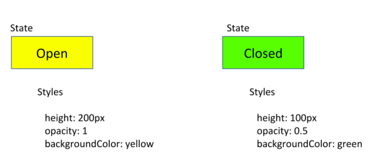
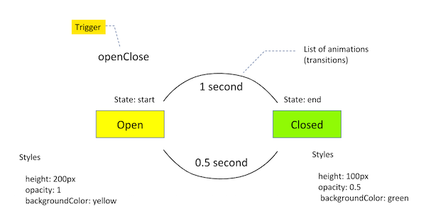

# [返回主目录](Readme.md)<!-- omit in toc --> 

# 目录 <!-- omit in toc --> 

- [Angular动画简介](#angular动画简介)
- [快速上手](#快速上手)
  - [步骤一：启用动画模块](#步骤一启用动画模块)
  - [步骤二：把动画功能导入组件文件中](#步骤二把动画功能导入组件文件中)
  - [步骤三：添加动画的元数据属性](#步骤三添加动画的元数据属性)
- [简单转场动画](#简单转场动画)
  - [动画状态和样式](#动画状态和样式)
  - [转场与时序](#转场与时序)
    - [动画元数据：持续时间、延迟和缓动效果](#动画元数据持续时间延迟和缓动效果)
  - [触发动画](#触发动画)
  - [定义动画，并把它们附加到 HTML 模板中](#定义动画并把它们附加到-html-模板中)
  - [代码回顾](#代码回顾)
  - [小节](#小节)
- [动画 API 小节](#动画-api-小节)

## Angular动画简介

动画用于提供运动的幻觉：HTML 元素随着时间改变样式。精心设计的动画可以让你的应用更有趣，更易用，但它们不仅仅是装饰性的。动画可以通过几种方式改善你的应用和用户体验：

- 没有动画，Web 页面的转场就会显得突兀、不协调。

- 运动能极大地提升用户体验，因此动画可以让用户察觉到应用对他们的操作做出了响应。

- 良好的动画可以直观的把用户的注意力吸引到要留意的地方。

典型的动画会涉及多种随时间变化的转换。HTML 元素可以移动、变换颜色、增加或缩小、隐藏或从页面中滑出。 这些变化可以同时发生或顺序发生。你可以控制每次转换的持续时间。

Angular 的动画系统是基于 CSS 功能构建的，这意味着你可以 "动" 浏览器认为可动的任何属性。包括位置、大小、变形、颜色、边框等。W3C 在它的 [CSS Transitions（转场）](https://www.w3.org/TR/css-transitions-1/) 页中维护了一个可动属性的列表。

## 快速上手


Angular 主要的动画模块是 @angular/animations 和 @angular/platform-browser。当你使用 CLI 创建新项目时，这些依赖会自动添加到你的项目中。

为了把 Angular 动画添加到你的项目中，把这些与动画相关的模块和标准的 Angular 功能一起导入进来。

### 步骤一：启用动画模块
导入 BrowserAnimationsModule，它能把动画能力引入 Angular 应用的根模块中。
```ts
import { NgModule } from '@angular/core';
import { BrowserModule } from '@angular/platform-browser';
import { BrowserAnimationsModule } from '@angular/platform-browser/animations';

@NgModule({
  imports: [
    BrowserModule,
    BrowserAnimationsModule
  ],
  declarations: [ ],
  bootstrap: [ ]
})
export class AppModule { }
```
### 步骤二：把动画功能导入组件文件中
如果你准备在组件文件中使用特定的动画函数，请从 @angular/animations 中导入这些函数。
```ts
import { Component, HostBinding } from '@angular/core';
import {
  trigger,
  state,
  style,
  animate,
  transition,
  // ...
} from '@angular/animations';
```
### 步骤三：添加动画的元数据属性
在组件的 @Component() 装饰器中，添加一个名叫 animations: 的元数据属性。 你可以把用来定义动画的触发器放进 animations 元数据属性中。
```ts
@Component({
  selector: 'app-root',
  templateUrl: 'app.component.html',
  styleUrls: ['app.component.css'],
  animations: [
    // animation triggers go here
  ]
})
```

## 简单转场动画
我们来做一个简单的转场动作，它把单个 HTML 元素从一个状态变成另一个状态。 比如，你可以指定按钮根据用户的最后一个动作显示成Open或Closed状态。当按钮处于 open 状态时，它是可见的，并且是黄色的。当它处于 closed 状态时，它是透明的，并且是绿色的。

在 HTML 中，这些属性都使用普通的 CSS 样式，比如颜色（color）和透明度（opacity）。在 Angular 中，使用 style() 函数来指定一组用作动画的 CSS 样式。 你可以为动画状态指定一组样式，并为该状态指定一个名字，比如 open 或 closed。


### 动画状态和样式

使用 Angular 的 state() 函数来定义不同的状态，供每次转场结束时调用。该函数接受两个参数：一个唯一的名字，比如 open 或 closed 和一个 style() 函数。

使用 style() 函数来定义一组与指定的状态名相关的样式。注意，样式的属性必须是**小驼峰** 格式的。

我们来看看 Angular 的 state() 函数如何与 style() 函数联用，来设置 CSS 样式的属性。 在下面的代码片段中，该状态的多个样式属性都是同时设置的。在 open 状态中，该按钮的高度是 200 像素，透明度是 1，背景色是黄色。

```ts
// ...
state('open', style({
  height: '200px',
  opacity: 1,
  backgroundColor: 'yellow'
})),
```
在 closed 状态中，按钮的高度是 100 像素，透明度是 0.5，背景色是绿色。
```ts
state('closed', style({
  height: '100px',
  opacity: 0.5,
  backgroundColor: 'green'
})),
```
### 转场与时序
在 Angular 中，你可以设置多个样式而不必用动画。不过，如果没有进一步细化，按钮的转换会立即完成 —— 没有渐隐、没有收缩，也没有其它的可视化效果来指出正在发生变化。

要让这些变化不那么突兀，我们需要定义一个动画转场来要求这些状态之间的变化在一段时间内发生。transition() 接受两个参数：第一个参数接受一个表达式，它定义两个转场状态之间的方向；第二个参数接受一个或一系列 animate() 函数。

使用 animate() 函数来定义长度、延迟和缓动效果，并指定一个样式函数，以定义转场过程中的样式。 你还可以使用 animate() 函数来为多步动画定义 keyframes() 函数。这些定义放在 animate() 函数的第二个参数中。

#### 动画元数据：持续时间、延迟和缓动效果
animate() 函数（作为转场函数的第二个参数）可以接受 timings 和 styles 参数。

timings 参数接受一个由三部分组成的字符串。
    `animate ('duration delay easing')`

第一部分 duration（持续时间）是必须的。这个持续时间可以表示成一个不带引号的纯数字（表示毫秒），或一个带引号的有单位的时间（表示秒数）。比如，0.1 秒的持续时间有如下表示方式：

- 作为纯数字，毫秒为单位：100

- 作为字符串，毫秒为单位：'100ms'

- 作为字符串，秒为单位：'0.1s'

第二个参数 delay 的语法和 duration 一样。比如：
- 等待 100 毫秒，然后运行 200 毫秒表示为：'0.2s 100ms'

第三个参数 easing 控制动画在运行期间如何进行加速和减速。比如 ease-in 表示动画开始时很慢，然后逐渐加速。

- 等待 100 毫秒，运行 200 毫秒。按照减速曲线运动，快速启动并逐渐减速，直到静止：'0.2s 100ms ease-out'

- 运行 200 毫秒，不等待。按照标准曲线运动，开始很慢，中间加速，最后逐渐减速：'0.2s ease-in-out'

- 立即开始，运行 200 毫秒。按照加速曲线运动，开始很慢，最后达到全速：'0.2s ease-in'

下面的例子提供了一个从 open 到 closed 的持续一秒的状态转场。

```ts
transition('open => closed', [
  animate('1s')
]),
```
在上面的代码片段中，=> 操作符表示单向转场，而 <=> 表示双向转场。在转场过程中，animate() 指定了转场需要花费的时间。在这里，从 open 到 closed 状态的转换要花费 1 秒中，表示成 1s。

下面的例子添加了一个从 closed 到 open 的状态转场，转场动画持续 0.5 秒。
```ts
transition('closed => open', [
  animate('0.5s')
]),
```

注意：在 state 和 transition 函数中使用样式时有一些需要注意的地方。

- 请用 state() 来定义那些每个转场结束时的样式，这些样式在动画完成后仍会保留。

- 使用 transition() 来定义那些中间样式，以便在动画过程中产生运动的错觉。

- 当禁用了动画时，也会忽略 transition() 中的样式，但 state() 中的样式不会。

- 你可以在同一个 transition() 参数中包含多个状态对：transition( 'on => off, off => void' )

### 触发动画
动画需要触发器，以便知道该在何时开始。trigger() 函数会把一些状态和转场组合在一起，并为这个动画命名，这样你就可以在 HTML 模板中把它附加到想要触发动画的元素上了。

trigger() 函数描述了监听变化时要使用的触发器名称。当这个触发器名称所绑定的值发生了变化时，触发器就会启动它所定义的操作。这些操作可能是转场，也可能是其它功能，我们稍后就会看到。

在这个例子中，我们将把该触发器命名为 openClose，并把它附加到 button 元素上。该触发器描述了 open 和 closed 两个状态，以及两个转场效果的时序。



> 注意：在每个 trigger() 函数调用中，元素在任意时刻只能处于其中的一个状态。但是，元素可以在同一时刻激活多个触发器。

### 定义动画，并把它们附加到 HTML 模板中
这些控制 HTML 元素如何运动的动画是在组件的元数据中定义的。请在 @Component() 装饰器的 animations: 属性下用代码定义你要用的动画。

```ts
@Component({
  selector: 'app-open-close',
  animations: [
    trigger('openClose', [
      // ...
      state('open', style({
        height: '200px',
        opacity: 1,
        backgroundColor: 'yellow'
      })),
      state('closed', style({
        height: '100px',
        opacity: 0.5,
        backgroundColor: 'green'
      })),
      transition('open => closed', [
        animate('1s')
      ]),
      transition('closed => open', [
        animate('0.5s')
      ]),
    ]),
  ],
  templateUrl: 'open-close.component.html',
  styleUrls: ['open-close.component.css']
})
export class OpenCloseComponent {
  isOpen = true;

  toggle() {
    this.isOpen = !this.isOpen;
  }

}
```
为组件定义好这些动画触发器之后，你可以给触发器名称加上 @ 前缀并包在方括号里，来把它附加到组件模板中的元素上。然后，你可以使用 Angular 的标准属性绑定语法（如下所示），来把这个触发器绑定到模板表达式上。这里的 triggerName 就是触发器的名称，而 expression 的求值结果是前面定义过的动画状态之一。
```html
<div [@triggerName]="expression">...</div>;
```
当该表达式的值变成了新的状态时，动画就会执行或者叫触发。

下列代码片段把该触发器绑定到了 isOpen 属性的值上。
```html
<div [@openClose]="isOpen ? 'open' : 'closed'" class="open-close-container">
  <p>The box is now {{ isOpen ? 'Open' : 'Closed' }}!</p>
</div>
```
在这个例子中，当 isOpen 表达式求值为一个已定义状态 open 或 closed 时，就会通知 openClose 触发器说状态变化了。然后，就由 openClose 中的代码来处理状态变更，并启动状态变更动画。

对于那些进入或离开页面的元素（插入到 DOM 中或从中移除），你可以让动画变成有条件的。例如，在 HTML 模板中可以和 *ngIf 一起使用动画触发器。

> 注意：在组件文件中，要把用来定义动画的触发器设置为 @Component() 装饰器的 animations: 属性的值。
> 在 HTML 模板文件中，使用这个触发器的名称来把所定义的这些动画附加到想要添加动画的 HTML 元素上。

### 代码回顾
下面是转场动画范例中讨论过的代码文件。
```ts
// src/app/open-close.component.ts
@Component({
  selector: 'app-open-close',
  animations: [
    trigger('openClose', [
      // ...
      state('open', style({
        height: '200px',
        opacity: 1,
        backgroundColor: 'yellow'
      })),
      state('closed', style({
        height: '100px',
        opacity: 0.5,
        backgroundColor: 'green'
      })),
      transition('open => closed', [
        animate('1s')
      ]),
      transition('closed => open', [
        animate('0.5s')
      ]),
    ]),
  ],
  templateUrl: 'open-close.component.html',
  styleUrls: ['open-close.component.css']
})
export class OpenCloseComponent {
  isOpen = true;

  toggle() {
    this.isOpen = !this.isOpen;
  }

}


// src/app/open-close.component.html
<div [@openClose]="isOpen ? 'open' : 'closed'" class="open-close-container">
  <p>The box is now {{ isOpen ? 'Open' : 'Closed' }}!</p>
</div>

// src/app/open-close.component.css
:host {
  display: block;
}

.open-close-container {
  border: 1px solid #dddddd;
  margin-top: 1em;
  padding: 20px 20px 0px 20px;
  color: #000000;
  font-weight: bold;
  font-size: 20px;
}
```
### 小节
在两个状态之间添加简单的转场动画，只要使用 style() 和 state()，并使用 animate() 来定义时序就可以了。

## 动画 API 小节
@angular/animations 模块提供的这些功能性 API 提供了一种领域特定语言（DSL），用于在 Angular 应用中创建和控制动画效果。到 [API 参考手册](https://angular.cn/api/animations)中查看完整的列表以及这些核心功能、相关数据结构的详细语法。

函数名|用途
-|-
trigger()|开始动画，并充当所有其它动画函数的容器。HTML 模板可以绑定到 triggerName。使用第一个参数来声明唯一的触发器名称。要使用数组语法。
style()|定义一个或多个要用于动画中的 CSS 样式。用于在动画期间控制 HTML 元素的视觉外观。要使用对象语法。
state()|创建一组有名字的 CSS 样式，它会在成功转换到指定的状态时应用到元素上。该状态可以在其它动画函数中通过名字进行引用。
animate()|指定转场的时序信息。delay 和 easing 是可选值。其中可以包含 style() 调用。
transition()|定义两个命名状态之间的动画序列。使用数组语法。
keyframes()|允许以特定的时间间隔对样式进行顺序更改。用于 animate() 中。每个 keyframe() 中都可以包含多个 style() 调用。使用数组语法。
group()|指定要并行运行的一组动画步骤（内部动画）。 该动画只有当所有内部动画步骤都完成之后才会继续。用于 sequence() 或 transition() 中。
query()|用于找出当前元素中的一个或多个内部 HTML 元素。
sequence()|指定一个动画步骤列表，它们会逐个顺序执行。
stagger()|交错安排多元素动画的开始时间。
animation()|生成可在其它地方调用的可重用动画。与 useAnimation() 一起使用。
useAnimation()|激活一个可复用动画。和 animation() 一起使用。
animateChild()|允许子组件上的动画和父组件在同一个时间范围（timeframe）内执行。
