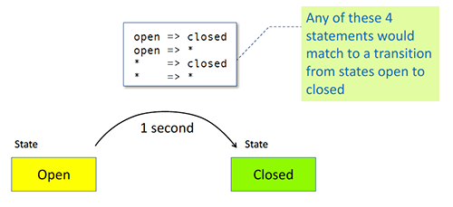
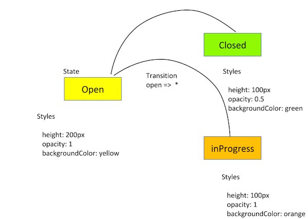
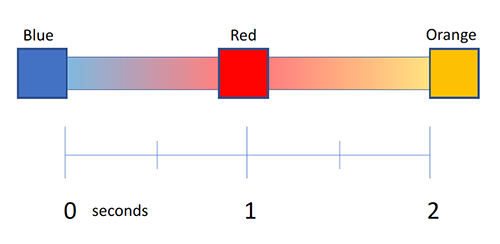
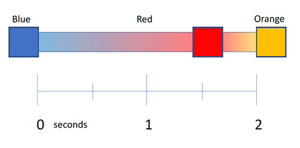
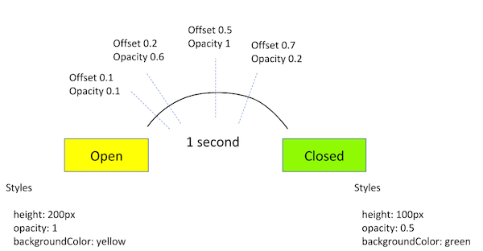

# [返回主目录](Readme.md)<!-- omit in toc --> 

# 目录 <!-- omit in toc --> 

- [动画转场与触发器](#动画转场与触发器)
- [预定义状态与通配符匹配](#预定义状态与通配符匹配)
  - [通配符状态](#通配符状态)
  - [使用带多个转场状态的通配符状态](#使用带多个转场状态的通配符状态)
  - [使用带样式的通配符状态](#使用带样式的通配符状态)
  - [void 状态](#void-状态)
  - [组合使用通配符和 void 状态](#组合使用通配符和-void-状态)
- [播放进入和离开视图时的动画](#播放进入和离开视图时的动画)
- [:enter 和 :leave 别名](#enter-和-leave-别名)
  - [和 :enter 与 :leave 一起使用 *ngIf 和 *ngFor](#和-enter-与-leave-一起使用-ngif-和-ngfor)
- [转场中的 :increment 和 :decrement](#转场中的-increment-和-decrement)
- [转场中的逻辑值](#转场中的逻辑值)
- [多重动画触发器](#多重动画触发器)
  - [父-子动画](#父-子动画)
  - [在某个 HTML 元素上禁用动画](#在某个-html-元素上禁用动画)
  - [禁用所有动画](#禁用所有动画)
- [动画回调](#动画回调)
- [关键帧动画](#关键帧动画)
  - [偏移](#偏移)
  - [带脉动效果的关键帧](#带脉动效果的关键帧)
  - [可动的属性与单位](#可动的属性与单位)
  - [使用通配符自动计算属性](#使用通配符自动计算属性)
  - [关键帧动画总结](#关键帧动画总结)

## 动画转场与触发器
本章将深入讲解特殊的转场状态，如 *（通配符）和 void，并说明这些特殊状态如何作用于进入或离开视图的元素。本章还探讨了多重触发器、动画回调，以及使用关键帧技术的序列动画。

## 预定义状态与通配符匹配
在 Angular 中，转场状态可以通过 state() 函数进行显式定义，或使用预定义的 *（通配符）状态和 void 状态。

### 通配符状态
星号 * 或者叫通配符可以匹配任何一个动画状态。它可用来定义那些不用在乎 HTML 元素的起始状态或结束状态的转场动画。

比如，一个 open => * 转场可应用在当元素的状态从 open 变成任何其它状态时。


下面是通配符状态的另一个代码范例，以及我们以前使用 open 和 closed 状态的实例。但这次，对于每个状态到状态的转换对，我们这次规定从任何状态转场到 closed 状态时要花 1 秒钟，而从任何状态转场到 open 状态时要花 0.5 秒。

这让我们可以添加新状态，而不必把它手动包含到每个单独的转场中。
```ts
animations: [
  trigger('openClose', [
    // ...
    state('open', style({
      height: '200px',
      opacity: 1,
      backgroundColor: 'yellow'
    })),
    state('closed', style({
      height: '100px',
      opacity: 0.5,
      backgroundColor: 'green'
    })),
    transition('* => closed', [
      animate('1s')
    ]),
    transition('* => open', [
      animate('0.5s')
    ]),
  ]),
],
```
使用双向箭头语法可以指定任意方向的状态转场。
```ts
transition('open <=> closed', [
  animate('0.5s')
]),
```

### 使用带多个转场状态的通配符状态
在这个双态按钮的例子中，通配符不是很有用，因为只有两种可能的状态：open 和 closed。当一个特定状态下的元素可能变更为多个潜在状态时，通配符状态会更好用。如果我们的按钮可以从 open 变成 closed 或类似 inProgress 的状态，则可以使用通配符状态来减少所需的编码量。


```ts
animations: [
  trigger('openClose', [
    // ...
    state('open', style({
      height: '200px',
      opacity: 1,
      backgroundColor: 'yellow'
    })),
    state('closed', style({
      height: '100px',
      opacity: 0.5,
      backgroundColor: 'green'
    })),
    transition('open => closed', [
      animate('1s')
    ]),
    transition('closed => open', [
      animate('0.5s')
    ]),
    transition('* => closed', [
      animate('1s')
    ]),
    transition('* => open', [
      animate('0.5s')
    ]),
    transition('open <=> closed', [
      animate('0.5s')
    ]),
    transition ('* => open', [
      animate ('1s',
        style ({ opacity: '*' }),
      ),
    ]),
    transition('* => *', [
      animate('1s')
    ]),
```

当在任意两个状态之间切换时，* => * 转场都会生效。

转场会按照其定义的顺序进行匹配。因此，你可以在 * => * 转场的前面定义其它转场。比如，定义只针对 open => closed 的状态变更或动画，或 closed => open，而使用 * => * 作为匹配不上其它状态对时的后备。

要这么做，只要把那些更特殊的转场放在 * => * 前面就行了。

### 使用带样式的通配符状态
使用带样式的 * 通配符来告诉动画使用当前的状态值，并用它进行动画处理。通配符是一个后备值，如果未在触发器中声明动画状态，就会使用这个值。

```ts
transition ('* => open', [
  animate ('1s',
    style ({ opacity: '*' }),
  ),
]),
```

### void 状态
你可以使用 void 状态来为进入或离开页面的元素配置转场。

### 组合使用通配符和 void 状态

你可以在转场中组合使用通配符和 void 状态，以触发那些进入和离开页面的动画：

- 当元素离开视图时，就会触发 * => void 转场，而不管它离开前处于什么状态。

- 当元素进入视图时，就会触发 void => * 转场，而不管它进入时处于什么状态。

- 通配符状态 * 会匹配任何状态 —— 包括 void。

## 播放进入和离开视图时的动画

本节介绍如何为进入和离开页面的元素设置动画。

> 注意：出于我们的目的，我们把元素进入或离开视图等价于从 DOM 中插入或删除。

现在，我们要添加一些新的行为：
- 当你把一个英雄添加到英雄列表中时，它看起来是从左侧飞进页面的。

- 当你从列表中移除一个英雄时，它看起来是从右侧飞出去的。

```ts
animations: [
  trigger('flyInOut', [
    state('in', style({ transform: 'translateX(0)' })),
    transition('void => *', [
      style({ transform: 'translateX(-100%)' }),
      animate(100)
    ]),
    transition('* => void', [
      animate(100, style({ transform: 'translateX(100%)' }))
    ])
  ])
]
```
在上述代码中，当 HTML 元素没有附着在视图中时，我们就会应用 void 状态。

## :enter 和 :leave 别名

enter 和 :leave 分别是 void => * 和 * => void 的别名。 这些别名供多个动画函数使用。

```ts
transition ( ':enter', [ ... ] );  // alias for void => *
transition ( ':leave', [ ... ] );  // alias for * => void
```
定位进入视图的元素更难，因为它不在 DOM 中。 因此，使用别名 :enter 和 :leave 来定位要从视图中插入或删除的 HTML 元素。

### 和 :enter 与 :leave 一起使用 *ngIf 和 *ngFor
当任何 *ngIf 或 *ngFor 中的视图放进页面中时，会运行 :enter 转场；当移除这些视图时，就会运行 :leave 转场。

本例子中有一个名叫 myInsertRemoveTrigger 的触发器，来表示进入和离开动画。 其 HTML 模板包含下列代码。

```html
<div @myInsertRemoveTrigger *ngIf="isShown" class="insert-remove-container">
  <p>The box is inserted</p>
</div>
```
在组件文件中，:enter 转场会将初始透明度设置为 0，然后设置动画，当该元素已经插入视图中之后，把这个透明度设置为 1。
```ts
trigger('myInsertRemoveTrigger', [
  transition(':enter', [
    style({ opacity: 0 }),
    animate('100ms', style({ opacity: 1 })),
  ]),
  transition(':leave', [
    animate('100ms', style({ opacity: 0 }))
  ])
]),
```

## 转场中的 :increment 和 :decrement
transition() 函数还能接受额外的选择器值：:increment 和 :decrement。当数值增加或减小时，使用这些来启动转场。

```ts
trigger('filterAnimation', [
  transition(':enter, * => 0, * => -1', []),
  transition(':increment', [
    query(':enter', [
      style({ opacity: 0, width: '0px' }),
      stagger(50, [
        animate('300ms ease-out', style({ opacity: 1, width: '*' })),
      ]),
    ], { optional: true })
  ]),
  transition(':decrement', [
    query(':leave', [
      stagger(50, [
        animate('300ms ease-out', style({ opacity: 0, width: '0px' })),
      ]),
    ])
  ]),
]),
```

## 转场中的逻辑值

如果某个触发器以逻辑型的值作为绑定值，那么就可以使用能与 true 和 false 或 1 和 0 相比较的 transition() 表达式来匹配这个值。

```html
<div [@openClose]="isOpen ? true : false" class="open-close-container">
</div>
```
在上述代码片段中，HTML 模板将 `<div>` 元素绑定到名为 openClose 的触发器，其状态表达式是 isOpen，可能的值为 true 和 false。这种方式可以代替创建两个命名状态 open 和 close 的方式。

在组件代码中，@Component 元数据下的 animations: 属性中，当该状态求值为 true 时（这里表示 "open"），相关 HTML 元素的高度值为通配符样式 * 或某个默认值。在这种情况下，它会使用此元素开始动画前的现有高度。当该元素是 "closed" 时，它的高度会从指定的高度运动到 0，这会让它不可见。

```ts
animations: [
  trigger('openClose', [
    state('true', style({ height: '*' })),
    state('false', style({ height: '0px' })),
    transition('false <=> true', animate(500))
  ])
],
```

## 多重动画触发器
你可以为组件定义多个动画触发器并将这些动画触发器附着到不同的元素上，这些元素之间的父子关系会影响动画的运行方式和时机。

### 父-子动画
每次在 Angular 中触发动画时，父动画始终会优先，而子动画会被阻塞。为了运行子动画，父动画必须查询出包含子动画的每个元素，然后使用 animateChild() 函数来运行它们。

### 在某个 HTML 元素上禁用动画
可以把一个名叫 @.disabled 的动画控制绑定放在 HTML 元素上，以禁用该元素及其子元素上的动画。当 @.disabled 绑定为 true 时，就会禁止渲染所有动画。

下面的代码范例展示了如何使用此特性。
```ts
// src/app/open-close.component.html
<div [@.disabled]="isDisabled">
  <div [@childAnimation]="isOpen ? 'open' : 'closed'"
    class="open-close-container">
    <p>The box is now {{ isOpen ? 'Open' : 'Closed' }}!</p>
  </div>
</div>

// src/app/open-close.component.ts
@Component({
  animations: [
    trigger('childAnimation', [
      // ...
    ]),
  ],
})
export class OpenCloseChildComponent {
  isDisabled = false;
  isOpen = false;
}
```
当 @.disabled 绑定为 true 时，@childAnimation 触发器就不会启动。

当 HTML 模板中的某个元素使用 @.disabled 禁止了动画时，也会同时禁止其所有内部元素的动画。你无法有选择的单独禁用单个元素上的多个动画。

不过，选择性的子动画仍然可以用如下方式之一在已禁用的父元素上运行：
v.

- 父动画可以使用 query() 函数来收集 HTML 模板中位于禁止动画区域内部的元素。这些元素仍然可以播放动画。

- 子动画可以被父动画查询，并且稍后使用 animateChild() 来播放它。

### 禁用所有动画
要禁用 Angular 应用中的所有动画，只要把 @.disabled 绑定放在顶层的 Angular 组件上即可

```ts
@Component({
  selector: 'app-root',
  templateUrl: 'app.component.html',
  styleUrls: ['app.component.css'],
  animations: [
    slideInAnimation
    // animation triggers go here
  ]
})
export class AppComponent {
  @HostBinding('@.disabled')
  public animationsDisabled = false;
}
```
> 注意：禁用应用级的动画在端到端（E2E）测试中是很有用的。

## 动画回调

当动画启动和终止时，trigger() 函数会发出一些回调。在下面的例子中，我们有一个包含 openClose 触发器的组件。
```ts
@Component({
  selector: 'app-open-close',
  animations: [
    trigger('openClose', [
      // ...
    ]),
  ],
  templateUrl: 'open-close.component.html',
  styleUrls: ['open-close.component.css']
})
export class OpenCloseComponent {
  onAnimationEvent ( event: AnimationEvent ) {
  }
}
```
在 HTML 模板中，动画事件可以通过 $event 传递回来，比如 @trigger.start 和 @trigger.done ，这里的 trigger 表示所使用的触发器名字。在我们的例子中，openClose 触发器将会是这样的：
```html
<div [@openClose]="isOpen ? 'open' : 'closed'"
    (@openClose.start)="onAnimationEvent($event)"
    (@openClose.done)="onAnimationEvent($event)"
    class="open-close-container">
</div>
```
动画回调的潜在用途之一，是用来覆盖比较慢的 API 调用，比如查阅数据库。例如，你可以建立一个 InProgress 按钮，让它拥有自己的循环动画。当后端系统操作完成时，它会播放脉动效果或其它一些视觉动作。

然后，在当前动画结束时，可以调用另一个动画。比如，当 API 调用完成时，按钮会从 inProgress 状态编程 closed 状态。

动画可以影响最终用户，让他觉得操作更快 —— 虽然并没有。因此，简单的动画是保持用户满意的一种经济有效的手段，而不必寻求提高服务器调用的速度或被迫补救那些你无法控制的情况，比如不可靠的网络连接。

回调可以作为调试工具，例如与 console.warn() 结合使用，以便在浏览器的开发者控制台中查看应用的进度。下列代码片段为我们原始的双态按钮（open 与 closed）范例创建了控制台输出。
```ts
export class OpenCloseComponent {
  onAnimationEvent ( event: AnimationEvent ) {
    // openClose is trigger name in this example
    console.warn(`Animation Trigger: ${event.triggerName}`);

    // phaseName is start or done
    console.warn(`Phase: ${event.phaseName}`);

    // in our example, totalTime is 1000 or 1 second
    console.warn(`Total time: ${event.totalTime}`);

    // in our example, fromState is either open or closed
    console.warn(`From: ${event.fromState}`);

    // in our example, toState either open or closed
    console.warn(`To: ${event.toState}`);

    // the HTML element itself, the button in this case
    console.warn(`Element: ${event.element}`);
  }
}
```
## 关键帧动画

前一节是简单的双态转场。现在，我们要使用关键帧动画创建一个具有多个顺序执行步骤的动画。

Angular 的 keyframe() 函数类似于 CSS 中的关键帧。关键帧允许在单个时间段内进行多种样式更改。例如，我们的按钮可以在单个的 2 秒时间段内多次改变颜色，而不是渐隐掉。



这些更改颜色的代码如下所示：

```ts
transition('* => active', [
  animate('2s', keyframes([
    style({ backgroundColor: 'blue' }),
    style({ backgroundColor: 'red' }),
    style({ backgroundColor: 'orange' })
  ]))
```

### 偏移
关键帧包括一个用来定义动画中每个样式何时开始更改的偏移（offset）属性。偏移是个 0 到 1 之间的相对值，分别标记动画的开始和结束时间，并且只要使用了它，就要同样应用于这个关键帧的每个步骤。

定义关键帧的偏移量是可选的。如果省略它们，就会自动分配均匀间隔的偏移。例如，三个没有预定义偏移的关键帧会分别使用 0、0.5、1 作为偏移。在上面的例子中，还可以为中间的转场指定偏移量 0.8。代码如下：


带有指定偏移量的代码如下：
```ts
transition('* => active', [
  animate('2s', keyframes([
    style({ backgroundColor: 'blue', offset: 0}),
    style({ backgroundColor: 'red', offset: 0.8}),
    style({ backgroundColor: 'orange', offset: 1.0})
  ])),
]),
transition('* => inactive', [
  animate('2s', keyframes([
    style({ backgroundColor: 'orange', offset: 0}),
    style({ backgroundColor: 'red', offset: 0.2}),
    style({ backgroundColor: 'blue', offset: 1.0})
  ]))
]),
```
你可以在单个动画中组合使用 duration、delay 和 easing 来定义关键帧。

### 带脉动效果的关键帧
通过在整个动画中定义特定偏移处的样式，可以使用关键帧在动画中创建脉动效果。

下面是使用关键帧创建脉动效果的例子：

- 原始的 open 和 closed 状态（包括其原始的高度、颜色和透明度）会在一秒钟内逐渐发生变化。

- 插在中间的关键帧序列会导致该按钮在一秒钟内出现不规则的脉动。



此动画的代码片段是这样的：
```ts
trigger('openClose', [
  state('open', style({
    height: '200px',
    opacity: 1,
    backgroundColor: 'yellow'
  })),
  state('close', style({
    height: '100px',
    opacity: 0.5,
    backgroundColor: 'green'
  })),
  // ...
  transition('* => *', [
    animate('1s', keyframes ( [
      style({ opacity: 0.1, offset: 0.1 }),
      style({ opacity: 0.6, offset: 0.2 }),
      style({ opacity: 1,   offset: 0.5 }),
      style({ opacity: 0.2, offset: 0.7 })
    ]))
  ])
])
```
### 可动的属性与单位
Angular 的动画支持是基于 Web 动画的，所以你可以动浏览器认为可动（animatable）的任意属性。包括位置、大小、变形、颜色、边框等。W3C 在 CSS 转场页也维护了一个可动属性的列表。

对于带有数值的位置属性，可以把值作为字符串（别忘了带引号）并使用适当的后缀来定义其单位：
- 50 像素：'50px'

- 相对字体大小：'3em'

- 百分比：'100%'

如果在指定尺寸时未提供单位，则 Angular 将使用默认单位像素（px）。把 50 像素表示为 50 和 '50px' 是一样的。

### 使用通配符自动计算属性
有时你在运行之前并不知道某个样式的属性值。比如，元素的宽度和高度通常取决于其内容和屏幕大小。在使用 CSS 动画时，这些属性通常会具有挑战性（译注：因为 CSS 动画不支持自动确定宽高）。

这些情况下，你可以在 style() 中指定通配符 * 属性，以便在运行期间计算该属性的值，然后把它插入到动画中。

下面的例子中有一个名叫 shrinkOut 的触发器，它会在 HTML 元素离开页面时使用。该动画会使用它离开之前的任意高度，并从该高度动画到 0。
```ts
// src/app/hero-list-auto.component.ts
animations: [
  trigger('shrinkOut', [
    state('in', style({ height: '*' })),
    transition('* => void', [
      style({ height: '*' }),
      animate(250, style({ height: 0 }))
    ])
  ])
]
```
### 关键帧动画总结
Angular 中的 keyframes() 函数允许你在单个转场中指定多个临时样式，并使用可选的偏移量来定义动画中每次样式变化的发生时机。