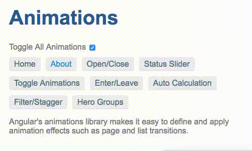

# [返回主目录](Readme.md)<!-- omit in toc --> 

# 目录 <!-- omit in toc --> 

- [路由转场动画](#路由转场动画)
- [路由配置](#路由配置)
- [路由出口](#路由出口)
- [动画定义](#动画定义)
  - [为宿主组件和子组件添加样式](#为宿主组件和子组件添加样式)
  - [查询视图的容器](#查询视图的容器)

## 路由转场动画

路由能让用户在应用中的不同路由之间导航。当用户从一个路由导航到另一个路由时，Angular 路由器会把这个 URL 映射到一个相关的组件，并显示其视图。为这种路由转换添加动画，将极大地提升用户体验。

Angular 路由器天生带有高级动画功能，它可以让你为在路由变化时为视图之间设置转场动画。要想在路由切换时生成动画序列，你需要首先定义出嵌套的动画序列。从宿主视图的顶层组件开始，在这些内嵌视图的宿主组件中嵌套添加其它动画。

要启用路由转场动画，需要做如下步骤：

1. 为应用导入路由模块，并创建一个路由配置来定义可能的路由。

2. 添加路由器出口，来告诉 Angular 路由器要把激活的组件放在 DOM 中的什么位置。

3. 定义动画。

让我们以两个路由之间的导航过程来解释一下路由转场动画，Home 和 About 分别与 HomeComponent 和 AboutComponent 的视图相关联。所有这些组件视图都是顶层视图的子节点，其宿主是 AppComponent。我们将实现路由器过渡动画，该动画会在出现新视图时向右滑动，并当用户在两个路由之间导航时把旧视图滑出。



## 路由配置

首先，使用 RouterModule 类提供的方法来配置一组路由。该路由配置会告诉路由器该如何导航。

使用 RouterModule.forRoot 方法来定义一组路由。同时，把其返回值导入到主模块 AppModule 的 imports 数组中。

> 注意：在根模块 AppModule 中使用 RouterModule.forRoot 方法来注册一些顶层应用路由和提供者。对于特性模块，调用 RouterModule.forChild 方法来注册其它路由。

下列配置定义了应用程序中可能的路由。
```ts
import { NgModule } from '@angular/core';
import { BrowserModule } from '@angular/platform-browser';
import { BrowserAnimationsModule } from '@angular/platform-browser/animations';
import { RouterModule } from '@angular/router';
import { AppComponent } from './app.component';
import { OpenCloseComponent } from './open-close.component';
import { OpenClosePageComponent } from './open-close-page.component';
import { OpenCloseChildComponent } from './open-close.component.4';
import { ToggleAnimationsPageComponent } from './toggle-animations-page.component';
import { StatusSliderComponent } from './status-slider.component';
import { StatusSliderPageComponent } from './status-slider-page.component';
import { HeroListPageComponent } from './hero-list-page.component';
import { HeroListGroupPageComponent } from './hero-list-group-page.component';
import { HeroListGroupsComponent } from './hero-list-groups.component';
import { HeroListEnterLeavePageComponent } from './hero-list-enter-leave-page.component';
import { HeroListEnterLeaveComponent } from './hero-list-enter-leave.component';
import { HeroListAutoCalcPageComponent } from './hero-list-auto-page.component';
import { HeroListAutoComponent } from './hero-list-auto.component';
import { HomeComponent } from './home.component';
import { AboutComponent } from './about.component';
import { InsertRemoveComponent } from './insert-remove.component';


@NgModule({
  imports: [
    BrowserModule,
    BrowserAnimationsModule,
    RouterModule.forRoot([
      { path: '', pathMatch: 'full', redirectTo: '/enter-leave' },
      { path: 'open-close', component: OpenClosePageComponent },
      { path: 'status', component: StatusSliderPageComponent },
      { path: 'toggle', component: ToggleAnimationsPageComponent },
      { path: 'heroes', component: HeroListPageComponent, data: {animation: 'FilterPage'} },
      { path: 'hero-groups', component: HeroListGroupPageComponent },
      { path: 'enter-leave', component: HeroListEnterLeavePageComponent },
      { path: 'auto', component: HeroListAutoCalcPageComponent },
      { path: 'insert-remove', component: InsertRemoveComponent},
      { path: 'home', component: HomeComponent, data: {animation: 'HomePage'} },
      { path: 'about', component: AboutComponent, data: {animation: 'AboutPage'} },

    ])
  ],
```

home 和 about 路径分别关联着 HomeComponent 和 AboutComponent 视图。该路由配置告诉 Angular 路由器当导航匹配了相应的路径时，就实例化 HomeComponent 和 AboutComponent 视图。

除了 path、component 之外，每个路由定义中的 data 属性也定义了与此路由有关的动画配置。当路由变化时，data 属性的值就会传给 AppComponent。你还可以在路由配置中传递其它的值供路由的动画使用。data 属性的值必须满足 routeAnimation 中定义的转场动画的要求，稍后我们就会定义它。

> 注意：这个 data 中的属性名可以是任意的。例如，上面例子中使用的名字 animation 就是随便起的。

## 路由出口
配置好路由之后，还要告诉 Angular 路由器当路由匹配时，要把视图渲染到那里。你可以通过在根组件 AppComponent 的模板中插入一个 `<router-outlet>` 容器来指定路由出口的位置。

`<router-outlet>` 容器具有一个属性型指令，它包含关于活动路由及其状态的数据，这些数据会基于我们在路由配置中设置的 data 属性。
```html
<div [@routeAnimations]="prepareRoute(outlet)" >
  <router-outlet #outlet="outlet"></router-outlet>
</div>
```
AppComponent 中定义了一个可以检测视图何时发生变化的方法，该方法会基于路由配置的 data 属性值，将动画状态值赋值给动画触发器（@routeAnimation）。下面就是一个 AppComponent 中的范例方法，用于检测路由在何时发生了变化。
```ts
prepareRoute(outlet: RouterOutlet) {
  return outlet && outlet.activatedRouteData && outlet.activatedRouteData['animation'];
}
```
这里的 prepareRoute() 方法会获取这个 outlet 指令的值（通过 #outlet="outlet"），并根据当前活动路由的自定义数据返回一个表示动画状态的字符串值。你可以使用这个数据来控制各个路由之间该执行哪个转场。

## 动画定义
动画可以直接在组件中定义。对于此范例，我们会在独立的文件中定义动画，这让我们可以复用这些动画。

下面的代码片段定义了一个名叫 slideInAnimation 的可复用动画。
```ts
// src/app/animations.ts
export const slideInAnimation =
  trigger('routeAnimations', [
    transition('HomePage <=> AboutPage', [
      style({ position: 'relative' }),
      query(':enter, :leave', [
        style({
          position: 'absolute',
          top: 0,
          left: 0,
          width: '100%'
        })
      ]),
      query(':enter', [
        style({ left: '-100%'})
      ]),
      query(':leave', animateChild()),
      group([
        query(':leave', [
          animate('300ms ease-out', style({ left: '100%'}))
        ]),
        query(':enter', [
          animate('300ms ease-out', style({ left: '0%'}))
        ])
      ]),
      query(':enter', animateChild()),
    ]),
    transition('* <=> FilterPage', [
      style({ position: 'relative' }),
      query(':enter, :leave', [
        style({
          position: 'absolute',
          top: 0,
          left: 0,
          width: '100%'
        })
      ]),
      query(':enter', [
        style({ left: '-100%'})
      ]),
      query(':leave', animateChild()),
      group([
        query(':leave', [
          animate('200ms ease-out', style({ left: '100%'}))
        ]),
        query(':enter', [
          animate('300ms ease-out', style({ left: '0%'}))
        ])
      ]),
      query(':enter', animateChild()),
    ])
  ]);
```
该动画定义做了如下事情：

- 定义两个转场。每个触发器都可以定义多个状态和多个转场。

- 调整宿主视图和子视图的样式，以便在转场期间，控制它们的相对位置。

- 使用 query() 来确定哪个子视图正在进入或离开宿主视图。

路由的变化会激活这个动画触发器，并应用一个与该状态变更相匹配的转场。

> 注意：这些转场状态必须和路由配置中定义的 data 属性的值相一致。

通过将可复用动画 slideInAnimation 添加到 AppComponent 的 animations 元数据中，可以让此动画定义能用在你的应用中。

```ts
// src/app/app.component.ts

@Component({
  selector: 'app-root',
  templateUrl: 'app.component.html',
  styleUrls: ['app.component.css'],
  animations: [
    slideInAnimation
    // animation triggers go here
  ]
})
```

### 为宿主组件和子组件添加样式
在转场期间，新视图将直接插入在旧视图后面，并且这两个元素会同时出现在屏幕上。要防止这种情况，就要为宿主视图以及要删除和插入的子视图指定一些额外的样式。宿主视图必须使用相对定位模式，而子视图则必须使用绝对定位模式。在这些视图中添加样式，就可以让容器就地播放动画，而不会让 DOM 移动。
```ts
// src/app/animations.ts
trigger('routeAnimations', [
  transition('HomePage <=> AboutPage', [
    style({ position: 'relative' }),
    query(':enter, :leave', [
      style({
        position: 'absolute',
        top: 0,
        left: 0,
        width: '100%'
      })
    ]),
```

### 查询视图的容器
使用 query() 方法可以找出当前宿主组件中的动画元素。query(":enter") 语句会返回已插入的视图，query(":leave") 语句会返回已移除的视图。

我们假设正在从 Home 转场到 About，Home => About。
```ts
query(':enter', [
    style({ left: '-100%'})
  ]),
  query(':leave', animateChild()),
  group([
    query(':leave', [
      animate('300ms ease-out', style({ left: '100%'}))
    ]),
    query(':enter', [
      animate('300ms ease-out', style({ left: '0%'}))
    ])
  ]),
  query(':enter', animateChild()),
]),
transition('* <=> FilterPage', [
  style({ position: 'relative' }),
  query(':enter, :leave', [
    style({
      position: 'absolute',
      top: 0,
      left: 0,
      width: '100%'
    })
  ]),
  query(':enter', [
    style({ left: '-100%'})
  ]),
  query(':leave', animateChild()),
  group([
    query(':leave', [
      animate('200ms ease-out', style({ left: '100%'}))
    ]),
    query(':enter', [
      animate('300ms ease-out', style({ left: '0%'}))
    ])
  ]),
  query(':enter', animateChild()),
])
```

在设置了视图的样式之后，动画代码会执行如下操作：

- query(':enter style({ left: '-100%'}) 会匹配添加的视图，并通过将其定位在最左侧来隐藏这个新视图。

- 在正在离开的视图上调用 animateChild()，来运行其子动画。

- 使用 group() 函数来并行运行内部动画。

- 在 group() 函数中：

  - 查询已移除的视图，并让它从右侧滑出。

  - 使用缓动函数和持续时间定义的动画，让这个新视图滑入。
  此动画将导致 about 视图从左向右滑动。

- 当主动画完成之后，在这个新视图上调用 animateChild() 方法，以运行其子动画。

你现在有了一个基本的路由动画，可以在从一个视图路由到另一个视图时播放动画。