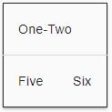

# 目录 <!-- omit in toc --> 

# 模板语法
Angular 应用管理着**用户之所见和所为**，并通过 **Component 类的实例（组件）**和**面向用户的模板交互**来实现这一点。  
在 Angular 中，**组件**扮演着**控制器或视图模型**的角色，**模板则扮演视图**的角色。  

## 模板中的HTML
几乎所有的 HTML 语法都是有效的模板语法。  
**`<script>` 元素，它被禁用了**，以阻止脚本注入攻击的风险。（实际上，`<script> `只是被忽略了。）  
**`<html>、<body> 和 <base>` 元素并没有扮演有用的角色**。剩下的所有元素基本上就都一样用了。  

## 插值表达式与模板表达式
### 插值表达式{{...}}
插值表达式会**用双花括号 {{和 }} 作为分隔符**。例如  
```html
<h3>Current customer: {{ currentCustomer }}</h3>
```
插值表达式可以把计算后的字符串插入到 HTML 元素标签内的文本或对标签的属性进行赋值。  
```html
<p>{{title}}</p>
<div></div>
```
在**括号之间的“素材”**，通常**是组件属性的名字**。Angular 会用组件中**相应属性的字符串值**，替换这个名字。  
括号间的素材是一个**模板表达式**，Angular 先**对它求值**，**再**把它**转换成字符串**。   
```html
<!-- "The sum of 1 + 1 is 2" -->
<p>The sum of 1 + 1 is {{1 + 1}}.</p>
```
>**插值其实是一个特殊语法，Angular 会把它转换为属性绑定**。  
>想用别的分隔符来代替 {{ 和 }}，也可以通过 Component 元数据中的 interpolation 选项来配置插值分隔符。  

### 模板表达式
**模板表达式会产生一个值**，并出**现在双花括号 {{ }} 中**。  Angular 执行这个表达式，并把它**赋值给绑定目标的属性**，这个**绑定目标可能是 HTML 元素、组件或指令**。  
模板表达式禁止使用具有或可能引发副作用的 JavaScript 表达式，包括：
- 赋值 (=, +=, -=, ...)

- new、typeof、instanceof 等操作符。

- 使用 ; 或 , 串联起来的表达式

- 自增和自减运算符：++ 和 --

- 一些 ES2015+ 版本的操作符

### 表达式上下文
典型的表**达式上下文就是这个组件实例**，它是各种绑定值的来源。  
表达式的上下文**可以包括组件之外的对象**。 比如模**板输入变量 (let customer)和模板引用变量(#customerInput)就**是备选的上下文对象之一。
```html
<!-- 组件实例的表达式上下文-->
<h4>{{recommended}}</h4>


<!-- 板输入变量的表达式上下文-->
<ul>
  <li *ngFor="let customer of customers">{{customer.name}}</li>
</ul>

<!-- 模板引用变量的表达式上下文-->
<label>Type something:
  <input #customerInput>{{customerInput.value}}
</label>
```
表达式上下文变量是由**模板变量**、**指令的上下文变量**（如果有）和**组件的成员**叠加而成的。  
在同一命名空间下优先级顺序如下：
**模板变量 > 指令的上下文变量 > 组件的成员**  
如果变量命名冲突，就以以上优先级进行调用。  

> 模板表达式不能引用全局命名空间中的任何东西，比如 window 或 document。它们也不能调用 console.log 或 Math.max。 它们只能引用表达式上下文中的成员。

### 模板表达式使用指南
遵循如下规则：
- 没有可见的副作用

- 执行迅速

- 非常简单

#### 没有可见的副作用
**模板表达式除了目标属性的值以外，不应该改变应用的任何状态。**
最好使用幂等的表达式，因为它没有副作用，并且能提升 Angular 变更检测的性能。  
幂等的表达式应该总是返回完全相同的东西，直到某个依赖值发生改变。  
#### 执行迅速
**表达式应该快速结束**，否则用户就会感到拖沓，特别是在较慢的设备上。 
#### 非常简单
虽然也可以写复杂的模板表达式，不过最好避免那样做。  
属性名或方法调用应该是常态，但偶然使用逻辑取反 ! 也是可以的。 其它情况下，**应该把应用程序和业务逻辑限制在组件中**，这样它才能更容易开发和测试。  

## 模板语句
**模板语句**用来**响应由绑定目标（如 HTML 元素、组件或指令）触发的事件**。 模板语句将在事件绑定一节看到，**它出现在 = 号右侧的引号中**，就像这样：**(event)="statement"**。   
**模板语句有副作用**。 这是事件处理的关键。因为你要根据用户的输入更新应用状态。  
```html
<button (click)="deleteHero()">Delete hero</button>
``` 
**模板语句**使用的语言也像 JavaScript。 **模板语句解析器**和模板表达式解析器有所不同，特别之处在于它支持**基本赋值 (=) 和表达式链 (; 和 ,)**。

然而，某些 JavaScript 语法仍然是不允许的：
- new 运算符

- 自增和自减运算符：++ 和 --

- 操作并赋值，例如 += 和 -=

- 位操作符 | 和 &

- 模板表达式运算符
### 语句上下文
语句上下文，通常是**正在绑定事件的那个组件实例**。  
**(click)="deleteHero()"** 中的 **deleteHero** 就是这个数据绑定组件上的一个方法。  
```html
<button (click)="deleteHero()">Delete hero</button>
```

**语句上下文**可以**引用模板自身上下文中的属性**。 在下面的例子中，就把模板的 $event 对象、模板输入变量 (let hero)和模板引用变量 (#heroForm)传给了组件中的一个事件处理器方法。  

```html
<button (click)="onSave($event)">Save</button>
<button *ngFor="let hero of heroes" (click)="deleteHero(hero)">{{hero.name}}</button>
<form #heroForm (ngSubmit)="onSubmit(heroForm)"> ... </form>
```
**模板上下文中的变量优先级 > 组件上下文中的变量**

### 语句指南
和表达式一样，**避免写复杂的模板语句**。 常规是函数调用或者属性赋值。

## 绑定语法概览
绑定的类型可以根据数据流的方向分成**三类**： **从数据源到视图**、**从视图到数据源**以及**双向的从视图到数据源再到视图**。

| 数据方向                 | 语法                                                                        | 绑定类型                   |
| ------------------------ | --------------------------------------------------------------------------- | -------------------------- |
| 单向从数据源到视图       | `{{expression}}`<br> `[target]="expression"`<br> `bind-target="expression"` | 插值、属性Attribute、CSS类 |
| 从视图到数据源的单向绑定 | `(target)="statement"`<br>`on-target="statement"`                           | 事件                       |
| 双向                     | `[(target)]="expression"`<br>`bindon-target="expression"`                   | 双向                       |

> 由于 HTML attribute 和 DOM property 在中文中都被翻译成了“属性”，无法区分,如果**提到“属性”**的地方，一定是**指DOM property**，Angular很少操作HTML Attribute

**在等号左边是目标名， 无论是包在括号中 ([]、()) 还是用前缀形式 (bind-、on-、bindon-) 。**

**这个目标名就是属性（Property）的名字。而不是元素属性（Attribute）的名字。**

### 新思维模型HTML+
数据绑定**允许用自定义标记扩展 HTML 词汇**的能力，会让你把模板 HTML 当成 HTML+。

**正常的 HTML 开发过程**，使用 HTML 元素来创建视觉结构， 通过把字符串常量设置到元素的 attribute 来修改那些元素。
```html
<div class="special">Mental Model</div>

<button disabled>Save</button>
```
在 Angular 模板中，**用封装了 HTML 的组件创建新元素**，并把它们当作原生 HTML 元素在模板中使用。

```html
<!-- Normal HTML -->
<div class="special">Mental Model</div>
<!-- 新的HTML元素 -->
<app-hero-detail></app-hero-detail>
```
在数据绑定之前，看一个例子：
```html
<!-- Bind button disabled state to `isUnchanged` property -->
<button [disabled]="isUnchanged">Save</button>
```
也许你会认为，正在绑定按钮的disabled attribute设置为组件的isUnchanged属性的值。  
但是这是错误的！实际上，**只要数据绑定开始了。就已经与HTML attribute无关了。这里不是设置HTML的属性，而是DOM元素、组件和指令的property**。

### HTML attribute和DOM property对比
attribute 是由 HTML 定义的。property 是由 DOM (Document Object Model) 定义的。
- 少量 HTML attribute 和 property 之间有着 1:1 的映射，如 id。

- 有些 HTML attribute 没有对应的 property，如 colspan。

- 有些 DOM property 没有对应的 attribute，如 textContent。

- 大量 HTML attribute 看起来映射到了 property…… 但却不像你想的那样！

> **attribute 初始化 DOM property**，然后它们的任务就完成了。**property 的值可以改变；attribute 的值不能改变**。

***要搞清楚attribute和property的区别，就要将attribute和property都学明白***
***强调：模板绑定是通过 property 和事件来工作的，而不是 attribute。***

**attribute 唯一的作用是用来初始化元素和指令的状态。 当进行数据绑定时，只是在与元素和指令的 property 和事件打交道，而 attribute 就完全靠边站了。**

### 绑定目标

数据绑定的目标是 DOM 中的某些东西。 这个**目标可能是（元素 | 组件 | 指令的）property、（元素 | 组件 | 指令的）事件，或(极少数情况下) attribute 名**。

| 绑定类型  | 目标                                                  | 范例                                                                                                                                                                             |
| --------- | ----------------------------------------------------- | -------------------------------------------------------------------------------------------------------------------------------------------------------------------------------- |
| 属性      | 元素的 property<br>组件的 property<br>指令的 property | ``<br>`<app-hero-detail[hero]="currentHero"></app-hero-detail>`<br>`<div [ngClass]="{'special': isSpecial}"></div>`                                    |
| 事件      | 元素的事件<br>组件的事件<br>指令的事件                | `<button (click)="onSave()">Save</button>`<br>`<app-hero-detail (deleteRequest)="deleteHero()"></app-hero-detail>`<br>`<div (myClick)="clicked=$event" clickable>click me</div>` |
| 双向      | 事件与property                                        | `<input [(ngModel)]="name">`                                                                                                                                                     |
| Attribute | attribute(例外情况)                                   | `<button [attr.aria-label]="help">help</button>`                                                                                                                                 |
| CSS类     | class property                                        | `<div [class.special]="isSpecial">Special</div>`                                                                                                                                 |
| 样式      | style property                                        | `<button [style.color]="isSpecial ? 'red' : 'green'">`                                                                                                                           |
## 属性名绑定[属性名]

最常用的**属性绑定是把元素属性(property)设置为组件属性的值**。
```html

<button [disabled]="isUnchanged">Cancel is disabled</button>
```
另一种是**设置指令的属性绑定**
```html
<div [ngClass]="classes">[ngClass] binding to the classes property</div>
```
设置**自定义组件的模型属性（这是父子组件之间通讯的重要途径）**
```html
<app-hero-detail [hero]="currentHero"></app-hero-detail>
```

### 单项输入

**属性绑定描属于单向数据绑定**，是从组件的数据属性流动到目标元素的属性。
**不能使用属性绑定来从目标元素拉取值，也不能绑定到目标元素的属性来读取它。只能设置它**。

### 绑定目标
**包裹在方括号中的元素属性名标记着目标属性**。  
````
或者使用**规范形式**，**bind-前缀**
````
**注意，这里的目标名字是property，而非attribute。**  

### 消除副作用
模板表达式的计算不能有可见的副作用。表达式可能会调用具有副作用的属性或方法。但 Angular 没法知道这一点，也没法阻止你。一般建议是，**只绑定数据属性和那些只返回值而不做其它事情的方法**。

### 返回恰当的类型
模板表达式应该返回目标属性所需类型的值。 如果目标属性想要个字符串，就返回字符串。 如果目标属性想要个数字，就返回数字。 如果目标属性想要个对象，就返回对象。

### 别忘了方括号
方括号告诉 Angular 要计算模板表达式。 如果忘了加方括号，Angular 会把这个表达式当做字符串常量看待

### 一次性字符串初始化
当满足下列条件时，应该**省略括号**：
- 目标属性接受字符串值。

- 字符串是个固定值，可以直接合并到模块中。

- 这个初始值永不改变。


标准 HTML 中用这种方式初始化 attribute，这种方式也可以用在初始化指令和组件的属性。下面这个例子把 HeroDetailComponent 的 prefix 属性初始化为固定的字符串，而不是模板表达式。Angular 设置它，然后忘记它。
``<app-hero-detail prefix="You are my" [hero]="currentHero"></app-hero-detail>``

### 属性绑定还是插值表达式？
通常得在插值和属性绑定之间做出选择。 下列这几对绑定做的事情完全相同：
```html
<p> is the <i>interpolated</i> image.</p>
<p> is the <i>property bound</i> image.</p>

<p><span>"{{title}}" is the <i>interpolated</i> title.</span></p>
<p>"<span [innerHTML]="title"></span>" is the <i>property bound</i> title.</p>
```
在多数情况下，**插值是更方便的备选项**。
但**数据类型不是字符串时，就必须使用属性绑定了**。
#### 内容安全
假设下面带有恶意内容的组件属性
```ts
evilTitle = 'Template <script>alert("evil never sleeps")</script>Syntax';
```
Angular 数据绑定对危险 HTML 有防备。 在显示它们之前，它对内容先进行消毒。 **不管是插值还是属性绑定，都不会允许带有 script 标签的 HTML 泄漏到浏览器中**。

```html
<!-- Angular会提示的警告
  Angular generates warnings for these two lines as it sanitizes them
  WARNING: sanitizing HTML stripped some content (see http://g.co/ng/security#xss).
 -->
<p><span>"{{evilTitle}}" is the <i>interpolated</i> evil title.</span></p>
<p>"<span [innerHTML]="evilTitle"></span>" is the <i>property bound</i> evil title.</p>
```
**插值处理script标签与属性绑定有所不同，但是二者都会只渲染没有危害的内容**：


## attribute、class、style绑定
模板语法为那些不太适合使用属性绑定的场景提供了专门的单向数据绑定形式。
### attribute绑定
可以通过attribute 绑定来直接设置 attribute 的值。 
> 这是“绑定到目标属性 (property)”这条规则中唯一的例外。这是唯一的能创建和设置 attribute 的绑定形式。

当元素没有**属性可绑的时候，就必须使用 attribute 绑定**。例如 ARIA， SVG 和 table 中的 colspan/rowspan 等 attribute。 它们是纯粹的 attribute，没有对应的属性可供绑定。
如果针对attribute使用插值或者属性绑定，就会出现错误
```html
<tr><td colspan="{{1 + 1}}">Three-Four</td></tr>
```
```error
Template parse errors:
Can't bind to 'colspan' since it isn't a known native property
```
**因为插值表达式和属性绑定只能设置property，不能设置attribute。**
**attribute绑定语法如下**：
```ts 
[attr.attribute-name] = "xxx"
```
**中括号部分以attr.开头，之后跟具体要绑定的attribute名字，等号后可使用字符串的表达式来设置attribute的值。**
```html
<table border=1>
  <!--  expression calculates colspan=2 -->
  <tr><td [attr.colspan]="1 + 1">One-Two</td></tr>

  <!-- ERROR: There is no `colspan` property to set!
    <tr><td colspan="{{1 + 1}}">Three-Four</td></tr>
  -->

  <tr><td>Five</td><td>Six</td></tr>
</table>
```
渲染结果：

### CSS类绑定
CSS 类绑定，**可以从元素的 class attribute 上添加和移除 CSS 类名**。  
绑定形式如下：
```ts
[class.class-name]="xxx" //单独设置某个class-name，一旦xxx为真，则添加这个css的class-name，反之移除这个css的class-name
class="a b c" [class]="xxx" //一旦xxx有值，则覆盖默认的class，反之保留默认的class
```
例如： 
```html
<!-- reset/override all class names with a binding  -->
<div class="bad curly special"
     [class]="badCurly">Bad curly</div>
```
当 badCurly 有值时 class 这个 attribute 设置的内容会被完全覆盖

```html
<!-- toggle the "special" class on/off with a property -->
<div [class.special]="isSpecial">The class binding is special</div>

<!-- binding to `class.special` trumps the class attribute -->
<div class="special"
     [class.special]="!isSpecial">This one is not so special</div>
```
绑定到special类名。 当模板表达式的求值结果是真值时，Angular 会添加这个类，反之则移除它。

虽然切换单一类名是个好办法，但是**通常人们更喜欢使用NgClass指令来同时管理多个CSS类名**，后文将详细解读

### 样式绑定
样式绑定形式如下：
```ts
[style.style-property]
[style.style-property.em]
[style.style-property.%]
```
与属性绑定类似,但方括号中的部分不是元素的属性名，而由style前缀，一个点 (.)和 CSS 样式的属性名组成。
例如：
```html
<button [style.color]="isSpecial ? 'red': 'green'">Red</button>
<button [style.background-color]="canSave ? 'cyan': 'grey'" >Save</button>
<button [style.font-size.em]="isSpecial ? 3 : 1" >Big</button>
<button [style.font-size.%]="!isSpecial ? 150 : 50" >Small</button>
```
虽然这是设置单一样式的好办法，但人们**通常更喜欢使用 NgStyle 指令 来同时设置多个内联样式**。

## 事件绑定
**事件绑定允许你侦听某些事件，比如按键、鼠标移动、点击和触屏**。
Angular 的事件绑定语法由**等号左侧带圆括号的目标事件**和**右侧引号中的模板语句**组成。


### 目标事件
Angular会**根据圆括号中的事件名称优先匹配已知指令的事件属性，如果没有匹配结果，会继续匹配元素的事件名称，如果依然没有匹配结果，会报错“未知指令”**。  
例如： 
```html
<!-- 匹配元素click事件-->
<button (click)="onSave($event)">Save</button>
<!-- 使用规范形式on-前缀，匹配元素click事件-->
<button on-click="onSave($event)">on-click Save</button>

<h4>myClick is an event on the custom ClickDirective:</h4>
<!-- 匹配指令的事件属性，如果没有找到myClick将会报错-->
<button (myClick)="clickMessage=$event" clickable>click with myClick</button>
{{clickMessage}}
```

### $event和事件处理语句

**\$event是一个事件的对象**
在事件绑定中，Angular会为目标事件设置一个事件处理器，当事件发生时事件处理器会执行模板语句，有时需要从html中取值，并将值存储在模型中，这个时候就需要\$event事件对象传递关于此事件的信息。  
**\$event是什么事件对象取决于绑定的目标事件**。**如果这个目标事件是原生的DOM事件，那\$event就是一个DOM事件对象**，它将会带有target、target.value这样的属性。  
**如果目标事件属于指令，那么\$event具体是什么事件对象就取决于目标事件属于什么指令了**。
例如：  
```html
<input [value]="currentItem.name"
       (input)="currentItem.name=$event.target.value" >
<!-- 不使用NgModel -->
```
上面的代码由于目标事件为DOM的原生input事件，所以\$event就是一个原生的DOM事件对象。通过将input事件发生后用户输入的值赋值给组件属性currentItem.name。
### 使用EventEmitter实现自定义事件
**EventEmitter字面意思是事件发射器**，顾名思义，就是通过这个对象的实例可以将目标事件发送给需要处理该事件的地方。  
并且EventEmitter对象的实例可以调用它本身的emit()方法，将需要的数据通过参数的形式传递出去。  
**使用EventEmitter对象实现自定义事件，通常指令创建一个EventEmitter对象的实例。并将这个实例作为属性暴露出来(@Output)，指令通过调用EventEmitter.emit(payload)来触发事件，其中的payload参数可以是任意类型的数据。之后父指令通过绑定这个属性来监听这个事件，并通过\$event对象来访问payload数据。**

例如如下例子：
```html
<!-- item-detial.compoent.html -->

<span [style.text-decoration]="lineThrough">{{ item.name }}
</span>
<button (click)="delete()">Delete</button>
```
```ts
// item-detail.component.ts
// This component makes a request but it can't actually delete a hero.
@Output() deleteRequest = new EventEmitter<Item>();

delete() {
  this.deleteRequest.emit(this.item);
  this.displayNone = this.displayNone ? '' : 'none';
  this.lineThrough = this.lineThrough ? '' : 'line-through';
}
```
**这个子组件HeroDetialComponent中，模板中带有一个绑定click事件的delete()方法。  
组件类中定义了delete()方法。但是这个子组件并不知道如何删除数据。最好的方法就是这个子组件向出发该click事件的父组件去报告它要删除用户的这个请求。**

父组件：
```html
<app-hero-detail [hero]="currentHero" (deleteRequest)="deleteHero($event)">
</app-hero-detail>
```
```ts
  deleteHero(hero?: Hero) {
    this.alert(`Delete ${hero ? hero.name : 'the hero'}.`);
  }
```
**在父组件中，当子组件的delete()方法被触发后，子组件的事件发射器就是发出一个通知，通知父组件我要删除数据，并且将要删除的相关数据存储至\$event对象中。  
父组件将deleteHero($event)方法事件绑定到子组件的事件发射器deleteRequest对象上，当接收到事件发射器发出的通知，就会将包含有子组件提供的数据的\$event对象传入deleteHero方法中进行进一步的逻辑处理。**

