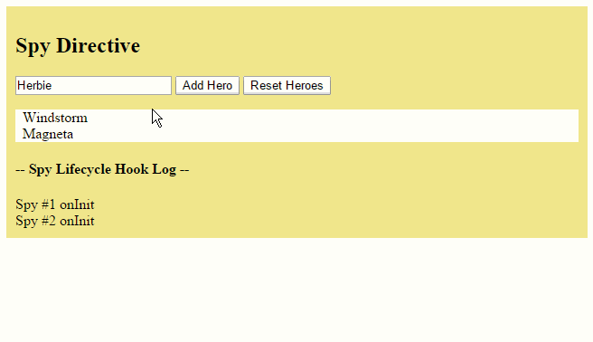

# [返回主目录](Readme.md)<!-- omit in toc --> 

# 目录 <!-- omit in toc --> 

# 生命周期钩子
每个组件都有一个被Angular管理的生命周期。

Angular 创建它，渲染它，创建并渲染它的子组件，在它被绑定的属性发生变化时检查它，并在它从 DOM 中被移除前销毁它。

Angular 提供了生命周期钩子，把这些关键生命时刻暴露出来，赋予你在它们发生时采取行动的能力。

除了那些组件内容和视图相关的钩子外,指令有相同生命周期钩子。

# 组件生命周期钩子概览

**指令和组件的实例的生命周期**：当 Angular 新建、更新和销毁它们时触发。 通过**实现一个或多个 Angular core 库里定义的生命周期钩子接口，开发者可以介入该生命周期中的这些关键时刻**。

每个接口都有唯一的一个钩子方法，它们的名字是**由接口名再加上 ng 前缀构成的**。比如，OnInit 接口的钩子方法叫做 ngOnInit， Angular 在创建组件后立刻调用它。

```ts
export class PeekABoo implements OnInit {
  constructor(private logger: LoggerService) { }

  // implement OnInit's `ngOnInit` method
  ngOnInit() { this.logIt(`OnInit`); }

  logIt(msg: string) {
    this.logger.log(`#${nextId++} ${msg}`);
  }
}
```
**指令或者组件会没有实现所有这些接口，并且有些钩子只对组件有意义。只有在指令/组件中定义过的那些钩子方法才会被 Angular 调用。**

# 生命周期的顺序

当 Angular 使用构造函数新建一个组件或指令后，就会按下面的顺序在特定时刻调用这些生命周期钩子方法：

钩子|用途及时机
-|-
ngOnChanges()|当 Angular（重新）设置数据绑定输入属性时响应。 该方法接受当前和上一属性值的 SimpleChanges 对象<br>**在 ngOnInit() 之前以及所绑定的一个或多个输入属性的值发生变化时都会调用**。
ngOnInit()|在 Angular 第一次显示数据绑定和设置指令/组件的输入属性之后，初始化指令/组件。<br>**在第一轮 ngOnChanges() 完成之后调用，只调用一次**。
ngDoCheck()|检测，并在发生 Angular 无法或不愿意自己检测的变化时作出反应。<br>**在每个变更检测周期中，紧跟在 ngOnChanges() 和 ngOnInit() 后面调用。**
ngAfterContentInit()|当 Angular 把外部内容投影进组件/指令的视图之后调用。<br>**第一次 ngDoCheck() 之后调用，只调用一次。**
ngAfterContentChecked()|每当 Angular 完成被投影组件内容的变更检测之后调用。<br>**ngAfterContentInit() 和每次 ngDoCheck() 之后调用**
ngAfterViewInit()|当 Angular 初始化完组件视图及其子视图之后调用。<br>**第一次 ngAfterContentChecked() 之后调用，只调用一次。**
ngAfterViewChecked()|每当 Angular 做完组件视图和子视图的变更检测之后调用。<br>**ngAfterViewInit() 和每次 ngAfterContentChecked() 之后调用。**
ngOnDestroy()|每当 Angular 每次销毁指令/组件之前调用并清扫。 在这儿反订阅可观察对象和分离事件处理器，以防内存泄漏。<br>**在 Angular 销毁指令/组件之前调用。**

# 接口是可选的(严格来讲)
Angular 在运行时看不到 TypeScript 接口，因为它们在编译为 JavaScript 的时候已经消失了。

**生命周期接口并不是必须的**。 你也别指望在指令和组件上添加生命周期钩子接口就能获得钩子带来的好处。

Angular 会去检测这些指令和组件的类，一旦发现钩子方法被定义了，就调用它们。 Angular 会找到并调用像 ngOnInit() 这样的钩子方法，有没有接口无所谓。

虽然如此，**在 TypeScript 指令类中添加接口是一项最佳实践，它可以获得强类型和 IDE 等编辑器带来的好处。**

# 其它 Angular 生命周期钩子
Angular 的其它子系统除了有这些组件钩子外，还可能有它们自己的生命周期钩子。

第三方库也可能会实现它们自己的钩子，以便让这些开发者在使用时能做更多的控制。

# 生命周期范例

```ts
@Component({
  selector: 'peek-a-boo',
  template: '<p>Now you see my hero, {{name}}</p>',
  styles: ['p {background: LightYellow; padding: 8px}']
})
// Don't HAVE to mention the Lifecycle Hook interfaces
// unless we want typing and tool support.
export class PeekABooComponent extends PeekABoo implements
             OnChanges, OnInit, DoCheck,
             AfterContentInit, AfterContentChecked,
             AfterViewInit, AfterViewChecked,
             OnDestroy {
  @Input()  name: string;

  private verb = 'initialized';

  constructor(logger: LoggerService) {
    super(logger);

    let is = this.name ? 'is' : 'is not';
    this.logIt(`name ${is} known at construction`);
  }

  // only called for/if there is an @input variable set by parent.
  ngOnChanges(changes: SimpleChanges) {
    let changesMsgs: string[] = [];
    for (let propName in changes) {
      if (propName === 'name') {
        let name = changes['name'].currentValue;
        changesMsgs.push(`name ${this.verb} to "${name}"`);
      } else {
        changesMsgs.push(propName + ' ' + this.verb);
      }
    }
    this.logIt(`OnChanges: ${changesMsgs.join('; ')}`);
    this.verb = 'changed'; // next time it will be a change
  }

  // Beware! Called frequently!
  // Called in every change detection cycle anywhere on the page
  ngDoCheck() { this.logIt(`DoCheck`); }

  ngAfterContentInit() { this.logIt(`AfterContentInit`);  }

  // Beware! Called frequently!
  // Called in every change detection cycle anywhere on the page
  ngAfterContentChecked() { this.logIt(`AfterContentChecked`); }

  ngAfterViewInit() { this.logIt(`AfterViewInit`); }

  // Beware! Called frequently!
  // Called in every change detection cycle anywhere on the page
  ngAfterViewChecked() { this.logIt(`AfterViewChecked`); }

  ngOnDestroy() { this.logIt(`OnDestroy`); }
}
```
为了演示 Angular 是如何按照期望的顺序调用这些钩子的。 PeekABooComponent组件完全实现了这些接口，用户点击Create...按钮，然后点击Destroy...按钮后，日志的状态如下图所示：


日志信息的日志和所规定的钩子调用顺序是一致的： OnChanges、OnInit、DoCheck (3x)、AfterContentInit、AfterContentChecked (3x)、 AfterViewInit、AfterViewChecked (3x)和 OnDestroy

> 构造函数本质上不应该算作 Angular 的钩子。 记录确认了在创建期间那些输入属性(这里是 name 属性)没有被赋值。

如果用户点击Update Hero按钮，就会看到另一个 OnChanges 和至少两组 DoCheck、AfterContentChecked 和 AfterViewChecked 钩子。 显然，这三种钩子被触发了很多次，必须让这三种钩子里的逻辑尽可能的精简！

# 窥探 OnInit 和 OnDestroy

1. 就像对组件一样，Angular 也会对指令调用这些钩子方法。

2. 一个侦探(spy)指令可以让你在无法直接修改 DOM 对象实现代码的情况下，透视其内部细节。 显然，你不能修改一个原生 `<div> `元素的实现代码。 你同样不能修改第三方组件。 但你用一个指令就能监视它们了。

通过一个注入进来的 LoggerService 把消息记录到父组件中去:

```ts
// Spy on any element to which it is applied.
// Usage: <div mySpy>...</div>
@Directive({selector: '[mySpy]'})
export class SpyDirective implements OnInit, OnDestroy {

  constructor(private logger: LoggerService) { }

  ngOnInit()    { this.logIt(`onInit`); }

  ngOnDestroy() { this.logIt(`onDestroy`); }

  private logIt(msg: string) {
    this.logger.log(`Spy #${nextId++} ${msg}`);
  }
}
```
把这个侦探指令写到任何原生元素或组件元素上，它将与所在的组件同时初始化和销毁。 下面是把它附加到用来重复显示英雄数据的这个 `<div>` 上。
```html
<div *ngFor="let hero of heroes" mySpy class="heroes">
  {{hero}}
</div>
```
每个“侦探”的出生和死亡也同时标记出了存放英雄的那个 `<div>` 的出生和死亡。钩子记录中的结构是这样的：




添加一个英雄就会产生一个新的英雄 `<div>`。侦探的 ngOnInit() 记录下了这个事件。

Reset 按钮清除了这个 heroes 列表。 Angular 从 DOM 中移除了所有英雄的 div，并且同时销毁了附加在这些 div 上的侦探指令。 侦探的 ngOnDestroy() 方法汇报了它自己的临终时刻。

**在真实的应用程序中，ngOnInit() 和 ngOnDestroy() 方法扮演着更重要的角色。**

## OnInit()

使用 ngOnInit() 有两个原因：

1. **在构造函数之后马上执行复杂的初始化逻辑**

2. **在 Angular 设置完输入属性之后，对该组件进行准备。**

有经验的开发者会让组件能很轻松和安全的构造出来。
