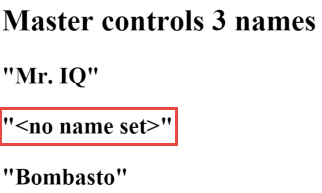
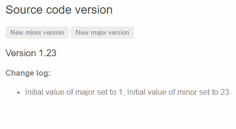

# [返回主目录](Readme.md)<!-- omit in toc --> 

# 目录 <!-- omit in toc --> 
- [组件之间的交互](#%e7%bb%84%e4%bb%b6%e4%b9%8b%e9%97%b4%e7%9a%84%e4%ba%a4%e4%ba%92)
- [通过输入型绑定把数据从父组件传到子组件](#%e9%80%9a%e8%bf%87%e8%be%93%e5%85%a5%e5%9e%8b%e7%bb%91%e5%ae%9a%e6%8a%8a%e6%95%b0%e6%8d%ae%e4%bb%8e%e7%88%b6%e7%bb%84%e4%bb%b6%e4%bc%a0%e5%88%b0%e5%ad%90%e7%bb%84%e4%bb%b6)
  - [测试一下](#%e6%b5%8b%e8%af%95%e4%b8%80%e4%b8%8b)
- [通过 setter 截听输入属性值的变化](#%e9%80%9a%e8%bf%87-setter-%e6%88%aa%e5%90%ac%e8%be%93%e5%85%a5%e5%b1%9e%e6%80%a7%e5%80%bc%e7%9a%84%e5%8f%98%e5%8c%96)
  - [测试一下](#%e6%b5%8b%e8%af%95%e4%b8%80%e4%b8%8b-1)
- [通过ngOnChanges()来截听输入属性值的变化](#%e9%80%9a%e8%bf%87ngonchanges%e6%9d%a5%e6%88%aa%e5%90%ac%e8%be%93%e5%85%a5%e5%b1%9e%e6%80%a7%e5%80%bc%e7%9a%84%e5%8f%98%e5%8c%96)
  - [测试一下](#%e6%b5%8b%e8%af%95%e4%b8%80%e4%b8%8b-2)
- [父组件监听子组件的事件](#%e7%88%b6%e7%bb%84%e4%bb%b6%e7%9b%91%e5%90%ac%e5%ad%90%e7%bb%84%e4%bb%b6%e7%9a%84%e4%ba%8b%e4%bb%b6)
- [父组件与子组件通过本地变量互动](#%e7%88%b6%e7%bb%84%e4%bb%b6%e4%b8%8e%e5%ad%90%e7%bb%84%e4%bb%b6%e9%80%9a%e8%bf%87%e6%9c%ac%e5%9c%b0%e5%8f%98%e9%87%8f%e4%ba%92%e5%8a%a8)
- [父组件调用@ViewChild()](#%e7%88%b6%e7%bb%84%e4%bb%b6%e8%b0%83%e7%94%a8viewchild)
- [父组件和子组件通过服务来双向通讯](#%e7%88%b6%e7%bb%84%e4%bb%b6%e5%92%8c%e5%ad%90%e7%bb%84%e4%bb%b6%e9%80%9a%e8%bf%87%e6%9c%8d%e5%8a%a1%e6%9d%a5%e5%8f%8c%e5%90%91%e9%80%9a%e8%ae%af)
# 组件之间的交互
本文包含了常见的组件通讯场景，也就是让两个或多个组件之间共享信息的方法。

# 通过输入型绑定把数据从父组件传到子组件
HeroChildComponent 有**两个输入型属性**，它们通常带@Input 装饰器。

```ts
import { Component, Input } from '@angular/core';
 
import { Hero } from './hero';
 
@Component({
  selector: 'app-hero-child',
  template: `
    <h3>{{hero.name}} says:</h3>
    <p>I, {{hero.name}}, am at your service, {{masterName}}.</p>
  `
})
export class HeroChildComponent {
  @Input() hero: Hero;
  @Input('master') masterName: string;
}
```
*第二个 @Input 为子组件的属性名 masterName 指定一个别名 master(不推荐为起别名，请参见风格指南).*

父组件 HeroParentComponent 把子组件的 HeroChildComponent 放到 *ngFor 循环器中，把自己的 master 字符串属性绑定到子组件的 master 别名上，并把每个循环的 hero 实例绑定到子组件的 hero 属性。

```ts
import { Component } from '@angular/core';
 
import { HEROES } from './hero';
 
@Component({
  selector: 'app-hero-parent',
  template: `
    <h2>{{master}} controls {{heroes.length}} heroes</h2>
    <app-hero-child *ngFor="let hero of heroes"
      [hero]="hero"
      [master]="master">
    </app-hero-child>
  `
})
export class HeroParentComponent {
  heroes = HEROES;
  master = 'Master';
}
```
运行应用程序会显示三个英雄：


## 测试一下

端到端测试，用于确保所有的子组件都如预期般初始化并显示出来：

```ts
// ...
let _heroNames = ['Dr IQ', 'Magneta', 'Bombasto'];
let _masterName = 'Master';
 
it('should pass properties to children properly', function () {
  let parent = element.all(by.tagName('app-hero-parent')).get(0);
  let heroes = parent.all(by.tagName('app-hero-child'));
 
  for (let i = 0; i < _heroNames.length; i++) {
    let childTitle = heroes.get(i).element(by.tagName('h3')).getText();
    let childDetail = heroes.get(i).element(by.tagName('p')).getText();
    expect(childTitle).toEqual(_heroNames[i] + ' says:');
    expect(childDetail).toContain(_masterName);
  }
});
// ...
```

# 通过 setter 截听输入属性值的变化

使用一个输入属性的 setter，以拦截父组件中值的变化，并采取行动。

子组件 NameChildComponent 的输入属性 name 上的这个 setter，会 trim 掉名字里的空格，并把空值替换成默认字符串。

```ts
import { Component, Input } from '@angular/core';
 
@Component({
  selector: 'app-name-child',
  template: '<h3>"{{name}}"</h3>'
})
export class NameChildComponent {
  private _name = '';
 
  @Input()
  set name(name: string) {
    this._name = (name && name.trim()) || '<no name set>';
  }
 
  get name(): string { return this._name; }
}
```

下面的 NameParentComponent 展示了各种名字的处理方式，包括一个全是空格的名字。

```ts
import { Component } from '@angular/core';
 
@Component({
  selector: 'app-name-parent',
  template: `
  <h2>Master controls {{names.length}} names</h2>
  <app-name-child *ngFor="let name of names" [name]="name"></app-name-child>
  `
})
export class NameParentComponent {
  // Displays 'Dr IQ', '<no name set>', 'Bombasto'
  names = ['Dr IQ', '   ', '  Bombasto  '];
}
```



## 测试一下
```TS
// ...
it('should display trimmed, non-empty names', function () {
  let _nonEmptyNameIndex = 0;
  let _nonEmptyName = '"Dr IQ"';
  let parent = element.all(by.tagName('app-name-parent')).get(0);
  let hero = parent.all(by.tagName('app-name-child')).get(_nonEmptyNameIndex);
 
  let displayName = hero.element(by.tagName('h3')).getText();
  expect(displayName).toEqual(_nonEmptyName);
});
 
it('should replace empty name with default name', function () {
  let _emptyNameIndex = 1;
  let _defaultName = '"<no name set>"';
  let parent = element.all(by.tagName('app-name-parent')).get(0);
  let hero = parent.all(by.tagName('app-name-child')).get(_emptyNameIndex);
 
  let displayName = hero.element(by.tagName('h3')).getText();
  expect(displayName).toEqual(_defaultName);
});
// ...
```

# 通过ngOnChanges()来截听输入属性值的变化
使用 OnChanges 生命周期钩子接口的 ngOnChanges() 方法来监测输入属性值的变化并做出回应。

**当需要监视多个、交互式输入属性的时候，本方法比用属性的 setter 更合适。**

这个 VersionChildComponent 会监测输入属性 major 和 minor 的变化，并把这些变化编写成日志以报告这些变化。

```ts
import { Component, Input, OnChanges, SimpleChange } from '@angular/core';
 
@Component({
  selector: 'app-version-child',
  template: `
    <h3>Version {{major}}.{{minor}}</h3>
    <h4>Change log:</h4>
    <ul>
      <li *ngFor="let change of changeLog">{{change}}</li>
    </ul>
  `
})
export class VersionChildComponent implements OnChanges {
  @Input() major: number;
  @Input() minor: number;
  changeLog: string[] = [];
 
  ngOnChanges(changes: {[propKey: string]: SimpleChange}) {
    let log: string[] = [];
    for (let propName in changes) {
      let changedProp = changes[propName];
      let to = JSON.stringify(changedProp.currentValue);
      if (changedProp.isFirstChange()) {
        log.push(`Initial value of ${propName} set to ${to}`);
      } else {
        let from = JSON.stringify(changedProp.previousValue);
        log.push(`${propName} changed from ${from} to ${to}`);
      }
    }
    this.changeLog.push(log.join(', '));
  }
}
```
VersionParentComponent 提供 minor 和 major 值，把修改它们值的方法绑定到按钮上。

```ts
import { Component } from '@angular/core';
 
@Component({
  selector: 'app-version-parent',
  template: `
    <h2>Source code version</h2>
    <button (click)="newMinor()">New minor version</button>
    <button (click)="newMajor()">New major version</button>
    <app-version-child [major]="major" [minor]="minor"></app-version-child>
  `
})
export class VersionParentComponent {
  major = 1;
  minor = 23;
 
  newMinor() {
    this.minor++;
  }
 
  newMajor() {
    this.major++;
    this.minor = 0;
  }
}
```

下面是点击按钮的结果。



## 测试一下
```ts
// ...
// Test must all execute in this exact order
it('should set expected initial values', function () {
  let actual = getActual();
 
  let initialLabel = 'Version 1.23';
  let initialLog = 'Initial value of major set to 1, Initial value of minor set to 23';
 
  expect(actual.label).toBe(initialLabel);
  expect(actual.count).toBe(1);
  expect(actual.logs.get(0).getText()).toBe(initialLog);
});
 
it('should set expected values after clicking \'Minor\' twice', function () {
  let repoTag = element(by.tagName('app-version-parent'));
  let newMinorButton = repoTag.all(by.tagName('button')).get(0);
 
  newMinorButton.click().then(function() {
    newMinorButton.click().then(function() {
      let actual = getActual();
 
      let labelAfter2Minor = 'Version 1.25';
      let logAfter2Minor = 'minor changed from 24 to 25';
 
      expect(actual.label).toBe(labelAfter2Minor);
      expect(actual.count).toBe(3);
      expect(actual.logs.get(2).getText()).toBe(logAfter2Minor);
    });
  });
});
 
it('should set expected values after clicking \'Major\' once', function () {
  let repoTag = element(by.tagName('app-version-parent'));
  let newMajorButton = repoTag.all(by.tagName('button')).get(1);
 
  newMajorButton.click().then(function() {
    let actual = getActual();
 
    let labelAfterMajor = 'Version 2.0';
    let logAfterMajor = 'major changed from 1 to 2, minor changed from 25 to 0';
 
    expect(actual.label).toBe(labelAfterMajor);
    expect(actual.count).toBe(4);
    expect(actual.logs.get(3).getText()).toBe(logAfterMajor);
  });
});
 
function getActual() {
  let versionTag = element(by.tagName('app-version-child'));
  let label = versionTag.element(by.tagName('h3')).getText();
  let ul = versionTag.element((by.tagName('ul')));
  let logs = ul.all(by.tagName('li'));
 
  return {
    label: label,
    logs: logs,
    count: logs.count()
  };
}
// ...
```
# 父组件监听子组件的事件
子组件暴露一个 EventEmitter 属性，当事件发生时，子组件利用该属性 emits(向上弹射)事件。父组件绑定到这个事件属性，并在事件发生时作出回应。

子组件的 EventEmitter 属性是一个输出属性，通常带有@Output 装饰器，就像在 VoterComponent 中看到的。

```ts
import { Component, EventEmitter, Input, Output } from '@angular/core';
 
@Component({
  selector: 'app-voter',
  template: `
    <h4>{{name}}</h4>
    <button (click)="vote(true)"  [disabled]="didVote">Agree</button>
    <button (click)="vote(false)" [disabled]="didVote">Disagree</button>
  `
})
export class VoterComponent {
  @Input()  name: string;
  @Output() voted = new EventEmitter<boolean>();
  didVote = false;
 
  vote(agreed: boolean) {
    this.voted.emit(agreed);
    this.didVote = true;
  }
}
```
点击按钮会触发 true 或 false(布尔型有效载荷)的事件。

父组件 VoteTakerComponent 绑定了一个事件处理器(onVoted())，用来响应子组件的事件($event)并更新一个计数器。

```ts
import { Component }      from '@angular/core';
 
@Component({
  selector: 'app-vote-taker',
  template: `
    <h2>Should mankind colonize the Universe?</h2>
    <h3>Agree: {{agreed}}, Disagree: {{disagreed}}</h3>
    <app-voter *ngFor="let voter of voters"
      [name]="voter"
      (voted)="onVoted($event)">
    </app-voter>
  `
})
export class VoteTakerComponent {
  agreed = 0;
  disagreed = 0;
  voters = ['Narco', 'Celeritas', 'Bombasto'];
 
  onVoted(agreed: boolean) {
    agreed ? this.agreed++ : this.disagreed++;
  }
}
```
本框架把事件参数(用 $event 表示)传给事件处理方法，该方法会处理它：


# 父组件与子组件通过本地变量互动

**父组件不能使用数据绑定来读取子组件的属性或调用子组件的方法。但可以在父组件模板里，新建一个本地变量来代表子组件，然后利用这个变量来读取子组件的属性和调用子组件的方法**，如下例所示。

子组件 CountdownTimerComponent 进行倒计时，归零时发射一个导弹。start 和 stop 方法负责控制时钟并在模板里显示倒计时的状态信息。

```ts
import { Component, OnDestroy, OnInit } from '@angular/core';
 
@Component({
  selector: 'app-countdown-timer',
  template: '<p>{{message}}</p>'
})
export class CountdownTimerComponent implements OnInit, OnDestroy {
 
  intervalId = 0;
  message = '';
  seconds = 11;
 
  clearTimer() { clearInterval(this.intervalId); }
 
  ngOnInit()    { this.start(); }
  ngOnDestroy() { this.clearTimer(); }
 
  start() { this.countDown(); }
  stop()  {
    this.clearTimer();
    this.message = `Holding at T-${this.seconds} seconds`;
  }
 
  private countDown() {
    this.clearTimer();
    this.intervalId = window.setInterval(() => {
      this.seconds -= 1;
      if (this.seconds === 0) {
        this.message = 'Blast off!';
      } else {
        if (this.seconds < 0) { this.seconds = 10; } // reset
        this.message = `T-${this.seconds} seconds and counting`;
      }
    }, 1000);
  }
}
```

计时器组件的宿主组件 CountdownLocalVarParentComponent 如下：

```ts
import { Component }                from '@angular/core';
import { CountdownTimerComponent }  from './countdown-timer.component';
 
@Component({
  selector: 'app-countdown-parent-lv',
  template: `
  <h3>Countdown to Liftoff (via local variable)</h3>
  <button (click)="timer.start()">Start</button>
  <button (click)="timer.stop()">Stop</button>
  <div class="seconds">{{timer.seconds}}</div>
  <app-countdown-timer #timer></app-countdown-timer>
  `,
  styleUrls: ['../assets/demo.css']
})
export class CountdownLocalVarParentComponent { }
```
父组件不能通过数据绑定使用子组件的 start 和 stop 方法，也不能访问子组件的 seconds 属性。

把本地变量(#timer)放到(<countdown-timer>)标签中，用来代表子组件。这样父组件的模板就得到了子组件的引用，于是可以在父组件的模板中访问子组件的所有属性和方法。

这个例子把父组件的按钮绑定到子组件的 start 和 stop 方法，并用插值表达式来显示子组件的 seconds 属性。

下面是父组件和子组件一起工作时的效果。


# 父组件调用@ViewChild()

**这个本地变量方法是个简单便利的方法。但是它也有局限性，因为父组件-子组件的连接必须全部在父组件的模板中进行。父组件本身的代码对子组件没有访问权**。

**如果父组件的类需要读取子组件的属性值或调用子组件的方法，就不能使用本地变量方法**。

**当父组件类需要这种访问时，可以把子组件作为 ViewChild，注入到父组件里面**。

下面的例子用与倒计时相同的范例来解释这种技术。 它的外观或行为没有变化。子组件CountdownTimerComponent也和原来一样。

下面是父组件 CountdownViewChildParentComponent:
```ts
import { AfterViewInit, ViewChild } from '@angular/core';
import { Component }                from '@angular/core';
import { CountdownTimerComponent }  from './countdown-timer.component';
 
@Component({
  selector: 'app-countdown-parent-vc',
  template: `
  <h3>Countdown to Liftoff (via ViewChild)</h3>
  <button (click)="start()">Start</button>
  <button (click)="stop()">Stop</button>
  <div class="seconds">{{ seconds() }}</div>
  <app-countdown-timer></app-countdown-timer>
  `,
  styleUrls: ['../assets/demo.css']
})
export class CountdownViewChildParentComponent implements AfterViewInit {
 
  @ViewChild(CountdownTimerComponent, {static: false})
  private timerComponent: CountdownTimerComponent;
 
  seconds() { return 0; }
 
  ngAfterViewInit() {
    // Redefine `seconds()` to get from the `CountdownTimerComponent.seconds` ...
    // but wait a tick first to avoid one-time devMode
    // unidirectional-data-flow-violation error
    setTimeout(() => this.seconds = () => this.timerComponent.seconds, 0);
  }
 
  start() { this.timerComponent.start(); }
  stop() { this.timerComponent.stop(); }
}
```

把子组件的视图插入到父组件类需要做一点额外的工作。

首先，你必须导入对装饰器 ViewChild 以及生命周期钩子 AfterViewInit 的引用。

接着，通过 @ViewChild 属性装饰器，将子组件 CountdownTimerComponent 注入到私有属性 timerComponent 里面。

组件元数据里就不再需要 #timer 本地变量了。而是把按钮绑定到父组件自己的 start 和 stop 方法，使用父组件的 seconds 方法的插值表达式来展示秒数变化。

这些方法可以直接访问被注入的计时器组件。

ngAfterViewInit() 生命周期钩子是非常重要的一步。被注入的计时器组件只有在 Angular 显示了父组件视图之后才能访问，所以它先把秒数显示为 0.

然后 Angular 会调用 ngAfterViewInit 生命周期钩子，但这时候再更新父组件视图的倒计时就已经太晚了。Angular 的单向数据流规则会阻止在同一个周期内更新父组件视图。应用在显示秒数之前会被迫再等一轮。

使用 setTimeout() 来等下一轮，然后改写 seconds() 方法，这样它接下来就会从注入的这个计时器组件里获取秒数的值。

# 父组件和子组件通过服务来双向通讯
父组件和它的子组件共享同一个服务，利用该服务在组件家族内部实现双向通讯。

该服务实例的作用域被限制在父组件和其子组件内。这个组件子树之外的组件将无法访问该服务或者与它们通讯。

这个 MissionService 把 MissionControlComponent 和多个 AstronautComponent 子组件连接起来。
```ts
import { Injectable } from '@angular/core';
import { Subject }    from 'rxjs';
 
@Injectable()
export class MissionService {
 
  // Observable string sources
  private missionAnnouncedSource = new Subject<string>();
  private missionConfirmedSource = new Subject<string>();
 
  // Observable string streams
  missionAnnounced$ = this.missionAnnouncedSource.asObservable();
  missionConfirmed$ = this.missionConfirmedSource.asObservable();
 
  // Service message commands
  announceMission(mission: string) {
    this.missionAnnouncedSource.next(mission);
  }
 
  confirmMission(astronaut: string) {
    this.missionConfirmedSource.next(astronaut);
  }
}
```
MissionControlComponent 提供服务的实例，并将其共享给它的子组件(通过 providers 元数据数组)，子组件可以通过构造函数将该实例注入到自身。

```ts
import { Component }          from '@angular/core';
 
import { MissionService }     from './mission.service';
 
@Component({
  selector: 'app-mission-control',
  template: `
    <h2>Mission Control</h2>
    <button (click)="announce()">Announce mission</button>
    <app-astronaut *ngFor="let astronaut of astronauts"
      [astronaut]="astronaut">
    </app-astronaut>
    <h3>History</h3>
    <ul>
      <li *ngFor="let event of history">{{event}}</li>
    </ul>
  `,
  providers: [MissionService]
})
export class MissionControlComponent {
  astronauts = ['Lovell', 'Swigert', 'Haise'];
  history: string[] = [];
  missions = ['Fly to the moon!',
              'Fly to mars!',
              'Fly to Vegas!'];
  nextMission = 0;
 
  constructor(private missionService: MissionService) {
    missionService.missionConfirmed$.subscribe(
      astronaut => {
        this.history.push(`${astronaut} confirmed the mission`);
      });
  }
 
  announce() {
    let mission = this.missions[this.nextMission++];
    this.missionService.announceMission(mission);
    this.history.push(`Mission "${mission}" announced`);
    if (this.nextMission >= this.missions.length) { this.nextMission = 0; }
  }
}
```
AstronautComponent 也通过自己的构造函数注入该服务。由于每个 AstronautComponent 都是 MissionControlComponent 的子组件，所以它们获取到的也是父组件的这个服务实例。
```ts
import { Component, Input, OnDestroy } from '@angular/core';
 
import { MissionService } from './mission.service';
import { Subscription }   from 'rxjs';
 
@Component({
  selector: 'app-astronaut',
  template: `
    <p>
      {{astronaut}}: <strong>{{mission}}</strong>
      <button
        (click)="confirm()"
        [disabled]="!announced || confirmed">
        Confirm
      </button>
    </p>
  `
})
export class AstronautComponent implements OnDestroy {
  @Input() astronaut: string;
  mission = '<no mission announced>';
  confirmed = false;
  announced = false;
  subscription: Subscription;
 
  constructor(private missionService: MissionService) {
    this.subscription = missionService.missionAnnounced$.subscribe(
      mission => {
        this.mission = mission;
        this.announced = true;
        this.confirmed = false;
    });
  }
 
  confirm() {
    this.confirmed = true;
    this.missionService.confirmMission(this.astronaut);
  }
 
  ngOnDestroy() {
    // prevent memory leak when component destroyed
    this.subscription.unsubscribe();
  }
}
```
> 注意，这个例子保存了 subscription 变量，并在 AstronautComponent 被销毁时调用 unsubscribe() 退订。 这是一个用于防止内存泄漏的保护措施。实际上，在这个应用程序中并没有这个风险，因为 AstronautComponent 的生命期和应用程序的生命期一样长。但在更复杂的应用程序环境中就不一定了。  
> 不需要在 MissionControlComponent 中添加这个保护措施，因为它作为父组件，控制着 MissionService 的生命期。


History 日志证明了：在父组件 MissionControlComponent 和子组件 AstronautComponent 之间，信息通过该服务实现了双向传递.


