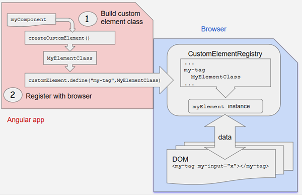

# [返回主目录](Readme.md)<!-- omit in toc --> 

# 目录 <!-- omit in toc --> 

# Angular元素(Elements)概览
**Angular 元素就是打包成自定义元素的 Angular 组件。所谓自定义元素就是一套与具体框架无关的用于定义新 HTML 元素的 Web 标准**。

自定义元素这项特性目前受到了 Chrome、Opera 和 Safari 的支持，在其它浏览器中也能通过腻子脚本（参见[浏览器支持](https://www.angular.cn/guide/elements#browser-support)）加以支持。 自定义元素扩展了 HTML，它允许你定义一个由 JavaScript 代码创建和控制的标签。 浏览器会维护一个自定义元素的注册表 CustomElementRegistry，它把一个可实例化的 JavaScript 类映射到 HTML 标签上。

**@angular/elements 包导出了一个 createCustomElement() API，它在 Angular 组件接口与变更检测功能和内置 DOM API 之间建立了一个桥梁**。

把组件转换成自定义元素可以让所有所需的 Angular 基础设施都在浏览器中可用。 创建自定义元素的方式简单直观，它会自动把你组件定义的视图连同变更检测与数据绑定等 Angular 的功能映射为相应的原生 HTML 等价物。

# 使用自定义元素

自定义元素会自举启动 —— **它们在添加到 DOM 中时就会自行启动自己，并在从 DOM 中移除时自行销毁自己。一旦自定义元素添加到了任何页面的 DOM 中，它的外观和行为就和其它的 HTML 元素一样了，不需要对 Angular 的术语或使用约定有任何特殊的了解**。

- **Angular 应用中的简易动态内容**

把**组件转换成自定义元素**为你在 Angular 应用中创建动态 HTML 内容提供了一种简单的方式。 在 Angular 应用中，你**直接添加到 DOM 中的 HTML 内容是不会经过 Angular 处理的**，**除非你使用动态组件来借助自己的代码把 HTML 标签与你的应用数据关联起来并参与变更检测。而使用自定义组件，所有这些装配工作都是自动的**。

- **富内容应用**

如果你有一个富内容应用（比如正在展示本文档的这个），自定义元素能让你的内容提供者使用复杂的 Angular 功能，而不要求他了解 Angular 的知识。比如，像本文档这样的 Angular 指南是使用 Angular 导航工具直接添加到 DOM 中的，但是其中可以包含特殊的元素，比如 `<code-snippet>`，它可以执行复杂的操作。 你所要告诉你的内容提供者的一切，就是这个自定义元素的语法。他们不需要了解关于 Angular 的任何知识，也不需要了解你的组件的数据结构或实现。

## 工作原理

**使用 *createCustomElement()* 函数来把组件转换成一个可注册成浏览器中自定义元素的类。 注册完这个配置好的类之后，你就可以在内容中像内置 HTML 元素一样使用这个新元素了**，比如直接把它加到 DOM 中：

```html
<my-popup message="Use Angular!"></my-popup>
```
当你的自定义元素放进页面中时，浏览器会创建一个已注册类的实例。其内容是由组件模板提供的，它使用 Angular 模板语法，并且使用组件和 DOM 数据进行渲染。组件的输入属性（Property）对应于该元素的输入属性（Attribute）。


# 把组件转换为自定义元素

**Angular 提供了 createCustomElement() 函数，以支持把 Angular 组件及其依赖转换成自定义元素。该函数会收集该组件的 Observable 型属性，提供浏览器创建和销毁实例时所需的 Angular 功能，还会对变更进行检测并做出响应。**

这个转换过程实现了 NgElementConstructor 接口，并创建了一个构造器类，用于生成该组件的一个自举型实例。

然后用 JavaScript 的 customElements.define() 函数把这个配置好的构造器和相关的自定义元素标签注册到浏览器的 CustomElementRegistry 中。 当浏览器遇到这个已注册元素的标签时，就会使用该构造器来创建一个自定义元素的实例。



## 映射
寄宿着 Angular 组件的自定义元素在组件中定义的"数据及逻辑"和标准的 DOM API 之间建立了一座桥梁。组件的属性和逻辑会直接映射到 HTML 属性和浏览器的事件系统中。

- 用于创建的 API 会解析该组件，以查找输入属性（Property），并在这个自定义元素上定义相应的属性（Attribute）。 它把属性名转换成与自定义元素兼容的形式（自定义元素不区分大小写），生成的属性名会使用中线分隔的小写形式。 比如，对于带有 `@Input('myInputProp') inputProp` 的组件，其对应的自定义元素会带有一个 my-input-prop 属性。

- 组件的输出属性会用 HTML 自定义事件的形式进行分发，自定义事件的名字就是这个输出属性的名字。 比如，对于带有 `@Output() valueChanged = new EventEmitter()` 属性的组件，其相应的自定义元素将会分发名叫 "valueChanged" 的事件，事件中所携带的数据存储在该事件对象的 detail 属性中。 如果你提供了别名，就改用这个别名。比如，`@Output('myClick') clicks = new EventEmitter<string>()`; 会导致分发名为 "myClick" 事件。

# 自定义元素的浏览器支持
浏览器|自定义元素支持
--|--
Chrome|原生支持
Opera|原生支持
Safari|原生支持
Firefox|在63版中原生支持，对于老版本，可以把 dom.webcomponents.enabled 和 dom.webcomponents.customelements.enabled 首选项设置为 true
Edge|正在实现

对于原生支持了自定义元素的浏览器，该规范要求开发人员使用 ES2016 的类来定义自定义元素 —— 开发人员可以在项目的 tsconfig.json 中设置 target: "es2015" 属性来满足这一要求。并不是所有浏览器都支持自定义元素和 ES2015，开发人员也可以选择使用腻子脚本来让它支持老式浏览器和 ES5 的代码。

**使用 Angular CLI 可以自动为你的项目添加正确的腻子脚本：ng add @angular/elements --name=*your_project_name*。**
