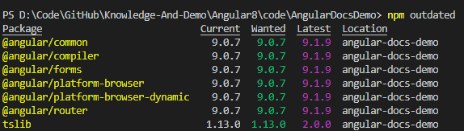

# 目录 <!-- omit in toc --> 
- [NPM](#npm)
  - [如果没有安装Node请先安装Nodejs](#%e5%a6%82%e6%9e%9c%e6%b2%a1%e6%9c%89%e5%ae%89%e8%a3%85node%e8%af%b7%e5%85%88%e5%ae%89%e8%a3%85nodejs)
  - [查看NPM版本](#%e6%9f%a5%e7%9c%8bnpm%e7%89%88%e6%9c%ac)
  - [升级本机NPM](#%e5%8d%87%e7%ba%a7%e6%9c%ac%e6%9c%banpm)
  - [升级项目中package.json与package-lock.json文件依赖到最新版](#%e5%8d%87%e7%ba%a7%e9%a1%b9%e7%9b%ae%e4%b8%adpackagejson%e4%b8%8epackage-lockjson%e6%96%87%e4%bb%b6%e4%be%9d%e8%b5%96%e5%88%b0%e6%9c%80%e6%96%b0%e7%89%88)
    - [查看package.json中依赖最新版本情况](#%e6%9f%a5%e7%9c%8bpackagejson%e4%b8%ad%e4%be%9d%e8%b5%96%e6%9c%80%e6%96%b0%e7%89%88%e6%9c%ac%e6%83%85%e5%86%b5)
    - [全局安装npm-check-updates工具](#%e5%85%a8%e5%b1%80%e5%ae%89%e8%a3%85npm-check-updates%e5%b7%a5%e5%85%b7)
    - [更新package.json中依赖到最新版](#%e6%9b%b4%e6%96%b0packagejson%e4%b8%ad%e4%be%9d%e8%b5%96%e5%88%b0%e6%9c%80%e6%96%b0%e7%89%88)
    - [更新package-lock.json中到最新版](#%e6%9b%b4%e6%96%b0package-lockjson%e4%b8%ad%e5%88%b0%e6%9c%80%e6%96%b0%e7%89%88)
    - [安装最新依赖](#%e5%ae%89%e8%a3%85%e6%9c%80%e6%96%b0%e4%be%9d%e8%b5%96)
- [全局AngularCLI](#%e5%85%a8%e5%b1%80angularcli)
  - [安装全局AngularCLI](#%e5%ae%89%e8%a3%85%e5%85%a8%e5%b1%80angularcli)
  - [升级AngularCLI](#%e5%8d%87%e7%ba%a7angularcli)
    - [升级全局AngularCLI](#%e5%8d%87%e7%ba%a7%e5%85%a8%e5%b1%80angularcli)
    - [升级当前项目的AngularCLI](#%e5%8d%87%e7%ba%a7%e5%bd%93%e5%89%8d%e9%a1%b9%e7%9b%ae%e7%9a%84angularcli)
      - [注意事项](#%e6%b3%a8%e6%84%8f%e4%ba%8b%e9%a1%b9)
        - [解决方案1](#%e8%a7%a3%e5%86%b3%e6%96%b9%e6%a1%881)
        - [解决方案2(不推荐)](#%e8%a7%a3%e5%86%b3%e6%96%b9%e6%a1%882%e4%b8%8d%e6%8e%a8%e8%8d%90)

# NPM
## 如果没有安装Node请先安装Nodejs
下载地址：https://nodejs.org/zh-cn/

## 查看NPM版本
使用命令
```shell
npm -v
```
## 升级本机NPM
参考文档：   
https://docs.npmjs.com/try-the-latest-stable-version-of-npm
https://docs.npmjs.com/

使用命令
```shell
npm install -g npm@latest
```
或者下载最新版本的nodejs安装程序，进行安装升级也可以

## 升级项目中package.json与package-lock.json文件依赖到最新版

### 查看package.json中依赖最新版本情况
```shell
npm outdated
```


### 全局安装npm-check-updates工具
```shell
npm install -g npm-check-updates
```

### 更新package.json中依赖到最新版
```shell
ncu -u
```
### 更新package-lock.json中到最新版
```shell
npm update
```

### 安装最新依赖
```shell
npm i
```

# 全局AngularCLI
## 安装全局AngularCLI
使用命令：
```ts
npm install -g @angular/cli
```
## 升级AngularCLI
### 升级全局AngularCLI
使用命令：
```ts
//卸载当前全局AngularCLI
npm uninstall -g @angular/cli
//清除全局npm缓存
npm cache verify
//if npm version is < 5 then use `npm cache clean`
//重新安装全局AngularCLI最新版本
npm install -g @angular/cli@latest
```

**当升级全局AngularCLI到最新版本之后，后续新建的本地Angular程序即为最新版本的本地AngularCLI**  
**如果本地Angular程序是老版本程序，就需要使用命令升级本地AngularCLI版本，可以参考：https://www.angular.cn/cli/update**

### 升级当前项目的AngularCLI
```ts
//在本地项目路径下，可以手动删除node_modules和dist文件夹，或者选择以下命令执行删除
//在windows command prompt中使用该命令删除项目中的node_modules和dist文件夹
//rmdir /S/Q node_modules dist 
//或者在Windows PowerShell中使用该命令删除项目中的node_modules和dist文件夹
rm -r -fo node_modules,dist
//或者在Linux环境下使用该命令删除项目中的node_modules和dist文件夹
//rm -rf node_modules dist  

//在本地项目中安装最新版本的AngularCLI
npm install --save-dev @angular/cli@latest
//安装所有包
npm install
```
#### 注意事项
有可能升级之后无法使用powershell执行AngularCLI命令，报
```
ng : 无法加载文件 C:\Users\small\AppData\Roaming\npm\ng.ps1。未对文件 C:\Users\small\AppData\Roaming\npm\ng.ps1 进行数
字签名。无法在当前系统上运行该脚本。有关运行脚本和设置执行策略的详细信息，请参阅 https:/go.microsoft.com/fwlink/?LinkID
=135170 中的 about_Execution_Policies。
```
错误。

##### 解决方案1
请删除或者重命名C:\Users\\[username]\AppData\Roaming\npm路径下的ng.ps1文件
##### 解决方案2(不推荐)
以管理员运行powershell执行命令
```
set-ExecutionPolicy RemoteSigned
```
设置ps1脚本RemoteSigned策略 为A，即执行所有不安全的脚本。  
之后执行命令
```
get-ExecutionPolicy
```
查看设置后的状态是否为RemoteSigned。


参考文档：
https://www.npmjs.com/package/@angular/cli#updating-angular-cli

