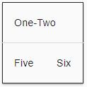
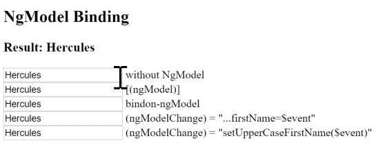
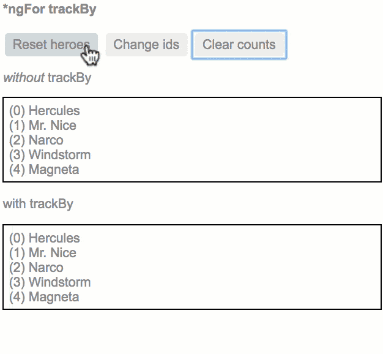
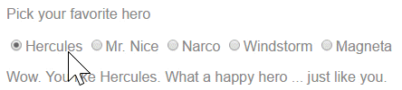
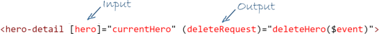
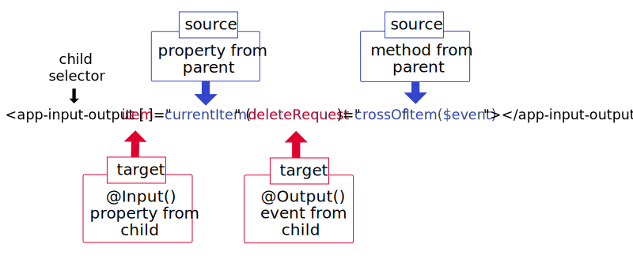

# [返回主目录](Readme.md)<!-- omit in toc --> 

# 目录 <!-- omit in toc --> 
- [模板语法](#%e6%a8%a1%e6%9d%bf%e8%af%ad%e6%b3%95)
  - [模板中的HTML](#%e6%a8%a1%e6%9d%bf%e4%b8%ad%e7%9a%84html)
  - [插值表达式与模板表达式](#%e6%8f%92%e5%80%bc%e8%a1%a8%e8%be%be%e5%bc%8f%e4%b8%8e%e6%a8%a1%e6%9d%bf%e8%a1%a8%e8%be%be%e5%bc%8f)
    - [插值表达式{{...}}](#%e6%8f%92%e5%80%bc%e8%a1%a8%e8%be%be%e5%bc%8f)
    - [模板表达式](#%e6%a8%a1%e6%9d%bf%e8%a1%a8%e8%be%be%e5%bc%8f)
    - [表达式上下文](#%e8%a1%a8%e8%be%be%e5%bc%8f%e4%b8%8a%e4%b8%8b%e6%96%87)
    - [模板表达式使用指南](#%e6%a8%a1%e6%9d%bf%e8%a1%a8%e8%be%be%e5%bc%8f%e4%bd%bf%e7%94%a8%e6%8c%87%e5%8d%97)
      - [没有可见的副作用](#%e6%b2%a1%e6%9c%89%e5%8f%af%e8%a7%81%e7%9a%84%e5%89%af%e4%bd%9c%e7%94%a8)
      - [执行迅速](#%e6%89%a7%e8%a1%8c%e8%bf%85%e9%80%9f)
      - [非常简单](#%e9%9d%9e%e5%b8%b8%e7%ae%80%e5%8d%95)
  - [模板语句](#%e6%a8%a1%e6%9d%bf%e8%af%ad%e5%8f%a5)
    - [语句上下文](#%e8%af%ad%e5%8f%a5%e4%b8%8a%e4%b8%8b%e6%96%87)
    - [语句指南](#%e8%af%ad%e5%8f%a5%e6%8c%87%e5%8d%97)
  - [绑定语法概览](#%e7%bb%91%e5%ae%9a%e8%af%ad%e6%b3%95%e6%a6%82%e8%a7%88)
    - [新思维模型HTML+](#%e6%96%b0%e6%80%9d%e7%bb%b4%e6%a8%a1%e5%9e%8bhtml)
    - [HTML attribute和DOM property对比](#html-attribute%e5%92%8cdom-property%e5%af%b9%e6%af%94)
    - [绑定目标](#%e7%bb%91%e5%ae%9a%e7%9b%ae%e6%a0%87)
  - [属性名绑定[属性名]](#%e5%b1%9e%e6%80%a7%e5%90%8d%e7%bb%91%e5%ae%9a%e5%b1%9e%e6%80%a7%e5%90%8d)
    - [单项输入](#%e5%8d%95%e9%a1%b9%e8%be%93%e5%85%a5)
    - [绑定目标](#%e7%bb%91%e5%ae%9a%e7%9b%ae%e6%a0%87-1)
    - [消除副作用](#%e6%b6%88%e9%99%a4%e5%89%af%e4%bd%9c%e7%94%a8)
    - [返回恰当的类型](#%e8%bf%94%e5%9b%9e%e6%81%b0%e5%bd%93%e7%9a%84%e7%b1%bb%e5%9e%8b)
    - [别忘了方括号](#%e5%88%ab%e5%bf%98%e4%ba%86%e6%96%b9%e6%8b%ac%e5%8f%b7)
    - [一次性字符串初始化](#%e4%b8%80%e6%ac%a1%e6%80%a7%e5%ad%97%e7%ac%a6%e4%b8%b2%e5%88%9d%e5%a7%8b%e5%8c%96)
    - [属性绑定还是插值表达式？](#%e5%b1%9e%e6%80%a7%e7%bb%91%e5%ae%9a%e8%bf%98%e6%98%af%e6%8f%92%e5%80%bc%e8%a1%a8%e8%be%be%e5%bc%8f)
      - [内容安全](#%e5%86%85%e5%ae%b9%e5%ae%89%e5%85%a8)
  - [attribute、class、style绑定](#attributeclassstyle%e7%bb%91%e5%ae%9a)
    - [attribute绑定](#attribute%e7%bb%91%e5%ae%9a)
    - [CSS类绑定](#css%e7%b1%bb%e7%bb%91%e5%ae%9a)
    - [样式绑定](#%e6%a0%b7%e5%bc%8f%e7%bb%91%e5%ae%9a)
  - [事件绑定](#%e4%ba%8b%e4%bb%b6%e7%bb%91%e5%ae%9a)
    - [目标事件](#%e7%9b%ae%e6%a0%87%e4%ba%8b%e4%bb%b6)
    - [$event和事件处理语句](#event%e5%92%8c%e4%ba%8b%e4%bb%b6%e5%a4%84%e7%90%86%e8%af%ad%e5%8f%a5)
    - [使用EventEmitter实现自定义事件](#%e4%bd%bf%e7%94%a8eventemitter%e5%ae%9e%e7%8e%b0%e8%87%aa%e5%ae%9a%e4%b9%89%e4%ba%8b%e4%bb%b6)
    - [模板语句有副作用](#%e6%a8%a1%e6%9d%bf%e8%af%ad%e5%8f%a5%e6%9c%89%e5%89%af%e4%bd%9c%e7%94%a8)
  - [双向绑定（[(...)]）](#%e5%8f%8c%e5%90%91%e7%bb%91%e5%ae%9a)
    - [双向绑定的原理](#%e5%8f%8c%e5%90%91%e7%bb%91%e5%ae%9a%e7%9a%84%e5%8e%9f%e7%90%86)
  - [内置指令](#%e5%86%85%e7%bd%ae%e6%8c%87%e4%bb%a4)
  - [内置属性型指令](#%e5%86%85%e7%bd%ae%e5%b1%9e%e6%80%a7%e5%9e%8b%e6%8c%87%e4%bb%a4)
    - [NgClass](#ngclass)
    - [NgStyle](#ngstyle)
    - [NgModel-使用[(ngModel)]双向绑定表单元素](#ngmodel-%e4%bd%bf%e7%94%a8ngmodel%e5%8f%8c%e5%90%91%e7%bb%91%e5%ae%9a%e8%a1%a8%e5%8d%95%e5%85%83%e7%b4%a0)
      - [使用NgModel时需要FormsModule](#%e4%bd%bf%e7%94%a8ngmodel%e6%97%b6%e9%9c%80%e8%a6%81formsmodule)
      - [[(ngModel)]内幕](#ngmodel%e5%86%85%e5%b9%95)
  - [内置结构型指令](#%e5%86%85%e7%bd%ae%e7%bb%93%e6%9e%84%e5%9e%8b%e6%8c%87%e4%bb%a4)
    - [NgIf](#ngif)
      - [这和显示/隐藏不是一回事](#%e8%bf%99%e5%92%8c%e6%98%be%e7%a4%ba%e9%9a%90%e8%97%8f%e4%b8%8d%e6%98%af%e4%b8%80%e5%9b%9e%e4%ba%8b)
      - [防范空指针错误](#%e9%98%b2%e8%8c%83%e7%a9%ba%e6%8c%87%e9%92%88%e9%94%99%e8%af%af)
    - [NgForOf](#ngforof)
      - [NgFor微语法](#ngfor%e5%be%ae%e8%af%ad%e6%b3%95)
    - [模板输入变量](#%e6%a8%a1%e6%9d%bf%e8%be%93%e5%85%a5%e5%8f%98%e9%87%8f)
      - [带索引的*ngFor](#%e5%b8%a6%e7%b4%a2%e5%bc%95%e7%9a%84ngfor)
      - [带trackBy的*ngFor](#%e5%b8%a6trackby%e7%9a%84ngfor)
    - [NgSwitch](#ngswitch)
  - [模板引用变量(#var)](#%e6%a8%a1%e6%9d%bf%e5%bc%95%e7%94%a8%e5%8f%98%e9%87%8fvar)
    - [模板引用变量怎么得到它的值](#%e6%a8%a1%e6%9d%bf%e5%bc%95%e7%94%a8%e5%8f%98%e9%87%8f%e6%80%8e%e4%b9%88%e5%be%97%e5%88%b0%e5%ae%83%e7%9a%84%e5%80%bc)
    - [关于模板引用变量的注意事项](#%e5%85%b3%e4%ba%8e%e6%a8%a1%e6%9d%bf%e5%bc%95%e7%94%a8%e5%8f%98%e9%87%8f%e7%9a%84%e6%b3%a8%e6%84%8f%e4%ba%8b%e9%a1%b9)
  - [输入和输出属性](#%e8%be%93%e5%85%a5%e5%92%8c%e8%be%93%e5%87%ba%e5%b1%9e%e6%80%a7)
    - [讨论](#%e8%ae%a8%e8%ae%ba)
    - [绑定到其他组件](#%e7%bb%91%e5%ae%9a%e5%88%b0%e5%85%b6%e4%bb%96%e7%bb%84%e4%bb%b6)
      - [Typescript的Pulbic是没有用的](#typescript%e7%9a%84pulbic%e6%98%af%e6%b2%a1%e6%9c%89%e7%94%a8%e7%9a%84)
    - [声明输入与输出属性](#%e5%a3%b0%e6%98%8e%e8%be%93%e5%85%a5%e4%b8%8e%e8%be%93%e5%87%ba%e5%b1%9e%e6%80%a7)
    - [输入还是输出？](#%e8%be%93%e5%85%a5%e8%bf%98%e6%98%af%e8%be%93%e5%87%ba)
    - [给输入/输出属性起别名](#%e7%bb%99%e8%be%93%e5%85%a5%e8%be%93%e5%87%ba%e5%b1%9e%e6%80%a7%e8%b5%b7%e5%88%ab%e5%90%8d)
  - [模板表达式操作符](#%e6%a8%a1%e6%9d%bf%e8%a1%a8%e8%be%be%e5%bc%8f%e6%93%8d%e4%bd%9c%e7%ac%a6)
    - [管道操作符(|)](#%e7%ae%a1%e9%81%93%e6%93%8d%e4%bd%9c%e7%ac%a6)
    - [安全导航操作符(?.)和空属性路径](#%e5%ae%89%e5%85%a8%e5%af%bc%e8%88%aa%e6%93%8d%e4%bd%9c%e7%ac%a6%e5%92%8c%e7%a9%ba%e5%b1%9e%e6%80%a7%e8%b7%af%e5%be%84)
    - [非空断言操作符(!)](#%e9%9d%9e%e7%a9%ba%e6%96%ad%e8%a8%80%e6%93%8d%e4%bd%9c%e7%ac%a6)
  - [内置模板函数](#%e5%86%85%e7%bd%ae%e6%a8%a1%e6%9d%bf%e5%87%bd%e6%95%b0)
    - [类型转换函数$any()](#%e7%b1%bb%e5%9e%8b%e8%bd%ac%e6%8d%a2%e5%87%bd%e6%95%b0any)
  - [模板中的SVG](#%e6%a8%a1%e6%9d%bf%e4%b8%ad%e7%9a%84svg)


# 模板语法
Angular 应用管理着**用户之所见和所为**，并通过 **Component 类的实例（组件）**和**面向用户的模板交互**来实现这一点。  
在 Angular 中，**组件**扮演着**控制器或视图模型**的角色，**模板则扮演视图**的角色。  

## 模板中的HTML
几乎所有的 HTML 语法都是有效的模板语法。  
**`<script>` 元素，它被禁用了**，以阻止脚本注入攻击的风险。（实际上，`<script> `只是被忽略了。）  
**`<html>、<body> 和 <base>` 元素并没有扮演有用的角色**。剩下的所有元素基本上就都一样用了。  

## 插值表达式与模板表达式
### 插值表达式{{...}}
插值表达式会**用双花括号 {{和 }} 作为分隔符**。例如  
```html
<h3>Current customer: {{ currentCustomer }}</h3>
```
插值表达式可以把计算后的字符串插入到 HTML 元素标签内的文本或对标签的属性进行赋值。  
```html
<p>{{title}}</p>
<div></div>
```
在**括号之间的“素材”**，通常**是组件属性的名字**。Angular 会用组件中**相应属性的字符串值**，替换这个名字。  
括号间的素材是一个**模板表达式**，Angular 先**对它求值**，**再**把它**转换成字符串**。   
```html
<!-- "The sum of 1 + 1 is 2" -->
<p>The sum of 1 + 1 is {{1 + 1}}.</p>
```
>**插值其实是一个特殊语法，Angular 会把它转换为属性绑定**。  
>想用别的分隔符来代替 {{ 和 }}，也可以通过 Component 元数据中的 interpolation 选项来配置插值分隔符。  

### 模板表达式
**模板表达式会产生一个值**，并出**现在双花括号 {{ }} 中**。  Angular 执行这个表达式，并把它**赋值给绑定目标的属性**，这个**绑定目标可能是 HTML 元素、组件或指令**。  
模板表达式禁止使用具有或可能引发副作用的 JavaScript 表达式，包括：
- 赋值 (=, +=, -=, ...)

- new、typeof、instanceof 等操作符。

- 使用 ; 或 , 串联起来的表达式

- 自增和自减运算符：++ 和 --

- 一些 ES2015+ 版本的操作符

### 表达式上下文
典型的表**达式上下文就是这个组件实例**，它是各种绑定值的来源。  
表达式的上下文**可以包括组件之外的对象**。 比如模**板输入变量 (let customer)和模板引用变量(#customerInput)就**是备选的上下文对象之一。
```html
<!-- 组件实例的表达式上下文-->
<h4>{{recommended}}</h4>


<!-- 板输入变量的表达式上下文-->
<ul>
  <li *ngFor="let customer of customers">{{customer.name}}</li>
</ul>

<!-- 模板引用变量的表达式上下文-->
<label>Type something:
  <input #customerInput>{{customerInput.value}}
</label>
```
表达式上下文变量是由**模板变量**、**指令的上下文变量**（如果有）和**组件的成员**叠加而成的。  
在同一命名空间下优先级顺序如下：
**模板变量 > 指令的上下文变量 > 组件的成员**  
如果变量命名冲突，就以以上优先级进行调用。  

> 模板表达式不能引用全局命名空间中的任何东西，比如 window 或 document。它们也不能调用 console.log 或 Math.max。 它们只能引用表达式上下文中的成员。

### 模板表达式使用指南
遵循如下规则：
- 没有可见的副作用

- 执行迅速

- 非常简单

#### 没有可见的副作用
**模板表达式除了目标属性的值以外，不应该改变应用的任何状态。**
最好使用幂等的表达式，因为它没有副作用，并且能提升 Angular 变更检测的性能。  
幂等的表达式应该总是返回完全相同的东西，直到某个依赖值发生改变。  
#### 执行迅速
**表达式应该快速结束**，否则用户就会感到拖沓，特别是在较慢的设备上。 
#### 非常简单
虽然也可以写复杂的模板表达式，不过最好避免那样做。  
属性名或方法调用应该是常态，但偶然使用逻辑取反 ! 也是可以的。 其它情况下，**应该把应用程序和业务逻辑限制在组件中**，这样它才能更容易开发和测试。  

## 模板语句
**模板语句**用来**响应由绑定目标（如 HTML 元素、组件或指令）触发的事件**。 模板语句将在事件绑定一节看到，**它出现在 = 号右侧的引号中**，就像这样：**(event)="statement"**。   
**模板语句有副作用**。 这是事件处理的关键。因为你要根据用户的输入更新应用状态。  
```html
<button (click)="deleteHero()">Delete hero</button>
``` 
**模板语句**使用的语言也像 JavaScript。 **模板语句解析器**和模板表达式解析器有所不同，特别之处在于它支持**基本赋值 (=) 和表达式链 (; 和 ,)**。

然而，某些 JavaScript 语法仍然是不允许的：
- new 运算符

- 自增和自减运算符：++ 和 --

- 操作并赋值，例如 += 和 -=

- 位操作符 | 和 &

- 模板表达式运算符
### 语句上下文
语句上下文，通常是**正在绑定事件的那个组件实例**。  
**(click)="deleteHero()"** 中的 **deleteHero** 就是这个数据绑定组件上的一个方法。  
```html
<button (click)="deleteHero()">Delete hero</button>
```

**语句上下文**可以**引用模板自身上下文中的属性**。 在下面的例子中，就把模板的 $event 对象、模板输入变量 (let hero)和模板引用变量 (#heroForm)传给了组件中的一个事件处理器方法。  

```html
<button (click)="onSave($event)">Save</button>
<button *ngFor="let hero of heroes" (click)="deleteHero(hero)">{{hero.name}}</button>
<form #heroForm (ngSubmit)="onSubmit(heroForm)"> ... </form>
```
**模板上下文中的变量优先级 > 组件上下文中的变量**

### 语句指南
和表达式一样，**避免写复杂的模板语句**。 常规是函数调用或者属性赋值。

## 绑定语法概览
绑定的类型可以根据数据流的方向分成**三类**： **从数据源到视图**、**从视图到数据源**以及**双向的从视图到数据源再到视图**。

| 数据方向                 | 语法                                                                        | 绑定类型                   |
| ------------------------ | --------------------------------------------------------------------------- | -------------------------- |
| 单向从数据源到视图       | `{{expression}}`<br> `[target]="expression"`<br> `bind-target="expression"` | 插值、属性Attribute、CSS类 |
| 从视图到数据源的单向绑定 | `(target)="statement"`<br>`on-target="statement"`                           | 事件                       |
| 双向                     | `[(target)]="expression"`<br>`bindon-target="expression"`                   | 双向                       |

> 由于 HTML attribute 和 DOM property 在中文中都被翻译成了“属性”，无法区分,如果**提到“属性”**的地方，一定是**指DOM property**，Angular很少操作HTML Attribute

**在等号左边是目标名， 无论是包在括号中 ([]、()) 还是用前缀形式 (bind-、on-、bindon-) 。**

**这个目标名就是属性（Property）的名字。而不是元素属性（Attribute）的名字。**

### 新思维模型HTML+
数据绑定**允许用自定义标记扩展 HTML 词汇**的能力，会让你把模板 HTML 当成 HTML+。

**正常的 HTML 开发过程**，使用 HTML 元素来创建视觉结构， 通过把字符串常量设置到元素的 attribute 来修改那些元素。
```html
<div class="special">Mental Model</div>

<button disabled>Save</button>
```
在 Angular 模板中，**用封装了 HTML 的组件创建新元素**，并把它们当作原生 HTML 元素在模板中使用。

```html
<!-- Normal HTML -->
<div class="special">Mental Model</div>
<!-- 新的HTML元素 -->
<app-hero-detail></app-hero-detail>
```
在数据绑定之前，看一个例子：
```html
<!-- Bind button disabled state to `isUnchanged` property -->
<button [disabled]="isUnchanged">Save</button>
```
也许你会认为，正在绑定按钮的disabled attribute设置为组件的isUnchanged属性的值。  
但是这是错误的！实际上，**只要数据绑定开始了。就已经与HTML attribute无关了。这里不是设置HTML的属性，而是DOM元素、组件和指令的property**。

### HTML attribute和DOM property对比
attribute 是由 HTML 定义的。property 是由 DOM (Document Object Model) 定义的。
- 少量 HTML attribute 和 property 之间有着 1:1 的映射，如 id。

- 有些 HTML attribute 没有对应的 property，如 colspan。

- 有些 DOM property 没有对应的 attribute，如 textContent。

- 大量 HTML attribute 看起来映射到了 property…… 但却不像你想的那样！

> **attribute 初始化 DOM property**，然后它们的任务就完成了。**property 的值可以改变；attribute 的值不能改变**。

***要搞清楚attribute和property的区别，就要将attribute和property都学明白***
***强调：模板绑定是通过 property 和事件来工作的，而不是 attribute。***

**attribute 唯一的作用是用来初始化元素和指令的状态。 当进行数据绑定时，只是在与元素和指令的 property 和事件打交道，而 attribute 就完全靠边站了。**

### 绑定目标

数据绑定的目标是 DOM 中的某些东西。 这个**目标可能是（元素 | 组件 | 指令的）property、（元素 | 组件 | 指令的）事件，或(极少数情况下) attribute 名**。

| 绑定类型  | 目标                                                  | 范例                                                                                                                                                                             |
| --------- | ----------------------------------------------------- | -------------------------------------------------------------------------------------------------------------------------------------------------------------------------------- |
| 属性      | 元素的 property<br>组件的 property<br>指令的 property | ``<br>`<app-hero-detail[hero]="currentHero"></app-hero-detail>`<br>`<div [ngClass]="{'special': isSpecial}"></div>`                                    |
| 事件      | 元素的事件<br>组件的事件<br>指令的事件                | `<button (click)="onSave()">Save</button>`<br>`<app-hero-detail (deleteRequest)="deleteHero()"></app-hero-detail>`<br>`<div (myClick)="clicked=$event" clickable>click me</div>` |
| 双向      | 事件与property                                        | `<input [(ngModel)]="name">`                                                                                                                                                     |
| Attribute | attribute(例外情况)                                   | `<button [attr.aria-label]="help">help</button>`                                                                                                                                 |
| CSS类     | class property                                        | `<div [class.special]="isSpecial">Special</div>`                                                                                                                                 |
| 样式      | style property                                        | `<button [style.color]="isSpecial ? 'red' : 'green'">`                                                                                                                           |
## 属性名绑定[属性名]

最常用的**属性绑定是把元素属性(property)设置为组件属性的值**。
```html

<button [disabled]="isUnchanged">Cancel is disabled</button>
```
另一种是**设置指令的属性绑定**
```html
<div [ngClass]="classes">[ngClass] binding to the classes property</div>
```
设置**自定义组件的模型属性（这是父子组件之间通讯的重要途径）**
```html
<app-hero-detail [hero]="currentHero"></app-hero-detail>
```

### 单项输入

**属性绑定描属于单向数据绑定**，是从组件的数据属性流动到目标元素的属性。
**不能使用属性绑定来从目标元素拉取值，也不能绑定到目标元素的属性来读取它。只能设置它**。

### 绑定目标
**包裹在方括号中的元素属性名标记着目标属性**。  
````
或者使用**规范形式**，**bind-前缀**
````
**注意，这里的目标名字是property，而非attribute。**  

### 消除副作用
模板表达式的计算不能有可见的副作用。表达式可能会调用具有副作用的属性或方法。但 Angular 没法知道这一点，也没法阻止你。一般建议是，**只绑定数据属性和那些只返回值而不做其它事情的方法**。

### 返回恰当的类型
模板表达式应该返回目标属性所需类型的值。 如果目标属性想要个字符串，就返回字符串。 如果目标属性想要个数字，就返回数字。 如果目标属性想要个对象，就返回对象。

### 别忘了方括号
方括号告诉 Angular 要计算模板表达式。 如果忘了加方括号，Angular 会把这个表达式当做字符串常量看待

### 一次性字符串初始化
当满足下列条件时，应该**省略括号**：
- 目标属性接受字符串值。

- 字符串是个固定值，可以直接合并到模块中。

- 这个初始值永不改变。


标准 HTML 中用这种方式初始化 attribute，这种方式也可以用在初始化指令和组件的属性。下面这个例子把 HeroDetailComponent 的 prefix 属性初始化为固定的字符串，而不是模板表达式。Angular 设置它，然后忘记它。
``<app-hero-detail prefix="You are my" [hero]="currentHero"></app-hero-detail>``

### 属性绑定还是插值表达式？
通常得在插值和属性绑定之间做出选择。 下列这几对绑定做的事情完全相同：
```html
<p> is the <i>interpolated</i> image.</p>
<p> is the <i>property bound</i> image.</p>

<p><span>"{{title}}" is the <i>interpolated</i> title.</span></p>
<p>"<span [innerHTML]="title"></span>" is the <i>property bound</i> title.</p>
```
在多数情况下，**插值是更方便的备选项**。
但**数据类型不是字符串时，就必须使用属性绑定了**。
#### 内容安全
假设下面带有恶意内容的组件属性
```ts
evilTitle = 'Template <script>alert("evil never sleeps")</script>Syntax';
```
Angular 数据绑定对危险 HTML 有防备。 在显示它们之前，它对内容先进行消毒。 **不管是插值还是属性绑定，都不会允许带有 script 标签的 HTML 泄漏到浏览器中**。

```html
<!-- Angular会提示的警告
  Angular generates warnings for these two lines as it sanitizes them
  WARNING: sanitizing HTML stripped some content (see http://g.co/ng/security#xss).
 -->
<p><span>"{{evilTitle}}" is the <i>interpolated</i> evil title.</span></p>
<p>"<span [innerHTML]="evilTitle"></span>" is the <i>property bound</i> evil title.</p>
```
**插值处理script标签与属性绑定有所不同，但是二者都会只渲染没有危害的内容**：


## attribute、class、style绑定
模板语法为那些不太适合使用属性绑定的场景提供了专门的单向数据绑定形式。
### attribute绑定
可以通过attribute 绑定来直接设置 attribute 的值。 
> 这是“绑定到目标属性 (property)”这条规则中唯一的例外。这是唯一的能创建和设置 attribute 的绑定形式。

当元素没有**属性可绑的时候，就必须使用 attribute 绑定**。例如 ARIA， SVG 和 table 中的 colspan/rowspan 等 attribute。 它们是纯粹的 attribute，没有对应的属性可供绑定。
如果针对attribute使用插值或者属性绑定，就会出现错误
```html
<tr><td colspan="{{1 + 1}}">Three-Four</td></tr>
```
```error
Template parse errors:
Can't bind to 'colspan' since it isn't a known native property
```
**因为插值表达式和属性绑定只能设置property，不能设置attribute。**
**attribute绑定语法如下**：
```ts 
[attr.attribute-name] = "xxx"
```
**中括号部分以attr.开头，之后跟具体要绑定的attribute名字，等号后可使用字符串的表达式来设置attribute的值。**
```html
<table border=1>
  <!--  expression calculates colspan=2 -->
  <tr><td [attr.colspan]="1 + 1">One-Two</td></tr>

  <!-- ERROR: There is no `colspan` property to set!
    <tr><td colspan="{{1 + 1}}">Three-Four</td></tr>
  -->

  <tr><td>Five</td><td>Six</td></tr>
</table>
```
渲染结果：

### CSS类绑定
CSS 类绑定，**可以从元素的 class attribute 上添加和移除 CSS 类名**。  
绑定形式如下：
```ts
[class.class-name]="xxx" //单独设置某个class-name，一旦xxx为真，则添加这个css的class-name，反之移除这个css的class-name
class="a b c" [class]="xxx" //一旦xxx有值，则覆盖默认的class，反之保留默认的class
```
例如： 
```html
<!-- reset/override all class names with a binding  -->
<div class="bad curly special"
     [class]="badCurly">Bad curly</div>
```
当 badCurly 有值时 class 这个 attribute 设置的内容会被完全覆盖

```html
<!-- toggle the "special" class on/off with a property -->
<div [class.special]="isSpecial">The class binding is special</div>

<!-- binding to `class.special` trumps the class attribute -->
<div class="special"
     [class.special]="!isSpecial">This one is not so special</div>
```
绑定到special类名。 当模板表达式的求值结果是真值时，Angular 会添加这个类，反之则移除它。

虽然切换单一类名是个好办法，但是**通常人们更喜欢使用NgClass指令来同时管理多个CSS类名**，后文将详细解读

### 样式绑定
样式绑定形式如下：
```ts
[style.style-property]
[style.style-property.em]
[style.style-property.%]
```
与属性绑定类似,但方括号中的部分不是元素的属性名，而由style前缀，一个点 (.)和 CSS 样式的属性名组成。
例如：
```html
<button [style.color]="isSpecial ? 'red': 'green'">Red</button>
<button [style.background-color]="canSave ? 'cyan': 'grey'" >Save</button>
<button [style.font-size.em]="isSpecial ? 3 : 1" >Big</button>
<button [style.font-size.%]="!isSpecial ? 150 : 50" >Small</button>
```
虽然这是设置单一样式的好办法，但人们**通常更喜欢使用 NgStyle 指令 来同时设置多个内联样式**。

## 事件绑定
**事件绑定允许你侦听某些事件，比如按键、鼠标移动、点击和触屏**。
Angular 的事件绑定语法由**等号左侧带圆括号的目标事件**和**右侧引号中的模板语句**组成。


### 目标事件
Angular会**根据圆括号中的事件名称优先匹配已知指令的事件属性，如果没有匹配结果，会继续匹配元素的事件名称，如果依然没有匹配结果，会报错“未知指令”**。  
例如： 
```html
<!-- 匹配元素click事件-->
<button (click)="onSave($event)">Save</button>
<!-- 使用规范形式on-前缀，匹配元素click事件-->
<button on-click="onSave($event)">on-click Save</button>

<h4>myClick is an event on the custom ClickDirective:</h4>
<!-- 匹配指令的事件属性，如果没有找到myClick将会报错-->
<button (myClick)="clickMessage=$event" clickable>click with myClick</button>
{{clickMessage}}
```

### $event和事件处理语句

**\$event是一个事件的对象**
在事件绑定中，Angular会为目标事件设置一个事件处理器，当事件发生时事件处理器会执行模板语句，有时需要从html中取值，并将值存储在模型中，这个时候就需要\$event事件对象传递关于此事件的信息。  
**\$event是什么事件对象取决于绑定的目标事件**。**如果这个目标事件是原生的DOM事件，那\$event就是一个DOM事件对象**，它将会带有target、target.value这样的属性。  
**如果目标事件属于指令，那么\$event具体是什么事件对象就取决于目标事件属于什么指令了**。
例如：  
```html
<input [value]="currentItem.name"
       (input)="currentItem.name=$event.target.value" >
<!-- 不使用NgModel -->
```
上面的代码由于目标事件为DOM的原生input事件，所以\$event就是一个原生的DOM事件对象。通过将input事件发生后用户输入的值赋值给组件属性currentItem.name。
### 使用EventEmitter实现自定义事件
**EventEmitter字面意思是事件发射器**，顾名思义，就是通过这个对象的实例可以将目标事件发送给需要处理该事件的地方。  
并且EventEmitter对象的实例可以调用它本身的emit()方法，将需要的数据通过参数的形式传递出去。  
**使用EventEmitter对象实现自定义事件，通常指令创建一个EventEmitter对象的实例。并将这个实例作为属性暴露出来(@Output)，指令通过调用EventEmitter.emit(payload)来触发事件，其中的payload参数可以是任意类型的数据。之后父指令通过绑定这个属性来监听这个事件，并通过\$event对象来访问payload数据。**

例如如下例子：
```html
<!-- item-detial.compoent.html -->

<span [style.text-decoration]="lineThrough">{{ item.name }}
</span>
<button (click)="delete()">Delete</button>
```
```ts
// item-detail.component.ts
// This component makes a request but it can't actually delete a hero.
@Output() deleteRequest = new EventEmitter<Item>();

delete() {
  this.deleteRequest.emit(this.item);
  this.displayNone = this.displayNone ? '' : 'none';
  this.lineThrough = this.lineThrough ? '' : 'line-through';
}
```
**这个子组件HeroDetialComponent中，模板中带有一个绑定click事件的delete()方法。  
组件类中定义了delete()方法。但是这个子组件并不知道如何删除数据。最好的方法就是这个子组件向出发该click事件的父组件去报告它要删除用户的这个请求。**

父组件：
```html
<app-hero-detail [hero]="currentHero" (deleteRequest)="deleteHero($event)">
</app-hero-detail>
```
```ts
  deleteHero(hero?: Hero) {
    this.alert(`Delete ${hero ? hero.name : 'the hero'}.`);
  }
```
**在父组件中，当子组件的delete()方法被触发后，子组件的事件发射器就是发出一个通知，通知父组件我要删除数据，并且将要删除的相关数据存储至\$event对象中。  
父组件将deleteHero($event)方法事件绑定到子组件的事件发射器deleteRequest对象上，当接收到事件发射器发出的通知，就会将包含有子组件提供的数据的\$event对象传入deleteHero方法中进行进一步的逻辑处理。**

### 模板语句有副作用
虽然模板表达是不应有副作用，但是**模板语句通常是带有副作用的**。例如deleteItem()这种方法，它会删除一些东西。

## 双向绑定（[(...)]）
通常有这种需求，当用户修改了数据时，被修改的数据在显示上也应该立即更新。从元素的角度上讲，**即设置元素属性，又要监听元素变化**。  
Angular提供了一种特殊的双向绑定语法：
**`[(x)]`**
**这种双向绑定语法结合了属性绑定[x]与事件绑定(x).**

### 双向绑定的原理
**双向绑定可以理解为设置属性x和对应的事件xChange。**  
例如如下代码：
```ts
//sizer.component.ts
import { Component, EventEmitter, Input, Output } from '@angular/core';
 
@Component({
  selector: 'app-sizer',
  template: `
  <div>
    <button (click)="dec()" title="smaller">-</button>
    <button (click)="inc()" title="bigger">+</button>
    <label [style.font-size.px]="size">FontSize: {{size}}px</label>
  </div>`
})
export class SizerComponent {
  @Input()  size: number | string;
  @Output() sizeChange = new EventEmitter<number>();
 
  dec() { this.resize(-1); }
  inc() { this.resize(+1); }
 
  resize(delta: number) {
    this.size = Math.min(40, Math.max(8, +this.size + delta));
    this.sizeChange.emit(this.size);
  }
}
```
```html
<!-- app.component.html  -->
<app-sizer [(size)]="fontSizePx"></app-sizer>
<div [style.font-size.px]="fontSizePx">Resizable Text</div>
```
代码中，sizer.component.ts具有size属性与sizeChange事件，size为输入值(@Input())，来自属性绑定，当点击按钮时会更新size的值，并且触发sizeChange事件。
当父组件使用双向绑定时，父组件的fontSizePx属性会设置并且监听子组件size属性的变化。实际上这个双向绑定可以分解为如下写法：
```html
<app-sizer [size]="fontSizePx" (sizeChange)="fontSizePx=$event"></app-sizer>
```
\$event即SizerComponent.sizeChange事件的载荷，即`sizeChange.emit(this.size)`的参数。
这就是**[(X)]**这种双向绑定的语法的原理，幸运的是Angular为用户提供了NgModel指令，简化了双向绑定的写法


## 内置指令
新版本的**Angular没有太多了内置指令**。使用更强大、更富有表现力的绑定系统可以达到同样的效果。  
**Angular内置指令分为两种**，分别为
- **属性型指令**
- **结构型指令**
## 内置属性型指令
**属性型指令会监听和修改其他HTML元素或组件的行为、元素属性（attribute）、DOM属性（Property）**。他们通常会作为HTML属性的名称应用在元素上。  
介绍几个常用的属性型指令：
- **NgClass**-添加或移除一组CSS类
- **NgStyle**-添加或移除一组CSS样式
- **NgModel**-双向绑定HTML表单元素

### NgClass
你经常用动态添加或删除 CSS 类的方式来控制元素如何显示。 通过绑定到 NgClass，可以同时添加或移除多个类。  
CSS绑定是添加或删除单个类的最佳途径
```html
<div [class.special]="isSpecial">The class binding is special</div>
```
但是如果存在多个CSS类时，NgClass是一个更好的选择。  
**使用NgClass与一个key:value形式的组件属性绑定，其中key代表CSS类名，value为bool值，当value为true时，该key将被添加到元素上，反之则被移除。**  
例如：
```ts
currentClasses: {};
setCurrentClasses() {
  // CSS classes: added/removed per current state of component properties
  this.currentClasses =  {
    'saveable': this.canSave,
    'modified': !this.isUnchanged,
    'special':  this.isSpecial
  };
}
```
```html
<div [ngClass]="currentClasses">This div is initially saveable, unchanged, and special</div>
```
 > 既可以在初始化时调用 setCurrentClasses()，也可以在所依赖的属性变化时调用。

### NgStyle
 NgStyle 绑定可以同时设置多个内联样式。  
 样式绑定是设置单一样式值的简单方式。
 ```html
 <div [style.font-size]="isSpecial ? 'x-large' : 'smaller'" >
  This div is x-large or smaller.
</div>
 ```
 要同时设置多个内联样式，NgStyle 指令可能是更好的选择。  
 **NgStyle 需要绑定到一个 key:value 控制对象。 对象的每个 key 是样式名，它的 value 是能用于这个样式的任何值。**
 例如：
 ```ts
currentStyles: {};
setCurrentStyles() {
  // CSS styles: set per current state of component properties
  this.currentStyles = {
    'font-style':  this.canSave      ? 'italic' : 'normal',
    'font-weight': !this.isUnchanged ? 'bold'   : 'normal',
    'font-size':   this.isSpecial    ? '24px'   : '12px'
  };
}
 ```
 ```html
<div [ngStyle]="currentStyles">
  This div is initially italic, normal weight, and extra large (24px).
</div>
 ```
 > 既可以在初始化时调用 setCurrentStyles()，也可以在所依赖的属性变化时调用。

### NgModel-使用[(ngModel)]双向绑定表单元素

 当开发数据输入表单时，你通常都要既显示数据属性又根据用户的更改去修改那个属性。可以使用NgModel指令进行双向绑定来简化这种工作：
 ```html
 <input [(ngModel)]="currentHero.name">
 ```
#### 使用NgModel时需要FormsModule

**在使用NgModel之前需要导入FormsModule,并将其添加到NgModule的imports列表中。**
```ts
import { NgModule } from '@angular/core';
import { BrowserModule }  from '@angular/platform-browser';
import { FormsModule } from '@angular/forms'; // <--- JavaScript import from Angular

/* Other imports */

@NgModule({
  imports: [
    BrowserModule,
    FormsModule  // <--- import into the NgModule
  ],
  /* Other module metadata */
})
export class AppModule { }
```

#### [(ngModel)]内幕

当在不使用ngModel双向绑定一个input元素时，其实是这样的：
```html
<input [value]="currentHero.name"
       (input)="currentHero.name=$event.target.value" >
```
然后使用了ngModel双向绑定之后，ngModel指令通过输入属性ngModel和输出属性ngModelChange属性隐藏了那些细节：
```html
<input
  [ngModel]="currentHero.name"
  (ngModelChange)="currentHero.name=$event">
```
> ngModel 输入属性会设置该元素的值，并通过 ngModelChange 的输出属性来监听元素值的变化。

> 各种元素都有很多特有的处理细节，因此 NgModel 指令只支持实现了ControlValueAccessor的元素， 它们能让元素适配本协议。 `<input>` 输入框正是其中之一。 Angular 为所有的基础 HTML 表单都提供了值访问器（Value accessor），表单一章展示了如何绑定它们。

> 你不能把 [(ngModel)] 用到非表单类的原生元素或第三方自定义组件上，除非写一个合适的值访问器

**使用独立的 ngModel 绑定优于绑定到该元素的原生属性**,不用被迫两次引用这个数据属性，Angular 可以捕获该元素的数据属性，并且通过一个简单的声明来设置它，这样它就可以使用 [(ngModel)] 语法了。
```html
<input [(ngModel)]="currentHero.name">
```
但是NgModel指令只是设置数据绑定属性。 如果要做更多或者做点不一样的事，也可以写它的展开形式。
```html
<input
  [ngModel]="currentHero.name"
  (ngModelChange)="setUppercaseName($event)">
```
还有很多其他写法：  


## 内置结构型指令
**结构型指令的职责是 HTML 布局。 它们塑造或重塑 DOM 的结构，这通常是通过添加、移除和操纵它们所附加到的宿主元素来实现的。**

简单介绍三种结构型指令：
- **NgIf**-根据条件把元素添加到DOM或者从DOM中移除
- **NgSwitch**-一组指令，用来在多个可选视图之间切换。
- **NgForOf**-对循环列表中的每一个条目重复嵌套同一个模板

### NgIf
**通过把 NgIf 指令应用到元素上（称为宿主元素），你可以往 DOM 中添加或从 DOM 中移除这个元素。**   

```html
<app-hero-detail *ngIf="isActive"></app-hero-detail>
```
当 isActive 表达式返回真值时，NgIf 把 HeroDetailComponent 添加到 DOM 中；为假时，NgIf 会从 DOM 中移除 HeroDetailComponent，并销毁该组件及其所有子组件。

#### 这和显示/隐藏不是一回事
你也可以通过类绑定或样式绑定来显示或隐藏一个元素。像这样：
```html
<!-- isSpecial is true -->
<div [class.hidden]="!isSpecial">Show with class</div>
<div [class.hidden]="isSpecial">Hide with class</div>

<!-- HeroDetail is in the DOM but hidden -->
<app-hero-detail [class.hidden]="isSpecial"></app-hero-detail>

<div [style.display]="isSpecial ? 'block' : 'none'">Show with style</div>
<div [style.display]="isSpecial ? 'none'  : 'block'">Hide with style</div>
```
但是这种方式和用 NgIf 排除子树是截然不同的。    
当你使用类绑定或样式绑定来隐藏一个元素时，它其实仍然在DOM中。子树中的组件及其状态依然是保留的。即使不可见，Angular仍然会继续检擦更新。这个子树有可能会占用相当可观的内存和资源。   
但是当你使用NgIf为false时，Angular会将其在DOM中物理移除。   
**相对来说NgIf具有更好的性能与安全性**
#### 防范空指针错误
**ngIf 指令通常会用来防范空指针错误**。 而显示/隐藏的方式是无法防范的，当一个表达式尝试访问空值的属性时，Angular 就会抛出一个异常。  
像这样：
```html
<div *ngIf="currentHero">Hello, {{currentHero.name}}</div>
<div *ngIf="nullHero">Hello, {{nullHero.name}}</div>
```
用 NgIf 来保护了两个 <div> 防范空指针错误。 currentHero 的名字只有当存在 currentHero 时才会显示出来。 而 nullHero 永远不会显示。  
### NgForOf
**NgFor 是一个重复器指令 —— 自定义数据显示的一种方式**。 你的目标是展示一个由多个条目组成的列表。首先定义了一个 HTML 块，它规定了单个条目应该如何显示。 再告诉 Angular 把这个块当做模板，渲染列表中的每个条目。  
下例中，NgFor 应用在一个简单的 `<div>` 上：

```html
<div *ngFor="let hero of heroes">{{hero.name}}</div>
```
也可以把 NgForOf 应用在一个组件元素上，就下例这样：
```html
<app-hero-detail *ngFor="let hero of heroes" [hero]="hero"></app-hero-detail>
```
#### NgFor微语法
赋值给 *ngFor 的字符串不是模板表达式。 它是一个微语法 —— 由 Angular 自己解释的小型语言。在这个例子中，字符串 "let hero of heroes" 的含义是：  
**取出 heroes 数组中的每个英雄，把它存入局部变量 hero 中，并在每次迭代时对模板 HTML 可用**  
Angular 把这个指令翻译成了一个 <ng-template> 包裹的宿主元素，然后使用这个模板重复创建出一组新元素，并且绑定到列表中的每一个 hero。  

### 模板输入变量
**hero 前的 let 关键字创建了一个名叫 hero 的模板输入变量**。 ngFor 指令在由父组件的 heroes 属性返回的 heroes 数组上迭代，每次迭代都从数组中把当前元素赋值给 hero 变量。  

你可以在 ngFor 的宿主元素（及其子元素）中引用模板输入变量 hero，从而访问该英雄的属性。 这里的第一个语句示范了如何在一个插值中引用它，第二个语句则示范了如何用一个输入绑定把它传给 `<hero-detail>` 组件的 hero 属性。
```html
<div *ngFor="let hero of heroes">{{hero.name}}</div>
<app-hero-detail *ngFor="let hero of heroes" [hero]="hero"></app-hero-detail>
```

#### 带索引的*ngFor
**NgFor 指令上下文中的 index 属性返回一个从零开始的索引**，表示当前条目在迭代中的顺序。 你可以通过模板输入变量捕获这个 index 值，并把它用在模板中。
```html
<div *ngFor="let hero of heroes; let i=index">{{i + 1}} - {{hero.name}}</div>
```

#### 带trackBy的*ngFor
ngFor 指令有时候会性能较差，特别是在大型列表中。 对一个条目的一丁点改动、移除或添加，都会导致级联的 DOM 操作。

例如，重新从服务器查询可以刷新包括所有新英雄在内的英雄列表。  
他们中的绝大多数（如果不是所有的话）都是以前显示过的英雄。你知道这一点，是因为每个英雄的 id 没有变化。 但在 Angular 看来，它只是一个由新的对象引用构成的新列表， 它没有选择，只能清理旧列表、舍弃那些 DOM 元素，并且用新的 DOM 元素来重建一个新列表。

如果给它指定一个 trackBy，Angular 就可以避免这种折腾。 往组件中添加一个方法，它会返回 NgFor应该追踪的值。 在这里，这个值就是英雄的 id。
```ts
trackByHeroes(index: number, hero: Hero): number { return hero.id; }
```
```html
<div *ngFor="let hero of heroes; trackBy: trackByHeroes">
  ({{hero.id}}) {{hero.name}}
</div>
```
这里展示了 trackBy 的效果。 "Reset heroes"会创建一个具有相同 hero.id 的新英雄。 "Change ids"则会创建一个具有新 hero.id 的新英雄。

- 如果没有 trackBy，这些按钮都会触发完全的 DOM 元素替换。
- 有了 trackBy，则只有修改了 id 的按钮才会触发元素替换。


  

### NgSwitch
**NgSwitch 指令类似于 JavaScript 的 switch 语句。 它可以从多个可能的元素中根据switch 条件来显示某一个。 Angular 只会把选中的元素放进 DOM 中。**

NgSwitch 实际上包括三个相互协作的指令：
- **NgSwitch**-主控指令
- **NgSwitchCase**-结构指令
- **NgSwitchDefault**-结构指令

例子如下：
```html
<div>
  <label *ngFor="let h of heroes">
    <input type="radio" name="heroes" [(ngModel)]="currentHero" [value]="h">{{h.name}}
  </label>
</div>
<div [ngSwitch]="currentHero.emotion">
  <app-happy-hero    *ngSwitchCase="'happy'"    [hero]="currentHero"></app-happy-hero>
  <app-sad-hero      *ngSwitchCase="'sad'"      [hero]="currentHero"></app-sad-hero>
  <app-confused-hero *ngSwitchCase="'confused'" [hero]="currentHero"></app-confused-hero>
  <app-unknown-hero  *ngSwitchDefault           [hero]="currentHero"></app-unknown-hero>
</div>
```

  

**NgSwitch 是主控指令，要把它绑定到一个返回候选值的表达式**。 本例子中的 emotion 是个字符串（`[ngSwitch]="currentHero.emotion"`），但实际上这个候选值可以是任意类型。

值得注意的是**NgSwitch 是一个属性型指令，而不是结构型指令**。 它要修改的是所在元素的行为，而不会直接接触 DOM 结构。

**NgSwitchCase 和 NgSwitchDefault 指令都是结构型指令，因为它们会从 DOM 中添加或移除元素。**

**NgSwitchCase 会在它绑定到的值等于候选值时，把它所在的元素加入到 DOM 中。**

**NgSwitchDefault 会在没有任何一个 NgSwitchCase 被选中时把它所在的元素加入 DOM 中。**

这组指令在要添加或移除组件元素时会非常有用。

## 模板引用变量(#var)
**模板引用变量通常用来引用模板中的某个 DOM 元素，它还可以引用 Angular 组件或指令或Web Component。**

例如：

使用井号 (#) 来声明引用变量。 #phone 的意思就是声明一个名叫 phone 的变量来引用 `<input>` 元素。
```html
<input #phone placeholder="phone number">
```
你可以在模板中的任何地方引用模板引用变量。 比如声明在 `<input>` 上的 phone 变量就是在模板另一侧的 `<button>` 上使用的。

```html
<input #phone placeholder="phone number">

<!-- lots of other elements -->

<!-- phone refers to the input element; pass its `value` to an event handler -->
<button (click)="callPhone(phone.value)">Call</button>
```
### 模板引用变量怎么得到它的值
大多数情况下，**Angular 会把模板引用变量的值设置为声明它的那个元素**。指令也可以修改这种行为，让这个值引用到别处，比如它自身。 NgForm 指令就是这么做的。
```html
<form (ngSubmit)="onSubmit(heroForm)" #heroForm="ngForm">
  <div class="form-group">
    <label for="name">Name
      <input class="form-control" name="name" required [(ngModel)]="hero.name">
    </label>
  </div>
  <button type="submit" [disabled]="!heroForm.form.valid">Submit</button>
</form>
<div [hidden]="!heroForm.form.valid">
  {{submitMessage}}
</div>
```
如果你没有导入过 FormsModule，Angular 就不会控制这个表单，那么它就是一个HTMLFormElement实例。 这里的 heroForm 实际上是一个 Angular NgForm 指令的引用， 因此具备了跟踪表单中的每个控件的值和有效性的能力。

原生的 `<form> `元素没有 form 属性，但 NgForm 指令有。这就解释了为何当 heroForm.form.valid 是无效时你可以禁用提交按钮， 并能把整个表单控件树传给父组件的 onSubmit 方法。

### 关于模板引用变量的注意事项
**模板引用变量 (#phone) 和*ngFor部分看到过的模板输入变量 (let phone) 是不同的。**

**模板引用变量的作用范围是整个模板。 不要在同一个模板中多次定义同一个变量名，否则它在运行期间的值是无法确定的。**

**你也可以用 ref- 前缀代替 #。 下面的例子中就用把 fax 变量声明成了 ref-fax 而不是 #fax。**
```html
<input ref-fax placeholder="fax number">
<button (click)="callFax(fax.value)">Fax</button>
```

## 输入和输出属性

**输入属性是一个带有 @Input 装饰器的可设置属性。当它通过属性绑定的形式被绑定时，值会“流入”这个属性。**

**输出属性是一个带有 @Output 装饰器的可观察对象型的属性。 这个属性几乎总是返回 Angular 的EventEmitter。 当它通过事件绑定的形式被绑定时，值会“流出”这个属性。**

> **你只能通过它的输入和输出属性将其绑定到其它组件或指令。**

> **记住，所有的组件都是指令。**

### 讨论
```html

<button (click)="onSave()">Save</button>
```
代码中iconUrl 和 onSave 是组件类的成员。但它们并没有带 @Input() 或 @Output() 装饰器。 
这是因为组件在自己的模板中总是可以绑定到组件自己的公共属性，而不用管他们是否加了@Input() 或 @Output() 装饰器。因为这些组件类和自己的模板是紧耦合状态，它们是同一个东西的两个部分，它们共同构成了组件。

### 绑定到其他组件
可以绑定到其它组件的属性。 这种绑定形式下，**其它组件的属性位于等号（=）的左侧**。
例如：
```html
<app-hero-detail [hero]="currentHero" (deleteRequest)="deleteHero($event)">
</app-hero-detail>
```
Angular可能会报错：
```ts
Uncaught Error: Template parse errors:
Can't bind to 'hero' since it isn't a known property of 'app-hero-detail'
```
你自己可能知道HeroDetailComponent有两个属性hero和detectRequest，但是Angular编译器并不知道。  
**除非这些属性是输入(@input)或输出(@output)属性，否则Angular不会绑定到其他足迹单的属性上。**
**Angualr要求显式声明这些API，之后才可以被外部组件进行绑定**
#### Typescript的Pulbic是没有用的
**不能用Typescript的public和private访问控制符来表明组件的公共API。**
> 所有数据绑定属性必须是 TypeScript 的公共属性，Angular 永远不会绑定到 TypeScript 中的私有属性。  

因此，Angular 需要一些其它方式来标记出那些允许被外部组件绑定到的属性。 这种其它方式，就是 @Input() 和 @Output() 装饰器。  

### 声明输入与输出属性
声明输入输出属性有两种方式。  
第一种，直接在组件属性前，添加装饰器：
```ts
@Input()  hero: Hero;
@Output() deleteRequest = new EventEmitter<Hero>();
```
第二种，在组件元数据中声明：
```ts
@Component({
  inputs: ['hero'],
  outputs: ['deleteRequest'],
})
```

### 输入还是输出？
**输入属性通常接收数据值。 输出属性暴露事件生产者**，如 EventEmitter 对象。  
输入和输出这两个词是从目标指令的角度来说的。  
  




从 HeroDetailComponent 角度来看，HeroDetailComponent.hero 是个输入属性， 因为数据流从模板绑定表达式流入那个属性。

从 HeroDetailComponent 角度来看，HeroDetailComponent.deleteRequest 是个输出属性， 因为事件从那个属性流出，流向模板绑定语句中的处理器。

### 给输入/输出属性起别名
给输入输出属性起别名有两种方式

**第一种方式，将别名传入到@input/@output装饰器上：**
```ts
@Output('myClick') clicks = new EventEmitter<string>(); 
//  @Output(alias) propertyName = ...
```
**第二种方式，在元数据中 inputs 和 outputs 数组中为属性指定别名。 可以写一个冒号 (:) 分隔的字符串，左侧是指令中的属性名，右侧则是公共别名。**

```ts
@Directive({
  outputs: ['clicks:myClick']  // propertyName:alias
})
```
在使用时就可以直接使用别名进行绑定了
```html
<div (myClick)="clickMessage=$event" clickable>click with myClick</div>
```
## 模板表达式操作符
模板表达式语言使用了 JavaScript 语法的子集，并补充了几个用于特定场景的特殊操作符。 下面介绍其中的两个：**管道和安全导航操作符**。

### 管道操作符(|)
**在绑定之前，表达式的结果可能需要一些转换**。例如，可能希望把数字显示成金额、强制文本变成大写，或者过滤列表以及进行排序。

使用Angular管道对象可以实现这些小型转换。

**管道就是一个简单的函数，它接收一个值，并返回转换结果。它很容易应用在模板表达式中，只要使用(|)就可以了。**

例如：
```html
<div>Title through uppercase pipe: {{title | uppercase}}</div>
```
管道操作符会把它左侧的表达式结果传给它右侧的管道函数。

还可以将**多个管道串联**：
```html
<!-- Pipe chaining: convert title to uppercase, then to lowercase -->
<div>
  Title through a pipe chain:
  {{title | uppercase | lowercase}}
</div>
```
还可以**向管道传入参数**：
```html
<!-- pipe with configuration argument => "February 25, 1970" -->
<div>Birthdate: {{currentHero?.birthdate | date:'longDate'}}</div>
```
**json 管道对调试绑定特别有用**：
```html
<div>{{currentHero | json}}</div>
```
```json
{ 
  "id": 0, 
  "name": "Hercules", 
  "emotion": "happy",
  "birthdate": "1970-02-25T08:00:00.000Z",
  "url": "http://www.imdb.com/title/tt0065832/",
  "rate": 325 
}
```

### 安全导航操作符(?.)和空属性路径

Angular 的**安全导航操作符 (?.) 是一种流畅而便利的方式，用来保护出现在属性路径中 null 和 undefined 值**。
例如,当nullHero的name为null时，如果使用以下方式：

```ts
The null hero's name is {{nullHero.name}}
```
就是导致整个视图无法渲染并且报错：
```ts
TypeError: Cannot read property 'name' of null in [null].
```
如果使用安全导航操作符,即可避免该问题的发生
```ts
The current hero's name is {{currentHero?.name}}
```

当然，也可以使用NgIf解决该问题：
```html
<!--No hero, div not displayed, no error -->
<div *ngIf="nullHero">The null hero's name is {{nullHero.name}}</div>
```
这些方法都有价值，但是会显得笨重，特别是当这个属性路径非常长的时候。 想象一下在一个很长的属性路径（如 a.b.c.d）中对空值提供保护。

所以，**使用安全导航操作符可以优雅并完美的解决这样的问题，像 a?.b?.c?.d 这样的长属性路径中，它工作得很完美。**

### 非空断言操作符(!)
在 TypeScript 2.0 中，你可以**使用 --strictNullChecks 标志强制开启严格空值检查。TypeScript 就会确保不存在意料之外的 null 或 undefined**。

在这种模式下，有类型的变量默认是不允许 null 或 undefined 值的，如果有未赋值的变量，或者试图把 null 或 undefined 赋值给不允许为空的变量，类型检查器就会抛出一个错误。

**如果类型检查器在运行期间无法确定一个变量是 null 或 undefined**，那么它也会抛出一个错误。 你自己可能知道它不会为空，但类型检查器不知道。 所以**你要告诉类型检查器，它不会为空，这时就要用到非空断言操作符**。

例如：
```html
<!--No hero, no text -->
<div *ngIf="hero">
  The hero's name is {{hero!.name}}
</div>
```
**在 Angular 编译器把你的模板转换成 TypeScript 代码时，这个操作符会防止 TypeScript 报告 "hero.name 可能为 null 或 undefined"的错误。**


与安全导航操作符不同的是，**非空断言操作符不会防止出现 null 或 undefined。 它只是告诉 TypeScript 的类型检查器对特定的属性表达式，不做 "严格空值检测"**。

## 内置模板函数

### 类型转换函数$any()
**有时候，绑定表达式可能会在 AOT 编译时报类型错误，并且它不能或很难指定类型。要消除这种报错，你可以使用 $any() 转换函数来把表达式转换成 any 类型**，范例如下：

```html
<p>The item's undeclared best by date is: {{$any(item).bestByDate}}</p>
```

**$any() 转换函数可以和 this 联合使用，以便访问组件中未声明过的成员。**

```html
<p>The item's undeclared best by date is: {{$any(this).bestByDate}}</p>
```
$any() 转换函数可以用在绑定表达式中任何可以进行方法调用的地方。

## 模板中的SVG
可以将SVG用作Angular中的有效模板。下面的所有模板语法都适用于SVG和HTML。

当您使用SVG作为模板时，您可以像使用HTML模板一样使用指令和绑定。这意味着您将能够动态生成交互式图形。

类如：
```ts
import { Component } from '@angular/core';

@Component({
  selector: 'app-svg',
  templateUrl: './svg.component.svg',
  styleUrls: ['./svg.component.css']
})
export class SvgComponent {
  fillColor = 'rgb(255, 0, 0)';

  changeColor() {
    const r = Math.floor(Math.random() * 256);
    const g = Math.floor(Math.random() * 256);
    const b = Math.floor(Math.random() * 256);
    this.fillColor = `rgb(${r}, ${g}, ${b})`;
  }
}
```
```html
<svg>
  <g>
    <rect x="0" y="0" width="100" height="100" [attr.fill]="fillColor" (click)="changeColor()" />
    <text x="120" y="50">click the rectangle to change the fill color</text>
  </g>
</svg>
```
在这里，您可以看到click()事件绑定的使用和属性绑定语法（[attr.fill]="fillColor"）。


