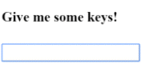
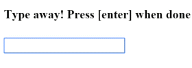

# [返回主目录](Readme.md)<!-- omit in toc --> 

# 目录 <!-- omit in toc --> 

- [用户输入](#%e7%94%a8%e6%88%b7%e8%be%93%e5%85%a5)
- [绑定用户输入事件](#%e7%bb%91%e5%ae%9a%e7%94%a8%e6%88%b7%e8%be%93%e5%85%a5%e4%ba%8b%e4%bb%b6)
- [通过$event对象取得用户输入(不推荐)](#%e9%80%9a%e8%bf%87event%e5%af%b9%e8%b1%a1%e5%8f%96%e5%be%97%e7%94%a8%e6%88%b7%e8%be%93%e5%85%a5%e4%b8%8d%e6%8e%a8%e8%8d%90)
  - [$event的类型](#event%e7%9a%84%e7%b1%bb%e5%9e%8b)
  - [传入$event是靠不住的做法](#%e4%bc%a0%e5%85%a5event%e6%98%af%e9%9d%a0%e4%b8%8d%e4%bd%8f%e7%9a%84%e5%81%9a%e6%b3%95)
- [从一个模板应用变量中获得用户输入(推荐做法)](#%e4%bb%8e%e4%b8%80%e4%b8%aa%e6%a8%a1%e6%9d%bf%e5%ba%94%e7%94%a8%e5%8f%98%e9%87%8f%e4%b8%ad%e8%8e%b7%e5%be%97%e7%94%a8%e6%88%b7%e8%be%93%e5%85%a5%e6%8e%a8%e8%8d%90%e5%81%9a%e6%b3%95)
- [按键事件过滤(通过key.enter)](#%e6%8c%89%e9%94%ae%e4%ba%8b%e4%bb%b6%e8%bf%87%e6%bb%a4%e9%80%9a%e8%bf%87keyenter)
- [丢失焦点事件(blur)](#%e4%b8%a2%e5%a4%b1%e7%84%a6%e7%82%b9%e4%ba%8b%e4%bb%b6blur)
- [混合key.enter和blur事件](#%e6%b7%b7%e5%90%88keyenter%e5%92%8cblur%e4%ba%8b%e4%bb%b6)
- [小结](#%e5%b0%8f%e7%bb%93)

# 用户输入
当用户点击链接、按下按钮或者输入文字时，这些用户动作都会产生 DOM 事件。 本章解释如何使用 Angular 事件绑定语法把这些事件绑定到事件处理器。

# 绑定用户输入事件
可以使用 Angular 事件绑定机制来响应任何 DOM 事件。

要绑定 DOM 事件，只要把 DOM 事件的名字包裹在圆括号中，然后用放在引号中的模板语句对它赋值就可以了。

例如实现一个点击事件处理器：

```html
<button (click)="onClickMe()">Click me!</button>
{{clickMessage}}
```
```ts
@Component({
  selector: 'app-click-me',
  template: `
    <button (click)="onClickMe()">Click me!</button>
    {{clickMessage}}`
})
export class ClickMeComponent {
  clickMessage = '';

  onClickMe() {
    this.clickMessage = 'You are my hero!';
  }
}
```
# 通过$event对象取得用户输入(不推荐)
**DOM 事件可以携带可能对组件有用的信息。可以通过$Event对象，将整个事件载荷传递给组件的事件处理器**：

```html
template: `
  <input (keyup)="onKey($event)">
  <p>{{values}}</p>
`
```
```ts
export class KeyUpComponent_v1 {
  values = '';

  onKey(event: any) { // without type info
    this.values += event.target.value + ' | ';
  }
}
```
**$event 对象的属性取决于 DOM 事件的类型,所有标准 DOM 事件对象都有一个 target 属性， 引用触发该事件的元素。**

在组件的 onKey() 方法中，把输入框的值和分隔符 (|) 追加组件的 values 属性。 使用插值表达式来把存放累加结果的 values 属性回显到屏幕上。

假设用户输入字母“abc”，然后用退格键一个一个删除它们。 用户界面将显示：



**可以用 event.key 替代 event.target.value，积累各个按键本身**，这样同样的用户输入可以产生：

## $event的类型
上边的例子将**event对象转换为any类型**，这样做虽然简化了代码，但是**丢失了智能提示**，你必须知道event对象到底是什么类型。为了防止这种问题，可以适当的**给event对象规定类型**：
```ts
export class KeyUpComponent_v1 {
  values = '';


  onKey(event: KeyboardEvent) { // with type info
    this.values += (<HTMLInputElement>event.target).value + ' | ';
  }
}
```
$event 的类型现在是 KeyboardEvent。 不是所有的元素都有 value 属性，所以它将 target 转换为输入元素。 OnKey 方法更加清晰地表达了它期望从模板得到什么，以及它是如何解析事件的。

## 传入$event是靠不住的做法
类型化事件对象揭露了重要的一点，即**反对把整个 DOM 事件传到方法中，因为这样组件会知道太多模板的信息**。 只有当它知道更多它本不应了解的 HTML 实现细节时，它才能提取信息。 这就**违反了模板（用户看到的）和组件（应用如何处理用户数据）之间的分离关注原则**。


# 从一个模板应用变量中获得用户输入(推荐做法)

**使用 Angular 的模板引用变量。 这些变量提供了从模块中直接访问元素的能力。** 在标识符前加上井号 (#) 就能声明一个模板引用变量。

```ts
@Component({
  selector: 'app-loop-back',
  template: `
    <input #box (keyup)="0">
    <p>{{box.value}}</p>
  `
})
export class LoopbackComponent { }
```


这个模板引用变量名叫 box，在 `<input>` 元素声明，它引用 `<input>` 元素本身。 代码使用 box 获得输入元素的 value 值，并通过插值表达式把它显示在 `<p>` 标签中。

这个模板完全是完全自包含的。它没有绑定到组件，组件也没做任何事情。

在输入框中输入，就会看到每次按键时，显示也随之更新了。

> 除非你绑定一个事件，否则这将完全无法工作。

> 只有在应用做了些异步事件（如击键），Angular 才更新绑定（并最终影响到屏幕）。 本例代码将 keyup 事件绑定到了数字 0，这可能是最短的模板语句了。 虽然这个语句不做什么，但它满足 Angular 的要求，所以 Angular 将更新屏幕。

**从模板变量获得输入框比通过 $event 对象更加简单**。 下面的代码重写了之前 keyup 示例，它使用变量来获得用户输入。
```ts
@Component({
  selector: 'app-key-up2',
  template: `
    <input #box (keyup)="onKey(box.value)">
    <p>{{values}}</p>
  `
})
export class KeyUpComponent_v2 {
  values = '';
  onKey(value: string) {
    this.values += value + ' | ';
  }
}
```
这个方法最漂亮的一点是：**组件代码从视图中获得了干净的数据值。再也不用了解 $event 变量及其结构了。**

# 按键事件过滤(通过key.enter)
(keyup) 事件处理器监听每一次按键。 有时只在意回车键，因为它标志着用户结束输入。 解决这个问题的一种方法是检查每个 $event.keyCode，只有键值是回车键时才采取行动。

更简单的方法是：**绑定到 Angular 的 keyup.enter 模拟事件。 然后，只有当用户敲回车键时，Angular 才会调用事件处理器**。
```ts
@Component({
  selector: 'app-key-up3',
  template: `
    <input #box (keyup.enter)="onEnter(box.value)">
    <p>{{value}}</p>
  `
})
export class KeyUpComponent_v3 {
  value = '';
  onEnter(value: string) { this.value = value; }
}
```



# 丢失焦点事件(blur)
前上例中，如果用户没有先按回车键，而是移开了鼠标，点击了页面中其它地方，输入框的当前值就会丢失。 只有当用户按下了回车键候，组件的 values 属性才能更新。

下面通过同时监听输入框的回车键和失去焦点事件来修正这个问题。
```ts
@Component({
  selector: 'app-key-up4',
  template: `
    <input #box
      (keyup.enter)="update(box.value)"
      (blur)="update(box.value)">

    <p>{{value}}</p>
  `
})
export class KeyUpComponent_v4 {
  value = '';
  update(value: string) { this.value = value; }
}
```

# 混合key.enter和blur事件
```ts
@Component({
  selector: 'app-little-tour',
  template: `
    <input #newHero
      (keyup.enter)="addHero(newHero.value)"
      (blur)="addHero(newHero.value); newHero.value='' ">

    <button (click)="addHero(newHero.value)">Add</button>

    <ul><li *ngFor="let hero of heroes">{{hero}}</li></ul>
  `
})
export class LittleTourComponent {
  heroes = ['Windstorm', 'Bombasto', 'Magneta', 'Tornado'];
  addHero(newHero: string) {
    if (newHero) {
      this.heroes.push(newHero);
    }
  }
}
```


# 小结
- 使用模板变量来引用元素 — newHero 模板变量引用了 `<input>` 元素。 你可以在 `<input>` 的任何兄弟或子级元素中引用 newHero。

- 传递数值，而非元素 — 获取输入框的值并将它传递给组件的 addHero，而不要传递 newHero。

- 保持模板语句简单 — (blur) 事件被绑定到两个 JavaScript 语句。 第一句调用 addHero。第二句 newHero.value='' 在添加新英雄到列表中后清除输入框。