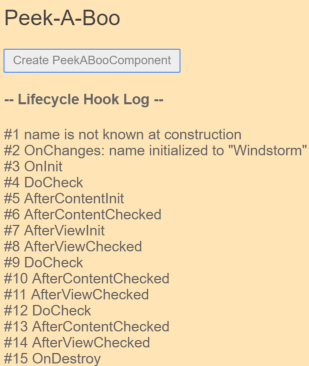
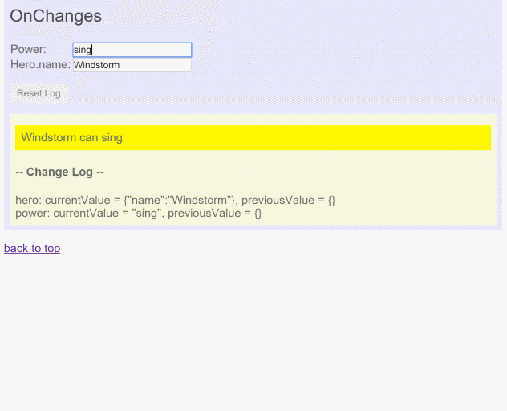
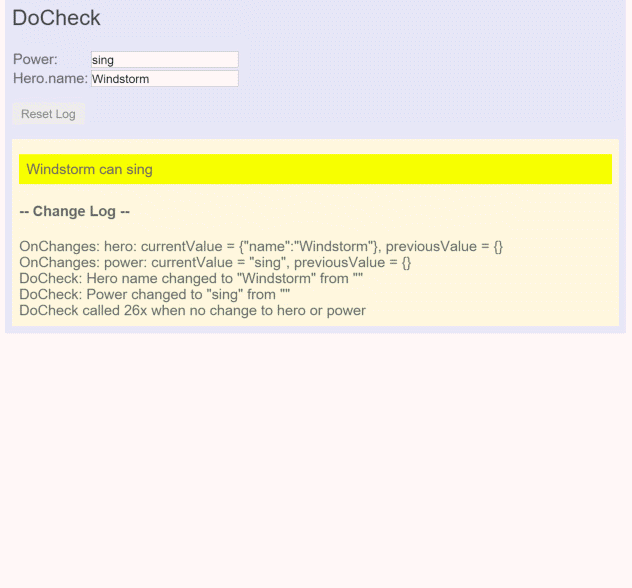
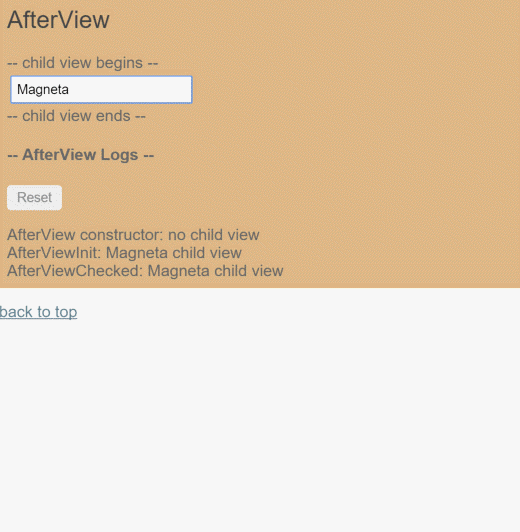

# [返回主目录](Readme.md)<!-- omit in toc --> 

# 目录 <!-- omit in toc --> 
- [生命周期钩子](#%e7%94%9f%e5%91%bd%e5%91%a8%e6%9c%9f%e9%92%a9%e5%ad%90)
- [组件生命周期钩子概览](#%e7%bb%84%e4%bb%b6%e7%94%9f%e5%91%bd%e5%91%a8%e6%9c%9f%e9%92%a9%e5%ad%90%e6%a6%82%e8%a7%88)
- [生命周期的顺序](#%e7%94%9f%e5%91%bd%e5%91%a8%e6%9c%9f%e7%9a%84%e9%a1%ba%e5%ba%8f)
- [接口是可选的(严格来讲)](#%e6%8e%a5%e5%8f%a3%e6%98%af%e5%8f%af%e9%80%89%e7%9a%84%e4%b8%a5%e6%a0%bc%e6%9d%a5%e8%ae%b2)
- [其它 Angular 生命周期钩子](#%e5%85%b6%e5%ae%83-angular-%e7%94%9f%e5%91%bd%e5%91%a8%e6%9c%9f%e9%92%a9%e5%ad%90)
- [生命周期范例](#%e7%94%9f%e5%91%bd%e5%91%a8%e6%9c%9f%e8%8c%83%e4%be%8b)
- [窥探 OnInit 和 OnDestroy](#%e7%aa%a5%e6%8e%a2-oninit-%e5%92%8c-ondestroy)
  - [OnInit()](#oninit)
  - [OnDestory()](#ondestory)
- [OnChanges()](#onchanges)
- [DoCheck()](#docheck)
- [AfterView](#afterview)
- [AfterContent](#aftercontent)
  - [内容投射](#%e5%86%85%e5%ae%b9%e6%8a%95%e5%b0%84)
  - [AfterContent钩子](#aftercontent%e9%92%a9%e5%ad%90)
  - [使用 AfterContent 时，无需担心单向数据流规则](#%e4%bd%bf%e7%94%a8-aftercontent-%e6%97%b6%e6%97%a0%e9%9c%80%e6%8b%85%e5%bf%83%e5%8d%95%e5%90%91%e6%95%b0%e6%8d%ae%e6%b5%81%e8%a7%84%e5%88%99)
# 生命周期钩子
每个组件都有一个被Angular管理的生命周期。

Angular 创建它，渲染它，创建并渲染它的子组件，在它被绑定的属性发生变化时检查它，并在它从 DOM 中被移除前销毁它。

Angular 提供了生命周期钩子，把这些关键生命时刻暴露出来，赋予你在它们发生时采取行动的能力。

除了那些组件内容和视图相关的钩子外,指令有相同生命周期钩子。

# 组件生命周期钩子概览

**指令和组件的实例的生命周期**：当 Angular 新建、更新和销毁它们时触发。 通过**实现一个或多个 Angular core 库里定义的生命周期钩子接口，开发者可以介入该生命周期中的这些关键时刻**。

每个接口都有唯一的一个钩子方法，它们的名字是**由接口名再加上 ng 前缀构成的**。比如，OnInit 接口的钩子方法叫做 ngOnInit， Angular 在创建组件后立刻调用它。

```ts
export class PeekABoo implements OnInit {
  constructor(private logger: LoggerService) { }

  // implement OnInit's `ngOnInit` method
  ngOnInit() { this.logIt(`OnInit`); }

  logIt(msg: string) {
    this.logger.log(`#${nextId++} ${msg}`);
  }
}
```
**指令或者组件会没有实现所有这些接口，并且有些钩子只对组件有意义。只有在指令/组件中定义过的那些钩子方法才会被 Angular 调用。**

# 生命周期的顺序

当 Angular 使用构造函数新建一个组件或指令后，就会按下面的顺序在特定时刻调用这些生命周期钩子方法：

钩子|用途及时机
-|-
ngOnChanges()|当 Angular（重新）设置数据绑定输入属性时响应。 该方法接受当前和上一属性值的 SimpleChanges 对象<br>**在 ngOnInit() 之前以及所绑定的一个或多个输入属性的值发生变化时都会调用**。
ngOnInit()|在 Angular 第一次显示数据绑定和设置指令/组件的输入属性之后，初始化指令/组件。<br>**在第一轮 ngOnChanges() 完成之后调用，只调用一次**。
ngDoCheck()|检测，并在发生 Angular 无法或不愿意自己检测的变化时作出反应。<br>**在每个变更检测周期中，紧跟在 ngOnChanges() 和 ngOnInit() 后面调用。**
ngAfterContentInit()|当 Angular 把外部内容投影进组件/指令的视图之后调用。<br>**第一次 ngDoCheck() 之后调用，只调用一次。**
ngAfterContentChecked()|每当 Angular 完成被投影组件内容的变更检测之后调用。<br>**ngAfterContentInit() 和每次 ngDoCheck() 之后调用**
ngAfterViewInit()|当 Angular 初始化完组件视图及其子视图之后调用。<br>**第一次 ngAfterContentChecked() 之后调用，只调用一次。**
ngAfterViewChecked()|每当 Angular 做完组件视图和子视图的变更检测之后调用。<br>**ngAfterViewInit() 和每次 ngAfterContentChecked() 之后调用。**
ngOnDestroy()|每当 Angular 每次销毁指令/组件之前调用并清扫。 在这儿反订阅可观察对象和分离事件处理器，以防内存泄漏。<br>**在 Angular 销毁指令/组件之前调用。**

# 接口是可选的(严格来讲)
Angular 在运行时看不到 TypeScript 接口，因为它们在编译为 JavaScript 的时候已经消失了。

**生命周期接口并不是必须的**。 你也别指望在指令和组件上添加生命周期钩子接口就能获得钩子带来的好处。

Angular 会去检测这些指令和组件的类，一旦发现钩子方法被定义了，就调用它们。 Angular 会找到并调用像 ngOnInit() 这样的钩子方法，有没有接口无所谓。

虽然如此，**在 TypeScript 指令类中添加接口是一项最佳实践，它可以获得强类型和 IDE 等编辑器带来的好处。**

# 其它 Angular 生命周期钩子
Angular 的其它子系统除了有这些组件钩子外，还可能有它们自己的生命周期钩子。

第三方库也可能会实现它们自己的钩子，以便让这些开发者在使用时能做更多的控制。

# 生命周期范例

```ts
@Component({
  selector: 'peek-a-boo',
  template: '<p>Now you see my hero, {{name}}</p>',
  styles: ['p {background: LightYellow; padding: 8px}']
})
// Don't HAVE to mention the Lifecycle Hook interfaces
// unless we want typing and tool support.
export class PeekABooComponent extends PeekABoo implements
             OnChanges, OnInit, DoCheck,
             AfterContentInit, AfterContentChecked,
             AfterViewInit, AfterViewChecked,
             OnDestroy {
  @Input()  name: string;

  private verb = 'initialized';

  constructor(logger: LoggerService) {
    super(logger);

    let is = this.name ? 'is' : 'is not';
    this.logIt(`name ${is} known at construction`);
  }

  // only called for/if there is an @input variable set by parent.
  ngOnChanges(changes: SimpleChanges) {
    let changesMsgs: string[] = [];
    for (let propName in changes) {
      if (propName === 'name') {
        let name = changes['name'].currentValue;
        changesMsgs.push(`name ${this.verb} to "${name}"`);
      } else {
        changesMsgs.push(propName + ' ' + this.verb);
      }
    }
    this.logIt(`OnChanges: ${changesMsgs.join('; ')}`);
    this.verb = 'changed'; // next time it will be a change
  }

  // Beware! Called frequently!
  // Called in every change detection cycle anywhere on the page
  ngDoCheck() { this.logIt(`DoCheck`); }

  ngAfterContentInit() { this.logIt(`AfterContentInit`);  }

  // Beware! Called frequently!
  // Called in every change detection cycle anywhere on the page
  ngAfterContentChecked() { this.logIt(`AfterContentChecked`); }

  ngAfterViewInit() { this.logIt(`AfterViewInit`); }

  // Beware! Called frequently!
  // Called in every change detection cycle anywhere on the page
  ngAfterViewChecked() { this.logIt(`AfterViewChecked`); }

  ngOnDestroy() { this.logIt(`OnDestroy`); }
}
```
为了演示 Angular 是如何按照期望的顺序调用这些钩子的。 PeekABooComponent组件完全实现了这些接口，用户点击Create...按钮，然后点击Destroy...按钮后，日志的状态如下图所示：



日志信息的日志和所规定的钩子调用顺序是一致的： OnChanges、OnInit、DoCheck (3x)、AfterContentInit、AfterContentChecked (3x)、 AfterViewInit、AfterViewChecked (3x)和 OnDestroy

> 构造函数本质上不应该算作 Angular 的钩子。 记录确认了在创建期间那些输入属性(这里是 name 属性)没有被赋值。

如果用户点击Update Hero按钮，就会看到另一个 OnChanges 和至少两组 DoCheck、AfterContentChecked 和 AfterViewChecked 钩子。 显然，这三种钩子被触发了很多次，必须让这三种钩子里的逻辑尽可能的精简！

# 窥探 OnInit 和 OnDestroy

1. 就像对组件一样，Angular 也会对指令调用这些钩子方法。

2. 一个侦探(spy)指令可以让你在无法直接修改 DOM 对象实现代码的情况下，透视其内部细节。 显然，你不能修改一个原生 `<div> `元素的实现代码。 你同样不能修改第三方组件。 但你用一个指令就能监视它们了。

通过一个注入进来的 LoggerService 把消息记录到父组件中去:

```ts
// Spy on any element to which it is applied.
// Usage: <div mySpy>...</div>
@Directive({selector: '[mySpy]'})
export class SpyDirective implements OnInit, OnDestroy {

  constructor(private logger: LoggerService) { }

  ngOnInit()    { this.logIt(`onInit`); }

  ngOnDestroy() { this.logIt(`onDestroy`); }

  private logIt(msg: string) {
    this.logger.log(`Spy #${nextId++} ${msg}`);
  }
}
```
把这个侦探指令写到任何原生元素或组件元素上，它将与所在的组件同时初始化和销毁。 下面是把它附加到用来重复显示英雄数据的这个 `<div>` 上。
```html
<div *ngFor="let hero of heroes" mySpy class="heroes">
  {{hero}}
</div>
```
每个“侦探”的出生和死亡也同时标记出了存放英雄的那个 `<div>` 的出生和死亡。钩子记录中的结构是这样的：


添加一个英雄就会产生一个新的英雄 `<div>`。侦探的 ngOnInit() 记录下了这个事件。

Reset 按钮清除了这个 heroes 列表。 Angular 从 DOM 中移除了所有英雄的 div，并且同时销毁了附加在这些 div 上的侦探指令。 侦探的 ngOnDestroy() 方法汇报了它自己的临终时刻。

**在真实的应用程序中，ngOnInit() 和 ngOnDestroy() 方法扮演着更重要的角色。**

## OnInit()

使用 ngOnInit() 有两个原因：

1. **在构造函数之后马上执行复杂的初始化逻辑**

2. **在 Angular 设置完输入属性之后，对该组件进行准备。**

有经验的开发者会让组件能很轻松和安全的构造出来。

**构造函数中除了使用简单的值对局部变量进行初始化之外，什么都不应该做。**

**ngOnInit() 是组件获取初始数据的好地方。**

另外还要记住，**在指令的构造函数完成之前，那些被绑定的输入属性(@Input()属性)还都没有值。 如果你需要基于这些属性的值来初始化这个指令，这种情况就会出问题。 而当 ngOnInit() 执行的时候，这些属性都已经被正确的赋值过了。**

> ngOnChanges() 方法是你访问这些属性的第一次机会。Angular 会在 ngOnInit() 之前调用 ngOnChanges()，之后还会调用很多次。但只会调用一次 ngOnInit()。

> **ngOnInit() 方法是放置复杂初始化逻辑的好地方。**

## OnDestory()
**一些清理逻辑必须在 Angular 销毁指令之前运行，把它们放在 ngOnDestroy() 中。**

这里是用来释放那些不会被垃圾收集器自动回收的各类资源的地方。 取消那些对可观察对象和 DOM 事件的订阅。停止定时器。注销该指令曾注册到全局服务或应用级服务中的各种回调函数。 如果不这么做，就会有导致内存泄露的风险。

# OnChanges()

**一旦检测到该组件(或指令)的输入属性发生了变化，Angular 就会调用它的 ngOnChanges() 方法。**

当使用OnChanges()钩子时，它只会监测输入属性的变化，而不会监测输入属性对象的变化，例如
```ts
@Input() hero: Hero;
@Input() power: string;
```
其中power输入属性会被监测，而hero输入属性，从本质上来讲它是一个对象，只有当引用地址发生变化时才会被检测。
```ts
ngOnChanges(changes: SimpleChanges) {
  for (let propName in changes) {
    let chng = changes[propName];
    let cur  = JSON.stringify(chng.currentValue);
    let prev = JSON.stringify(chng.previousValue);
    this.changeLog.push(`${propName}: currentValue = ${cur}, previousValue = ${prev}`);
  }
}
```
```html
<on-changes [hero]="hero" [power]="power"></on-changes>
```
ngOnChanges() 方法获取了一个对象，它把每个发生变化的属性名都映射到了一个SimpleChange对象， 该对象中有属性的当前值和前一个值。这个钩子会在这些发生了变化的属性上进行迭代，并记录它们。




# DoCheck()

使用 DoCheck 钩子来检测那些 Angular 自身无法捕获的变更并采取行动。

> 用这个方法来检测那些被 Angular 忽略的更改。

DoCheck 范例通过下面的 ngDoCheck() 钩子扩展了 OnChanges 范例：

```ts
ngDoCheck() {

  if (this.hero.name !== this.oldHeroName) {
    this.changeDetected = true;
    this.changeLog.push(`DoCheck: Hero name changed to "${this.hero.name}" from "${this.oldHeroName}"`);
    this.oldHeroName = this.hero.name;
  }

  if (this.power !== this.oldPower) {
    this.changeDetected = true;
    this.changeLog.push(`DoCheck: Power changed to "${this.power}" from "${this.oldPower}"`);
    this.oldPower = this.power;
  }

  if (this.changeDetected) {
      this.noChangeCount = 0;
  } else {
      // log that hook was called when there was no relevant change.
      let count = this.noChangeCount += 1;
      let noChangeMsg = `DoCheck called ${count}x when no change to hero or power`;
      if (count === 1) {
        // add new "no change" message
        this.changeLog.push(noChangeMsg);
      } else {
        // update last "no change" message
        this.changeLog[this.changeLog.length - 1] = noChangeMsg;
      }
  }

  this.changeDetected = false;
}
```
当英雄或它的超能力发生了非实质性改变时，就会往日志中写一条特殊的消息。 这样你可以看到 DoCheck 被调用的频率。结果非常显眼：



虽然 **ngDoCheck()** 钩子可以可以监测到英雄的 name 什么时候发生了变化。但其**开销很恐怖**。 这个 **ngDoCheck 钩子被非常频繁的调用** —— 在每次变更检测周期之后，发生了变化的每个地方都会调它。 在这个例子中，用户还没有做任何操作之前，它就被调用了超过二十次。

大部分检查的第一次调用都是在 Angular 首次渲染该页面中其它不相关数据时触发的。 仅仅把鼠标移到其它 `<input>` 中就会触发一次调用。 只有相对较少的调用才是由于对相关数据的修改而触发的。 显然，我们的实现必须非常轻量级，否则将损害用户体验。

# AfterView

AfterView 例子展示了 AfterViewInit() 和 AfterViewChecked() 钩子，Angular 会在每次创建了组件的子视图后调用它们。

下面是一个子视图，它用来把英雄的名字显示在一个 `<input>` 中：

```ts
//child component
@Component({
  selector: 'app-child-view',
  template: '<input [(ngModel)]="hero">'
})
export class ChildViewComponent {
  hero = 'Magneta';
}
```
```ts
//AfterViewComponent
template: `
  <div>-- child view begins --</div>
    <app-child-view></app-child-view>
  <div>-- child view ends --</div>`
```
下列钩子基于子视图中的每一次数据变更采取行动，它只能**通过带@ViewChild装饰器的属性来访问子视图**。
```ts
//AfterViewComponent
export class AfterViewComponent implements  AfterViewChecked, AfterViewInit {
  private prevHero = '';

  // Query for a VIEW child of type `ChildViewComponent`
  @ViewChild(ChildViewComponent, {static: false}) viewChild: ChildViewComponent;

  ngAfterViewInit() {
    // viewChild is set after the view has been initialized
    this.logIt('AfterViewInit');
    this.doSomething();
  }

  ngAfterViewChecked() {
    // viewChild is updated after the view has been checked
    if (this.prevHero === this.viewChild.hero) {
      this.logIt('AfterViewChecked (no change)');
    } else {
      this.prevHero = this.viewChild.hero;
      this.logIt('AfterViewChecked');
      this.doSomething();
    }
  }
  // ...
  // This surrogate for real business logic sets the `comment`
  private doSomething() {
    let c = this.viewChild.hero.length > 10 ? `That's a long name` : '';
    if (c !== this.comment) {
      // Wait a tick because the component's view has already been checked
      this.logger.tick_then(() => this.comment = c);
    }
  }
}
```



注意，**Angular 会频繁的调用 AfterViewChecked()，甚至在并没有需要关注的更改时也会触发。 所以务必把这个钩子方法写得尽可能精简，以免出现性能问题。**

# AfterContent
AfterContent 例子展示了 AfterContentInit() 和 AfterContentChecked() 钩子，**Angular 会在外来内容被投影到组件中之后调用它们**。

## 内容投射

**内容投影是从组件外部导入 HTML 内容，并把它插入在组件模板中指定位置上的一种途径。**

这种内容投射类似于马甲，就像transclusion的技术。

例如这个例子，不再通过模板来把子视图包含进来，而是改为从 AfterContentComponent 的父组件中导入它。下面是父组件的模板：

```html
<after-content>
  <app-child></app-child>
</after-content>
```
其中after-content是父组件，app-child为子组件，但是`<app-child>`被包含在`<after-content>`标签中。这种方式就叫做内容投射。**永远不要在组件标签的内部放任何内容 —— 除非你想把这些内容投影进这个组件中。**

看一下父组件`<after-content>`的模板：
```ts
template: `
  <div>-- projected content begins --</div>
    <ng-content></ng-content>
  <div>-- projected content ends --</div>`
```
**`<ng-content> `标签是外来内容的占位符**。 它告诉 Angular 在哪里插入这些外来内容。 在这里，被投影进去的内容就是来自父组件的 `<app-child>` 标签。


> 下列迹象表明存在着内容投影：
> - 在组件的元素标签中有 HTML
> - 组件的模板中出现了 `<ng-content>` 标签


## AfterContent钩子

AfterContent 钩子和 AfterView 相似。关键的不同点是子组件的类型不同。

- AfterView 钩子所关心的是 ViewChildren，这些子组件的元素标签会出现在该组件的模板里面。
- AfterContent 钩子所关心的是 ContentChildren，这些子组件被 Angular 投影进该组件中。

下列 AfterContent 钩子基于子级内容中值的变化而采取相应的行动，它只能通过带有@ContentChild装饰器的属性来查询到“子级内容”。

```ts
export class AfterContentComponent implements AfterContentChecked, AfterContentInit {
  private prevHero = '';
  comment = '';

  // Query for a CONTENT child of type `ChildComponent`
  @ContentChild(ChildComponent, {static: false}) contentChild: ChildComponent;

  ngAfterContentInit() {
    // contentChild is set after the content has been initialized
    this.logIt('AfterContentInit');
    this.doSomething();
  }

  ngAfterContentChecked() {
    // contentChild is updated after the content has been checked
    if (this.prevHero === this.contentChild.hero) {
      this.logIt('AfterContentChecked (no change)');
    } else {
      this.prevHero = this.contentChild.hero;
      this.logIt('AfterContentChecked');
      this.doSomething();
    }
  }
  // ...
}
```
## 使用 AfterContent 时，无需担心单向数据流规则
该组件的 doSomething() 方法立即更新了组件被绑定的 comment 属性。 它不用等下一回合。

回忆一下，Angular 在每次调用 AfterView 钩子之前也会同时调用 AfterContent。 Angular 在完成当前组件的视图合成之前，就已经完成了被投影内容的合成。 所以你仍然有机会去修改那个视图。
