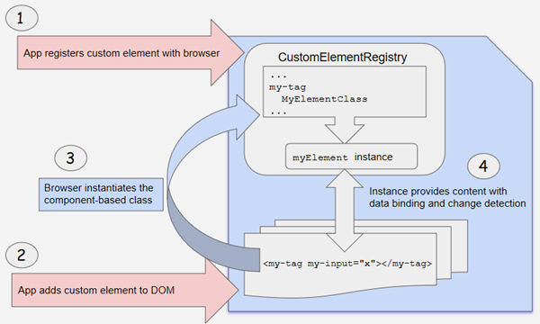

# [返回主目录](Readme.md)<!-- omit in toc --> 

# 目录 <!-- omit in toc --> 
- [Angular元素(Elements)概览](#angular%e5%85%83%e7%b4%a0elements%e6%a6%82%e8%a7%88)
- [使用自定义元素](#%e4%bd%bf%e7%94%a8%e8%87%aa%e5%ae%9a%e4%b9%89%e5%85%83%e7%b4%a0)
  - [工作原理](#%e5%b7%a5%e4%bd%9c%e5%8e%9f%e7%90%86)
- [把组件转换为自定义元素](#%e6%8a%8a%e7%bb%84%e4%bb%b6%e8%bd%ac%e6%8d%a2%e4%b8%ba%e8%87%aa%e5%ae%9a%e4%b9%89%e5%85%83%e7%b4%a0)
  - [映射](#%e6%98%a0%e5%b0%84)
- [自定义元素的浏览器支持](#%e8%87%aa%e5%ae%9a%e4%b9%89%e5%85%83%e7%b4%a0%e7%9a%84%e6%b5%8f%e8%a7%88%e5%99%a8%e6%94%af%e6%8c%81)
- [范例：弹窗服务](#%e8%8c%83%e4%be%8b%e5%bc%b9%e7%aa%97%e6%9c%8d%e5%8a%a1)
- [为自定义元素添加类型支持](#%e4%b8%ba%e8%87%aa%e5%ae%9a%e4%b9%89%e5%85%83%e7%b4%a0%e6%b7%bb%e5%8a%a0%e7%b1%bb%e5%9e%8b%e6%94%af%e6%8c%81)


# Angular元素(Elements)概览
**Angular 元素就是打包成自定义元素的 Angular 组件。所谓自定义元素就是一套与具体框架无关的用于定义新 HTML 元素的 Web 标准**。

自定义元素这项特性目前受到了 Chrome、Opera 和 Safari 的支持，在其它浏览器中也能通过腻子脚本（参见[浏览器支持](https://www.angular.cn/guide/elements#browser-support)）加以支持。 自定义元素扩展了 HTML，它允许你定义一个由 JavaScript 代码创建和控制的标签。 浏览器会维护一个自定义元素的注册表 CustomElementRegistry，它把一个可实例化的 JavaScript 类映射到 HTML 标签上。

**@angular/elements 包导出了一个 createCustomElement() API，它在 Angular 组件接口与变更检测功能和内置 DOM API 之间建立了一个桥梁**。

把组件转换成自定义元素可以让所有所需的 Angular 基础设施都在浏览器中可用。 创建自定义元素的方式简单直观，它会自动把你组件定义的视图连同变更检测与数据绑定等 Angular 的功能映射为相应的原生 HTML 等价物。

# 使用自定义元素

自定义元素会自举启动 —— **它们在添加到 DOM 中时就会自行启动自己，并在从 DOM 中移除时自行销毁自己。一旦自定义元素添加到了任何页面的 DOM 中，它的外观和行为就和其它的 HTML 元素一样了，不需要对 Angular 的术语或使用约定有任何特殊的了解**。

- **Angular 应用中的简易动态内容**

把**组件转换成自定义元素**为你在 Angular 应用中创建动态 HTML 内容提供了一种简单的方式。 在 Angular 应用中，你**直接添加到 DOM 中的 HTML 内容是不会经过 Angular 处理的**，**除非你使用动态组件来借助自己的代码把 HTML 标签与你的应用数据关联起来并参与变更检测。而使用自定义组件，所有这些装配工作都是自动的**。

- **富内容应用**

如果你有一个富内容应用（比如正在展示本文档的这个），自定义元素能让你的内容提供者使用复杂的 Angular 功能，而不要求他了解 Angular 的知识。比如，像本文档这样的 Angular 指南是使用 Angular 导航工具直接添加到 DOM 中的，但是其中可以包含特殊的元素，比如 `<code-snippet>`，它可以执行复杂的操作。 你所要告诉你的内容提供者的一切，就是这个自定义元素的语法。他们不需要了解关于 Angular 的任何知识，也不需要了解你的组件的数据结构或实现。

## 工作原理

**使用 *createCustomElement()* 函数来把组件转换成一个可注册成浏览器中自定义元素的类。 注册完这个配置好的类之后，你就可以在内容中像内置 HTML 元素一样使用这个新元素了**，比如直接把它加到 DOM 中：

```html
<my-popup message="Use Angular!"></my-popup>
```
当你的自定义元素放进页面中时，浏览器会创建一个已注册类的实例。其内容是由组件模板提供的，它使用 Angular 模板语法，并且使用组件和 DOM 数据进行渲染。组件的输入属性（Property）对应于该元素的输入属性（Attribute）。



# 把组件转换为自定义元素

**Angular 提供了 createCustomElement() 函数，以支持把 Angular 组件及其依赖转换成自定义元素。该函数会收集该组件的 Observable 型属性，提供浏览器创建和销毁实例时所需的 Angular 功能，还会对变更进行检测并做出响应。**

这个转换过程实现了 NgElementConstructor 接口，并创建了一个构造器类，用于生成该组件的一个自举型实例。

然后用 JavaScript 的 customElements.define() 函数把这个配置好的构造器和相关的自定义元素标签注册到浏览器的 CustomElementRegistry 中。 当浏览器遇到这个已注册元素的标签时，就会使用该构造器来创建一个自定义元素的实例。


## 映射
寄宿着 Angular 组件的自定义元素在组件中定义的"数据及逻辑"和标准的 DOM API 之间建立了一座桥梁。组件的属性和逻辑会直接映射到 HTML 属性和浏览器的事件系统中。

- 用于创建的 API 会解析该组件，以查找输入属性（Property），并在这个自定义元素上定义相应的属性（Attribute）。 它把属性名转换成与自定义元素兼容的形式（自定义元素不区分大小写），生成的属性名会使用中线分隔的小写形式。 比如，对于带有 `@Input('myInputProp') inputProp` 的组件，其对应的自定义元素会带有一个 my-input-prop 属性。

- 组件的输出属性会用 HTML 自定义事件的形式进行分发，自定义事件的名字就是这个输出属性的名字。 比如，对于带有 `@Output() valueChanged = new EventEmitter()` 属性的组件，其相应的自定义元素将会分发名叫 "valueChanged" 的事件，事件中所携带的数据存储在该事件对象的 detail 属性中。 如果你提供了别名，就改用这个别名。比如，`@Output('myClick') clicks = new EventEmitter<string>()`; 会导致分发名为 "myClick" 事件。

# 自定义元素的浏览器支持
浏览器|自定义元素支持
--|--
Chrome|原生支持
Opera|原生支持
Safari|原生支持
Firefox|在63版中原生支持，对于老版本，可以把 dom.webcomponents.enabled 和 dom.webcomponents.customelements.enabled 首选项设置为 true
Edge|正在实现

对于原生支持了自定义元素的浏览器，该规范要求开发人员使用 ES2016 的类来定义自定义元素 —— 开发人员可以在项目的 tsconfig.json 中设置 target: "es2015" 属性来满足这一要求。并不是所有浏览器都支持自定义元素和 ES2015，开发人员也可以选择使用腻子脚本来让它支持老式浏览器和 ES5 的代码。

**使用 Angular CLI 可以自动为你的项目添加正确的腻子脚本：ng add @angular/elements --name=*your_project_name*。**

# 范例：弹窗服务
以前，如果你要在运行期间把一个组件添加到应用中，就不得不定义动态组件。你还要把动态组件添加到模块的 entryComponents 列表中，以便应用在启动时能找到它，然后还要加载它、把它附加到 DOM 中的元素上，并且装配所有的依赖、变更检测和事件处理。


用 Angular 自定义组件会让这个过程更简单、更透明。它会自动提供所有基础设施和框架，而你要做的就是定义所需的各种事件处理逻辑。（如果你不准备在应用中直接用它，还要把该组件在编译时排除出去。）

这个弹窗服务的范例应用（见后面）定义了一个组件，你可以动态加载它也可以把它转换成自定义组件。

这个弹窗服务的范例应用（见后面）定义了一个组件，你可以动态加载它也可以把它转换成自定义组件。

- **popup.component.ts** 定义了一个简单的弹窗元素，用于显示一条输入消息，附带一些动画和样式。

- **popup.service.ts** 创建了一个可注入的服务，它提供了两种方式来执行 PopupComponent：作为动态组件或作为自定义元素。注意动态组件的方式需要更多的代码来做搭建工作。

- **app.module.ts** 把 PopupComponent 添加到模块的 entryComponents 列表中，而从编译过程中排除它，以消除启动时的警告和错误。

- **app.component.ts** 定义了该应用的根组件，它借助 PopupService 在运行时把这个弹窗添加到 DOM 中。在应用运行期间，根组件的构造函数会把 PopupComponent 转换成自定义元素。


已将该示例添加至TourOfHeresAngular8项目中.

这个范例中同时演示了这两种方式。一个按钮使用动态加载的方式添加弹窗，另一个按钮使用自定义元素的方式。可以看到，两者的结果是一样的，其差别只是准备过程不同。
```ts 
//popup.component.ts

import { NgModule } from '@angular/core';
import { BrowserModule } from '@angular/platform-browser';
import { BrowserAnimationsModule } from '@angular/platform-browser/animations';
 
import { AppComponent } from './app.component';
import { PopupComponent } from './popup.component';
import { PopupService } from './popup.service';
 
// Include the `PopupService` provider,
// but exclude `PopupComponent` from compilation,
// because it will be added dynamically.
 
@NgModule({
  imports: [BrowserModule, BrowserAnimationsModule],
  providers: [PopupService],
  declarations: [AppComponent, PopupComponent],
  bootstrap: [AppComponent],
  entryComponents: [PopupComponent],
})
export class AppModule {
}

```
```ts
//popup.service.ts
import { ApplicationRef, ComponentFactoryResolver, Injectable, Injector } from '@angular/core';
import { NgElement, WithProperties } from '@angular/elements';
import { PopupComponent } from './popup.component';
 
 
@Injectable()
export class PopupService {
  constructor(private injector: Injector,
              private applicationRef: ApplicationRef,
              private componentFactoryResolver: ComponentFactoryResolver) {}
 
  // Previous dynamic-loading method required you to set up infrastructure
  // before adding the popup to the DOM.
  showAsComponent(message: string) {
    // Create element
    const popup = document.createElement('popup-component');
 
    // Create the component and wire it up with the element
    const factory = this.componentFactoryResolver.resolveComponentFactory(PopupComponent);
    const popupComponentRef = factory.create(this.injector, [], popup);
 
    // Attach to the view so that the change detector knows to run
    this.applicationRef.attachView(popupComponentRef.hostView);
 
    // Listen to the close event
    popupComponentRef.instance.closed.subscribe(() => {
      document.body.removeChild(popup);
      this.applicationRef.detachView(popupComponentRef.hostView);
    });
 
    // Set the message
    popupComponentRef.instance.message = message;
 
    // Add to the DOM
    document.body.appendChild(popup);
  }
 
  // This uses the new custom-element method to add the popup to the DOM.
  showAsElement(message: string) {
    // Create element
    const popupEl: NgElement & WithProperties<PopupComponent> = document.createElement('popup-element') as any;
 
    // Listen to the close event
    popupEl.addEventListener('closed', () => document.body.removeChild(popupEl));
 
    // Set the message
    popupEl.message = message;
 
    // Add to the DOM
    document.body.appendChild(popupEl);
  }
}
```
```ts
//app.module.ts
import { NgModule } from '@angular/core';
import { BrowserModule } from '@angular/platform-browser';
import { BrowserAnimationsModule } from '@angular/platform-browser/animations';
 
import { AppComponent } from './app.component';
import { PopupComponent } from './popup.component';
import { PopupService } from './popup.service';
 
// Include the `PopupService` provider,
// but exclude `PopupComponent` from compilation,
// because it will be added dynamically.
 
@NgModule({
  imports: [BrowserModule, BrowserAnimationsModule],
  providers: [PopupService],
  declarations: [AppComponent, PopupComponent],
  bootstrap: [AppComponent],
  entryComponents: [PopupComponent],
})
export class AppModule {
}
```
```ts
//app.component.ts
import { Component, Injector } from '@angular/core';
import { createCustomElement } from '@angular/elements';
import { PopupService } from './popup.service';
import { PopupComponent } from './popup.component';
 
@Component({
  selector: 'app-root',
  template: `
    <input #input value="Message">
    <button (click)="popup.showAsComponent(input.value)">Show as component</button>
    <button (click)="popup.showAsElement(input.value)">Show as element</button>
  `,
})
export class AppComponent {
  constructor(injector: Injector, public popup: PopupService) {
    // Convert `PopupComponent` to a custom element.
    const PopupElement = createCustomElement(PopupComponent, {injector});
    // Register the custom element with the browser.
    customElements.define('popup-element', PopupElement);
  }
}
```

# 为自定义元素添加类型支持

一般的 DOM API，比如 document.createElement() 或 document.querySelector()，会返回一个与指定的参数相匹配的元素类型。比如，调用 document.createElement('a') 会返回 HTMLAnchorElement，这样 TypeScript 就会知道它有一个 href 属性，而 document.createElement('div') 会返回 HTMLDivElement，这样 TypeScript 就会知道它没有 href 属性。

当调用未知元素（比如自定义的元素名 popup-element）时，该方法会返回泛化类型，比如 HTMLELement，这时候 TypeScript 就无法推断出所返回元素的正确类型。

用 Angular 创建的自定义元素会扩展 NgElement 类型（而它扩展了 HTMLElement）。除此之外，这些自定义元素还拥有相应组件的每个输入属性。比如，popup-element 元素具有一个 string 型的 message 属性。

如果你要让你的自定义元素获得正确的类型，还可使用一些选项。假设你要创建一个基于下列组件的自定义元素 my-dialog：

```ts
@Component(...)
class MyDialog {
  @Input() content: string;
}
```

获得精确类型的最简单方式是把相关 DOM 方法的返回值转换成正确的类型。要做到这一点，你可以**使用 NgElement 和 WithProperties 类型（都导出自 @angular/elements）**：

```ts
const aDialog = document.createElement('my-dialog') as NgElement & WithProperties<{content: string}>;
aDialog.content = 'Hello, world!';
aDialog.content = 123;  // <-- ERROR: TypeScript knows this should be a string.
aDialog.body = 'News';  // <-- ERROR: TypeScript knows there is no `body` property on `aDialog`.
```

这是一种让你的自定义元素快速获得 TypeScript 特性（比如类型检查和自动完成支持）的好办法，不过如果你要在多个地方使用它，**可能会有点啰嗦，因为不得不在每个地方对返回类型做转换**。


另一种方式可以对每个自定义元素的类型只声明一次。你可以扩展 HTMLELementTagNameMap，TypeScript 会在 DOM 方法（如 document.createElement()、document.querySelector() 等）中用它来根据标签名推断返回元素的类型。

```ts
declare global {
  interface HTMLElementTagNameMap {
    'my-dialog': NgElement & WithProperties<{content: string}>;
    'my-other-element': NgElement & WithProperties<{foo: 'bar'}>;
    ...
  }
}
```
现在，TypeScript 就可以像内置元素一样推断出它的正确类型了：
```ts
document.createElement('div')               //--> HTMLDivElement (built-in element)
document.querySelector('foo')               //--> Element        (unknown element)
document.createElement('my-dialog')         //--> NgElement & WithProperties<{content: string}> (custom element)
document.querySelector('my-other-element')  //--> NgElement & WithProperties<{foo: 'bar'}>      (custom element)
```