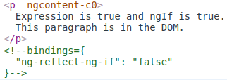
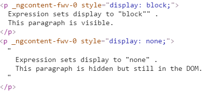
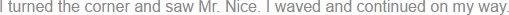

# [返回主目录](Readme.md)<!-- omit in toc --> 

# 目录 <!-- omit in toc --> 
- [结构型指令](#%e7%bb%93%e6%9e%84%e5%9e%8b%e6%8c%87%e4%bb%a4)
- [什么是结构型指令](#%e4%bb%80%e4%b9%88%e6%98%af%e7%bb%93%e6%9e%84%e5%9e%8b%e6%8c%87%e4%bb%a4)
  - [指令的拼写形式](#%e6%8c%87%e4%bb%a4%e7%9a%84%e6%8b%bc%e5%86%99%e5%bd%a2%e5%bc%8f)
- [NgIf案例分析](#ngif%e6%a1%88%e4%be%8b%e5%88%86%e6%9e%90)
  - [为什么是移除而不是隐藏](#%e4%b8%ba%e4%bb%80%e4%b9%88%e6%98%af%e7%a7%bb%e9%99%a4%e8%80%8c%e4%b8%8d%e6%98%af%e9%9a%90%e8%97%8f)
- [星号(*)前缀](#%e6%98%9f%e5%8f%b7%e5%89%8d%e7%bc%80)
- [*ngFor内幕](#ngfor%e5%86%85%e5%b9%95)
  - [微语法](#%e5%be%ae%e8%af%ad%e6%b3%95)
  - [模板输入变量](#%e6%a8%a1%e6%9d%bf%e8%be%93%e5%85%a5%e5%8f%98%e9%87%8f)
  - [每个宿主元素上只能有一个结构型指令](#%e6%af%8f%e4%b8%aa%e5%ae%bf%e4%b8%bb%e5%85%83%e7%b4%a0%e4%b8%8a%e5%8f%aa%e8%83%bd%e6%9c%89%e4%b8%80%e4%b8%aa%e7%bb%93%e6%9e%84%e5%9e%8b%e6%8c%87%e4%bb%a4)
- [NgSwitch内幕](#ngswitch%e5%86%85%e5%b9%95)
- [优先使用星号(*)语法](#%e4%bc%98%e5%85%88%e4%bd%bf%e7%94%a8%e6%98%9f%e5%8f%b7%e8%af%ad%e6%b3%95)
- [`<ng-template>`](#ng-template)
- [使用`<ng-container>`把一些兄弟元素归为一组](#%e4%bd%bf%e7%94%a8ng-container%e6%8a%8a%e4%b8%80%e4%ba%9b%e5%85%84%e5%bc%9f%e5%85%83%e7%b4%a0%e5%bd%92%e4%b8%ba%e4%b8%80%e7%bb%84)
  - [`<ng-container>` 的救赎](#ng-container-%e7%9a%84%e6%95%91%e8%b5%8e)
- [写一个结构型指令](#%e5%86%99%e4%b8%80%e4%b8%aa%e7%bb%93%e6%9e%84%e5%9e%8b%e6%8c%87%e4%bb%a4)
  - [TemplateRef 和 ViewContainerRef](#templateref-%e5%92%8c-viewcontainerref)
  - [appUnless 属性](#appunless-%e5%b1%9e%e6%80%a7)
- [小结](#%e5%b0%8f%e7%bb%93)

# 结构型指令
介绍，用结构型指令操纵 DOM 树，写自己的结构型指令来完成同样的任务。

# 什么是结构型指令
**结构型指令的职责是 HTML 布局。 它们塑造或重塑 DOM 的结构，比如添加、移除或维护这些元素。**

结构型指令非常容易识别。 在这个例子中，**星号（*）被放在指令的属性名之前。**

```html
<div *ngIf="hero" class="name">{{hero.name}}</div>
```
**没有方括号，没有圆括号，只是把 *ngIf 设置为一个字符串。**

在这个例子中，将会学到星号(*)这个简写方法，而这个字符串是一个微语法，而不是通常的模板表达式。 Angular 会解释这个语法糖，变成一个 `<ng-template>` 标记，包裹着宿主元素及其子元素。 每个结构型指令都可以用这个模板做点不同的事情。

**三个常用的内置结构型指令 —— NgIf、NgFor和NgSwitch...**。 你在模板语法一章中学过它，并且在 Angular 文档的例子中到处都在用它。下面是模板中的例子：

```html
<div *ngIf="hero" class="name">{{hero.name}}</div>

<ul>
  <li *ngFor="let hero of heroes">{{hero.name}}</li>
</ul>

<div [ngSwitch]="hero?.emotion">
  <app-happy-hero    *ngSwitchCase="'happy'"    [hero]="hero"></app-happy-hero>
  <app-sad-hero      *ngSwitchCase="'sad'"      [hero]="hero"></app-sad-hero>
  <app-confused-hero *ngSwitchCase="'confused'" [hero]="hero"></app-confused-hero>
  <app-unknown-hero  *ngSwitchDefault           [hero]="hero"></app-unknown-hero>
</div>
```

## 指令的拼写形式
 指令同时具有两种拼写形式大驼峰 UpperCamelCase 和小驼峰 lowerCamelCase，比如你已经看过的 NgIf 和 ngIf。 这里的原因在于，**NgIf 引用的是指令的类名，而 ngIf 引用的是指令的属性名*。**

 **指令的类名拼写成大驼峰形式（NgIf），而它的属性名则拼写成小驼峰形式（ngIf）。谈论指令的属性和工作原理时引用指令的类名，在描述如何在 HTML 模板中把该指令应用到元素时，引用指令的属性名。**

> 还有另外两种 Angular 指令，在本开发指南的其它地方有讲解：**(1) 组件 (2) 属性型指令。**  
> 组件可以在原生 HTML 元素中管理一小片区域的 HTML。从技术角度说，它就是一个带模板的指令。  
> 属性型指令会改变某个元素、组件或其它指令的外观或行为。 比如，内置的NgStyle指令可以同时修改元素的多个样式。  
> **你可以在一个宿主元素上应用多个属性型指令，但只能应用一个结构型指令。**

# NgIf案例分析

NgIf 是一个很好的结构型指令案例：它接受一个布尔值，并据此让一整块 DOM 树出现或消失。

```html
<p *ngIf="true">
  Expression is true and ngIf is true.
  This paragraph is in the DOM.
</p>
<p *ngIf="false">
  Expression is false and ngIf is false.
  This paragraph is not in the DOM.
</p>
```
**ngIf 指令并不是使用 CSS 来隐藏元素的。它会把这些元素从 DOM 中物理删除。** 使用浏览器的开发者工具就可以确认这一点。



当条件为假时，NgIf 会从 DOM 中移除它的宿主元素，取消它监听过的那些 DOM 事件，从 Angular 变更检测中移除该组件，并销毁它。 这些组件和 DOM 节点可以被当做垃圾收集起来，并且释放它们占用的内存。

## 为什么是移除而不是隐藏
指令也可以通过把它的 display 风格设置为 none 而隐藏不需要的段落。
```html
<p [style.display]="'block'">
  Expression sets display to "block".
  This paragraph is visible.
</p>
<p [style.display]="'none'">
  Expression sets display to "none".
  This paragraph is hidden but still in the DOM.
</p>
```
当不可见时，这个元素仍然留在 DOM 中。



对于简单的段落，隐藏和移除之间的差异影响不大，但对于资源占用较多的组件是不一样的。 当隐藏掉一个元素时，组件的行为还在继续 —— 它仍然附加在它所属的 DOM 元素上， 它也仍在监听事件。Angular 会继续检查哪些能影响数据绑定的变更。 组件原本要做的那些事情仍在继续。

虽然不可见，组件及其各级子组件仍然占用着资源，而这些资源如果分配给别人可能会更有用。 在性能和内存方面的负担相当可观，响应度会降低，而用户却可能无法从中受益。

当然，从积极的一面看，重新显示这个元素会非常快。 组件以前的状态被保留着，并随时可以显示。 组件不用重新初始化 —— 该操作可能会比较昂贵。 这时候隐藏和显示就成了正确的选择。

但是，除非有非常强烈的理由来保留它们，否则你会更倾向于移除用户看不见的那些 DOM 元素，并且使用 NgIf 这样的结构型指令来收回用不到的资源。

同样的考量也适用于每一个结构型指令，无论是内置的还是自定义的。 你应该提醒自己慎重考虑添加元素、移除元素以及创建和销毁组件的后果。

# 星号(*)前缀
你可能注意到了指令名的星号（*）前缀，并且困惑于为什么需要它以及它是做什么的。

这里的 *ngIf 会在 hero 存在时显示英雄的名字。
```html
<div *ngIf="hero" class="name">{{hero.name}}</div>
```

**星号是一个用来简化更复杂语法的“语法糖”。 从内部实现来说，Angular 把 `*ngIf` 属性 翻译成一个 `<ng-template>` 元素 并用它来包裹宿主元素**，代码如下：
```html
<ng-template [ngIf]="hero">
  <div class="name">{{hero.name}}</div>
</ng-template>
```
- *ngIf 指令被移到了 `<ng-template>` 元素上。在那里它变成了一个属性绑定 [ngIf]。  
- `<div> `上的其余部分，包括它的 class 属性在内，移到了内部的` <ng-template>` 元素上。

第一种形态永远不会真的渲染出来。 只有最终产出的结果才会出现在 DOM 中。


Angular 会在真正渲染的时候填充 `<ng-template>` 的内容，并且把 `<ng-template>` 替换为一个供诊断用的注释。  
NgFor和NgSwitch...指令也都遵循同样的模式。

# *ngFor内幕

Angular 会把 `*ngFor` 用同样的方式把星号`(*)`语法的 template属性转换成 `<ng-template>`元素。

这里有一个 NgFor 的全特性应用，同时用了这三种写法：
```html
<div *ngFor="let hero of heroes; let i=index; let odd=odd; trackBy: trackById" [class.odd]="odd">
  ({{i}}) {{hero.name}}
</div>

<ng-template ngFor let-hero [ngForOf]="heroes" let-i="index" let-odd="odd" [ngForTrackBy]="trackById">
  <div [class.odd]="odd">({{i}}) {{hero.name}}</div>
</ng-template>
```

它明显比 ngIf 复杂得多，确实如此。 NgFor 指令比本章展示过的 NgIf 具有更多的必选特性和可选特性。 至少 NgFor 会需要一个循环变量（let hero）和一个列表（heroes）。

你可以通过把一个字符串赋值给 ngFor 来启用这些特性，这个字符串使用 Angular 的**微语法**。

> ngFor 字符串之外的每一样东西都会留在宿主元素（`<div>`）上，也就是说它移到了 `<ng-template>` 内部。 在这个例子中，[ngClass]="odd" 留在了 `<div>` 上。

## 微语法
Angular 微语法能让你通过简短的、友好的字符串来配置一个指令。 微语法解析器把这个字符串翻译成 `<ng-template>` 上的属性：

- let 关键字声明一个模板输入变量，你会在模板中引用它。本例子中，这个输入变量就是 hero、i 和 odd。 解析器会把 let hero、let i 和 let odd 翻译成命名变量 let-hero、let-i 和 let-odd。

- 微语法解析器接收 of 和 trackby，把它们首字母大写（of -> Of, trackBy -> TrackBy）， 并且给它们加上指令的属性名（ngFor）前缀，最终生成的名字是 ngForOf 和 ngForTrackBy。 这两个最终生成的名字是 NgFor 的输入属性，指令据此了解到列表是 heroes，而 track-by 函数是 trackById。

- NgFor 指令在列表上循环，每个循环中都会设置和重置它自己的上下文对象上的属性。 这些属性包括 index 和 odd 以及一个特殊的属性名 $implicit（隐式变量）。

- let-i 和 let-odd 变量是通过 let i=index 和 let odd=odd 来定义的。 Angular 把它们设置为上下文对象中的 index 和 odd 属性的当前值。

- 这里并没有指定 let-hero 的上下文属性。它的来源是隐式的。 Angular 将 let-hero 设置为此上下文中 $implicit 属性的值， 它是由 NgFor 用当前迭代中的英雄初始化的。

- API 参考手册中描述了 NgFor 指令的其它属性和上下文属性。

- NgFor 是由 NgForOf 指令来实现的。请参阅 NgForOf API 参考手册来了解 NgForOf 指令的更多属性及其上下文属性。

这些微语法机制在你写自己的结构型指令时也同样有效.

## 模板输入变量

**模板输入变量是这样一种变量，你可以在单个实例的模板中引用它的值**。 这个例子中有好几个模板输入变量：hero、i 和 odd。 它们**都是用 let 作为前导关键字**。

无论是在语义上还是语法上，模板输入变量和模板引用变量是不同的。

**你使用 let 关键字（如 let hero）在模板中声明一个模板输入变量。 这个变量的范围被限制在所重复模板的单一实例上。 事实上，你可以在其它结构型指令中使用同样的变量名。**

**而声明模板引用变量使用的是给变量名加 # 前缀的方式（#var）。 一个引用变量引用的是它所附着到的元素、组件或指令。它可以在整个模板的任意位置访问。**

模板输入变量和引用变量具有各自独立的命名空间。let hero 中的 hero 和 #hero 中的 hero 并不是同一个变量。

## 每个宿主元素上只能有一个结构型指令

有时你会希望只有当特定的条件为真时才重复渲染一个 HTML 块。 你可能试过**把 *ngFor 和 *ngIf 放在同一个宿主元素上，但 Angular 不允许**。这是因为你在**一个元素上只能放一个结构型指令。**

原因很简单。结构型指令可能会对宿主元素及其子元素做很复杂的事。当两个指令放在同一个元素上时，谁先谁后？NgIf 优先还是 NgFor 优先？NgIf 可以取消 NgFor 的效果吗？ 如果要这样做，Angular 应该如何把这种能力泛化，以取消其它结构型指令的效果呢？

对这些问题，没有办法简单回答。而**禁止多个结构型指令则可以简单地解决这个问题**。 这种情况下有一个简单的解决方案：**把 `*ngIf` 放在一个"容器"元素上，再包装进 `*ngFor` 元素。 这个元素可以使用`ng-container`，以免引入一个新的 HTML 层级**。

# NgSwitch内幕
Angular 的 NgSwitch 实际上是一组相互合作的指令：NgSwitch、NgSwitchCase 和 NgSwitchDefault。

例如：
```html
<div [ngSwitch]="hero?.emotion">
  <app-happy-hero    *ngSwitchCase="'happy'"    [hero]="hero"></app-happy-hero>
  <app-sad-hero      *ngSwitchCase="'sad'"      [hero]="hero"></app-sad-hero>
  <app-confused-hero *ngSwitchCase="'confused'" [hero]="hero"></app-confused-hero>
  <app-unknown-hero  *ngSwitchDefault           [hero]="hero"></app-unknown-hero>
</div>
```
一个值(hero.emotion)被被赋值给了 NgSwitch，以决定要显示哪一个分支。

**NgSwitch** 本身不是结构型指令，而**是一个属性型指令**，它控制其它两个 switch 指令的行为。 这也就是为什么你要写成 [ngSwitch] 而不是 *ngSwitch 的原因。

NgSwitchCase 和 NgSwitchDefault 都是结构型指令。 因此你要使用星号（*）前缀来把它们附着到元素上。 NgSwitchCase 会在它的值匹配上选项值的时候显示它的宿主元素。 NgSwitchDefault 则会当没有兄弟 NgSwitchCase 匹配上时显示它的宿主元素。

> 指令所在的元素就是它的宿主元素。 `<happy-hero>` 是 *ngSwitchCase 的宿主元素。 `<unknown-hero>` 是 *ngSwitchDefault 的宿主元素。

像其它的结构型指令一样，NgSwitchCase 和 NgSwitchDefault 也可以解释语法糖，变成 `<ng-template> `的形式。
```html
<div [ngSwitch]="hero?.emotion">
  <ng-template [ngSwitchCase]="'happy'">
    <app-happy-hero [hero]="hero"></app-happy-hero>
  </ng-template>
  <ng-template [ngSwitchCase]="'sad'">
    <app-sad-hero [hero]="hero"></app-sad-hero>
  </ng-template>
  <ng-template [ngSwitchCase]="'confused'">
    <app-confused-hero [hero]="hero"></app-confused-hero>
  </ng-template >
  <ng-template ngSwitchDefault>
    <app-unknown-hero [hero]="hero"></app-unknown-hero>
  </ng-template>
</div>
```
# 优先使用星号(*)语法
星号（*）语法比不带语法糖的形式更加清晰。 如果找不到单一的元素来应用该指令，可以使用`<ng-container>`作为该指令的容器。

虽然很少有理由在模板中使用结构型指令的属性形式和元素形式，但这些幕后知识仍然是很重要的，即：**Angular 会创建 `<ng-template>`，还要了解它的工作原理。 当需要写自己的结构型指令时，你就要使用 `<ng-template>`。**

# `<ng-template>`
**`<ng-template>`是一个 Angular 元素，用来渲染 HTML。 它永远不会直接显示出来。 事实上，在渲染视图之前，Angular 会把 `<ng-template>`及其内容替换为一个注释。**

如果没有使用结构型指令，而仅仅把一些别的元素包装进 `<ng-template>` 中，那些元素就是不可见的。 在下面的这个短语"Hip! Hip! Hooray!"中，中间的这个 "Hip!"（欢呼声） 就是如此。

```html
<p>Hip!</p>
<ng-template>
  <p>Hip!</p>
</ng-template>
<p>Hooray!</p>
```
Angular 抹掉了中间的那个 "Hip!" ，让欢呼声显得不再那么热烈了。


结构型指令会让 `<ng-template>` 正常工作，在你写自己的结构型指令时就会看到这一点。

# 使用`<ng-container>`把一些兄弟元素归为一组

通常都**需要一个根元素作为结构型指令的宿主**。 列表元素（`<li>`）就是一个典型的供 NgFor 使用的宿主元素。

```html
<li *ngFor="let hero of heroes">{{hero.name}}</li>
```
当没有这样一个单一的宿主元素时，你就可以把这些内容包裹在一个原生的 HTML 容器元素中，比如 `<div>`，并且把结构型指令附加到这个"包裹"上。
```html
<div *ngIf="hero" class="name">{{hero.name}}</div>
```
但引入另一个容器元素（通常是 `<span>` 或 `<div>`）来把一些元素归到一个单一的根元素下，通常也会带来问题。注意，是"通常"而不是"总会"。

这种用于分组的元素可能会破坏模板的外观表现，因为 CSS 的样式既不曾期待也不会接受这种新的元素布局。 比如，假设你有下列分段布局。
```html
<p>
  I turned the corner
  <span *ngIf="hero">
    and saw {{hero.name}}. I waved
  </span>
  and continued on my way.
</p>
```
而你的 CSS 样式规则是应用于 <p> 元素下的 <span> 的。
```css
p span { color: red; font-size: 70%; }
```
这样渲染出来的段落就会非常奇怪。


本来为其它地方准备的 p span 样式，被意外的应用到了这里。

另一个问题是：有些 HTML 元素需要所有的直属下级都具有特定的类型。 比如，`<select>` 元素要求直属下级必须为 `<option>`，那就没办法把这些选项包装进 `<div>` 或 `<span>` 中。

如果这样做：

```html
<div>
  Pick your favorite hero
  (<label><input type="checkbox" checked (change)="showSad = !showSad">show sad</label>)
</div>
<select [(ngModel)]="hero">
  <span *ngFor="let h of heroes">
    <span *ngIf="showSad || h.emotion !== 'sad'">
      <option [ngValue]="h">{{h.name}} ({{h.emotion}})</option>
    </span>
  </span>
</select>
```
下拉列表就是空的。


浏览器不会显示 `<span>` 中的 `<option>`。

## `<ng-container>` 的救赎

Angular 的 `<ng-container>` 是一个分组元素，但它不会污染样式或元素布局，因为 Angular 压根不会把它放进 DOM 中。

这次使用 `<ng-container>` 重新实现的条件化段落。
```html
<p>
  I turned the corner
  <ng-container *ngIf="hero">
    and saw {{hero.name}}. I waved
  </ng-container>
  and continued on my way.
</p>
```
这次就渲染对了。



现在用 `<ng-container> `来根据条件排除选择框中的某个 `<option>`。

```html
<div>
  Pick your favorite hero
  (<label><input type="checkbox" checked (change)="showSad = !showSad">show sad</label>)
</div>
<select [(ngModel)]="hero">
  <ng-container *ngFor="let h of heroes">
    <ng-container *ngIf="showSad || h.emotion !== 'sad'">
      <option [ngValue]="h">{{h.name}} ({{h.emotion}})</option>
    </ng-container>
  </ng-container>
</select>
```
下拉框也工作正常。


> 注意： 记住，ngModel 指令是在 Angular 的 FormsModule 中定义的，你要在想使用它的模块的 imports: [...] 元数据中导入 FormsModule。

**`<ng-container>` 是一个由 Angular 解析器负责识别处理的语法元素。 它不是一个指令、组件、类或接口，更像是 JavaScript 中 if 块中的花括号。**

```javascript
if (someCondition) {
  statement1;
  statement2;
  statement3;
}
```
没有这些花括号，JavaScript 只会执行第一句，而你原本的意图是把其中的所有语句都视为一体来根据条件执行。 而 `<ng-container> `满足了 Angular 模板中类似的需求。

# 写一个结构型指令

在本节中，你会写一个名叫 UnlessDirective 的结构型指令，它是 NgIf 的反义词。 NgIf 在条件为 true 的时候显示模板内容，而 UnlessDirective 则会在条件为 false 时显示模板内容。

```html
<p *appUnless="condition">Show this sentence unless the condition is true.</p>
```
创建指令很像创建组件。

- **导入 Directive 装饰器（而不再是 Component）。**

- **导入符号 Input、TemplateRef 和 ViewContainerRef，你在任何结构型指令中都会需要它们。**

- **给指令类添加装饰器。**

- **设置 CSS 属性选择器 ，以便在模板中标识出这个指令该应用于哪个元素。**

这里是起点：

```ts
//unless.directive.ts
import { Directive, Input, TemplateRef, ViewContainerRef } from '@angular/core';

@Directive({ selector: '[appUnless]'})
export class UnlessDirective {
}
```

指令的选择器通常是把指令的属性名括在方括号中，如 [appUnless]。 这个方括号定义出了一个 CSS 属性选择器。

该指令的属性名应该拼写成小驼峰形式，并且带有一个前缀。 但是，这个前缀不能用 ng，因为它只属于 Angular 本身。 请选择一些简短的，适合你自己或公司的前缀。 在这个例子中，前缀是 my。

指令的类名用 Directive 结尾，参见风格指南。 但 Angular 自己的指令例外。

## TemplateRef 和 ViewContainerRef

像这个例子一样的简单结构型指令会从 Angular 生成的 `<ng-template>` 元素中创建一个内嵌的视图，并把这个视图插入到一个视图容器中，紧挨着本指令原来的宿主元素 `<p>`（译注：注意不是子节点，而是兄弟节点）。

你可以使用TemplateRef取得 `<ng-template>` 的内容，并通过ViewContainerRef来访问这个视图容器。

你可以把它们都注入到指令的构造函数中，作为该类的私有属性。

```ts
//unless.directive.ts(ctor)
constructor(
  private templateRef: TemplateRef<any>,
  private viewContainer: ViewContainerRef) { }
```

## appUnless 属性
该指令的使用者会把一个 true/false 条件绑定到 [appUnless] 属性上。 也就是说，该指令需要一个带有 @Input 的 appUnless 属性。
```ts
//unless.directive.ts(set)
@Input() set appUnless(condition: boolean) {
  if (!condition && !this.hasView) {
    this.viewContainer.createEmbeddedView(this.templateRef);
    this.hasView = true;
  } else if (condition && this.hasView) {
    this.viewContainer.clear();
    this.hasView = false;
  }
}
```
一旦该值的条件发生了变化，Angular 就会去设置 appUnless 属性。因为不能用 appUnless 属性，所以你要为它定义一个设置器（setter）。
- 如果条件为假，并且以前尚未创建过该视图，就告诉视图容器（ViewContainer）根据模板创建一个内嵌视图。  
- 如果条件为真，并且视图已经显示出来了，就会清除该容器，并销毁该视图。  

没有人会读取 appUnless 属性，因此它不需要定义 getter。

完整的指令代码如下：
```ts
//unless.directive.ts(excerpt)
import { Directive, Input, TemplateRef, ViewContainerRef } from '@angular/core';

/**
 * Add the template content to the DOM unless the condition is true.
 */
@Directive({ selector: '[appUnless]'})
export class UnlessDirective {
  private hasView = false;

  constructor(
    private templateRef: TemplateRef<any>,
    private viewContainer: ViewContainerRef) { }

  @Input() set appUnless(condition: boolean) {
    if (!condition && !this.hasView) {
      this.viewContainer.createEmbeddedView(this.templateRef);
      this.hasView = true;
    } else if (condition && this.hasView) {
      this.viewContainer.clear();
      this.hasView = false;
    }
  }
}
```
把这个指令添加到 AppModule 的 declarations 数组中。

然后创建一些 HTML 来试用一下。

```html
<p *appUnless="condition" class="unless a">
  (A) This paragraph is displayed because the condition is false.
</p>

<p *appUnless="!condition" class="unless b">
  (B) Although the condition is true,
  this paragraph is displayed because appUnless is set to false.
</p>
```
当 condition 为 false 时，顶部的段落就会显示出来，而底部的段落消失了。 当 condition 为 true 时，顶部的段落被移除了，而底部的段落显示了出来。


# 小结
你学到了

- 结构型指令可以操纵 HTML 的元素布局。

- 当没有合适的宿主元素时，可以使用`<ng-container>`对元素进行分组。

- Angular 会把星号（*）语法解开成 `<ng-template>`。

- 内置指令 NgIf、NgFor 和 NgSwitch 的工作原理。

- 微语法如何展开成`<ng-template>`。

- 写了一个自定义结构型指令 —— UnlessDirective。

相关源码：
```ts
//app.component.ts
import { Component } from '@angular/core';
 
import { Hero, heroes } from './hero';
 
@Component({
  selector: 'app-root',
  templateUrl: './app.component.html',
  styleUrls: [ './app.component.css' ]
})
export class AppComponent {
  heroes = heroes;
  hero = this.heroes[0];
 
  condition = false;
  logs: string[] = [];
  showSad = true;
  status = 'ready';
 
  trackById(index: number, hero: Hero): number { return hero.id; }
}
```
```html
<!--app.component.html-->
<h1>Structural Directives</h1>
 
<p>Conditional display of hero</p>
 
<blockquote>
<div *ngIf="hero" class="name">{{hero.name}}</div>
</blockquote>
 
<p>List of heroes</p>
 
<ul>
  <li *ngFor="let hero of heroes">{{hero.name}}</li>
</ul>
 
 
<hr>
 
<h2 id="ngIf">NgIf</h2>
 
<p *ngIf="true">
  Expression is true and ngIf is true.
  This paragraph is in the DOM.
</p>
<p *ngIf="false">
  Expression is false and ngIf is false.
  This paragraph is not in the DOM.
</p>
 
<p [style.display]="'block'">
  Expression sets display to "block".
  This paragraph is visible.
</p>
<p [style.display]="'none'">
  Expression sets display to "none".
  This paragraph is hidden but still in the DOM.
</p>
 
<h4>NgIf with template</h4>
<p>&lt;ng-template&gt; element</p>
<ng-template [ngIf]="hero">
  <div class="name">{{hero.name}}</div>
</ng-template>
 
<hr>
 
<h2 id="ng-container">&lt;ng-container&gt;</h2>
 
<h4>*ngIf with a &lt;ng-container&gt;</h4>
 
<button (click)="hero = hero ? null : heroes[0]">Toggle hero</button>
 
<p>
  I turned the corner
  <ng-container *ngIf="hero">
    and saw {{hero.name}}. I waved
  </ng-container>
  and continued on my way.
</p>
<p>
  I turned the corner
  <span *ngIf="hero">
    and saw {{hero.name}}. I waved
  </span>
  and continued on my way.
</p>
 
<p><i>&lt;select&gt; with &lt;span&gt;</i></p>
<div>
  Pick your favorite hero
  (<label><input type="checkbox" checked (change)="showSad = !showSad">show sad</label>)
</div>
<select [(ngModel)]="hero">
  <span *ngFor="let h of heroes">
    <span *ngIf="showSad || h.emotion !== 'sad'">
      <option [ngValue]="h">{{h.name}} ({{h.emotion}})</option>
    </span>
  </span>
</select>
 
<p><i>&lt;select&gt; with &lt;ng-container&gt;</i></p>
<div>
  Pick your favorite hero
  (<label><input type="checkbox" checked (change)="showSad = !showSad">show sad</label>)
</div>
<select [(ngModel)]="hero">
  <ng-container *ngFor="let h of heroes">
    <ng-container *ngIf="showSad || h.emotion !== 'sad'">
      <option [ngValue]="h">{{h.name}} ({{h.emotion}})</option>
    </ng-container>
  </ng-container>
</select>
<br><br>
 
<hr>
 
<h2 id="ngFor">NgFor</h2>
 
<div class="box">
 
<p class="code">&lt;div *ngFor="let hero of heroes; let i=index; let odd=odd; trackBy: trackById" [class.odd]="odd"&gt;</p>
<div *ngFor="let hero of heroes; let i=index; let odd=odd; trackBy: trackById" [class.odd]="odd">
  ({{i}}) {{hero.name}}
</div>
 
<p class="code">&lt;ng-template ngFor let-hero [ngForOf]="heroes" let-i="index" let-odd="odd" [ngForTrackBy]="trackById"/&gt;</p>
<ng-template ngFor let-hero [ngForOf]="heroes" let-i="index" let-odd="odd" [ngForTrackBy]="trackById">
  <div [class.odd]="odd">({{i}}) {{hero.name}}</div>
</ng-template>
 
</div>
<hr>
 
<h2 id="ngSwitch">NgSwitch</h2>
 
<div>Pick your favorite hero</div>
<p>
  <label *ngFor="let h of heroes">
    <input type="radio" name="heroes" [(ngModel)]="hero" [value]="h">{{h.name}}
  </label>
  <label><input type="radio" name="heroes" (click)="hero = null">None of the above</label>
</p>
 
<h4>NgSwitch</h4>
 
<div [ngSwitch]="hero?.emotion">
  <app-happy-hero    *ngSwitchCase="'happy'"    [hero]="hero"></app-happy-hero>
  <app-sad-hero      *ngSwitchCase="'sad'"      [hero]="hero"></app-sad-hero>
  <app-confused-hero *ngSwitchCase="'confused'" [hero]="hero"></app-confused-hero>
  <app-unknown-hero  *ngSwitchDefault           [hero]="hero"></app-unknown-hero>
</div>
 
<h4>NgSwitch with &lt;ng-template&gt;</h4>
<div [ngSwitch]="hero?.emotion">
  <ng-template [ngSwitchCase]="'happy'">
    <app-happy-hero [hero]="hero"></app-happy-hero>
  </ng-template>
  <ng-template [ngSwitchCase]="'sad'">
    <app-sad-hero [hero]="hero"></app-sad-hero>
  </ng-template>
  <ng-template [ngSwitchCase]="'confused'">
    <app-confused-hero [hero]="hero"></app-confused-hero>
  </ng-template >
  <ng-template ngSwitchDefault>
    <app-unknown-hero [hero]="hero"></app-unknown-hero>
  </ng-template>
</div>
 
<hr>
 
<h2>&lt;ng-template&gt;</h2>
<p>Hip!</p>
<ng-template>
  <p>Hip!</p>
</ng-template>
<p>Hooray!</p>
 
<hr>
 
<h2 id="appUnless">UnlessDirective</h2>
<p>
  The condition is currently
  <span [ngClass]="{ 'a': !condition, 'b': condition, 'unless': true }">{{condition}}</span>.
  <button
    (click)="condition = !condition"
    [ngClass] = "{ 'a': condition, 'b': !condition }" >
    Toggle condition to {{condition ? 'false' : 'true'}}
  </button>
</p>
<p *appUnless="condition" class="unless a">
  (A) This paragraph is displayed because the condition is false.
</p>
 
<p *appUnless="!condition" class="unless b">
  (B) Although the condition is true,
  this paragraph is displayed because appUnless is set to false.
</p>
 
 
<h4>UnlessDirective with template</h4>
 
<p *appUnless="condition">Show this sentence unless the condition is true.</p>
 
<p *appUnless="condition" class="code unless">
  (A) &lt;p *appUnless="condition" class="code unless"&gt;
</p>
 
<ng-template [appUnless]="condition">
  <p class="code unless">
    (A) &lt;ng-template [appUnless]="condition"&gt;
  </p>
</ng-template>
```
```css
/* app.component.css */
button {
  min-width: 100px;
  font-size: 100%;
}
 
.box {
  border: 1px solid gray;
  max-width: 600px;
  padding: 4px;
}
.choices {
  font-style: italic;
}
 
code, .code {
  background-color: #eee;
  color: black;
  font-family: Courier, sans-serif;
  font-size: 85%;
}
 
div.code {
  width: 400px;
}
 
.heroic {
  font-size: 150%;
  font-weight: bold;
}
 
hr {
  margin: 40px 0
}
 
.odd {
  background-color:  palegoldenrod;
}
 
td, th {
  text-align: left;
  vertical-align: top;
}
 
p span { color: red; font-size: 70%; }
 
.unless {
  border: 2px solid;
  padding: 6px;
}
 
p.unless {
  width: 500px;
}
 
button.a, span.a, .unless.a {
  color: red;
  border-color: gold;
  background-color: yellow;
  font-size: 100%;
}
 
button.b, span.b, .unless.b {
  color: black;
  border-color: green;
  background-color: lightgreen;
  font-size: 100%;
}
```
```ts
//app.module.ts
import { NgModule }      from '@angular/core';
import { FormsModule }   from '@angular/forms';
import { BrowserModule } from '@angular/platform-browser';
 
import { AppComponent }         from './app.component';
import { heroSwitchComponents } from './hero-switch.components';
import { UnlessDirective }    from './unless.directive';
 
@NgModule({
  imports: [ BrowserModule, FormsModule ],
  declarations: [
    AppComponent,
    heroSwitchComponents,
    UnlessDirective
  ],
  bootstrap: [ AppComponent ]
})
export class AppModule { }
```
```ts
//hero.ts
export class Hero {
  id: number;
  name: string;
  emotion?: string;
}
 
export const heroes: Hero[] = [
  { id: 1, name: 'Dr Nice',  emotion: 'happy'},
  { id: 2, name: 'Narco',     emotion: 'sad' },
  { id: 3, name: 'Windstorm', emotion: 'confused' },
  { id: 4, name: 'Magneta'}
];
```
```ts
//hero-switch.components.ts
import { Component, Input } from '@angular/core';
import { Hero } from './hero';
 
@Component({
  selector: 'app-happy-hero',
  template: `Wow. You like {{hero.name}}. What a happy hero ... just like you.`
})
export class HappyHeroComponent {
  @Input() hero: Hero;
}
 
@Component({
  selector: 'app-sad-hero',
  template: `You like {{hero.name}}? Such a sad hero. Are you sad too?`
})
export class SadHeroComponent {
  @Input() hero: Hero;
}
 
@Component({
  selector: 'app-confused-hero',
  template: `Are you as confused as {{hero.name}}?`
})
export class ConfusedHeroComponent {
  @Input() hero: Hero;
}
 
@Component({
  selector: 'app-unknown-hero',
  template: `{{message}}`
})
export class UnknownHeroComponent {
  @Input() hero: Hero;
  get message() {
    return this.hero && this.hero.name ?
      `${this.hero.name} is strange and mysterious.` :
      'Are you feeling indecisive?';
  }
}
 
export const heroSwitchComponents =
  [ HappyHeroComponent, SadHeroComponent, ConfusedHeroComponent, UnknownHeroComponent ];
```
```ts
//unless.directive.ts
import { Directive, Input, TemplateRef, ViewContainerRef } from '@angular/core';
 
/**
 * Add the template content to the DOM unless the condition is true.
 *
 * If the expression assigned to `appUnless` evaluates to a truthy value
 * then the templated elements are removed removed from the DOM,
 * the templated elements are (re)inserted into the DOM.
 *
 * <div *ngUnless="errorCount" class="success">
 *   Congrats! Everything is great!
 * </div>
 *
 * ### Syntax
 *
 * - `<div *appUnless="condition">...</div>`
 * - `<ng-template [appUnless]="condition"><div>...</div></ng-template>`
 *
 */
@Directive({ selector: '[appUnless]'})
export class UnlessDirective {
  private hasView = false;
 
  constructor(
    private templateRef: TemplateRef<any>,
    private viewContainer: ViewContainerRef) { }
 
  @Input() set appUnless(condition: boolean) {
    if (!condition && !this.hasView) {
      this.viewContainer.createEmbeddedView(this.templateRef);
      this.hasView = true;
    } else if (condition && this.hasView) {
      this.viewContainer.clear();
      this.hasView = false;
    }
  }
}
```