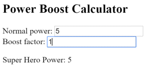

# [返回主目录](Readme.md)<!-- omit in toc --> 

# 目录 <!-- omit in toc --> 


# 管道
每个应用开始的时候差不多都是一些简单任务：获取数据、转换它们，然后把它们显示给用户。 获取数据可能简单到创建一个局部变量就行，也可能复杂到从 WebSocket 中获取数据流。

一旦取到数据，你就可以把它们原始值的 toString 结果直接推入视图中。 但这种做法很少能具备良好的用户体验。 比如，几乎每个人都更喜欢简单的日期格式，例如1988-04-15，而不是服务端传过来的原始字符串格式 —— Fri Apr 15 1988 00:00:00 GMT-0700 (Pacific Daylight Time)。

显然，有些值最好显示成用户友好的格式。你很快就会发现，在很多不同的应用中，都在重复做出某些相同的变换。 你几乎会把它们看做某种 CSS 样式，事实上，你也确实更喜欢在 HTML 模板中应用它们 —— 就像 CSS 样式一样。

**通过引入 Angular 管道（一种编写"从显示到值"转换逻辑的途径），你可以把它声明在 HTML 中。**

# 使用管道

**管道把数据作为输入，然后转换它，给出期望的输出**。 比如，你要把组件的 birthday 属性转换成对人类更友好的日期格式。

```ts
//hero-birthday1.component.ts
import { Component } from '@angular/core';

@Component({
  selector: 'app-hero-birthday',
  template: `<p>The hero's birthday is {{ birthday | date }}</p>`
})
export class HeroBirthdayComponent {
  birthday = new Date(1988, 3, 15); // April 15, 1988
}
```
重点看下组件的模板。

```html
<p>The hero's birthday is {{ birthday | date }}</p>
```
在这个插值表达式中，你**让组件的 birthday 值通过管道操作符( | )流动到 右侧的Date 管道函数中。所有管道都会用这种方式工作**。

# 内置的管道

Angular 内置了一些管道，比如

- **DatePipe**
- **UpperCasePipe**
- **LowerCasePipe**
- **CurrencyPipe**
- **PercentPipe**  

它们全都可以直接用在任何模板中。

# 对管道进行参数化

**管道可能接受任何数量的可选参数**来对它的输出进行微调。 可以**在管道名后面添加一个冒号( : )再跟一个参数值**，来为管道添加参数(**比如 currency:'EUR'**)。 如果这个**管道可以接受多个参数**，那么就**用冒号来分隔这些参数值(比如 slice:1:5)**。


修改生日模板，来为这个日期管道提供一个格式化参数。 当格式化完该英雄的 4 月 15 日生日之后，它应该被渲染成04/15/88。

```html
<p>The hero's birthday is {{ birthday | date:"MM/dd/yy" }} </p>
```

**参数值可以是任何有效的模板表达式**（参见模板语法中的模板表达式部分），比如字符串字面量或组件的属性。 换句话说，借助属性绑定，你也可以像用绑定来控制生日的值一样，控制生日的显示格式。


来写第二个组件，它把管道的格式参数绑定到该组件的 format 属性。这里是新组件的模板：

```ts
//hero-0birthday2.component.ts(template)
template: `
  <p>The hero's birthday is {{ birthday | date:format }}</p>
  <button (click)="toggleFormat()">Toggle Format</button>
`
```
你还能在模板中添加一个按钮，并把它的点击事件绑定到组件的 toggleFormat() 方法。 此方法会在短日期格式('shortDate')和长日期格式('fullDate')之间切换组件的 format 属性。
```ts
//hero-birthday2.component.ts(class)
export class HeroBirthday2Component {
  birthday = new Date(1988, 3, 15); // April 15, 1988
  toggle = true; // start with true == shortDate

  get format()   { return this.toggle ? 'shortDate' : 'fullDate'; }
  toggleFormat() { this.toggle = !this.toggle; }
}
```
当你点击此按钮的时候，所显示的日期会在“04/15/1988”和“Friday, April 15, 1988”之间切换。


# 链式管道
你**可以把管道串联在一起，以组合出一些潜在的有用功能**。 下面这个例子中，要把 birthday 串联到 DatePipe 管道，然后又串联到 UpperCasePipe，这样就可以把生日显示成大写形式了。 生日被显示成了APR 15, 1988：

```html
The chained hero's birthday is
{{ birthday | date | uppercase}}
```
下面这个显示FRIDAY, APRIL 15, 1988的例子用同样的方式链接了这两个管道，而且同时还给 date 管道传进去一个参数。

```html
The chained hero's birthday is
{{  birthday | date:'fullDate' | uppercase}}
```

# 自定义管道
你还可以写自己的自定义管道。 下面就是一个名叫 ExponentialStrengthPipe 的管道，它可以放大英雄的能力：
```ts
//exponential-strength.pipe.ts
import { Pipe, PipeTransform } from '@angular/core';
/*
 * Raise the value exponentially
 * Takes an exponent argument that defaults to 1.
 * Usage:
 *   value | exponentialStrength:exponent
 * Example:
 *   {{ 2 | exponentialStrength:10 }}
 *   formats to: 1024
*/
@Pipe({name: 'exponentialStrength'})
export class ExponentialStrengthPipe implements PipeTransform {
  transform(value: number, exponent?: number): number {
    return Math.pow(value, isNaN(exponent) ? 1 : exponent);
  }
}
```

在这个管道的定义中体现了几个关键点：
- **管道是一个带有“管道元数据(pipe metadata)”装饰器的类。**

- **这个管道类实现了 PipeTransform 接口的 transform 方法，该方法接受一个输入值和一些可选参数，并返回转换后的值。**

- **当每个输入值被传给 transform 方法时，还会带上另一个参数，比如你这个管道就有一个 exponent(放大指数) 参数。**

- **可以通过 @Pipe 装饰器来告诉 Angular：这是一个管道。该装饰器是从 Angular 的 core 库中引入的。**

- **这个 @Pipe 装饰器允许你定义管道的名字，这个名字会被用在模板表达式中。它必须是一个有效的 JavaScript 标识符。 比如，你这个管道的名字是 exponentialStrength。**

## PipeTransform接口
> transform 方法是管道的基本要素。 PipeTransform接口中定义了它，并用它指导各种工具和编译器。 理论上说，它是可选的。Angular 不会管它，而是直接查找并执行 transform 方法。

现在，你需要一个组件来演示这个管道。
```ts
//power-booster.component.ts
import { Component } from '@angular/core';

@Component({
  selector: 'app-power-booster',
  template: `
    <h2>Power Booster</h2>
    <p>Super power boost: {{2 | exponentialStrength: 10}}</p>
  `
})
export class PowerBoosterComponent { }
```


请注意以下几点：
- **你使用自定义管道的方式和内置管道完全相同。**

- **你必须把这个管道添加到 AppModule 的 declarations 数组中。**

- **如果选择将管道注入(inject)类中，则必须将管道包含字在NgModule的providers数组中。**

**别忘了在Declarations数组中注册自定义管道**

你必须手动注册自定义管道。如果忘了，Angular 就会报告一个错误。 在前一个例子中你没有把 DatePipe 列进去，这是因为 Angular 所有的内置管道都已经预注册过了。

# 内力倍增计算机管道
仅仅升级模板来测试这个自定义管道其实没多大意思。 干脆把这个例子升级为“能力提升计算器”，它可以把该管道和使用 ngModel 的双向数据绑定组合起来。
```ts
//power-boost-calculator.component.ts
import { Component } from '@angular/core';
 
@Component({
  selector: 'app-power-boost-calculator',
  template: `
    <h2>Power Boost Calculator</h2>
    <div>Normal power: <input [(ngModel)]="power"></div>
    <div>Boost factor: <input [(ngModel)]="factor"></div>
    <p>
      Super Hero Power: {{power | exponentialStrength: factor}}
    </p>
  `
})
export class PowerBoostCalculatorComponent {
  power = 5;
  factor = 1;
}
```


# 管道与变更检测
Angular 通过变更检测过程来查找绑定值的更改，并在每一次 JavaScript 事件之后运行：每次按键、鼠标移动、定时器以及服务器的响应。 这可能会让变更检测显得很昂贵，但是 Angular 会尽可能降低变更检测的成本。

当使用管道时，Angular 会选用一种更简单、更快速的变更检测算法。

## 无管道

在下一个例子中，组件使用默认的、激进(昂贵)的变更检测策略来检测和更新 heroes 数组中的每个英雄。下面是它的模板：
```html
<!--flying-heroes.component.html-->
New hero:
  <input type="text" #box
          (keyup.enter)="addHero(box.value); box.value=''"
          placeholder="hero name">
  <button (click)="reset()">Reset</button>
  <div *ngFor="let hero of heroes">
    {{hero.name}}
  </div>
```
和模板相伴的组件类可以提供英雄数组，能把新的英雄添加到数组中，还能重置英雄数组。
```ts
//flaying-heroes.component.ts
export class FlyingHeroesComponent {
  heroes: any[] = [];
  canFly = true;
  constructor() { this.reset(); }

  addHero(name: string) {
    name = name.trim();
    if (!name) { return; }
    let hero = {name, canFly: this.canFly};
    this.heroes.push(hero);
  }

  reset() { this.heroes = HEROES.slice(); }
}
```
你可以添加新的英雄，加完之后，Angular 就会更新显示。 reset 按钮会把 heroes 替换成一个由原来的英雄组成的新数组，重置完之后，Angular 就会更新显示。 如果你提供了删除或修改英雄的能力，Angular 也会检测到那些更改，并更新显示。

## 使用管道控制“会飞的英雄”
往 *ngFor 重复器中添加一个 FlyingHeroesPipe 管道，这个管道能过滤出所有会飞的英雄。
```html
<!--flying-heroes.component.html-->
<div *ngFor="let hero of (heroes | flyingHeroes)">
  {{hero.name}}
</div>
```
下面是 FlyingHeroesPipe 的实现，它遵循了以前讲过的那些写自定义管道的模式。
```ts
//flying-heroes.pipe.ts
import { Pipe, PipeTransform } from '@angular/core';

import { Flyer } from './heroes';

@Pipe({ name: 'flyingHeroes' })
export class FlyingHeroesPipe implements PipeTransform {
  transform(allHeroes: Flyer[]) {
    return allHeroes.filter(hero => hero.canFly);
  }
}
```
