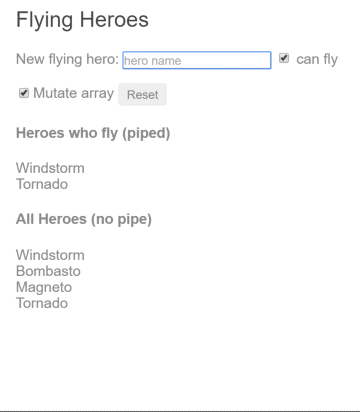
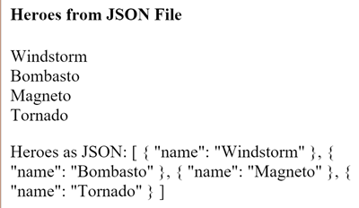

# [返回主目录](Readme.md)<!-- omit in toc --> 

# 目录 <!-- omit in toc --> 
- [管道](#%e7%ae%a1%e9%81%93)
- [使用管道](#%e4%bd%bf%e7%94%a8%e7%ae%a1%e9%81%93)
- [内置的管道](#%e5%86%85%e7%bd%ae%e7%9a%84%e7%ae%a1%e9%81%93)
- [对管道进行参数化](#%e5%af%b9%e7%ae%a1%e9%81%93%e8%bf%9b%e8%a1%8c%e5%8f%82%e6%95%b0%e5%8c%96)
- [链式管道](#%e9%93%be%e5%bc%8f%e7%ae%a1%e9%81%93)
- [自定义管道](#%e8%87%aa%e5%ae%9a%e4%b9%89%e7%ae%a1%e9%81%93)
  - [PipeTransform接口](#pipetransform%e6%8e%a5%e5%8f%a3)
- [内力倍增计算机管道](#%e5%86%85%e5%8a%9b%e5%80%8d%e5%a2%9e%e8%ae%a1%e7%ae%97%e6%9c%ba%e7%ae%a1%e9%81%93)
- [管道与变更检测](#%e7%ae%a1%e9%81%93%e4%b8%8e%e5%8f%98%e6%9b%b4%e6%a3%80%e6%b5%8b)
  - [无管道](#%e6%97%a0%e7%ae%a1%e9%81%93)
  - [使用管道控制“会飞的英雄”](#%e4%bd%bf%e7%94%a8%e7%ae%a1%e9%81%93%e6%8e%a7%e5%88%b6%e4%bc%9a%e9%a3%9e%e7%9a%84%e8%8b%b1%e9%9b%84)
- [纯(pure)管道与非纯(impure)管道](#%e7%ba%afpure%e7%ae%a1%e9%81%93%e4%b8%8e%e9%9d%9e%e7%ba%afimpure%e7%ae%a1%e9%81%93)
  - [纯管道](#%e7%ba%af%e7%ae%a1%e9%81%93)
  - [非纯管道](#%e9%9d%9e%e7%ba%af%e7%ae%a1%e9%81%93)
- [非纯管道 FlyingHeroesPipe](#%e9%9d%9e%e7%ba%af%e7%ae%a1%e9%81%93-flyingheroespipe)
- [非纯 AsyncPipe :star:](#%e9%9d%9e%e7%ba%af-asyncpipe-star)
- [一个非纯而且带缓存的管道](#%e4%b8%80%e4%b8%aa%e9%9d%9e%e7%ba%af%e8%80%8c%e4%b8%94%e5%b8%a6%e7%bc%93%e5%ad%98%e7%9a%84%e7%ae%a1%e9%81%93)
- [JsonPipe](#jsonpipe)
- [纯管道与纯函数](#%e7%ba%af%e7%ae%a1%e9%81%93%e4%b8%8e%e7%ba%af%e5%87%bd%e6%95%b0)
- [总结](#%e6%80%bb%e7%bb%93)
- [附录：没有 FilterPipe 或者 OrderByPipe](#%e9%99%84%e5%bd%95%e6%b2%a1%e6%9c%89-filterpipe-%e6%88%96%e8%80%85-orderbypipe)

# 管道
每个应用开始的时候差不多都是一些简单任务：获取数据、转换它们，然后把它们显示给用户。 获取数据可能简单到创建一个局部变量就行，也可能复杂到从 WebSocket 中获取数据流。

一旦取到数据，你就可以把它们原始值的 toString 结果直接推入视图中。 但这种做法很少能具备良好的用户体验。 比如，几乎每个人都更喜欢简单的日期格式，例如1988-04-15，而不是服务端传过来的原始字符串格式 —— Fri Apr 15 1988 00:00:00 GMT-0700 (Pacific Daylight Time)。

显然，有些值最好显示成用户友好的格式。你很快就会发现，在很多不同的应用中，都在重复做出某些相同的变换。 你几乎会把它们看做某种 CSS 样式，事实上，你也确实更喜欢在 HTML 模板中应用它们 —— 就像 CSS 样式一样。

**通过引入 Angular 管道（一种编写"从显示到值"转换逻辑的途径），你可以把它声明在 HTML 中。**

# 使用管道

**管道把数据作为输入，然后转换它，给出期望的输出**。 比如，你要把组件的 birthday 属性转换成对人类更友好的日期格式。

```ts
//hero-birthday1.component.ts
import { Component } from '@angular/core';

@Component({
  selector: 'app-hero-birthday',
  template: `<p>The hero's birthday is {{ birthday | date }}</p>`
})
export class HeroBirthdayComponent {
  birthday = new Date(1988, 3, 15); // April 15, 1988
}
```
重点看下组件的模板。

```html
<p>The hero's birthday is {{ birthday | date }}</p>
```
在这个插值表达式中，你**让组件的 birthday 值通过管道操作符( | )流动到 右侧的Date 管道函数中。所有管道都会用这种方式工作**。

# 内置的管道

Angular 内置了一些管道，比如

- **DatePipe**
- **UpperCasePipe**
- **LowerCasePipe**
- **CurrencyPipe**
- **PercentPipe**  

它们全都可以直接用在任何模板中。

# 对管道进行参数化

**管道可能接受任何数量的可选参数**来对它的输出进行微调。 可以**在管道名后面添加一个冒号( : )再跟一个参数值**，来为管道添加参数(**比如 currency:'EUR'**)。 如果这个**管道可以接受多个参数**，那么就**用冒号来分隔这些参数值(比如 slice:1:5)**。


修改生日模板，来为这个日期管道提供一个格式化参数。 当格式化完该英雄的 4 月 15 日生日之后，它应该被渲染成04/15/88。

```html
<p>The hero's birthday is {{ birthday | date:"MM/dd/yy" }} </p>
```

**参数值可以是任何有效的模板表达式**（参见模板语法中的模板表达式部分），比如字符串字面量或组件的属性。 换句话说，借助属性绑定，你也可以像用绑定来控制生日的值一样，控制生日的显示格式。


来写第二个组件，它把管道的格式参数绑定到该组件的 format 属性。这里是新组件的模板：

```ts
//hero-0birthday2.component.ts(template)
template: `
  <p>The hero's birthday is {{ birthday | date:format }}</p>
  <button (click)="toggleFormat()">Toggle Format</button>
`
```
你还能在模板中添加一个按钮，并把它的点击事件绑定到组件的 toggleFormat() 方法。 此方法会在短日期格式('shortDate')和长日期格式('fullDate')之间切换组件的 format 属性。
```ts
//hero-birthday2.component.ts(class)
export class HeroBirthday2Component {
  birthday = new Date(1988, 3, 15); // April 15, 1988
  toggle = true; // start with true == shortDate

  get format()   { return this.toggle ? 'shortDate' : 'fullDate'; }
  toggleFormat() { this.toggle = !this.toggle; }
}
```
当你点击此按钮的时候，所显示的日期会在“04/15/1988”和“Friday, April 15, 1988”之间切换。


# 链式管道
你**可以把管道串联在一起，以组合出一些潜在的有用功能**。 下面这个例子中，要把 birthday 串联到 DatePipe 管道，然后又串联到 UpperCasePipe，这样就可以把生日显示成大写形式了。 生日被显示成了APR 15, 1988：

```html
The chained hero's birthday is
{{ birthday | date | uppercase}}
```
下面这个显示FRIDAY, APRIL 15, 1988的例子用同样的方式链接了这两个管道，而且同时还给 date 管道传进去一个参数。

```html
The chained hero's birthday is
{{  birthday | date:'fullDate' | uppercase}}
```

# 自定义管道
你还可以写自己的自定义管道。 下面就是一个名叫 ExponentialStrengthPipe 的管道，它可以放大英雄的能力：
```ts
//exponential-strength.pipe.ts
import { Pipe, PipeTransform } from '@angular/core';
/*
 * Raise the value exponentially
 * Takes an exponent argument that defaults to 1.
 * Usage:
 *   value | exponentialStrength:exponent
 * Example:
 *   {{ 2 | exponentialStrength:10 }}
 *   formats to: 1024
*/
@Pipe({name: 'exponentialStrength'})
export class ExponentialStrengthPipe implements PipeTransform {
  transform(value: number, exponent?: number): number {
    return Math.pow(value, isNaN(exponent) ? 1 : exponent);
  }
}
```

在这个管道的定义中体现了几个关键点：
- **管道是一个带有“管道元数据(pipe metadata)”装饰器的类。**

- **这个管道类实现了 PipeTransform 接口的 transform 方法，该方法接受一个输入值和一些可选参数，并返回转换后的值。**

- **当每个输入值被传给 transform 方法时，还会带上另一个参数，比如你这个管道就有一个 exponent(放大指数) 参数。**

- **可以通过 @Pipe 装饰器来告诉 Angular：这是一个管道。该装饰器是从 Angular 的 core 库中引入的。**

- **这个 @Pipe 装饰器允许你定义管道的名字，这个名字会被用在模板表达式中。它必须是一个有效的 JavaScript 标识符。 比如，你这个管道的名字是 exponentialStrength。**

## PipeTransform接口
> transform 方法是管道的基本要素。 PipeTransform接口中定义了它，并用它指导各种工具和编译器。 理论上说，它是可选的。Angular 不会管它，而是直接查找并执行 transform 方法。

现在，你需要一个组件来演示这个管道。
```ts
//power-booster.component.ts
import { Component } from '@angular/core';

@Component({
  selector: 'app-power-booster',
  template: `
    <h2>Power Booster</h2>
    <p>Super power boost: {{2 | exponentialStrength: 10}}</p>
  `
})
export class PowerBoosterComponent { }
```


请注意以下几点：
- **你使用自定义管道的方式和内置管道完全相同。**

- **你必须把这个管道添加到 AppModule 的 declarations 数组中。**

- **如果选择将管道注入(inject)类中，则必须将管道包含字在NgModule的providers数组中。**

**别忘了在Declarations数组中注册自定义管道**

你必须手动注册自定义管道。如果忘了，Angular 就会报告一个错误。 在前一个例子中你没有把 DatePipe 列进去，这是因为 Angular 所有的内置管道都已经预注册过了。

# 内力倍增计算机管道
仅仅升级模板来测试这个自定义管道其实没多大意思。 干脆把这个例子升级为“能力提升计算器”，它可以把该管道和使用 ngModel 的双向数据绑定组合起来。
```ts
//power-boost-calculator.component.ts
import { Component } from '@angular/core';
 
@Component({
  selector: 'app-power-boost-calculator',
  template: `
    <h2>Power Boost Calculator</h2>
    <div>Normal power: <input [(ngModel)]="power"></div>
    <div>Boost factor: <input [(ngModel)]="factor"></div>
    <p>
      Super Hero Power: {{power | exponentialStrength: factor}}
    </p>
  `
})
export class PowerBoostCalculatorComponent {
  power = 5;
  factor = 1;
}
```


# 管道与变更检测
Angular 通过变更检测过程来查找绑定值的更改，并在每一次 JavaScript 事件之后运行：每次按键、鼠标移动、定时器以及服务器的响应。 这可能会让变更检测显得很昂贵，但是 Angular 会尽可能降低变更检测的成本。

当使用管道时，Angular 会选用一种更简单、更快速的变更检测算法。

## 无管道

在下一个例子中，组件使用默认的、激进(昂贵)的变更检测策略来检测和更新 heroes 数组中的每个英雄。下面是它的模板：
```html
<!--flying-heroes.component.html-->
New hero:
  <input type="text" #box
          (keyup.enter)="addHero(box.value); box.value=''"
          placeholder="hero name">
  <button (click)="reset()">Reset</button>
  <div *ngFor="let hero of heroes">
    {{hero.name}}
  </div>
```
和模板相伴的组件类可以提供英雄数组，能把新的英雄添加到数组中，还能重置英雄数组。
```ts
//flaying-heroes.component.ts
export class FlyingHeroesComponent {
  heroes: any[] = [];
  canFly = true;
  constructor() { this.reset(); }

  addHero(name: string) {
    name = name.trim();
    if (!name) { return; }
    let hero = {name, canFly: this.canFly};
    this.heroes.push(hero);
  }

  reset() { this.heroes = HEROES.slice(); }
}
```
你可以添加新的英雄，加完之后，Angular 就会更新显示。 reset 按钮会把 heroes 替换成一个由原来的英雄组成的新数组，重置完之后，Angular 就会更新显示。 如果你提供了删除或修改英雄的能力，Angular 也会检测到那些更改，并更新显示。

## 使用管道控制“会飞的英雄”
往 *ngFor 重复器中添加一个 FlyingHeroesPipe 管道，这个管道能过滤出所有会飞的英雄。
```html
<!--flying-heroes.component.html-->
<div *ngFor="let hero of (heroes | flyingHeroes)">
  {{hero.name}}
</div>
```
下面是 FlyingHeroesPipe 的实现，它遵循了以前讲过的那些写自定义管道的模式。
```ts
//flying-heroes.pipe.ts
import { Pipe, PipeTransform } from '@angular/core';

import { Flyer } from './heroes';

@Pipe({ name: 'flyingHeroes' })
export class FlyingHeroesPipe implements PipeTransform {
  transform(allHeroes: Flyer[]) {
    return allHeroes.filter(hero => hero.canFly);
  }
}
```
你看到一种奇怪的行为。添加的每个英雄都是会飞行的英雄，但是没有一个被显示出来。

虽然你没有得到期望的行为，但 Angular 也没有出错。 这里只是用了另一种变更检测算法 —— 它会忽略对列表及其子项所做的任何更改。

注意这里是如何添加新英雄的：
```ts
//flying-heroes.component.ts
this.heroes.push(hero);
```
**当你往 heroes 数组中添加一个新的英雄时，这个数组的引用并没有改变。它还是那个数组。而引用却是 Angular 所关心的一切。 在它看来，这是同一个数组，没有变化，也就不需要更新显示。**

要修复它，就要创建一个新数组，把这个英雄追加进去，并把它赋给 heroes。 这次，Angular 检测到数组的引用变化了。它执行了这个管道，并使用这个新数组更新显示，这次它就包括新的飞行英雄了。

如果你修改了这个数组，没有管道被执行，也没有显示被更新。 如果你替换了这个数组，管道就会被执行，显示也更新了。 这个飞行英雄的例子用检查框和其它显示内容扩展了原有代码，来帮你体验这些效果。



**直接替换这个数组是通知 Angular 更新显示的一种高效方式。 你该什么时候替换这个数组呢？当数据变化的时候。 在这个玩具级例子中，这是一个简单的规则，因为这里修改数据的唯一途径就是添加新英雄。**

**更多情况下，你不知道什么时候数据变化了，尤其是在那些有很多种途径改动数据的程序中 —— 可能在程序中很远的地方。 组件就是一个通常无法知道那些改动的例子。此外，它会导致削足适履(脚大鞋小，为了穿上鞋而把脚削去一点儿。比喻无原则地迁就现成条件或不顾客观条件生搬硬套。) —— 扭曲组件的设计来适应管道。 要尽可能保持组件类独立于 HTML。组件不应该关心管道的存在。**

**为了过滤出会飞的英雄，考虑使用非纯(impure)管道。**

# 纯(pure)管道与非纯(impure)管道
有两类管道：**纯的与非纯的**。 默认情况下，管道都是纯的。以前见到的每个管道都是纯的。 **通过把它的 pure 标志设置为 false，你可以制作一个非纯管道**。你可以像这样让 FlyingHeroesPipe 变成非纯的：

```ts
//flying-heroes.pipe.ts
@Pipe({
  name: 'flyingHeroesImpure',
  pure: false
})
```
先理解一下纯和非纯之间的区别，从纯管道开始。

## 纯管道
**Angular 只有在它检测到输入值发生了纯变更时才会执行纯管道。 纯变更是指对原始类型值(String、Number、Boolean、Symbol)的更改， 或者对对象引用(Date、Array、Function、Object)的更改。**

**Angular 会忽略(复合)对象内部的更改。 如果你更改了输入日期(Date)中的月份、往一个输入数组(Array)中添加新值或者更新了一个输入对象(Object)的属性，它都不会调用纯管道。**

**这可能看起来是一种限制，但它保证了速度。 对象引用的检查是非常快的(比递归的深检查要快得多)，所以 Angular 可以快速的决定是否应该跳过管道执行和视图更新。**

**因此，如果要和变更检测策略打交道，就会更喜欢用纯管道。 如果不能，你就可以转回到非纯管道。**

> 或者你也可以完全不用管道。 有时候，使用组件的属性能比用管道更好的达到目的，后面会再讨论这一点。

## 非纯管道
**Angular 会在每个组件的变更检测周期中执行非纯管道。 非纯管道可能会被调用很多次，和每个按键或每次鼠标移动一样频繁。**

**要在脑子里绷着这根弦，必须小心翼翼的实现非纯管道。 一个昂贵、迟钝的管道将摧毁用户体验。**

# 非纯管道 FlyingHeroesPipe
把 FlyingHeroesPipe 换成了 FlyingHeroesImpurePipe。 下面是完整的实现：
```ts
//FlyingHeroesImpurePipe。
@Pipe({
  name: 'flyingHeroesImpure',
  pure: false
})
export class FlyingHeroesImpurePipe extends FlyingHeroesPipe {}
```
```ts
//FlyingHeroesPipe
import { Pipe, PipeTransform } from '@angular/core';

import { Flyer } from './heroes';

@Pipe({ name: 'flyingHeroes' })
export class FlyingHeroesPipe implements PipeTransform {
  transform(allHeroes: Flyer[]) {
    return allHeroes.filter(hero => hero.canFly);
  }
}
```
你把它从 FlyingHeroesPipe 中继承下来，以证明无需改动内部代码。 唯一的区别是管道元数据中的 pure 标志。

这是一个很好地非纯管道候选者，因为它的 transform 函数又小又快。
```ts
//flying-heroes.pipe.ts (filter)
return allHeroes.filter(hero => hero.canFly);
```
你可以从 FlyingHeroesComponent 派生出一个 FlyingHeroesImpureComponent。
```html
<!--flying-heroes-impure.component.html (excerpt)-->
<div *ngFor="let hero of (heroes | flyingHeroesImpure)">
  {{hero.name}}
</div>
```
唯一的重大改动就是管道。当你添加新的英雄甚至修改 heroes 数组时，这个会飞的英雄的显示也跟着更新了。

# 非纯 AsyncPipe :star:
Angular 的 AsyncPipe 是一个有趣的非纯管道的例子。 AsyncPipe 接受一个 Promise 或 Observable 作为输入，并且自动订阅这个输入，最终返回它们给出的值。

AsyncPipe 管道是有状态的。 该管道维护着一个所输入的 Observable 的订阅，并且持续从那个 Observable 中发出新到的值。

下面例子使用该 async 管道把一个消息字符串(message$)的 Observable 绑定到视图中。

```ts
//hero-async-message.component.ts
import { Component } from '@angular/core';
 
import { Observable, interval } from 'rxjs';
import { map, take } from 'rxjs/operators';
 
@Component({
  selector: 'app-hero-message',
  template: `
    <h2>Async Hero Message and AsyncPipe</h2>
    <p>Message: {{ message$ | async }}</p>
    <button (click)="resend()">Resend</button>`,
})
export class HeroAsyncMessageComponent {
  message$: Observable<string>;
 
  private messages = [
    'You are my hero!',
    'You are the best hero!',
    'Will you be my hero?'
  ];
 
  constructor() { this.resend(); }
 
  resend() {
    this.message$ = interval(500).pipe(
      map(i => this.messages[i]),
      take(this.messages.length)
    );
  }
}
```

这个 Async 管道节省了组件的样板代码。 组件不用订阅这个异步数据源，而且不用在被销毁时取消订阅(如果订阅了而忘了反订阅容易导致隐晦的内存泄露)。

# 一个非纯而且带缓存的管道
来写更多的非纯管道：一个向服务器发起 HTTP 请求的管道。

时刻记住，非纯管道可能每隔几微秒就会被调用一次。 如果你不小心点，这个管道就会发起一大堆请求“攻击”服务器。

下面这个管道只有当所请求的 URL 发生变化时才会向服务器发起请求。它会缓存服务器的响应。 代码如下，它使用Angular http客户端来接收数据

```ts
//fetch-json.pipe.ts
import { HttpClient }          from '@angular/common/http';
import { Pipe, PipeTransform } from '@angular/core';
 
@Pipe({
  name: 'fetch',
  pure: false
})
export class FetchJsonPipe implements PipeTransform {
  private cachedData: any = null;
  private cachedUrl = '';
 
  constructor(private http: HttpClient) { }
 
  transform(url: string): any {
    if (url !== this.cachedUrl) {
      this.cachedData = null;
      this.cachedUrl = url;
      this.http.get(url).subscribe(result => this.cachedData = result);
    }
 
    return this.cachedData;
  }
}
```

接下来在一个测试挽具组件中演示一下它，该组件的模板中定义了两个使用到此管道的绑定，它们都从 heroes.json 文件中取得英雄数据。

```ts
//hero-list.component.ts
import { Component } from '@angular/core';
 
@Component({
  selector: 'app-hero-list',
  template: `
    <h2>Heroes from JSON File</h2>
 
    <div *ngFor="let hero of ('assets/heroes.json' | fetch) ">
      {{hero.name}}
    </div>
 
    <p>Heroes as JSON:
      {{'assets/heroes.json' | fetch | json}}
    </p>`
})
export class HeroListComponent { }
```
组件渲染起来是这样的：



这个管道上的断点请求数据的过程显示：

- 每个绑定都有它自己的管道实例。

- 每个管道实例都缓存了它自己的 URL 和数据。

- 每个管道实例都只调用一次服务器。

# JsonPipe
第二个绑定除了用到 FetchPipe 之外还链接了更多管道。 它通过串联上内置管道 JsonPipe 来把英雄数据显示成了 JSON 格式。

**JsonPipe为你诊断数据绑定的某些神秘错误或为做进一步绑定而探查数据时，提供了一个简单途径。**

# 纯管道与纯函数

**纯管道使用纯函数。 纯函数是指在处理输入并返回结果时，不会产生任何副作用的函数。 给定相同的输入，它们总是返回相同的输出。**

在本章前面讨论的管道都是用纯函数实现的。 内置的 DatePipe 就是一个用纯函数实现的纯管道。 ExponentialStrengthPipe 是如此， FlyingHeroesComponent 也是如此。 不久前你刚看过的 **FlyingHeroesImpurePipe 就是一个用纯函数实现的非纯管道。**

但是**一个纯管道必须总是用纯函数实现**。忽略这个警告将导致失败并带来一大堆这样的控制台错误：
```error
regarding expressions that changed after they were checked.  
表达式在被检查后被变更。
```

# 总结
**管道是很好的封装和共享的通用“值-显示”转换逻辑。可以像样式一样使用它们，把它们扔到模板表达式中，以提升视图的表现力和可用性。**

学着写写自定义管道，并贡献给开发社区。

# 附录：没有 FilterPipe 或者 OrderByPipe

Angular 没有随身发布过滤或列表排序的管道。 熟悉 AngularJS 的开发人员应该知道 filter 和 orderBy 过滤器，但在 Angular 中它们没有等价物。

这并不是疏忽。Angular 不想提供这些管道，因为 (a) 它们性能堪忧，以及 (b) 它们会阻止比较激进的代码最小化(minification)。 无论是 filter 还是 orderBy 都需要它的参数引用对象型属性。 你在前面学过，这样的管道必然是非纯管道，并且 Angular 会在几乎每一次变更检测周期中调用非纯管道。

过滤、 特别是排序是昂贵的操作。 当 Angular 每秒调用很多次这类管道函数时，即使是中等规模的列表都可能严重降低用户体验。 在 AngularJS 程序中，filter 和 orderBy 经常被误用，结果连累到 Angular 自身，人们抱怨说它太慢。 从某种意义上，这也不冤：谁叫 AngularJS 把 filter 和 orderBy 作为首发队员呢？是它自己准备了这个性能陷阱。

虽然不是很明显，但代码最小化方面也存在风险。想象一个用于英雄列表的排序管道。该列表可能根据英雄原始属性中的 name 和 planet 进行排序，就像这样：
```html
<!-- NOT REAL CODE! -->
<div *ngFor="let hero of heroes | orderBy:'name,planet'"></div>
```
你使用文本字符串来标记出排序字段，期望管道通过索引形式(如 `hero['name']`)引用属性的值。 不幸的是，激进的代码最小化策略会改变Hero 类的属性名，所以 `Hero.name` 和 `Hero.planet` 可能会被变成 `Hero.a` 和 `Hero.b`。 显然，`hero['name']` 是无法正常工作的。

然而有些人可能不想做那么激进的最小化， Angular 作为一个产品不应该拒绝那些想做激进的最小化的人。 所以，Angular 开发组决定随 Angular 一起发布的每样东西，都应该能被安全的最小化。

Angular 开发组和一些有经验的 Angular 开发者强烈建议你：把你的过滤和排序逻辑挪进组件本身。 组件可以对外暴露一个 filteredHeroes 或 sortedHeroes 属性，这样它就获得控制权，以决定要用什么频度去执行其它辅助逻辑。 你原本准备实现为管道，并在整个应用中共享的那些功能，都能被改写为一个过滤/排序的服务，并注入到组件中。

如果你不需要顾虑这些性能和最小化问题，也可以创建自己的管道来实现这些功能(参考FlyingHeroesPipe中的写法)或到社区中去找找。