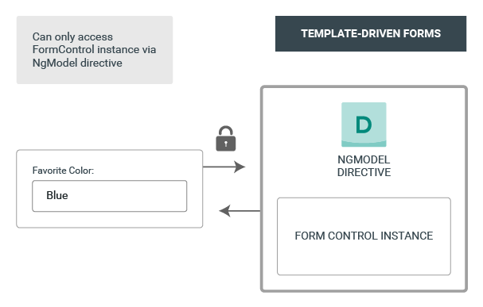

# [返回主目录](Readme.md)<!-- omit in toc --> 

# 目录 <!-- omit in toc --> 

# Angular表单简介
用表单处理用户输入是许多常见应用的基础功能。 应用通过表单来让用户登录、修改个人档案、输入敏感信息以及执行各种数据输入任务。

Angular 提供了两种不同的方法来通过表单处理用户输入：**响应式表单**和**模板驱动表单**。 **两者都从视图中捕获用户输入事件、验证用户输入、创建表单模型、修改数据模型，并提供跟踪这些更改的途径。**

不过，**响应式表单和模板驱动表单**在如何处理和管理表单和表单数据方面有所不同。**各有优势**。

一般来说：
- **响应式表单更健壮：它们的可扩展性、可复用性和可测试性更强**。 如果表单是应用中的关键部分，或者你已经准备使用响应式编程模式来构建应用，请使用响应式表单。

- **模板驱动表单在往应用中添加简单的表单时非常有用**，比如邮件列表的登记表单。它们很容易添加到应用中，但是不像响应式表单那么容易扩展。如果你有非常基本的表单需求和简单到能用模板管理的逻辑，请使用模板驱动表单。

# 关键差异
下表总结了响应式表单和模板驱动表单之间的一些关键差异。

| 相关方面       | 响应式表单           | 模板驱动表单     |
| -------------- | -------------------- | ---------------- |
| 建立(表单模式) | 显示，在组件类中创建 | 隐式，由组件创建 |
| 数据模式       | 结构化               | 非结构化         |
| 可预测性       | 同步                 | 异步             |
| 表单验证       | 函数                 | 指令             |
| 可变性         | 不可变               | 可变             |
| 可伸缩性       | 访问底层API          | 在API之上的抽象  |

# 共同基础
响应式表单和模板驱动表单共享了一些底层构造块。
- **FormControl** 实例用于追踪单个表单控件的值和验证状态。

- **FormGroup** 用于追踪一个表单控件组的值和状态。

- **FormArray** 用于追踪表单控件数组的值和状态。

- **ControlValueAccessor** 用于在 Angular 的 FormControl 实例和原生 DOM 元素之间创建一个桥梁。

# 建立表单模型
**响应式表单和模板驱动表单都是用表单模型来跟踪 Angular 表单和表单输入元素之间值的变化**。下面的例子展示了如何定义和创建表单模型。

## 在响应式表单中建立
下面是一个带有输入字段的组件，它使用响应式表单实现了单个控件。
```ts
import { Component } from '@angular/core';
import { FormControl } from '@angular/forms';
 
@Component({
  selector: 'app-reactive-favorite-color',
  template: `
    Favorite Color: <input type="text" [formControl]="favoriteColorControl">
  `
})
export class FavoriteColorComponent {
  favoriteColorControl = new FormControl('');
}
```

权威数据源负责提供在指定时间点上表单元素的值和状态。在响应式表单中，表单模式充当权威数据源。上例中的表单模型就是 FormControl 的实例。


在响应式表单中，表单模型是显式定义在组件类中的。接着，响应式表单指令（这里是 FormControlDirective）会把这个现有的表单控件实例通过数据访问器（ControlValueAccessor 的实例）来指派给视图中的表单元素。

## 在模板驱动表单中建立

下面是同一个带有输入字段的组件，它使用模板驱动表单实现了单个控件。

```ts
import { Component } from '@angular/core';

@Component({
  selector: 'app-template-favorite-color',
  template: `
    Favorite Color: <input type="text" [(ngModel)]="favoriteColor">
  `
})
export class FavoriteColorComponent {
  favoriteColor = '';
}
```
在模板驱动表单中，权威数据源是模板。



表单模型的抽象促进了结构的简化。模板驱动表单的 NgModel 指令负责创建和管理指定表单元素上的表单控件实例。它不那么明显，但你不必再直接操纵表单模型了。

# 表单中的数据流

