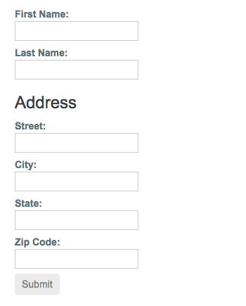

# [返回主目录](Readme.md)<!-- omit in toc --> 

# 目录 <!-- omit in toc --> 
- [响应式表单](#%e5%93%8d%e5%ba%94%e5%bc%8f%e8%a1%a8%e5%8d%95)
- [响应式表单简介](#%e5%93%8d%e5%ba%94%e5%bc%8f%e8%a1%a8%e5%8d%95%e7%ae%80%e4%bb%8b)
- [快速起步](#%e5%bf%ab%e9%80%9f%e8%b5%b7%e6%ad%a5)
  - [步骤 1 - 注册 ReactiveFormsModule](#%e6%ad%a5%e9%aa%a4-1---%e6%b3%a8%e5%86%8c-reactiveformsmodule)
  - [步骤 2 - 生成并导入一个新的表单控件](#%e6%ad%a5%e9%aa%a4-2---%e7%94%9f%e6%88%90%e5%b9%b6%e5%af%bc%e5%85%a5%e4%b8%80%e4%b8%aa%e6%96%b0%e7%9a%84%e8%a1%a8%e5%8d%95%e6%8e%a7%e4%bb%b6)
  - [步骤 3 - 在模板中注册该控件](#%e6%ad%a5%e9%aa%a4-3---%e5%9c%a8%e6%a8%a1%e6%9d%bf%e4%b8%ad%e6%b3%a8%e5%86%8c%e8%af%a5%e6%8e%a7%e4%bb%b6)
- [管理控件的值](#%e7%ae%a1%e7%90%86%e6%8e%a7%e4%bb%b6%e7%9a%84%e5%80%bc)
  - [显示表单控件的值](#%e6%98%be%e7%a4%ba%e8%a1%a8%e5%8d%95%e6%8e%a7%e4%bb%b6%e7%9a%84%e5%80%bc)
  - [替换表单控件的值](#%e6%9b%bf%e6%8d%a2%e8%a1%a8%e5%8d%95%e6%8e%a7%e4%bb%b6%e7%9a%84%e5%80%bc)
- [把表单控件分组](#%e6%8a%8a%e8%a1%a8%e5%8d%95%e6%8e%a7%e4%bb%b6%e5%88%86%e7%bb%84)
  - [步骤 1 - 创建 FormGroup 实例](#%e6%ad%a5%e9%aa%a4-1---%e5%88%9b%e5%bb%ba-formgroup-%e5%ae%9e%e4%be%8b)
  - [步骤 2 - 关联 FormGroup 的模型和视图](#%e6%ad%a5%e9%aa%a4-2---%e5%85%b3%e8%81%94-formgroup-%e7%9a%84%e6%a8%a1%e5%9e%8b%e5%92%8c%e8%a7%86%e5%9b%be)
  - [保存表单数据](#%e4%bf%9d%e5%ad%98%e8%a1%a8%e5%8d%95%e6%95%b0%e6%8d%ae)
  - [显示组件](#%e6%98%be%e7%a4%ba%e7%bb%84%e4%bb%b6)
- [嵌套的表单组](#%e5%b5%8c%e5%a5%97%e7%9a%84%e8%a1%a8%e5%8d%95%e7%bb%84)
  - [步骤 1 - 创建嵌套的分组](#%e6%ad%a5%e9%aa%a4-1---%e5%88%9b%e5%bb%ba%e5%b5%8c%e5%a5%97%e7%9a%84%e5%88%86%e7%bb%84)
  - [步骤 2 - 在模板中分组内嵌的表单](#%e6%ad%a5%e9%aa%a4-2---%e5%9c%a8%e6%a8%a1%e6%9d%bf%e4%b8%ad%e5%88%86%e7%bb%84%e5%86%85%e5%b5%8c%e7%9a%84%e8%a1%a8%e5%8d%95)
- [部分模型更新](#%e9%83%a8%e5%88%86%e6%a8%a1%e5%9e%8b%e6%9b%b4%e6%96%b0)
  - [修补（Patching）模型值](#%e4%bf%ae%e8%a1%a5patching%e6%a8%a1%e5%9e%8b%e5%80%bc)
- [使用 FormBuilder 来生成表单控件](#%e4%bd%bf%e7%94%a8-formbuilder-%e6%9d%a5%e7%94%9f%e6%88%90%e8%a1%a8%e5%8d%95%e6%8e%a7%e4%bb%b6)
  - [步骤 1 - 导入 FormBuilder 类](#%e6%ad%a5%e9%aa%a4-1---%e5%af%bc%e5%85%a5-formbuilder-%e7%b1%bb)
  - [步骤 2 - 注入 FormBuilder 服务](#%e6%ad%a5%e9%aa%a4-2---%e6%b3%a8%e5%85%a5-formbuilder-%e6%9c%8d%e5%8a%a1)
  - [步骤 3 - 生成表单控件](#%e6%ad%a5%e9%aa%a4-3---%e7%94%9f%e6%88%90%e8%a1%a8%e5%8d%95%e6%8e%a7%e4%bb%b6)
- [简单表单验证](#%e7%ae%80%e5%8d%95%e8%a1%a8%e5%8d%95%e9%aa%8c%e8%af%81)
  - [步骤 1 - 导入验证器函数](#%e6%ad%a5%e9%aa%a4-1---%e5%af%bc%e5%85%a5%e9%aa%8c%e8%af%81%e5%99%a8%e5%87%bd%e6%95%b0)
  - [步骤 2 - 把字段设为必填（required）](#%e6%ad%a5%e9%aa%a4-2---%e6%8a%8a%e5%ad%97%e6%ae%b5%e8%ae%be%e4%b8%ba%e5%bf%85%e5%a1%abrequired)
  - [显示表单状态](#%e6%98%be%e7%a4%ba%e8%a1%a8%e5%8d%95%e7%8a%b6%e6%80%81)
- [使用表单数组管理动态控件](#%e4%bd%bf%e7%94%a8%e8%a1%a8%e5%8d%95%e6%95%b0%e7%bb%84%e7%ae%a1%e7%90%86%e5%8a%a8%e6%80%81%e6%8e%a7%e4%bb%b6)
  - [步骤 1 - 导入 FormArray](#%e6%ad%a5%e9%aa%a4-1---%e5%af%bc%e5%85%a5-formarray)
  - [步骤 2 - 定义 FormArray](#%e6%ad%a5%e9%aa%a4-2---%e5%ae%9a%e4%b9%89-formarray)
  - [步骤 3 - 访问 FormArray 控件](#%e6%ad%a5%e9%aa%a4-3---%e8%ae%bf%e9%97%ae-formarray-%e6%8e%a7%e4%bb%b6)
  - [步骤 4 - 在模板中显示表单数组](#%e6%ad%a5%e9%aa%a4-4---%e5%9c%a8%e6%a8%a1%e6%9d%bf%e4%b8%ad%e6%98%be%e7%a4%ba%e8%a1%a8%e5%8d%95%e6%95%b0%e7%bb%84)
  - [添加绰号](#%e6%b7%bb%e5%8a%a0%e7%bb%b0%e5%8f%b7)
- [附录](#%e9%99%84%e5%bd%95)
  - [响应式表单 API](#%e5%93%8d%e5%ba%94%e5%bc%8f%e8%a1%a8%e5%8d%95-api)
    - [类](#%e7%b1%bb)
    - [指令](#%e6%8c%87%e4%bb%a4)

# 响应式表单
**响应式表单提供了一种模型驱动的方式来处理表单输入，其中的值会随时间而变化**。本文会向你展示如何创建和更新单个表单控件，然后在一个分组中使用多个控件，验证表单的值，以及如何实现更高级的表单。

# 响应式表单简介

**响应式表单使用显式的、不可变的方式，管理表单在特定的时间点上的状态。对表单状态的每一次变更都会返回一个新的状态，这样可以在变化时维护模型的整体性。响应式表单是围绕 Observable 的流构建的，表单的输入和值都是通过这些输入值组成的流来提供的，它可以同步访问。**

**响应式表单还提供了一种更直观的测试路径，因为在请求时你可以确信这些数据是一致的、可预料的**。这个流的任何一个消费者都可以安全地操纵这些数据。

响应式表单与模板驱动的表单有着显著的不同点。响应式表单通过对数据模型的同步访问提供了更多的可预测性，使用 Observable 的操作符提供了不可变性，并且通过 Observable 流提供了变化追踪功能。 如果你更喜欢在模板中直接访问数据，那么模板驱动的表单会显得更明确，因为它们依赖嵌入到模板中的指令，并借助可变数据来异步跟踪变化。

# 快速起步

本节描述了如何添加单个表单控件。这里的例子允许用户在输入框中输入自己的名字，捕获输入的值，并把表单控件元素的当前值显示出来。

## 步骤 1 - 注册 ReactiveFormsModule

要使用响应式表单，就要从 @angular/forms 包中导入 ReactiveFormsModule 并把它添加到你的 NgModule 的 imports 数组中。

```ts
//app.module.ts (excerpt)
import { ReactiveFormsModule } from '@angular/forms';

@NgModule({
  imports: [
    // other imports ...
    ReactiveFormsModule
  ],
})
export class AppModule { }
```

## 步骤 2 - 生成并导入一个新的表单控件

当使用响应式表单时，FormControl 类是最基本的构造块。要注册单个的表单控件，请在组件中导入 FormControl 类，并创建一个 FormControl 的新实例，把它保存在类的某个属性中。

```ts
import { Component } from '@angular/core';
import { FormControl } from '@angular/forms';

@Component({
  selector: 'app-name-editor',
  templateUrl: './name-editor.component.html',
  styleUrls: ['./name-editor.component.css']
})
export class NameEditorComponent {
  name = new FormControl('');
}
```

可以用 FormControl 的构造函数设置初始值，这个例子中它是空字符串。通过在你的组件类中创建这些控件，你可以直接对表单控件的状态进行监听、修改和校验。

## 步骤 3 - 在模板中注册该控件

在组件类中创建了控件之后，你还要把它和模板中的一个表单控件关联起来。修改模板，为表单控件添加 formControl 绑定，**formControl 是由 ReactiveFormsModule 中的 FormControlDirective 提供的**。

```html
<label>
  Name:
  <input type="text" [formControl]="name">
</label>
```
把该表单控件注册给了模板中名为 name 的输入元素。这样，表单控件和 DOM 元素就可以互相通讯了：视图会反映模型的变化，模型也会反映视图中的变化。

# 管理控件的值
响应式表单让你可以访问表单控件此刻的状态和值。你可以通过组件类或组件模板来操纵其当前状态和值。

## 显示表单控件的值

你可以用两种方式显示它的值：

- **通过可观察对象 valueChanges，你可以在模板中使用 AsyncPipe 或在组件类中使用 subscribe() 方法来监听表单值的变化**。

- **使用 value 属性。它能让你获得当前值的一份快照**。

下面的例子展示了如何在模板中使用插值表达式显示当前值。

```html
<p>
  Value: {{ name.value }}
</p>
```
一旦你修改了表单控件所关联的元素，这里显示的值也跟着变化了。


## 替换表单控件的值

响应式表单还有一些方法可以用编程的方式修改控件的值，它让你可以灵活的修改控件的值而不需要借助用户交互。**FormControl 提供了一个 setValue() 方法，它会修改这个表单控件的值，并且验证与控件结构相对应的值的结构**。比如，当从后端 API 或服务接收到了表单数据时，可以通过 setValue() 方法来把原来的值替换为新的值。

```ts
updateName() {
  this.name.setValue('Nancy');
}
```
修改模板，添加一个按钮，用于模拟改名操作。在点 Update Name 按钮之前表单控件元素中输入的任何值都会回显为它的当前值。
```html
<p>
  <button (click)="updateName()">Update Name</button>
</p>
```
由于表单模型是该控件的权威数据源，因此当你单击该按钮时，组件中该输入框的值也变化了，覆盖掉它的当前值。


> **注意：在这个例子中，你只使用单个控件，但是当调用 FormGroup 或 FormArray 的 setValue() 方法时，传入的值就必须匹配控件组或控件数组的结构才行。**

# 把表单控件分组


就像 FormControl 的实例能让你控制单个输入框所对应的控件一样，FormGroup 的实例也能跟踪一组 FormControl 实例（比如一个表单）的表单状态。当创建 FormGroup 时，其中的每个控件都会根据其名字进行跟踪。下列例子展示了如何管理单个控件组中的多个 FormControl 实例。

生成一个 ProfileEditor 组件并从 @angular/forms 包中导入 FormGroup 和 FormControl 类。

```ts
import { FormGroup, FormControl } from '@angular/forms';
```
## 步骤 1 - 创建 FormGroup 实例

在组件类中创建一个名叫 profileForm 的属性，并设置为 FormGroup 的一个新实例。要初始化这个 FormGroup，请为构造函数提供一个由控件组成的对象，对象中的每个名字都要和表单控件的名字一一对应。

对此个人档案表单，要添加两个 FormControl 实例，名字分别为 firstName 和 lastName。

```ts
import { Component } from '@angular/core';
import { FormGroup, FormControl } from '@angular/forms';
 
@Component({
  selector: 'app-profile-editor',
  templateUrl: './profile-editor.component.html',
  styleUrls: ['./profile-editor.component.css']
})
export class ProfileEditorComponent {
  profileForm = new FormGroup({
    firstName: new FormControl(''),
    lastName: new FormControl(''),
  });
}
```

现在，这些独立的表单控件被收集到了一个控件组中。这个 FormGroup 用对象的形式提供了它的模型值，这个值来自组中每个控件的值。 FormGroup 实例拥有和 FormControl 实例相同的属性（比如 value、untouched）和方法（比如 setValue()）。

## 步骤 2 - 关联 FormGroup 的模型和视图

这个表单组还能跟踪其中每个控件的状态及其变化，所以如果其中的某个控件的状态或值变化了，父控件也会发出一次新的状态变更或值变更事件。该控件组的模型来自它的所有成员。在定义了这个模型之后，你必须更新模板，来把该模型反映到视图中。

```html
<form [formGroup]="profileForm">
  
  <label>
    First Name:
    <input type="text" formControlName="firstName">
  </label>

  <label>
    Last Name:
    <input type="text" formControlName="lastName">
  </label>

</form>
```

注意，就像 FormGroup 所包含的那控件一样，profileForm 这个 FormGroup 也通过 FormGroup 指令绑定到了 form 元素，在该模型和表单中的输入框之间创建了一个通讯层。 由 FormControlName 指令提供的 formControlName 属性把每个输入框和 FormGroup 中定义的表单控件绑定起来。这些表单控件会和相应的元素通讯，它们还把更改传递给 FormGroup，这个 FormGroup 是模型值的权威数据源。

## 保存表单数据

ProfileEditor 组件从用户那里获得输入，但在真实的场景中，你可能想要先捕获表单的值，等将来在组件外部进行处理。 FormGroup 指令会监听 form 元素发出的 submit 事件，并发出一个 ngSubmit 事件，让你可以绑定一个回调函数。

把 onSubmit() 回调方法添加为 form 标签上的 ngSubmit 事件监听器。

```html
<form [formGroup]="profileForm" (ngSubmit)="onSubmit()">
```
ProfileEditor 组件上的 onSubmit() 方法会捕获 profileForm 的当前值。要保持该表单的封装性，就要使用 EventEmitter 向组件外部提供该表单的值。下面的例子会使用 console.warn 把这个值记录到浏览器的控制台中。


```ts
onSubmit() {
  // TODO: Use EventEmitter with form value
  console.warn(this.profileForm.value);
}
```
form 标签所发出的 submit 事件是原生 DOM 事件，通过点击类型为 submit 的按钮可以触发本事件。这还让用户可以用回车键来提交填完的表单。

往表单的底部添加一个 button，用于触发表单提交。

```html
<button type="submit" [disabled]="!profileForm.valid">Submit</button>
```
> **注意：上面这个代码片段中的按钮还附加了一个 disabled 绑定，用于在 profileForm 无效时禁用该按钮。目前你还没有执行任何表单验证逻辑，因此该按钮始终是可用的。稍后的表单验证一节会讲解简单的表单验证。**

## 显示组件
 
ProfileEditor 让你能管理 FormGroup 中的 firstName 和 lastName 等 FormControl 实例。


# 嵌套的表单组

如果要构建复杂的表单，如果能在更小的分区中管理不同类别的信息就会更容易一些，而有些信息分组可能会自然的汇入另一个更大的组中。使用嵌套的 FormGroup 可以让你把大型表单组织成一些稍小的、易管理的分组。

## 步骤 1 - 创建嵌套的分组

“地址”就是可以把信息进行分组的绝佳范例。FormGroup 可以同时接纳 FormControl 和 FormGroup 作为子控件。这使得那些比较复杂的表单模型可以更易于维护、更有逻辑性。要想在 profileForm 中创建一个嵌套的分组，请添加一个内嵌的名叫 address 的元素指向这个 FormGroup 实例。

```ts
import { Component } from '@angular/core';
import { FormGroup, FormControl } from '@angular/forms';

@Component({
  selector: 'app-profile-editor',
  templateUrl: './profile-editor.component.html',
  styleUrls: ['./profile-editor.component.css']
})
export class ProfileEditorComponent {
  profileForm = new FormGroup({
    firstName: new FormControl(''),
    lastName: new FormControl(''),
    address: new FormGroup({
      street: new FormControl(''),
      city: new FormControl(''),
      state: new FormControl(''),
      zip: new FormControl('')
    })
  });
}
```

在这个例子中，address group 把现有的 firstName、lastName 控件和新的 street、city、state 和 zip 控件组合在一起。虽然 address 这个 FormGroup 是 profileForm 这个整体 FormGroup 的一个子控件，但是仍然适用同样的值和状态的变更规则。来自内嵌控件组的状态和值的变更将会冒泡到它的父控件组，以维护整体模型的一致性。

## 步骤 2 - 在模板中分组内嵌的表单

在修改了组件类中的模型之后，还要修改模板，来把这个 FormGroup 实例对接到它的输入元素。
把包含 street、city、state 和 zip 字段的 address 表单组添加到 ProfileEditor 模板中。

```html
<div formGroupName="address">
  <h3>Address</h3>

  <label>
    Street:
    <input type="text" formControlName="street">
  </label>

  <label>
    City:
    <input type="text" formControlName="city">
  </label>
  
  <label>
    State:
    <input type="text" formControlName="state">
  </label>

  <label>
    Zip Code:
    <input type="text" formControlName="zip">
  </label>
</div>
```
ProfileEditor 表单显示为一个组，但是将来这个模型会被进一步细分，以表示逻辑分组区域。



> **注意：这里使用了 value 属性和 JsonPipe 管道在组件模板中显示了这个 FormGroup 的值。**

# 部分模型更新

当修改包含多个 FormGroup 实例的值时，你可能只希望更新模型中的一部分，而不是完全替换掉。这一节会讲解该如何更新 AbstractControl 模型中的一部分。

## 修补（Patching）模型值

有两种更新模型值的方式：

- **使用 setValue() 方法来为单个控件设置新值。 setValue() 方法会严格遵循表单组的结构，并整体性替换控件的值。**

- **使用 patchValue() 方法可以用对象中所定义的任何属性为表单模型进行替换**。

**setValue() 方法的严格检查可以帮助你捕获复杂表单嵌套中的错误，而 patchValue() 在遇到那些错误时可能会默默的失败**。

使用 updateProfile 方法传入下列数据可以更新用户的名字与街道住址。

```ts
updateProfile() {
  this.profileForm.patchValue({
    firstName: 'Nancy',
    address: {
      street: '123 Drew Street'
    }
  });
}
```
通过往模板中添加一个按钮来模拟一次更新操作，以修改用户档案。
```html
<p>
  <button (click)="updateProfile()">Update Profile</button>
</p>
```

当点击按钮时，profileForm 模型中只有 firstName 和 street 被修改了。注意，street 是在 address 属性的对象中被修改的。这种结构是必须的，因为 patchValue() 方法要针对模型的结构进行更新。patchValue() 只会更新表单模型中所定义的那些属性。

# 使用 FormBuilder 来生成表单控件
当需要与多个表单打交道时，手动创建多个表单控件实例会非常繁琐。FormBuilder 服务提供了一些便捷方法来生成表单控件。FormBuilder 在幕后也使用同样的方式来创建和返回这些实例，只是用起来更简单。

## 步骤 1 - 导入 FormBuilder 类
从 @angular/forms 包中导入 FormBuilder 类。
```ts
import { FormBuilder } from '@angular/forms';
```

## 步骤 2 - 注入 FormBuilder 服务

FormBuilder 是一个可注入的服务提供商，它是由 ReactiveFormModule 提供的。只要把它添加到组件的构造函数中就可以注入这个依赖。
```ts
constructor(private fb: FormBuilder) { }
```
## 步骤 3 - 生成表单控件
FormBuilder 服务有三个方法：**control()、group() 和 array()。这些方法都是工厂方法，用于在组件类中分别生成 FormControl、FormGroup 和 FormArray**。

用 group 方法来创建 profileForm 控件。

```ts
import { Component } from '@angular/core';
import { FormBuilder } from '@angular/forms';
 
@Component({
  selector: 'app-profile-editor',
  templateUrl: './profile-editor.component.html',
  styleUrls: ['./profile-editor.component.css']
})
export class ProfileEditorComponent {
  profileForm = this.fb.group({
    firstName: [''],
    lastName: [''],
    address: this.fb.group({
      street: [''],
      city: [''],
      state: [''],
      zip: ['']
    }),
  });
 
  constructor(private fb: FormBuilder) { }
}
```
在上面的例子中，你可以使用 group() 方法，用和前面一样的名字来定义这些属性。这里，每个控件名对应的值都是一个数组，**这个数组中的第一项是其初始值**。

> **注意：你可以只使用初始值来定义控件，但是如果你的控件还需要同步或异步验证器，那就在这个数组中的第二项和第三项提供同步和异步验证器。**

比较一下用表单构建器和手动创建实例这两种方式。

```ts
profileForm = new FormGroup({
  firstName: new FormControl(''),
  lastName: new FormControl(''),
  address: new FormGroup({
    street: new FormControl(''),
    city: new FormControl(''),
    state: new FormControl(''),
    zip: new FormControl('')
  })
});

profileForm = this.fb.group({
  firstName: [''],
  lastName: [''],
  address: this.fb.group({
    street: [''],
    city: [''],
    state: [''],
    zip: ['']
  }),
});
```

# 简单表单验证
表单验证用于验证用户的输入，以确保其完整和正确。本节讲解了如何把单个验证器添加到表单控件中，以及如何显示表单的整体状态。

## 步骤 1 - 导入验证器函数
响应式表单包含了一组开箱即用的常用验证器函数。这些函数接收一个控件，用以验证并根据验证结果返回一个错误对象或空值。

从 @angular/forms 包中导入 Validators 类。
```ts
import { Validators } from '@angular/forms';
```

## 步骤 2 - 把字段设为必填（required）

最常见的校验项是把一个字段设为必填项。本节描述如何为 firstName 控件添加“必填项”验证器。

在 ProfileEditor 组件中，把静态方法 Validators.required 设置为 firstName 控件值数组中的第二项。

```ts
profileForm = this.fb.group({
  firstName: ['', Validators.required],
  lastName: [''],
  address: this.fb.group({
    street: [''],
    city: [''],
    state: [''],
    zip: ['']
  }),
});
```
HTML5 有一组内置的属性，用来进行原生验证，包括 required、minlength、maxlength 等。虽然是可选的，不过你也可以在表单的输入元素上把它们添加为附加属性来使用它们。这里我们把 required 属性添加到 firstName 输入元素上。

```html
<input type="text" formControlName="firstName" required>
```
> **注意：这些 HTML5 验证器属性可以和 Angular 响应式表单提供的内置验证器组合使用。组合使用这两种验证器实践，可以防止在模板检查完之后表达式再次被修改导致的错误。**

## 显示表单状态

当你往表单控件上添加了一个必填字段时，它的初始值是无效的（invalid）。这种无效状态会传播到其父 FormGroup 元素中，也让这个 FormGroup 的状态变为无效的。你可以通过该 FormGroup 实例的 status 属性来访问其当前状态。

使用插值表达式显示 profileForm 的当前状态。

```ts
<p>
  Form Status: {{ profileForm.status }}
</p>
```


提交按钮被禁用了，因为 firstName 控件的必填项规则导致了 profileForm 也是无效的。在你填写了 firstName 输入框之后，该表单就变成了有效的，并且提交按钮也启用了。

# 使用表单数组管理动态控件

FormArray 是 FormGroup 之外的另一个选择，用于管理任意数量的匿名控件。像 FormGroup 实例一样，你也可以往 FormArray 中动态插入和移除控件，并且 FormArray 实例的值和验证状态也是根据它的子控件计算得来的。 不过，你不需要为每个控件定义一个名字作为 key，因此，如果你事先不知道子控件的数量，这就是一个很好的选择。下面的例子展示了如何在 ProfileEditor 中管理一组绰号（aliases）。

## 步骤 1 - 导入 FormArray

从 @angular/form 中导入 FormArray，以使用它的类型信息。FormBuilder 服务用于创建 FormArray 实例。

```ts
import { FormArray } from '@angular/forms';
```

## 步骤 2 - 定义 FormArray

你可以通过把一组（从零项到多项）控件定义在一个数组中来初始化一个 FormArray。为 profileForm 添加一个 aliases 属性，把它定义为 FormArray 类型。

使用 FormBuilder.array() 方法来定义该数组，并用 FormBuilder.control() 方法来往该数组中添加一个初始控件。

```ts
profileForm = this.fb.group({
  firstName: ['', Validators.required],
  lastName: [''],
  address: this.fb.group({
    street: [''],
    city: [''],
    state: [''],
    zip: ['']
  }),
  aliases: this.fb.array([
    this.fb.control('')
  ])
});
```
FormGroup 中的这个 aliases 控件现在管理着一个控件，将来还可以动态添加多个。

## 步骤 3 - 访问 FormArray 控件

相对于重复使用 profileForm.get() 方法获取每个实例的方式，getter 可以让你轻松访问表单数组各个实例中的别名。 表单数组实例用一个数组来代表未定数量的控件。通过 getter 来访问控件很方便，这种方法还能很容易地重复处理更多控件。

使用 getter 语法创建类属性 aliases，以从父表单组中接收表示绰号的表单数组控件。

```ts
get aliases() {
  return this.profileForm.get('aliases') as FormArray;
}
```
> 注意：因为返回的控件的类型是 AbstractControl，所以你要为该方法提供一个显式的类型声明来访问 FormArray 特有的语法。

定义一个方法来把一个绰号控件动态插入到绰号 FormArray 中。用 FormArray.push() 方法把该控件添加为数组中的新条目。

```ts
addAlias() {
  this.aliases.push(this.fb.control(''));
}
```
在这个模板中，这些控件会被迭代，把每个控件都显示为一个独立的输入框。

## 步骤 4 - 在模板中显示表单数组

要想为表单模型添加 aliases ，你必须把它加入到模板中供用户输入。和 FormGroupNameDirective 提供的 formGroupName 一样，FormArrayNameDirective 也使用 formArrayName 在这个 FormArray 实例和模板之间建立绑定。

在 formGroupName `<div>` 元素的结束标签下方，添加一段模板 HTML。

```html
<div formArrayName="aliases">
  <h3>Aliases</h3> <button (click)="addAlias()">Add Alias</button>

  <div *ngFor="let address of aliases.controls; let i=index">
    <!-- The repeated alias template -->
    <label>
      Alias:
      <input type="text" [formControlName]="i">
    </label>
  </div>
</div>
```
*ngFor 指令对 aliases FormArray 提供的每个 FormControl 进行迭代。因为 FormArray 中的元素是匿名的，所以你要把索引号赋值给 i 变量，并且把它传给每个控件的 formControlName 输入属性。


每当新的 alias 加进来时，FormArray 的实例就会基于这个索引号提供它的控件。这将允许你在每次计算根控件的状态和值时跟踪每个控件。

## 添加绰号
最初，表单只包含一个绰号字段，点击 Add Alias 按钮，就出现了另一个字段。你还可以验证由模板底部的“Form Value”显示出来的表单模型所报告的这个绰号数组。

> **注意：除了为每个绰号使用 FormControl 之外，你还可以改用 FormGroup 来组合上一些额外字段。对其中的每个条目定义控件的过程和前面没有区别。**

# 附录
## 响应式表单 API
下面列出了用于创建和管理表单控件的基础类和服务。

### 类

|类|说明|
|-|-|
|AbstractControl|所有三种表单控件类（FormControl、FormGroup 和 FormArray）的抽象基类。它提供了一些公共的行为和属性。|
|FormControl|管理单体表单控件的值和有效性状态。它对应于 HTML 的表单控件，比如 `<input>` 或 `<select>`。|
|FormGroup|管理一组 AbstractControl 实例的值和有效性状态。该组的属性中包括了它的子控件。组件中的顶级表单就是 FormGroup。|
|FormArray|管理一些 AbstractControl 实例数组的值和有效性状态。|
|FormBuilder|一个可注入的服务，提供一些用于提供创建控件实例的工厂方法。|

### 指令

|指令|说明|
|-|-|
|FormControlDirective|把一个独立的 FormControl 实例绑定到表单控件元素。|
|FormControlName|把一个现有 FormGroup 中的 FormControl 实例根据名字绑定到表单控件元素。|
|FormGroupDirective|把一个现有的 FormGroup 实例绑定到 DOM 元素。|
|FormGroupName|把一个内嵌的 FormGroup 实例绑定到一个 DOM 元素。|
|FormArrayName|把一个内嵌的 FormArray 实例绑定到一个 DOM 元素。|