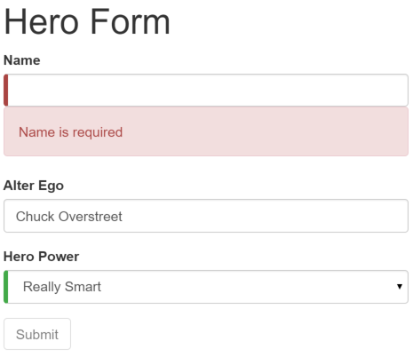

# [返回主目录](Readme.md)<!-- omit in toc --> 

# 目录 <!-- omit in toc --> 


# 模板驱动表单简介

开发表单需要设计能力（那超出了本章的范围），而框架支持**双向数据绑定、变更检测、验证和错误处理**，而本章你将会学到它们。

这个页面演示了如何从草稿构建一个简单的表单。这个过程中你将学会如何：
- 用组件和模板构建 Angular 表单

- 用 ngModel 创建双向数据绑定，以读取和写入输入控件的值

- 跟踪状态的变化，并验证表单控件

- 使用特殊的 CSS 类来跟踪控件的状态并给出视觉反馈

- 向用户显示验证错误提示，以及启用/禁用表单控件

- 使用模板引用变量在 HTML 元素之间共享信息

# 模板驱动表单
通常，**使用 Angular 模板语法编写模板，结合本章所描述的表单专用指令和技术来构建表单**。

> 你还可以使用响应式（也叫模型驱动）的方式来构建表单。不过本章中只介绍模板驱动表单。

利用 Angular 模板，可以构建几乎所有表单 — 登录表单、联系人表单…… 以及任何的商务表单。 可以创造性地摆放各种控件、把它们绑定到数据、指定校验规则、显示校验错误、有条件的禁用或 启用特定的控件、触发内置的视觉反馈等等，不胜枚举。

它用起来很简单，这是因为 Angular 处理了大多数重复、单调的任务，这让你可以不必亲自操刀、身陷其中。

你将学习构建如下的“模板驱动”表单：


这里是英雄职业介绍所，使用这个表单来维护候选英雄们的个人信息。每个英雄都需要一份工作。 公司的使命就是让合适的英雄去应对恰当的危机！

表单中的三个字段，其中两个是必填的。必填的字段在左侧有个绿色的竖条，方便用户分辨哪些是必填项。

如果删除了英雄的名字，表单就会用醒目的样式把验证错误显示出来。



注意，提交按钮被禁用了，而且输入控件左侧的“必填”条从绿色变为了红色。

> 稍后，会使用标准 CSS 来定制“必填”条的颜色和位置。

你将一点点构建出此表单：

1. 创建 Hero 模型类

2. 创建控制此表单的组件。

3. 创建具有初始表单布局的模板。

4. 使用 ngModel 双向数据绑定语法把数据属性绑定到每个表单输入控件。

5. 往每个表单输入控件上添加 name 属性 (attribute)。

6. 添加自定义 CSS 来提供视觉反馈。

7. 显示和隐藏有效性验证的错误信息。

8. 使用 ngSubmit 处理表单提交。

9. 禁用此表单的提交按钮，直到表单变为有效。

# 创建 Hero 模型类

最简单的模型是个“属性包”，用来存放应用中一件事物的事实。 这里使用三个必备字段 (id、name、power)，和一个可选字段 (alterEgo，译注：中文含义是第二人格，例如 X 战警中的 Jean / 黑凤凰)。

使用 Angular CLI 命令 ng generate class 生成一个名叫 Hero 的新类：

```
ng generate class Hero
```

内容如下：

```ts
export class Hero {

  constructor(
    public id: number,
    public name: string,
    public power: string,
    public alterEgo?: string
  ) {  }

}
```
这是一个少量需求和零行为的贫血模型。对演示来说很完美。

TypeScript 编译器为每个 public 构造函数参数生成一个公共字段，在创建新的英雄实例时，自动把参数值赋给这些公共字段。

alterEgo 是可选的，调用构造函数时可省略，注意 alterEgo? 中的问号 (?)。

可以这样创建新英雄：


