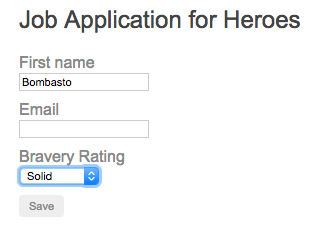

# [返回主目录](Readme.md)<!-- omit in toc --> 

# 目录 <!-- omit in toc --> 

- [动态表单](#%e5%8a%a8%e6%80%81%e8%a1%a8%e5%8d%95)
- [启动/引导(bootstrap)](#%e5%90%af%e5%8a%a8%e5%bc%95%e5%af%bcbootstrap)
- [问卷问题模型](#%e9%97%ae%e5%8d%b7%e9%97%ae%e9%a2%98%e6%a8%a1%e5%9e%8b)
- [问卷表单组件](#%e9%97%ae%e5%8d%b7%e8%a1%a8%e5%8d%95%e7%bb%84%e4%bb%b6)
- [问卷数据](#%e9%97%ae%e5%8d%b7%e6%95%b0%e6%8d%ae)
- [动态模板](#%e5%8a%a8%e6%80%81%e6%a8%a1%e6%9d%bf)


# 动态表单

**有时候手动编写和维护表单所需工作量和时间会过大**。特别是在需要编写大量表单时。表单都很相似，而且随着业务和监管需求的迅速变化，表单也要随之变化，这样维护的成本过高。

**基于业务对象模型的元数据，动态创建表单可能会更划算。**

本文会展示如何利用 formGroup 来动态渲染一个简单的表单，包括各种控件类型和验证规则。 这个起点很简陋，但可以在这个基础上添加丰富多彩的问卷问题、更优美的渲染以及更卓越的用户体验。

这个例子要为正在找工作的英雄们创建一个在线申请表的动态表单。英雄管理局会不断修改申请流程，你要在不修改应用代码的情况下，动态创建这些表单。

# 启动/引导(bootstrap)

从创建一个名叫 AppModule 的 NgModule 开始。

使用**响应式表单**

响应式表单属于另外一个叫做 ReactiveFormsModule 的 NgModule，所以，为了使用响应式表单类的指令，你得从 @angular/forms 库中引入 ReactiveFormsModule 模块。

在 main.ts 中启动 AppModule。

```ts
//app.module.ts
import { BrowserModule }                from '@angular/platform-browser';
import { ReactiveFormsModule }          from '@angular/forms';
import { NgModule }                     from '@angular/core';

import { AppComponent }                 from './app.component';
import { DynamicFormComponent }         from './dynamic-form.component';
import { DynamicFormQuestionComponent } from './dynamic-form-question.component';

@NgModule({
  imports: [ BrowserModule, ReactiveFormsModule ],
  declarations: [ AppComponent, DynamicFormComponent, DynamicFormQuestionComponent ],
  bootstrap: [ AppComponent ]
})
export class AppModule {
  constructor() {
  }
}
```
```ts
//main.ts
import { enableProdMode } from '@angular/core';
import { platformBrowserDynamic } from '@angular/platform-browser-dynamic';

import { AppModule } from './app/app.module';
import { environment } from './environments/environment';

if (environment.production) {
  enableProdMode();
}

platformBrowserDynamic().bootstrapModule(AppModule);
```

# 问卷问题模型

下一步是定义一个对象模型，用来描述所有表单功能需要的场景。英雄的申请流程涉及到一个包含很多问卷问题的表单。问卷问题是最基础的对象模型。

下面的 QuestionBase 是最基础的问卷问题基类。

```ts
//question-base.ts
export class QuestionBase<T> {
  value: T;
  key: string;
  label: string;
  required: boolean;
  order: number;
  controlType: string;

  constructor(options: {
      value?: T,
      key?: string,
      label?: string,
      required?: boolean,
      order?: number,
      controlType?: string
    } = {}) {
    this.value = options.value;
    this.key = options.key || '';
    this.label = options.label || '';
    this.required = !!options.required;
    this.order = options.order === undefined ? 1 : options.order;
    this.controlType = options.controlType || '';
  }
}
```

在这个基础上，你**派生出两个新类 TextboxQuestion 和 DropdownQuestion，分别代表文本框和下拉框。这么做的初衷是，表单能动态绑定到特定的问卷问题类型，并动态渲染出合适的控件**。


TextboxQuestion 可以通过 type 属性来支持多种 HTML5 元素类型，比如文本、邮件、网址等。

```ts
//question-textbox.ts
import { QuestionBase } from './question-base';

export class TextboxQuestion extends QuestionBase<string> {
  controlType = 'textbox';
  type: string;

  constructor(options: {} = {}) {
    super(options);
    this.type = options['type'] || '';
  }
}
```
DropdownQuestion 表示一个带可选项列表的选择框。
```ts
//question-dropdown.ts
import { QuestionBase } from './question-base';

export class DropdownQuestion extends QuestionBase<string> {
  controlType = 'dropdown';
  options: {key: string, value: string}[] = [];

  constructor(options: {} = {}) {
    super(options);
    this.options = options['options'] || [];
  }
}
```

接下来定义了 QuestionControlService，一个可以把问卷问题转换为 FormGroup 的服务。 简而言之，这个 FormGroup 使用问卷模型的元数据，并允许你指定默认值和验证规则。

```ts
//question-control.servece.ts
import { Injectable }   from '@angular/core';
import { FormControl, FormGroup, Validators } from '@angular/forms';

import { QuestionBase } from './question-base';

@Injectable()
export class QuestionControlService {
  constructor() { }

  toFormGroup(questions: QuestionBase<any>[] ) {
    let group: any = {};

    questions.forEach(question => {
      group[question.key] = question.required ? new FormControl(question.value || '', Validators.required)
                                              : new FormControl(question.value || '');
    });
    return new FormGroup(group);
  }
}
```

# 问卷表单组件
现在你已经有一个定义好的完整模型了，接着就可以开始创建一个展现动态表单的组件。

DynamicFormComponent 是表单的主要容器和入口点。

```html
<!--dynamic-form.compoent.html-->
<div>
  <form (ngSubmit)="onSubmit()" [formGroup]="form">

    <div *ngFor="let question of questions" class="form-row">
      <app-question [question]="question" [form]="form"></app-question>
    </div>

    <div class="form-row">
      <button type="submit" [disabled]="!form.valid">Save</button>
    </div>
  </form>

  <div *ngIf="payLoad" class="form-row">
    <strong>Saved the following values</strong><br>{{payLoad}}
  </div>
</div>
```
```ts
//dynamic-form.component.ts
import { Component, Input, OnInit }  from '@angular/core';
import { FormGroup }                 from '@angular/forms';

import { QuestionBase }              from './question-base';
import { QuestionControlService }    from './question-control.service';

@Component({
  selector: 'app-dynamic-form',
  templateUrl: './dynamic-form.component.html',
  providers: [ QuestionControlService ]
})
export class DynamicFormComponent implements OnInit {

  @Input() questions: QuestionBase<any>[] = [];
  form: FormGroup;
  payLoad = '';

  constructor(private qcs: QuestionControlService) {  }

  ngOnInit() {
    this.form = this.qcs.toFormGroup(this.questions);
  }

  onSubmit() {
    this.payLoad = JSON.stringify(this.form.value);
  }
}
```

它代表了问卷问题列表，每个问题都被绑定到一个 `<app-question>` 组件元素。 `<app-question>` 标签匹配到的是组件 DynamicFormQuestionComponent，该组件的职责是根据各个问卷问题对象的值来动态渲染表单控件。

```html
<!--dynamic-form-question.component.html-->
<div [formGroup]="form">
  <label [attr.for]="question.key">{{question.label}}</label>

  <div [ngSwitch]="question.controlType">

    <input *ngSwitchCase="'textbox'" [formControlName]="question.key"
            [id]="question.key" [type]="question.type">

    <select [id]="question.key" *ngSwitchCase="'dropdown'" [formControlName]="question.key">
      <option *ngFor="let opt of question.options" [value]="opt.key">{{opt.value}}</option>
    </select>

  </div> 

  <div class="errorMessage" *ngIf="!isValid">{{question.label}} is required</div>
</div>
```
```ts
//dynamic-form-question.component.ts
import { Component, Input } from '@angular/core';
import { FormGroup }        from '@angular/forms';

import { QuestionBase }     from './question-base';

@Component({
  selector: 'app-question',
  templateUrl: './dynamic-form-question.component.html'
})
export class DynamicFormQuestionComponent {
  @Input() question: QuestionBase<any>;
  @Input() form: FormGroup;
  get isValid() { return this.form.controls[this.question.key].valid; }
}
```

请注意，这个组件能代表模型里的任何问题类型。目前，还只有两种问题类型，但可以添加更多类型。可以用 ngSwitch 决定显示哪种类型的问题。

在这两个组件中，你依赖 Angular 的 formGroup 来把模板 HTML 和底层控件对象连接起来，该对象从问卷问题模型里获取渲染和验证规则。

formControlName 和 formGroup 是在 ReactiveFormsModule 中定义的指令。这个模板之所以能使用它们，是因为你曾从 AppModule 中导入了 ReactiveFormsModule。

# 问卷数据

DynamicFormComponent 期望得到一个问题列表，该数组被绑定到 @Input() questions 属性。

QuestionService 会返回为工作申请表定义的那组问题列表。在真实的应用程序环境中，你会从数据库里获得这些问题列表。

关键是，你完全根据 QuestionService 返回的对象来控制英雄的工作申请表。 要维护这份问卷，只要非常简单地添加、修改和删除 questions 数组中的对象就可以了。

```ts
//question.service.ts
import { Injectable }       from '@angular/core';

import { DropdownQuestion } from './question-dropdown';
import { QuestionBase }     from './question-base';
import { TextboxQuestion }  from './question-textbox';

@Injectable()
export class QuestionService {

  // TODO: get from a remote source of question metadata
  // TODO: make asynchronous
  getQuestions() {

    let questions: QuestionBase<any>[] = [

      new DropdownQuestion({
        key: 'brave',
        label: 'Bravery Rating',
        options: [
          {key: 'solid',  value: 'Solid'},
          {key: 'great',  value: 'Great'},
          {key: 'good',   value: 'Good'},
          {key: 'unproven', value: 'Unproven'}
        ],
        order: 3
      }),

      new TextboxQuestion({
        key: 'firstName',
        label: 'First name',
        value: 'Bombasto',
        required: true,
        order: 1
      }),

      new TextboxQuestion({
        key: 'emailAddress',
        label: 'Email',
        type: 'email',
        order: 2
      })
    ];

    return questions.sort((a, b) => a.order - b.order);
  }
}
```

最后，在 AppComponent 里显示出表单。
```ts
//app.component.ts
import { Component }       from '@angular/core';

import { QuestionService } from './question.service';

@Component({
  selector: 'app-root',
  template: `
    <div>
      <h2>Job Application for Heroes</h2>
      <app-dynamic-form [questions]="questions"></app-dynamic-form>
    </div>
  `,
  providers:  [QuestionService]
})
export class AppComponent {
  questions: any[];

  constructor(service: QuestionService) {
    this.questions = service.getQuestions();
  }
}
```

# 动态模板

在这个例子中，虽然你是在为英雄的工作申请表建模，但是除了 QuestionService 返回的那些对象外，没有其它任何地方是与英雄有关的。

这点非常重要，因为只要与问卷对象模型兼容，就可以在任何类型的调查问卷中复用这些组件。 这里的关键是用到元数据的动态数据绑定来渲染表单，对问卷问题没有任何硬性的假设。除控件的元数据外，还可以动态添加验证规则。

表单验证通过之前，保存按钮是禁用的。验证通过后，就可以点击保存按钮，程序会把当前值渲染成 JSON 显示出来。 这表明任何用户输入都被传到了数据模型里。至于如何储存和提取数据则是另一话题了。

完整的表单是这样的：



