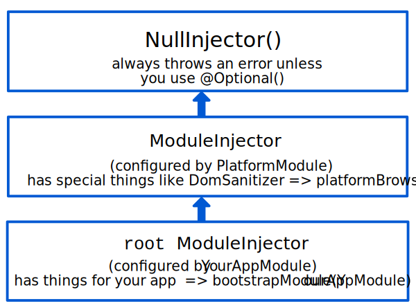
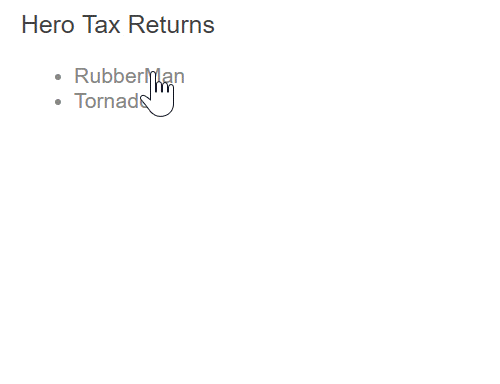

# [返回主目录](Readme.md)<!-- omit in toc --> 

# 目录 <!-- omit in toc --> 
- [多级注入器](#%e5%a4%9a%e7%ba%a7%e6%b3%a8%e5%85%a5%e5%99%a8)
- [两个注入器层次结构](#%e4%b8%a4%e4%b8%aa%e6%b3%a8%e5%85%a5%e5%99%a8%e5%b1%82%e6%ac%a1%e7%bb%93%e6%9e%84)
  - [ModuleInjector](#moduleinjector)
    - [平台注入器](#%e5%b9%b3%e5%8f%b0%e6%b3%a8%e5%85%a5%e5%99%a8)
  - [ElementInjector](#elementinjector)
- [解析规则](#%e8%a7%a3%e6%9e%90%e8%a7%84%e5%88%99)
- [解析修饰符](#%e8%a7%a3%e6%9e%90%e4%bf%ae%e9%a5%b0%e7%ac%a6)
  - [修饰符的类型](#%e4%bf%ae%e9%a5%b0%e7%ac%a6%e7%9a%84%e7%b1%bb%e5%9e%8b)
  - [@Optional()](#optional)
  - [@Self()](#self)
  - [@SkipSelf()](#skipself)
    - [@SkipSelf() with @Optional()](#skipself-with-optional)
  - [@Host()](#host)
- [模板的逻辑结构](#%e6%a8%a1%e6%9d%bf%e7%9a%84%e9%80%bb%e8%be%91%e7%bb%93%e6%9e%84)
- [在 @Component() 中提供服务](#%e5%9c%a8-component-%e4%b8%ad%e6%8f%90%e4%be%9b%e6%9c%8d%e5%8a%a1)
  - [应用程序结构示例](#%e5%ba%94%e7%94%a8%e7%a8%8b%e5%ba%8f%e7%bb%93%e6%9e%84%e7%a4%ba%e4%be%8b)
  - [使用 providers 数组](#%e4%bd%bf%e7%94%a8-providers-%e6%95%b0%e7%bb%84)
  - [使用 viewProviders 数组](#%e4%bd%bf%e7%94%a8-viewproviders-%e6%95%b0%e7%bb%84)
  - [providers 与 viewProviders](#providers-%e4%b8%8e-viewproviders)
- [修改服务可见性](#%e4%bf%ae%e6%94%b9%e6%9c%8d%e5%8a%a1%e5%8f%af%e8%a7%81%e6%80%a7)
  - [提供者令牌的可见性](#%e6%8f%90%e4%be%9b%e8%80%85%e4%bb%a4%e7%89%8c%e7%9a%84%e5%8f%af%e8%a7%81%e6%80%a7)
  - [@SkipSelf() 和 viewProviders](#skipself-%e5%92%8c-viewproviders)
  - [@Host() 和 viewProviders](#host-%e5%92%8c-viewproviders)
- [ElementInjector 用例示例](#elementinjector-%e7%94%a8%e4%be%8b%e7%a4%ba%e4%be%8b)
  - [场景：服务隔离](#%e5%9c%ba%e6%99%af%e6%9c%8d%e5%8a%a1%e9%9a%94%e7%a6%bb)
  - [场景：多重编辑会话](#%e5%9c%ba%e6%99%af%e5%a4%9a%e9%87%8d%e7%bc%96%e8%be%91%e4%bc%9a%e8%af%9d)
  - [场景：专门的提供者](#%e5%9c%ba%e6%99%af%e4%b8%93%e9%97%a8%e7%9a%84%e6%8f%90%e4%be%9b%e8%80%85)

## 多级注入器
Angular 中的注入器有一些规则，您可以利用这些规则来在应用程序中获得所需的可注入对象可见性。通过了解这些规则，可以确定应在哪个 NgModule、组件或指令中声明服务提供者。

## 两个注入器层次结构

Angular 中有两个注入器层次结构：
1. ModuleInjector 层次结构 —— 使用 @NgModule() 或 @Injectable() 注解在此层次结构中配置 ModuleInjector。
2. ElementInjector 层次结构 —— 在每个 DOM 元素上隐式创建。除非您在 @Directive() 或 @Component() 的 providers 属性中进行配置，否则默认情况下，ElementInjector 为空。

### ModuleInjector
可以通过以下两种方式之一配置 ModuleInjector ：

- 使用 @Injectable() 的 providedIn 属性引用 @NgModule() 或 root 。

- 使用 @NgModule() 的 providers 数组。

> 摇树优化与 @Injectable()
> 使用 @Injectable() 的 providedIn 属性优于 @NgModule() 的 providers 数组，因为使用 @Injectable() 的 providedIn 时，优化工具可以进行摇树优化，从而删除您的应用程序中未使用的服务，以减小捆绑包尺寸。
> 摇树优化对于库特别有用，因为使用该库的应用程序不需要注入它。

ModuleInjector 由 @NgModule.providers 和 NgModule.imports 属性配置。

ModuleInjector 是可以通过 NgModule.imports 递归找到的所有 providers 数组的扁平化。

子 ModuleInjector 是在延迟加载其它 @NgModules 时创建的。

使用 @Injectable() 的 providedIn 属性提供服务的方式如下：

```ts
import { Injectable } from '@angular/core';

@Injectable({
  providedIn: 'root'  // <--provides this service in the root ModuleInjector
})
export class ItemService {
  name = 'telephone';
}
```
@Injectable() 装饰器标识服务类。该 providedIn 属性配置指定的 ModuleInjector，这里的 root 会把让该服务在 root ModuleInjector 上可用。

#### 平台注入器
在 root 之上还有两个注入器，一个是额外的 ModuleInjector，一个是 NullInjector()。

思考下 Angular 要如何通过 main.ts 中的如下代码引导应用程序：

```ts
platformBrowserDynamic().bootstrapModule(AppModule).then(ref => {...})
```

bootstrapModule() 方法会创建一个由 AppModule 配置的注入器作为平台注入器的子注入器。也就是 root ModuleInjector。

platformBrowserDynamic() 方法创建一个由 PlatformModule 配置的注入器，该注入器包含特定平台的依赖项。这允许多个应用共享同一套平台配置。例如，无论您运行多少个应用程序，浏览器都只有一个 URL 栏。您可以使用 platformBrowser() 函数提供 extraProviders，从而在平台级别配置特定平台的额外提供者。

层次结构中的下一个父注入器是 NullInjector()，它是树的顶部。如果您在树中向上走了很远，以至于要在 NullInjector() 中寻找服务，那么除非使用 @Optional()，否则将收到错误消息，因为最终所有东西都将以 NullInjector() 结束并返回错误，或者对于 @Optional()，返回 null。

下图展示了前面各段落描述的 root ModuleInjector 及其父注入器之间的关系。



虽然 root 是一个特殊的别名，但其他 ModuleInjector 都没有别名。每当创建动态加载组件时，你还会创建 ModuleInjector，比如路由器，它还会创建子 ModuleInjector。

无论是使用 bootstrapModule() 的方法配置它，还是将所有提供者都用 root 注册到其自己的服务中，所有请求最终都会转发到 root 注入器。

> @Injectable() vs. @NgModule()
> 如果你在 AppModule 的 @NgModule() 中配置应用级提供者，它就会覆盖一个在 @Injectable() 的 root 元数据中配置的提供者。您可以用这种方式，来配置供多个应用共享的服务的非默认提供者。
> 下面的例子中，通过把 location 策略 的提供者添加到 AppModule 的 providers 列表中，为路由器配置了非默认的 location 策略。
> ```ts
> providers: [
>  { provide: LocationStrategy, useClass: HashLocationStrategy }
>]
> ```

### ElementInjector
Angular 会为每个 DOM 元素隐式创建 ElementInjector 。

可以用 @Component() 装饰器中的 providers 或 viewProviders 属性来配置 ElementInjector 以提供服务。例如，下面的 TestComponent 通过提供此服务来配置 ElementInjector：

```ts
@Component({
  ...
  providers: [{ provide: ItemService, useValue: { name: 'lamp' } }]
})
export class TestComponent
```
在组件中提供服务时，可以通过 ElementInjector 在该组件实例处使用该服务。根据解析规则部分描述的可见性规则，它也同样在子组件/指令处可见。

当组件实例被销毁时，该服务实例也将被销毁。

####　@Directive() 和 @Component()
组件是一种特殊类型的指令，这意味着 @Directive() 具有 providers 属性，@Component() 也同样如此。 这意味着指令和组件都可以使用 providers 属性来配置提供者。当使用 providers 属性为组件或指令配置提供者时，该提供程商就属于该组件或指令的 ElementInjector。同一元素上的组件和指令共享同一个注入器。

## 解析规则
当为组件/指令解析令牌时，Angular 分为两个阶段来解析它：

1. 最先针对 ElementInjector 层次结构（其父级）寻找

2. 如果ElementInjector中找不到，之后在针对 ModuleInjector 层次结构（其父级）

当组件声明依赖项时，Angular 会尝试使用它自己的 ElementInjector 来满足该依赖。 如果组件的注入器缺少提供者，它将把请求传给其父组件的 ElementInjector 。

这些请求将继续转发，直到 Angular 找到可以处理该请求的注入器或用完祖先 ElementInjector 。

如果 Angular 在任何 ElementInjector 中都找不到提供者，它将返回到发起请求的元素，并在 ModuleInjector 层次结构中进行查找。如果 Angular 仍然找不到提供者，它将引发错误。

如果您已在不同级别注册了相同 DI 令牌的提供者，则 Angular 会用遇到的第一个来解析该依赖。例如，如果提供者已经在需要此服务的组件中本地注册了，则 Angular 不会再寻找同一服务的其他提供者。

## 解析修饰符

可以使用 @Optional()，@Self()，@SkipSelf() 和 @Host() 来修饰 Angular 的解析行为。从 @angular/core 导入它们，并在注入服务时在组件类构造函数中使用它们。

### 修饰符的类型

解析修饰符分为三类：

1. 如果 Angular 找不到您要的东西该怎么办，用 @Optional()

2. 从哪里开始寻找，用 @SkipSelf()

3. 到哪里停止寻找，用 @Host() 和 @Self()

默认情况下，Angular 始终从当前的 Injector 开始，并一直向上搜索。修饰符使您可以更改开始（默认是自己）或结束位置。

另外，您可以组合除 @Host() 和 @Self() 之外的所有修饰符，当然还有 @SkipSelf() 和 @Self() 。

### @Optional()

@Optional() 允许 Angular 将您注入的服务视为可选服务。这样，如果无法在运行时解析它，Angular 只会将服务解析为 null，而不会抛出错误。在下面的示例中，服务 OptionalService 没有在 @NgModule() 或组件类中提供，所以它没有在应用中的任何地方。

```ts
export class OptionalComponent {
  constructor(@Optional() public optional: OptionalService) {}
}
```

### @Self()
使用 @Self() 让 Angular 仅查看当前组件或指令的 ElementInjector 。

@Self() 的一个好例子是要注入某个服务，但只有当该服务在当前宿主元素上可用时才行。为了避免这种情况下出错，请将 @Self() 与 @Optional() 结合使用。

例如，在下面的 SelfComponent 中。请注意在构造函数中注入的 LeafService。

```ts
@Component({
  selector: 'app-self-no-data',
  templateUrl: './self-no-data.component.html',
  styleUrls: ['./self-no-data.component.css']
})
export class SelfNoDataComponent {
  constructor(@Self() @Optional() public leaf: LeafService) { }
}
```
在这个例子中，有一个父提供者，注入服务将返回该值，但是，使用 @Self() 和 @Optional() 注入的服务将返回 null 因为 @Self() 告诉注入器在当前宿主元素上就要停止搜索。

另一个示例显示了具有 FlowerService 提供者的组件类。在这个例子中，注入器没有超出当前 ElementInjector 就停止了，因为它已经找到了 FlowerService 并返回了黄色花朵🌼。
```ts
@Component({
  selector: 'app-self',
  templateUrl: './self.component.html',
  styleUrls: ['./self.component.css'],
  providers: [{ provide: FlowerService, useValue: { emoji: '🌼' } }]

})
export class SelfComponent {
  constructor(@Self() public flower: FlowerService) {}
}
```

### @SkipSelf()
@SkipSelf() 与 @Self() 相反。使用 @SkipSelf() ，Angular 在父 ElementInjector 中而不是当前 ElementInjector 中开始搜索服务。因此，如果父 ElementInjector 对 emoji 使用了值 🌿（蕨类），但组件的 providers 数组中有 🍁（枫叶），则 Angular 将忽略 🍁（枫叶），而使用 🌿（蕨类）。

要在代码中看到这一点，请先假定 emoji 的以下值就是父组件正在使用的值，如本服务所示：
```ts
export class LeafService {
  emoji = '🌿';
}
```
想象一下，在子组件中，您有一个不同的值 🍁（枫叶），但您想使用父项的值。你就要使用 @SkipSelf() ：
```ts
@Component({
  selector: 'app-skipself',
  templateUrl: './skipself.component.html',
  styleUrls: ['./skipself.component.css'],
  // Angular would ignore this LeafService instance
  providers: [{ provide: LeafService, useValue: { emoji: '🍁' } }]
})
export class SkipselfComponent {
  // Use @SkipSelf() in the constructor
  constructor(@SkipSelf() public leaf: LeafService) { }
}
```
在这个例子中，您获得的 emoji 值将为 🌿（蕨类），而不是 🍁（枫叶）。

#### @SkipSelf() with @Optional()

如果值为 null 请同时使用 @SkipSelf() 和 @Optional() 来防止错误。在下面的示例中，将 Person 服务注入到构造函数中。@SkipSelf() 告诉 Angular 跳过当前的注入器，如果 Person 服务为 null，则 @Optional() 将防止报错。
```ts
class Person {
  constructor(@Optional() @SkipSelf() parent: Person) {}
}
```
### @Host()
@Host() 使您可以在搜索提供者时将当前组件指定为注入器树的最后一站。即使树的更上级有一个服务实例，Angular 也不会继续寻找。使用 @Host() 的例子如下：
```ts
@Component({
  selector: 'app-host',
  templateUrl: './host.component.html',
  styleUrls: ['./host.component.css'],
  //  provide the service
  providers: [{ provide: FlowerService, useValue: { emoji: '🌼' } }]
})
export class HostComponent {
  // use @Host() in the constructor when injecting the service
  constructor(@Host() @Optional() public flower: FlowerService) { }

}
```
由于 HostComponent 在其构造函数中具有 @Host() ，因此，无论 HostComponent 的父级是否可能有 flower.emoji 值，该 HostComponent 都将使用 🌼（黄色花朵）。

## 模板的逻辑结构
在组件类中提供服务时，服务在 ElementInjector 树中的可见性是取决于您在何处以及如何提供这些服务。

了解 Angular 模板的基础逻辑结构将为您配置服务并进而控制其可见性奠定基础。

组件在模板中使用，如以下示例所示：
```html
<app-root>
    <app-child></app-child>
</app-root>
```
> 注意：通常，您要在单独的文件中声明组件及其模板。为了理解注入系统的工作原理，从组合逻辑树的视角来看它们是很有帮助的。使用术语“逻辑”将其与渲染树（您的应用程序 DOM 树）区分开。为了标记组件模板的位置，本指南使用 <#VIEW> 伪元素，该元素实际上不存在于渲染树中，仅用于心智模型中。

下面是如何将 <app-root> 和 <app-child> 视图树组合为单个逻辑树的示例：

```html
<app-root>
  <#VIEW>
    <app-child>
     <#VIEW>
       ...content goes here...
     </#VIEW>
    </app-child>
  <#VIEW>
</app-root>
```
当您在组件类中配置服务时，了解这种 <#VIEW> 划界的思想尤其重要。

## 在 @Component() 中提供服务
您如何通过 @Component() （或 @Directive() ）装饰器提供服务决定了它们的可见性。以下各节演示了 providers 和 viewProviders 以及使用 @SkipSelf() 和 @Host() 修改服务可见性的方法。

组件类可以通过两种方式提供服务：

1. 使用 providers 数组
   ```ts
   @Component({
    ...
    providers: [
        {provide: FlowerService, useValue: {emoji: '🌺'}}
      ]
    })
   ```
2. 使用 viewProviders 数组
   ```ts
   @Component({
   ...
   viewProviders: [
        {provide: AnimalService, useValue: {emoji: '🐶'}}
    ]
   })   
   ```

> 注意：在逻辑树中，你会看到 @Provide ， @Inject 和 @NgModule ，这些不是真正的 HTML 属性，只是为了在这里证明其幕后的原理。
> - @Inject(Token)=>Value 表示，如果要将 Token 注入逻辑树中的此位置，则它的值为 Value。
> - @Provide(Token=Value) 表示，在逻辑树中的此位置存在一个值为 Value 的 Token 提供者的声明。
> - @NgModule(Token) 表示，应在此位置使用后备的 NgModule 注入器。

### 应用程序结构示例
示例应用程序的 root 提供了 FlowerService，其 emoji 值为 🌺（红色芙蓉）
```ts
@Injectable({
  providedIn: 'root'
})
export class FlowerService {
  emoji = '🌺';
}
```
考虑一个只有 AppComponent 和 ChildComponent 的简单应用程序。最基本的渲染视图看起来就像嵌套的 HTML 元素，例如：
```html
<app-root> <!-- AppComponent selector -->
    <app-child> <!-- ChildComponent selector -->
    </app-child>
</app-root>
```
但是，在幕后，Angular 在解析注入请求时使用如下逻辑视图表示形式：
```ts
<app-root> <!-- AppComponent selector -->
    <#VIEW>
        <app-child> <!-- ChildComponent selector -->
            <#VIEW>
            </#VIEW>
        </app-child>
    </#VIEW>
</app-root>
```
此处的 <#VIEW> 表示模板的实例。请注意，每个组件都有自己的 <#VIEW> 。

了解此结构可以告知您如何提供和注入服务，并完全控制服务的可见性。

现在，考虑` <app-root>` 只注入了 FlowerService ：
```ts
export class AppComponent  {
  constructor(public flower: FlowerService) {}
}
```
将绑定添加到 `<app-root>` 模板来将结果可视化：
```html
<p>Emoji from FlowerService: {{flower.emoji}}</p>
```
该视图中的输出为：
```html
Emoji from FlowerService: 🌺
```
在逻辑树中，这可以表示成如下形式：
```html
<app-root @NgModule(AppModule)
        @Inject(FlowerService) flower=>"🌺">
  <#VIEW>

    <p>Emoji from FlowerService: {{flower.emoji}} (🌺)</p>

    <app-child>
      <#VIEW>
      </#VIEW>
     </app-child>
  </#VIEW>
</app-root>
```
当 `<app-root>` 请求 FlowerService 时，注入器的工作就是解析 FlowerService 令牌。令牌的解析分为两个阶段：

1. 注入器确定逻辑树中搜索的开始位置和结束位置。注入程序从起始位置开始，并在逻辑树的每个级别上查找令牌。如果找到令牌，则将其返回。

2. 如果未找到令牌，则注入程序将寻找最接近的父 @NgModule() 委派该请求。

在这个例子中，约束为：

1. 从属于 `<app-root>` 的 <#VIEW> 开始，并结束于 `<app-root>` 。

   - 通常，搜索的起点就是注入点。但是，在这个例子中，`<app-root>` @Component 的特殊之处在于它们还包括自己的 viewProviders，这就是为什么搜索从 `<app-root>` 的 <#VIEW> 开始的原因。（对于匹配同一位置的指令，情况却并非如此）。

   - 结束位置恰好与组件本身相同，因为它就是此应用程序中最顶层的组件。

2. 当在 ElementInjector 中找不到注入令牌时，就用 AppModule 充当后备注入器。

### 使用 providers 数组
现在，在 ChildComponent 类中，为 FlowerService 添加一个提供者，以便在接下来的小节中演示更复杂的解析规则：
```ts
// child.component.ts
@Component({
  selector: 'app-child',
  templateUrl: './child.component.html',
  styleUrls: ['./child.component.css'],
  // use the providers array to provide a service
  providers: [{ provide: FlowerService, useValue: { emoji: '🌻' } }]
})

export class ChildComponent {
  // inject the service
  constructor( public flower: FlowerService) { }
}
```
现在，在 @Component() 装饰器中提供了 FlowerService ，当 `<app-child>` 请求该服务时，注入器仅需要查找 `<app-child>` 自己的 ElementInjector 。不必再通过注入器树继续搜索。

下一步是将绑定添加到 ChildComponent 模板。

```html
<p>Emoji from FlowerService: {{flower.emoji}}</p>
```
要渲染新的值，请在 AppComponent 模板的底部添加 <app-child> ，以便其视图也显示向日葵：
```
Child Component
Emoji from FlowerService: 🌻
```
在逻辑树中，可以把它表示成这样：
```html
<app-root @NgModule(AppModule)
        @Inject(FlowerService) flower=>"🌺">
  <#VIEW>

    <p>Emoji from FlowerService: {{flower.emoji}} (🌺)</p>

    <app-child @Provide(FlowerService="🌻")
               @Inject(FlowerService)=>"🌻"> <!-- search ends here -->
      <#VIEW> <!-- search starts here -->

        <h2>Parent Component</h2>

        <p>Emoji from FlowerService: {{flower.emoji}} (🌻)</p>

      </#VIEW>
     </app-child>
  </#VIEW>
</app-root>
```
当 `<app-child>` 请求 FlowerService 时，注入器从 `<app-child>` 的 <#VIEW> 开始搜索（包括 <#VIEW> ，因为它是从 @Component() 注入的），并到 `<app-child>` 结束。在这个例子中， FlowerService 在 `<app-child>` 的 providers 数组中解析为向日葵🌻。注入器不必在注入器树中进一步查找。一旦找到 FlowerService ，它便停止运行，再也看不到🌺（红芙蓉）。
### 使用 viewProviders 数组
使用 viewProviders 数组是在 @Component() 装饰器中提供服务的另一种方法。使用 viewProviders 使服务在 <#VIEW> 中可见。

除了使用 viewProviders 数组外，其他步骤与使用 providers 数组相同。

该示例应用程序具有第二个服务 AnimalService 来演示 viewProviders 。

首先，创建一个 AnimalService 与 emoji 的🐳（鲸鱼）属性：

```ts
import { Injectable } from '@angular/core';

@Injectable({
  providedIn: 'root'
})
export class AnimalService {
  emoji = '🐳';
}
```
遵循与 FlowerService 相同的模式，将 AnimalService 注入 AppComponent 类：
```ts
export class AppComponent  {
  constructor(public flower: FlowerService, public animal: AnimalService) {}
}
```
添加一个 viewProviders 数组，并将 AnimalService 也注入到 `<app-child>` 类中，但是给 emoji 一个不同的值。在这里，它的值为🐶（小狗）。
```ts
@Component({
  selector: 'app-child',
  templateUrl: './child.component.html',
  styleUrls: ['./child.component.css'],
  // provide services
  providers: [{ provide: FlowerService, useValue: { emoji: '🌻' } }],
  viewProviders: [{ provide: AnimalService, useValue: { emoji: '🐶' } }]
})

export class ChildComponent {
  // inject service
  constructor( public flower: FlowerService, public animal: AnimalService) { }
}
```
将绑定添加到 ChildComponent 和 AppComponent 模板。在 ChildComponent 模板中，添加以下绑定：
```html
<p>Emoji from AnimalService: {{animal.emoji}}</p>
```
此外，将其添加到 AppComponent 模板：
```html
<p>Emoji from AnimalService: {{animal.emoji}}</p>
```
现在，您应该在浏览器中看到两个值：
```
AppComponent
Emoji from AnimalService: 🐳

Child Component
Emoji from AnimalService: 🐶
```
此 viewProviders 示例的逻辑树如下：
```html
<app-root @NgModule(AppModule)
        @Inject(AnimalService) animal=>"🐳">
  <#VIEW>
    <app-child>
      <#VIEW
       @Provide(AnimalService="🐶")
       @Inject(AnimalService=>"🐶")>

       <!-- ^^using viewProviders means AnimalService is available in <#VIEW>-->

       <p>Emoji from AnimalService: {{animal.emoji}} (🐶)</p>

      </#VIEW>
     </app-child>
  </#VIEW>
</app-root>
```

与 FlowerService 示例一样， `<app-child>` @Component() 装饰器中提供了 AnimalService。这意味着，由于注入器首先在组件的 ElementInjector 中查找，因此它将找到 AnimalService 的值 🐶（小狗）。它不需要继续搜索 ElementInjector 树，也不需要搜索 ModuleInjector 。

### providers 与 viewProviders

为了看清 providers 和 viewProviders 的差异，请在示例中添加另一个组件，并将其命名为 InspectorComponent 。 InspectorComponent 将是 ChildComponent 的子 ChildComponent 。在 inspector.component.ts 中，将 FlowerService 和 AnimalService 注入构造函数中：

```ts
// inspector.component.ts
export class InspectorComponent {
  constructor(public flower: FlowerService, public animal: AnimalService) { }
}
```
您不需要 providers 或 viewProviders 数组。接下来，在 inspector.component.html 中，从以前的组件中添加相同的 html：
```html
<p>Emoji from FlowerService: {{flower.emoji}}</p>
<p>Emoji from AnimalService: {{animal.emoji}}</p>
```
别忘了将 InspectorComponent 添加到 AppModule declarations 数组。
```ts
// app.module.ts
@NgModule({
  imports:      [ BrowserModule, FormsModule ],
  declarations: [ AppComponent, ChildComponent, InspectorComponent ],
  bootstrap:    [ AppComponent ],
  providers: []
})
export class AppModule { }
```
接下来，确保您的 child.component.html 包含以下内容：
```html
<p>Emoji from FlowerService: {{flower.emoji}}</p>
<p>Emoji from AnimalService: {{animal.emoji}}</p>

<div class="container">
  <h3>Content projection</h3>
	<ng-content></ng-content>
</div>

<h3>Inside the view</h3>
<app-inspector></app-inspector>
```

前两行带有绑定，来自之前的步骤。新的部分是 `<ng-content>` 和 `<app-inspector>`。 `<ng-content>` 允许您投影内容， ChildComponent 模板中的 `<app-inspector>` 使 InspectorComponent 成为 ChildComponent 的子组件。

接下来，将以下内容添加到 app.component.html 中以利用内容投影的优势。
```html
<app-child><app-inspector></app-inspector></app-child>
```
现在，浏览器将呈现以下内容，为简洁起见，省略了前面的示例：
```
//...Omitting previous examples. The following applies to this section.

Content projection: This is coming from content. Doesn't get to see
puppy because the puppy is declared inside the view only.

Emoji from FlowerService: 🌻
Emoji from AnimalService: 🐳

Emoji from FlowerService: 🌻
Emoji from AnimalService: 🐶
```

这四个绑定说明了 providers 和 viewProviders 之间的区别。由于🐶（小狗）在<#VIEW>中声明，因此投影内容不可见。投影的内容中会看到🐳（鲸鱼）。

但是下一部分， InspectorComponent 是 ChildComponent 的子组件， InspectorComponent 在 <#VIEW> 内部，因此当它请求 AnimalService 时，它会看到🐶（小狗）。

逻辑树中的 AnimalService 如下所示：

```html
<app-root @NgModule(AppModule)
        @Inject(AnimalService) animal=>"🐳">
  <#VIEW>
    <app-child>
      <#VIEW
       @Provide(AnimalService="🐶")
       @Inject(AnimalService=>"🐶")>

       <!-- ^^using viewProviders means AnimalService is available in <#VIEW>-->

       <p>Emoji from AnimalService: {{animal.emoji}} (🐶)</p>

       <app-inspector>

        <p>Emoji from AnimalService: {{animal.emoji}} (🐶)</p>

       </app-inspector>
      </#VIEW>
      <app-inspector>
        <#VIEW>

          <p>Emoji from AnimalService: {{animal.emoji}} (🐳)</p>

        </#VIEW>
      </app-inspector>
     </app-child>
  </#VIEW>
</app-root>
```
`<app-inspector>` 的投影内容中看到了🐳（鲸鱼），而不是🐶（小狗），因为🐶（小狗）在 `<app-child>` 的 <#VIEW> 中。如果 `<app-inspector>` 也位于 <#VIEW> 则只能看到🐶（小狗）。

## 修改服务可见性

本节讲的是如何使用可见性修饰符 @Host() ， @Self() 和 @SkipSelf() 来限制 ElementInjector 的开始和结束范围。

### 提供者令牌的可见性

可见性装饰器影响搜索注入令牌时在逻辑树中开始和结束的位置。为此，要将可见性装饰器放置在注入点，即 constructor() ，而不是在声明点。

为了修改该注入器从哪里开始寻找 FlowerService，把 @SkipSelf() 加到 `<app-child>` 的 @Inject 声明 FlowerService 中。该声明在 `<app-child>` 构造函数中，如 child.component.ts 所示：
```ts
constructor(@SkipSelf() public flower : FlowerService) { }
```
使用 @SkipSelf()，`<app-child>` 注入器不会寻找自身来获取 FlowerService。相反，喷射器开始在 `<app-root>` 的 ElementInjector 中寻找 FlowerService，在那里它什么也没找到。 然后，它返回到 `<app-child>` 的 ModuleInjector 并找到🌺（红芙蓉）值，这是可用的，因为 `<app-child>` ModuleInjector 和 `<app-root>` ModuleInjector 被展开成了一个 ModuleInjector 。因此，UI 将呈现以下内容：
```
Emoji from FlowerService: 🌺
```
在逻辑树中，这种情况可能如下所示：
```html
<app-root @NgModule(AppModule)
        @Inject(FlowerService) flower=>"🌺">
  <#VIEW>
    <app-child @Provide(FlowerService="🌻")>
      <#VIEW @Inject(FlowerService, SkipSelf)=>"🌺">

      <!-- With SkipSelf, the injector looks to the next injector up the tree -->

      </#VIEW>
      </app-child>
  </#VIEW>
</app-root>
```
尽管 `<app-child>` 提供了🌻（向日葵），但该应用程序渲染了🌺（红色芙蓉），因为 @SkipSelf() 导致当前的注入器跳过了自身并寻找其父级。

如果现在将 @Host()（以及 @SkipSelf() ）添加到了 FlowerService 的 @Inject，其结果将为 null 。这是因为 @Host() 将搜索的上限限制为 <#VIEW> 。这是在逻辑树中的情况：

```html
<app-root @NgModule(AppModule)
        @Inject(FlowerService) flower=>"🌺">
  <#VIEW> <!-- end search here with null-->
    <app-child @Provide(FlowerService="🌻")> <!-- start search here -->
      <#VIEW @Inject(FlowerService, @SkipSelf, @Host, @Optional)=>null>
      </#VIEW>
      </app-parent>
  </#VIEW>
</app-root>
```
在这里，服务及其值是相同的，但是 @Host() 阻止了注入器对 FlowerService 进行任何高于 <#VIEW> 的查找，因此找不到它并返回 null 。

### @SkipSelf() 和 viewProviders
该 `<app-child>` 目前提供在 viewProviders 数组中提供了值为 🐶（小狗）的 AnimalService。由于注入器只需要查看 `<app-child>` 的 ElementInjector 中的 AnimalService ，它就不会看到🐳（鲸鱼）。

就像在 FlowerService 示例中一样，如果将 @SkipSelf() 添加到 AnimalService 的构造函数中，则注入器将不在 AnimalService 的当前 `<app-child>` 的 ElementInjector 中查找 AnimalService 。

```ts
export class ChildComponent {

// add @SkipSelf()
  constructor(@SkipSelf() public animal : AnimalService) { }

}
```
相反，注入器将从 `<app-root>` ElementInjector 开始找。请记住， `<app-child>` 类在 viewProviders 数组中 AnimalService 中提供了🐶（小狗）的值：
```ts
@Component({
  selector: 'app-child',
  ...
  viewProviders:
  [{ provide: AnimalService, useValue: { emoji: '🐶' } }]
})
```
在 `<app-child>` 中使用 @SkipSelf() 的逻辑树是这样的：
```html
<app-root @NgModule(AppModule)
        @Inject(AnimalService=>"🐳")>
  <#VIEW><!-- search begins here -->
    <app-child>
      <#VIEW
       @Provide(AnimalService="🐶")
       @Inject(AnimalService, SkipSelf=>"🐳")>

       <!--Add @SkipSelf -->

      </#VIEW>
      </app-child>
  </#VIEW>
</app-root>
```
在 `<app-child>` 中使用 @SkipSelf()，注入器就会在 `<app-root>` 的 ElementInjector 中找到 🐳（鲸）。

### @Host() 和 viewProviders

如果把 @Host() 添加到 AnimalService 的构造函数上，结果就是🐶（小狗），因为注入器会在 `<app-child>` 的 <#VIEW> 中查找 AnimalService 服务。这里是 `<app-child>` 类中的 viewProviders 数组和构造函数中的 @Host() ：
```ts
@Component({
  selector: 'app-child',
  ...
  viewProviders:
  [{ provide: AnimalService, useValue: { emoji: '🐶' } }]

})
export class ChildComponent {
  constructor(@Host() public animal : AnimalService) { }
}
```
@Host() 导致注入器开始查找，直到遇到 <#VIEW> 的边缘。

将带有第三个动物🦔（刺猬）的 viewProviders 数组添加到 app.component.ts 的 @Component() 元数据中：

```ts
@Component({
  selector: 'app-root',
  templateUrl: './app.component.html',
  styleUrls: [ './app.component.css' ],
  viewProviders: [{ provide: AnimalService, useValue: { emoji: '🦔' } }]
})
```

接下来，同时把 @SkipSelf() 和 @Host() 加在 child.component.ts 中 AnimalService 的构造函数中。这是 `<app-child>` 构造函数中的 @Host() 和 @SkipSelf()：
```ts
export class ChildComponent {

  constructor(
  @Host() @SkipSelf() public animal : AnimalService) { }

}
```
将 @Host() 和 SkipSelf() 应用于 providers 数组中的 FlowerService，结果为 null，因为 @SkipSelf() 会在 `<app-child>` 的注入器中开始搜索，但是 @Host() 要求它在 <#VIEW> 停止搜索 —— 没有 FlowerService 。在逻辑树中，您可以看到 FlowerService 在 `<app-child>` 中可见，而在 <#VIEW> 中不可见。

不过，提供在 AppComponent 的 viewProviders 数组中的 AnimalService ，是可见的。
逻辑树表示法说明了为何如此：
```html
<app-root @NgModule(AppModule)
        @Inject(AnimalService=>"🐳")>
  <#VIEW @Provide(AnimalService="🦔")
         @Inject(AnimalService, @SkipSelf, @Host, @Optional)=>"🦔">

    <!-- ^^@SkipSelf() starts here,  @Host() stops here^^ -->

    <app-child>
      <#VIEW @Provide(AnimalService="🐶")
             @Inject(AnimalService, @SkipSelf, @Host, @Optional)=>"🐶">

               <!-- Add @SkipSelf ^^-->

      </#VIEW>
      </app-child>
  </#VIEW>
</app-root>
```

## ElementInjector 用例示例
在不同级别配置一个或多个提供者的能力开辟了很有用的可能性。
### 场景：服务隔离
出于架构方面的考虑，可能会让你决定把一个服务限制到只能在它所属的那个应用域中访问。 比如，这个例子中包括一个用于显示反派列表的 VillainsListComponent，它会从 VillainsService 中获得反派列表数据。

如果你在根模块 AppModule 中（也就是你注册 HeroesService 的地方）提供 VillainsService，就会让应用中的任何地方都能访问到 VillainsService，包括针对英雄的工作流。如果你稍后修改了 VillainsService，就可能破坏了英雄组件中的某些地方。在根模块 AppModule 中提供该服务将会引入此风险。

该怎么做呢？你可以在 VillainsListComponent 的 providers 元数据中提供 VillainsService，就像这样：

```ts
@Component({
  selector: 'app-villains-list',
  templateUrl: './villains-list.component.html',
  providers: [ VillainsService ]
})
```

在 VillainsListComponent 的元数据中而不是其它地方提供 VillainsService 服务，该服务就会只在 VillainsListComponent 及其子组件树中可用。

VillainService 对于 VillainsListComponent 来说是单例的，因为它就是在这里声明的。只要 VillainsListComponent 没有销毁，它就始终是 VillainService 的同一个实例。但是对于 VillainsListComponent 的多个实例，每个 VillainsListComponent 的实例都会有自己的 VillainService 实例。

### 场景：多重编辑会话
很多应用允许用户同时进行多个任务。 比如，在纳税申报应用中，申报人可以打开多个报税单，随时可能从一个切换到另一个。

本章要示范的场景仍然是基于《英雄指南》的。 想象一个外层的 HeroListComponent，它显示一个超级英雄的列表。

要打开一个英雄的报税单，申报者点击英雄名，它就会打开一个组件来编辑那个申报单。 每个选中的申报单都会在自己的组件中打开，并且可以同时打开多个申报单。

每个报税单组件都有下列特征：

- 属于它自己的报税单会话。

- 可以修改一个报税单，而不会影响另一个组件中的申报单。

- 能把所做的修改保存到它的报税单中，或者放弃它们。



假设 HeroTaxReturnComponent 还有一些管理并还原这些更改的逻辑。 这对于简单的报税单来说是很容易的。 不过，在现实世界中，报税单的数据模型非常复杂，对这些修改的管理可能不得不投机取巧。 你可以把这种管理任务委托给一个辅助服务，就像这个例子中所做的。

报税单服务 HeroTaxReturnService 缓存了单条 HeroTaxReturn，用于跟踪那个申报单的变更，并且可以保存或还原它。 它还委托给了全应用级的单例服务 HeroService，它是通过依赖注入机制取得的。
```ts
//hero-tax-return.service.ts
import { Injectable }    from '@angular/core';
import { HeroTaxReturn } from './hero';
import { HeroesService } from './heroes.service';

@Injectable()
export class HeroTaxReturnService {
  private currentTaxReturn: HeroTaxReturn;
  private originalTaxReturn: HeroTaxReturn;

  constructor(private heroService: HeroesService) { }

  set taxReturn (htr: HeroTaxReturn) {
    this.originalTaxReturn = htr;
    this.currentTaxReturn  = htr.clone();
  }

  get taxReturn (): HeroTaxReturn {
    return this.currentTaxReturn;
  }

  restoreTaxReturn() {
    this.taxReturn = this.originalTaxReturn;
  }

  saveTaxReturn() {
    this.taxReturn = this.currentTaxReturn;
    this.heroService.saveTaxReturn(this.currentTaxReturn).subscribe();
  }
}
```
下面是正在使用 HeroTaxReturnService 的 HeroTaxReturnComponent 组件。
```ts
import { Component, EventEmitter, Input, Output } from '@angular/core';
import { HeroTaxReturn }        from './hero';
import { HeroTaxReturnService } from './hero-tax-return.service';

@Component({
  selector: 'app-hero-tax-return',
  templateUrl: './hero-tax-return.component.html',
  styleUrls: [ './hero-tax-return.component.css' ],
  providers: [ HeroTaxReturnService ]
})
export class HeroTaxReturnComponent {
  message = '';

  @Output() close = new EventEmitter<void>();

  get taxReturn(): HeroTaxReturn {
    return this.heroTaxReturnService.taxReturn;
  }

  @Input()
  set taxReturn (htr: HeroTaxReturn) {
    this.heroTaxReturnService.taxReturn = htr;
  }

  constructor(private heroTaxReturnService: HeroTaxReturnService) { }

  onCanceled()  {
    this.flashMessage('Canceled');
    this.heroTaxReturnService.restoreTaxReturn();
  };

  onClose()  { this.close.emit(); };

  onSaved() {
    this.flashMessage('Saved');
    this.heroTaxReturnService.saveTaxReturn();
  }

  flashMessage(msg: string) {
    this.message = msg;
    setTimeout(() => this.message = '', 500);
  }
}
```

通过 @Input() 属性可以得到要编辑的报税单，这个属性被实现成了读取器（getter）和设置器（setter）。 设置器根据传进来的报税单初始化了组件自己的 HeroTaxReturnService 实例。 读取器总是返回该服务所存英雄的当前状态。 组件也会请求该服务来保存或还原这个报税单。

但如果该服务是一个全应用范围的单例就不行了。 每个组件就都会共享同一个服务实例，每个组件也都会覆盖属于其他英雄的报税单。

要防止这一点，就要在 HeroTaxReturnComponent 元数据的 providers 属性中配置组件级的注入器，来提供该服务。

```ts
providers: [ HeroTaxReturnService ]
```
HeroTaxReturnComponent 有它自己的 HeroTaxReturnService 提供者。 回忆一下，每个组件的实例都有它自己的注入器。 在组件级提供服务可以确保组件的每个实例都得到一个自己的、私有的服务实例，而报税单也不会再被意外覆盖了。

### 场景：专门的提供者

在其它层级重新提供服务的另一个理由，是在组件树的深层中把该服务替换为一个更专门化的实现。

考虑一个依赖于一系列服务的 Car 组件。 假设你在根注入器（代号 A）中配置了通用的提供者：CarService、EngineService 和 TiresService。

你创建了一个车辆组件（A），它显示一个从另外三个通用服务构造出的车辆。

然后，你创建一个子组件（B），它为 CarService 和 EngineService 定义了自己特有的提供者，它们具有适用于组件 B 的特有能力。

组件 B 是另一个组件 C 的父组件，而组件 C 又定义了自己的，更特殊的CarService 提供者。


在幕后，每个组件都有自己的注入器，这个注入器带有为组件本身准备的 0 个、1 个或多个提供者。

当你在最深层的组件 C 解析 Car 的实例时，它使用注入器 C 解析生成了一个 Car 的实例，使用注入器 B 解析了 Engine，而 Tires 则是由根注入器 A 解析的。


