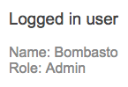
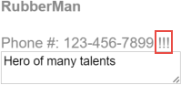
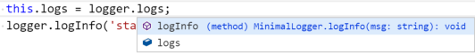

# [返回主目录](Readme.md)<!-- omit in toc --> 

# 目录 <!-- omit in toc --> 


# 实战

## 嵌套的服务依赖

这些被注入服务的消费者不需要知道如何创建这个服务。新建和缓存这个服务是依赖注入器的工作。消费者只要让依赖注入框架知道它需要哪些依赖项就可以了。

有时候一个服务依赖其它服务...而其它服务可能依赖另外的更多服务。 依赖注入框架会负责正确的顺序解析这些嵌套的依赖项。 在每一步，依赖的使用者只要在它的构造函数里简单声明它需要什么，框架就会完成所有剩下的事情。

下面的例子往 AppComponent 里声明它依赖 LoggerService 和 UserContext。

```ts
constructor(logger: LoggerService, public userContext: UserContextService) {
  userContext.loadUser(this.userId);
  logger.logInfo('AppComponent initialized');
}
```

UserContext 转而依赖 LoggerService 和 UserService（这个服务用来收集特定用户信息）。

```ts
@Injectable({
  providedIn: 'root'
})
export class UserContextService {
  constructor(private userService: UserService, private loggerService: LoggerService) {
  }
}
```
当 Angular 新建 AppComponent 时，依赖注入框架会先创建一个 LoggerService 的实例，然后创建 UserContextService 实例。 UserContextService 也需要框架刚刚创建的这个 LoggerService 实例，这样框架才能为它提供同一个实例。UserContextService 还需要框架创建过的 UserService。 UserService 没有其它依赖，所以依赖注入框架可以直接 new 出该类的一个实例，并把它提供给 UserContextService 的构造函数。

父组件 AppComponent 不需要了解这些依赖的依赖。 只要在构造函数中声明自己需要的依赖即可（这里是 LoggerService 和 UserContextService），框架会帮你解析这些嵌套的依赖。

当所有的依赖都就位之后，AppComponent 就会显示该用户的信息。



## 把服务的范围限制到某个组件的子树下

Angular 应用程序有多个依赖注入器，组织成一个与组件树平行的树状结构。 每个注入器都会创建依赖的一个单例。在所有该注入器负责提供服务的地方，所提供的都是同一个实例。 可以在注入器树的任何层级提供和建立特定的服务。这意味着，如果在多个注入器中提供该服务，那么该服务也就会有多个实例。

由根注入器提供的依赖可以注入到应用中任何地方的任何组件中。 但有时候你可能希望把服务的有效性限制到应用程序的一个特定区域。 比如，你可能希望用户明确选择一个服务，而不是让根注入器自动提供它。

通过在组件树的子级根组件中提供服务，可以把一个被注入服务的作用域局限在应用程序结构中的某个分支中。 这个例子中展示了如何通过把服务添加到子组件 @Component() 装饰器的 providers 数组中，来为 HeroesBaseComponent 提供另一个 HeroService 实例：
```ts
@Component({
  selector: 'app-unsorted-heroes',
  template: `<div *ngFor="let hero of heroes">{{hero.name}}</div>`,
  providers: [HeroService]
})
export class HeroesBaseComponent implements OnInit {
  constructor(private heroService: HeroService) { }
}
```
当 Angular 新建 HeroBaseComponent 的时候，它会同时新建一个 HeroService 实例，该实例只在该组件及其子组件(如果有)中可见。

也可以在应用程序别处的另一个组件里提供 HeroService。这样就会导致在另一个注入器中存在该服务的另一个实例。

## 多个服务实例(沙箱式隔离)

在组件树的同一个级别上，有时需要一个服务的多个实例。

一个用来保存其伴生组件的实例状态的服务就是个好例子。 每个组件都需要该服务的单独实例。 每个服务有自己的工作状态，与其它组件的服务和状态隔离。这叫做沙箱化，因为每个服务和组件实例都在自己的沙箱里运行。

在这个例子中，HeroBiosComponent 呈现了 HeroBioComponent 的三个实例。

```ts
@Component({
  selector: 'app-hero-bios',
  template: `
    <app-hero-bio [heroId]="1"></app-hero-bio>
    <app-hero-bio [heroId]="2"></app-hero-bio>
    <app-hero-bio [heroId]="3"></app-hero-bio>`,
  providers: [HeroService]
})
export class HeroBiosComponent {
}
```
每个 HeroBioComponent 都能编辑一个英雄的生平。HeroBioComponent 依赖 HeroCacheService 服务来对该英雄进行读取、缓存和执行其它持久化操作。
```ts
@Injectable()
export class HeroCacheService {
  hero: Hero;
  constructor(private heroService: HeroService) {}

  fetchCachedHero(id: number) {
    if (!this.hero) {
      this.hero = this.heroService.getHeroById(id);
    }
    return this.hero;
  }
}
```
这三个 HeroBioComponent 实例不能共享同一个 HeroCacheService 实例。否则它们会相互冲突，争相把自己的英雄放在缓存里面。

它们应该通过在自己的元数据(metadata)providers 数组里面列出 HeroCacheService, 这样每个 HeroBioComponent 就能拥有自己独立的 HeroCacheService 实例了。
```ts
@Component({
  selector: 'app-hero-bio',
  template: `
    <h4>{{hero.name}}</h4>
    <ng-content></ng-content>
    <textarea cols="25" [(ngModel)]="hero.description"></textarea>`,
  providers: [HeroCacheService]
})

export class HeroBioComponent implements OnInit  {
  @Input() heroId: number;

  constructor(private heroCache: HeroCacheService) { }

  ngOnInit() { this.heroCache.fetchCachedHero(this.heroId); }

  get hero() { return this.heroCache.hero; }
}
```

父组件 HeroBiosComponent 把一个值绑定到 heroId。ngOnInit 把该 id 传递到服务，然后服务获取和缓存英雄。hero 属性的 getter 从服务里面获取缓存的英雄，并在模板里显示它绑定到属性值。


## 使用参数装饰器来限定依赖查找方式
当类需要某个依赖项时，该依赖项就会作为参数添加到类的构造函数中。 当 Angular 需要实例化该类时，就会调用 DI 框架来提供该依赖。 默认情况下，DI 框架会在注入器树中查找一个提供者，从该组件的局部注入器开始，如果需要，则沿着注入器树向上冒泡，直到根注入器。
- 第一个配置过该提供者的注入器就会把依赖（服务实例或值）提供给这个构造函数。

- 如果在根注入器中也没有找到提供者，则 DI 框架将会抛出一个错误。

通过在类的构造函数中对服务参数使用参数装饰器，可以提供一些选项来修改默认的搜索行为。

### 用 @Optional 来让依赖是可选的，以及使用 @Host 来限定搜索方式

依赖可以注册在组件树的任何层级上。 当组件请求某个依赖时，Angular 会从该组件的注入器找起，沿着注入器树向上，直到找到了第一个满足要求的提供者。如果没找到依赖，Angular 就会抛出一个错误。

某些情况下，你需要限制搜索，或容忍依赖项的缺失。 你可以使用组件构造函数参数上的 @Host 和 @Optional 这两个限定装饰器来修改 Angular 的搜索行为。

- @Optional 属性装饰器告诉 Angular 当找不到依赖时就返回 null。

- @Host 属性装饰器会禁止在宿主组件以上的搜索。宿主组件通常就是请求该依赖的那个组件。 不过，当该组件投影进某个父组件时，那个父组件就会变成宿主。下面的例子中介绍了第二种情况。

如下例所示，这些装饰器可以独立使用，也可以同时使用。这个HeroBiosAndContactsComponent 是你以前见过的那个 HeroBiosComponent 的修改版。

```ts
@Component({
  selector: 'app-hero-bios-and-contacts',
  template: `
    <app-hero-bio [heroId]="1"> <app-hero-contact></app-hero-contact> </app-hero-bio>
    <app-hero-bio [heroId]="2"> <app-hero-contact></app-hero-contact> </app-hero-bio>
    <app-hero-bio [heroId]="3"> <app-hero-contact></app-hero-contact> </app-hero-bio>`,
  providers: [HeroService]
})
export class HeroBiosAndContactsComponent {
  constructor(logger: LoggerService) {
    logger.logInfo('Creating HeroBiosAndContactsComponent');
  }
}
```
注意看模板：
```ts
template: `
  <app-hero-bio [heroId]="1"> <app-hero-contact></app-hero-contact> </app-hero-bio>
  <app-hero-bio [heroId]="2"> <app-hero-contact></app-hero-contact> </app-hero-bio>
  <app-hero-bio [heroId]="3"> <app-hero-contact></app-hero-contact> </app-hero-bio>`,
```
在 `<hero-bio>` 标签中是一个新的 `<hero-contact>` 元素。Angular 就会把相应的 HeroContactComponent投影(transclude)进 HeroBioComponent 的视图里， 将它放在 HeroBioComponent 模板的 `<ng-content>` 标签槽里。
```ts
template: `
  <h4>{{hero.name}}</h4>
  <ng-content></ng-content>
  <textarea cols="25" [(ngModel)]="hero.description"></textarea>`,
```
从 HeroContactComponent 获得的英雄电话号码，被投影到上面的英雄描述里，结果如下：


这里的 HeroContactComponent 演示了限定型装饰器。
```ts
@Component({
  selector: 'app-hero-contact',
  template: `
  <div>Phone #: {{phoneNumber}}
  <span *ngIf="hasLogger">!!!</span></div>`
})
export class HeroContactComponent {

  hasLogger = false;

  constructor(
      @Host() // limit to the host component's instance of the HeroCacheService
      private heroCache: HeroCacheService,

      @Host()     // limit search for logger; hides the application-wide logger
      @Optional() // ok if the logger doesn't exist
      private loggerService: LoggerService
  ) {
    if (loggerService) {
      this.hasLogger = true;
      loggerService.logInfo('HeroContactComponent can log!');
    }
  }

  get phoneNumber() { return this.heroCache.hero.phone; }

}
```
注意构造函数的参数。
```ts
@Host() // limit to the host component's instance of the HeroCacheService
private heroCache: HeroCacheService,

@Host()     // limit search for logger; hides the application-wide logger
@Optional() // ok if the logger doesn't exist
private loggerService: LoggerService
```
@Host() 函数是构造函数属性 heroCache 的装饰器，确保从其父组件 HeroBioComponent 得到一个缓存服务。如果该父组件中没有该服务，Angular 就会抛出错误，即使组件树里的再上级有某个组件拥有这个服务，还是会抛出错误。

另一个 @Host() 函数是构造函数属性 loggerService 的装饰器。 在本应用程序中只有一个在 AppComponent 级提供的 LoggerService 实例。 该宿主 HeroBioComponent 没有自己的 LoggerService 提供者。

如果没有同时使用 @Optional() 装饰器的话，Angular 就会抛出错误。当该属性带有 @Optional() 标记时，Angular 就会把 loggerService 设置为 null，并继续执行组件而不会抛出错误。

下面是 HeroBiosAndContactsComponent 的执行结果：


如果注释掉 @Host() 装饰器，Angular 就会沿着注入器树往上走，直到在 AppComponent 中找到该日志服务。日志服务的逻辑加了进来，所显示的英雄信息增加了 "!!!" 标记，这表明确实找到了日志服务。


如果你恢复了 @Host() 装饰器，并且注释掉 @Optional 装饰器，应用就会抛出一个错误，因为它在宿主组件这一层找不到所需的 Logger。EXCEPTION: No provider for LoggerService! (HeroContactComponent -> LoggerService)

### 使用 @Inject 指定自定义提供者

自定义提供者让你可以为隐式依赖提供一个具体的实现，比如内置浏览器 API。下面的例子使用 InjectionToken 来提供 localStorage，将其作为 BrowserStorageService 的依赖项。

```ts
import { Inject, Injectable, InjectionToken } from '@angular/core';

export const BROWSER_STORAGE = new InjectionToken<Storage>('Browser Storage', {
  providedIn: 'root',
  factory: () => localStorage
});

@Injectable({
  providedIn: 'root'
})
export class BrowserStorageService {
  constructor(@Inject(BROWSER_STORAGE) public storage: Storage) {}

  get(key: string) {
    this.storage.getItem(key);
  }

  set(key: string, value: string) {
    this.storage.setItem(key, value);
  }

  remove(key: string) {
    this.storage.removeItem(key);
  }

  clear() {
    this.storage.clear();
  }
}
```
factory 函数返回 window 对象上的 localStorage 属性。Inject 装饰器修饰一个构造函数参数，用于为某个依赖提供自定义提供者。现在，就可以在测试期间使用 localStorage 的 Mock API 来覆盖这个提供者了，而不必与真实的浏览器 API 进行交互。

### 使用 @Self 和 @SkipSelf 来修改提供者的搜索方式

注入器也可以通过构造函数的参数装饰器来指定范围。下面的例子就在 Component 类的 providers 中使用浏览器的 sessionStorage API 覆盖了 BROWSER_STORAGE 令牌。同一个 BrowserStorageService 在构造函数中使用 @Self 和 @SkipSelf 装饰器注入了两次，来分别指定由哪个注入器来提供依赖。

```ts
import { Component, OnInit, Self, SkipSelf } from '@angular/core';
import { BROWSER_STORAGE, BrowserStorageService } from './storage.service';

@Component({
  selector: 'app-storage',
  template: `
    Open the inspector to see the local/session storage keys:

    <h3>Session Storage</h3>
    <button (click)="setSession()">Set Session Storage</button>

    <h3>Local Storage</h3>
    <button (click)="setLocal()">Set Local Storage</button>
  `,
  providers: [
    BrowserStorageService,
    { provide: BROWSER_STORAGE, useFactory: () => sessionStorage }
  ]
})
export class StorageComponent implements OnInit {

  constructor(
    @Self() private sessionStorageService: BrowserStorageService,
    @SkipSelf() private localStorageService: BrowserStorageService,
  ) { }

  ngOnInit() {
  }

  setSession() {
    this.sessionStorageService.set('hero', 'Dr Nice - Session');
  }

  setLocal() {
    this.localStorageService.set('hero', 'Dr Nice - Local');
  }
}
```
使用 @Self 装饰器时，注入器只在该组件的注入器中查找提供者。@SkipSelf 装饰器可以让你跳过局部注入器，并在注入器树中向上查找，以发现哪个提供者满足该依赖。 sessionStorageService 实例使用浏览器的 sessionStorage 来跟 BrowserStorageService 打交道，而 localStorageService 跳过了局部注入器，使用根注入器提供的 BrowserStorageService，它使用浏览器的 localStorage API。

## 注入组件的 DOM 元素
即便开发者极力避免，仍然会有很多视觉效果和第三方工具 (比如 jQuery) 需要访问 DOM。这会让你不得不访问组件所在的 DOM 元素。

为了说明这一点，请看属性型指令中那个 HighlightDirective 的简化版。
```ts
import { Directive, ElementRef, HostListener, Input } from '@angular/core';

@Directive({
  selector: '[appHighlight]'
})
export class HighlightDirective {

  @Input('appHighlight') highlightColor: string;

  private el: HTMLElement;

  constructor(el: ElementRef) {
    this.el = el.nativeElement;
  }

  @HostListener('mouseenter') onMouseEnter() {
    this.highlight(this.highlightColor || 'cyan');
  }

  @HostListener('mouseleave') onMouseLeave() {
    this.highlight(null);
  }

  private highlight(color: string) {
    this.el.style.backgroundColor = color;
  }
}
```
当用户把鼠标移到 DOM 元素上时，指令将指令所在的元素的背景设置为一个高亮颜色。

Angular 把构造函数参数 el 设置为注入的 ElementRef，该 ElementRef 代表了宿主的 DOM 元素， 它的 nativeElement 属性把该 DOM 元素暴露给了指令。

下面的代码把指令的 myHighlight 属性(Attribute)填加到两个 `<div>` 标签里，一个没有赋值，一个赋值了颜色。
```html
<div id="highlight"  class="di-component"  appHighlight>
  <h3>Hero Bios and Contacts</h3>
  <div appHighlight="yellow">
    <app-hero-bios-and-contacts></app-hero-bios-and-contacts>
  </div>
</div>
```

下图显示了鼠标移到 `<hero-bios-and-contacts>` 标签上的效果：


## 使用提供者来定义依赖
本节会示范如何编写提供者来交付被依赖的服务。

为了从依赖注入器中获取服务，你必须传给它一个令牌。 Angular 通常会通过指定构造函数参数以及参数的类型来处理它。 参数的类型可以用作注入器的查阅令牌。 Angular 会把该令牌传给注入器，并把它的结果赋给相应的参数。

下面是一个典型的例子。
```ts
constructor(logger: LoggerService) {
  logger.logInfo('Creating HeroBiosComponent');
}
```
Angular 会要求注入器提供与 LoggerService 相关的服务，并把返回的值赋给 logger 参数。

如果注入器已经缓存了与该令牌相关的服务实例，那么它就会直接提供此实例。 如果它没有，它就要使用与该令牌相关的提供者来创建一个。

> 如果注入器无法根据令牌在自己内部找到对应的提供者，它便将请求移交给它的父级注入器，这个过程不断重复，直到没有更多注入器为止。 如果没找到，注入器就抛出一个错误...除非这个请求是可选的。

新的注入器没有提供者。 Angular 会使用一组首选提供者来初始化它本身的注入器。 你必须为自己应用程序特有的依赖项来配置提供者。

### 定义提供者

用于实例化类的默认方法不一定总适合用来创建依赖。你可以到依赖提供者部分查看其它方法。 HeroOfTheMonthComponent 例子示范了一些替代方案，展示了为什么需要它们。 它看起来很简单：一些属性和一些由 logger 生成的日志。


它背后的代码定制了 DI 框架提供依赖项的方法和位置。 这个例子阐明了通过提供对象字面量来把对象的定义和 DI 令牌关联起来的另一种方式。

```ts
import { Component, Inject } from '@angular/core';

import { DateLoggerService } from './date-logger.service';
import { Hero }              from './hero';
import { HeroService }       from './hero.service';
import { LoggerService }     from './logger.service';
import { MinimalLogger }     from './minimal-logger.service';
import { RUNNERS_UP,
         runnersUpFactory }  from './runners-up';

@Component({
  selector: 'app-hero-of-the-month',
  templateUrl: './hero-of-the-month.component.html',
  providers: [
    { provide: Hero,          useValue:    someHero },
    { provide: TITLE,         useValue:   'Hero of the Month' },
    { provide: HeroService,   useClass:    HeroService },
    { provide: LoggerService, useClass:    DateLoggerService },
    { provide: MinimalLogger, useExisting: LoggerService },
    { provide: RUNNERS_UP,    useFactory:  runnersUpFactory(2), deps: [Hero, HeroService] }
  ]
})
export class HeroOfTheMonthComponent {
  logs: string[] = [];

  constructor(
      logger: MinimalLogger,
      public heroOfTheMonth: Hero,
      @Inject(RUNNERS_UP) public runnersUp: string,
      @Inject(TITLE) public title: string)
  {
    this.logs = logger.logs;
    logger.logInfo('starting up');
  }
}
```
providers 数组展示了你可以如何使用其它的键来定义提供者：useValue、useClass、useExisting 或 useFactory。

#### 值提供者：useValue
useValue 键让你可以为 DI 令牌关联一个固定的值。 使用该技巧来进行运行期常量设置，比如网站的基础地址和功能标志等。 你也可以在单元测试中使用值提供者，来用一个 Mock 数据来代替一个生产环境下的数据服务。

HeroOfTheMonthComponent 例子中有两个值-提供者。
```ts
{ provide: Hero,          useValue:    someHero },
{ provide: TITLE,         useValue:   'Hero of the Month' },
```
- 第一处提供了用于 Hero 令牌的 Hero 类的现有实例，而不是要求注入器使用 new 来创建一个新实例或使用它自己的缓存实例。这里令牌就是这个类本身。

- 第二处为 TITLE 令牌指定了一个字符串字面量资源。 TITLE 提供者的令牌不是一个类，而是一个特别的提供者查询键，名叫InjectionToken，表示一个 InjectionToken 实例。

你可以把 InjectionToken 用作任何类型的提供者的令牌，但是当依赖是简单类型（比如字符串、数字、函数）时，它会特别有用。

一个值-提供者的值必须在指定之前定义。 比如标题字符串就是立即可用的。 该例中的 someHero 变量是以前在如下的文件中定义的。 你不能使用那些要等以后才能定义其值的变量。

```ts
const someHero = new Hero(42, 'Magma', 'Had a great month!', '555-555-5555');
```
其它类型的提供者都会惰性创建它们的值，也就是说只在需要注入它们的时候才创建。

#### 类提供者：useClass
useClass 提供的键让你可以创建并返回指定类的新实例。

你可以使用这类提供者来为公共类或默认类换上一个替代实现。比如，这个替代实现可以实现一种不同的策略来扩展默认类，或在测试环境中模拟真实类的行为。

请看下面 HeroOfTheMonthComponent 里的两个例子：
```ts
{ provide: HeroService,   useClass:    HeroService },
{ provide: LoggerService, useClass:    DateLoggerService },
```
第一个提供者是展开了语法糖的，是一个典型情况的展开。一般来说，被新建的类(HeroService)同时也是该提供者的注入令牌。 通常都选用缩写形式，完整形式可以让细节更明确。

第二个提供者使用 DateLoggerService 来满足 LoggerService。该 LoggerService 在 AppComponent 级别已经被注册。当这个组件要求 LoggerService 的时候，它得到的却是 DateLoggerService 服务的实例。

> 这个组件及其子组件会得到 DateLoggerService 实例。这个组件树之外的组件得到的仍是 LoggerService 实例。

DateLoggerService 从 LoggerService 继承；它把当前的日期/时间附加到每条信息上。
```ts
@Injectable({
  providedIn: 'root'
})
export class DateLoggerService extends LoggerService
{
  logInfo(msg: any)  { super.logInfo(stamp(msg)); }
  logDebug(msg: any) { super.logInfo(stamp(msg)); }
  logError(msg: any) { super.logError(stamp(msg)); }
}

function stamp(msg: any) { return msg + ' at ' + new Date(); }
```

#### 别名提供者：useExisting
useExisting 提供了一个键，让你可以把一个令牌映射成另一个令牌。实际上，第一个令牌就是第二个令牌所关联的服务的别名，这样就创建了访问同一个服务对象的两种途径。
```ts
{ provide: MinimalLogger, useExisting: LoggerService },
```
你可以使用别名接口来窄化 API。下面的例子中使用别名就是为了这个目的。

想象 LoggerService 有个很大的 API 接口，远超过现有的三个方法和一个属性。你可能希望把 API 接口收窄到只有两个你确实需要的成员。在这个例子中，MinimalLogger类-接口，就这个 API 成功缩小到了只有两个成员：
```ts
// Class used as a "narrowing" interface that exposes a minimal logger
// Other members of the actual implementation are invisible
export abstract class MinimalLogger {
  logs: string[];
  logInfo: (msg: string) => void;
}
```

下面的例子在一个简化版的 HeroOfTheMonthComponent 中使用 MinimalLogger。

```ts
@Component({
  selector: 'app-hero-of-the-month',
  templateUrl: './hero-of-the-month.component.html',
  // TODO: move this aliasing, `useExisting` provider to the AppModule
  providers: [{ provide: MinimalLogger, useExisting: LoggerService }]
})
export class HeroOfTheMonthComponent {
  logs: string[] = [];
  constructor(logger: MinimalLogger) {
    logger.logInfo('starting up');
  }
}
```
HeroOfTheMonthComponent 构造函数的 logger 参数是一个 MinimalLogger 类型，在支持 TypeScript 感知的编辑器里，只能看到它的两个成员 logs 和 logInfo：


实际上，Angular 把 logger 参数设置为注入器里 LoggerService 令牌下注册的完整服务，该令牌恰好是以前提供的那个 DateLoggerService 实例。

在下面的图片中，显示了日志日期，可以确认这一点：


#### 工厂提供者：useFactory
useFactory 提供了一个键，让你可以通过调用一个工厂函数来创建依赖实例，如下面的例子所示。

```ts
{ provide: RUNNERS_UP,    useFactory:  runnersUpFactory(2), deps: [Hero, HeroService] }
```
注入器通过调用你用 useFactory 键指定的工厂函数来提供该依赖的值。 注意，提供者的这种形态还有第三个键 deps，它指定了供 useFactory 函数使用的那些依赖。

