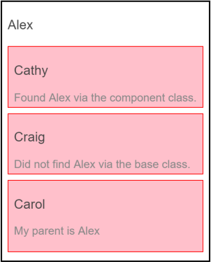
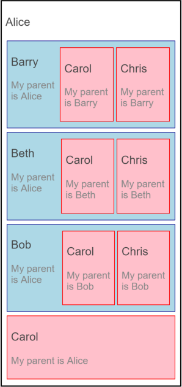

# [返回主目录](Readme.md)<!-- omit in toc --> 

# 目录 <!-- omit in toc --> 
- [使用 DI 浏览组件树](#%e4%bd%bf%e7%94%a8-di-%e6%b5%8f%e8%a7%88%e7%bb%84%e4%bb%b6%e6%a0%91)
- [查找已知类型的父组件](#%e6%9f%a5%e6%89%be%e5%b7%b2%e7%9f%a5%e7%b1%bb%e5%9e%8b%e7%9a%84%e7%88%b6%e7%bb%84%e4%bb%b6)
- [不能根据父组件的基类访问父组件](#%e4%b8%8d%e8%83%bd%e6%a0%b9%e6%8d%ae%e7%88%b6%e7%bb%84%e4%bb%b6%e7%9a%84%e5%9f%ba%e7%b1%bb%e8%ae%bf%e9%97%ae%e7%88%b6%e7%bb%84%e4%bb%b6)
- [根据父组件的类接口查找它](#%e6%a0%b9%e6%8d%ae%e7%88%b6%e7%bb%84%e4%bb%b6%e7%9a%84%e7%b1%bb%e6%8e%a5%e5%8f%a3%e6%9f%a5%e6%89%be%e5%ae%83)
- [使用 @SkipSelf() 在树中查找父组件](#%e4%bd%bf%e7%94%a8-skipself-%e5%9c%a8%e6%a0%91%e4%b8%ad%e6%9f%a5%e6%89%be%e7%88%b6%e7%bb%84%e4%bb%b6)
- [父类接口](#%e7%88%b6%e7%b1%bb%e6%8e%a5%e5%8f%a3)
- [provideParent() 辅助函数](#provideparent-%e8%be%85%e5%8a%a9%e5%87%bd%e6%95%b0)

## 使用 DI 浏览组件树

应用的组件之间经常需要共享信息。你通常要用松耦合的技术来共享信息，比如数据绑定和服务共享。但是有时候让一个组件直接引用另一个组件还是很有意义的。 例如，你需要通过另一个组件的直接引用来访问其属性或调用其方法。

在 Angular 中获取组件引用略微有些棘手。 Angular 组件本身并没有一棵可以用编程方式检查或浏览的树。 其父子关系是通过组件的视图对象间接建立的。

每个组件都有一个宿主视图和一些内嵌视图。 组件 A 的内嵌视图可以是组件 B 的宿主视图，而组件 B 还可以有它自己的内嵌视图。 这意味着每个组件都有一棵以该组件的宿主视图为根节点的视图树。

有一些用于在视图树中向下导航的 API。 请到 API 参考手册中查看 Query、QueryList、ViewChildren 和 ContentChildren。

不存在用于获取父引用的公共 API。 不过，由于每个组件的实例都会添加到注入器的容器中，因此你可以通过 Angular 的依赖注入来访问父组件。

本节描述的就是关于这种做法的一些技巧。

## 查找已知类型的父组件
你可以使用标准的类注入形式来获取类型已知的父组件。

在下面的例子中，父组件 AlexComponent 具有一些子组件，包括 CathyComponent：
```ts
// parent-finder.component.ts (AlexComponent v.1)
@Component({
  selector: 'alex',
  template: `
    <div class="a">
      <h3>{{name}}</h3>
      <cathy></cathy>
      <craig></craig>
      <carol></carol>
    </div>`,
})
export class AlexComponent extends Base
{
  name = 'Alex';
}
```
在把 AlexComponent 注入到 CathyComponent 的构造函数中之后，Cathy 可以报告她是否能访问 Alex：
```ts
// parent-finder.component.ts (CathyComponent)
@Component({
  selector: 'cathy',
  template: `
  <div class="c">
    <h3>Cathy</h3>
    {{alex ? 'Found' : 'Did not find'}} Alex via the component class.<br>
  </div>`
})
export class CathyComponent {
  constructor( @Optional() public alex: AlexComponent ) { }
}
```
## 不能根据父组件的基类访问父组件
如果你不知道具体的父组件类怎么办？

可复用组件可能是多个组件的子组件。想象一个用于呈现相关金融工具的突发新闻的组件。 出于商业原因，当市场上的数据流发生变化时，这些新组件会频繁调用其父组件。

该应用可能定义了十几个金融工具组件。理想情况下，它们全都实现了同一个基类，你的 NewsComponent 也能理解其 API。

> 如果能查找实现了某个接口的组件当然更好。 但那是不可能的。因为 TypeScript 接口在转译后的 JavaScript 中不存在，而 JavaScript 不支持接口。 因此，找无可找。

这个设计并不怎么好。 该例子是为了验证组件是否能通过其父组件的基类来注入父组件。

这个例子中的 CraigComponent 体现了此问题。往回看，你可以看到 Alex 组件扩展（继承）了基类 Base。
```ts
export class AlexComponent extends Base
```
CraigComponent 试图把 Base 注入到它的构造函数参数 alex 中，并汇报这次注入是否成功了。

```ts
@Component({
  selector: 'craig',
  template: `
  <div class="c">
    <h3>Craig</h3>
    {{alex ? 'Found' : 'Did not find'}} Alex via the base class.
  </div>`
})
export class CraigComponent {
  constructor( @Optional() public alex: Base ) { }
}
```
不幸的是，这不行！**你不能通过父组件的基类注入它。**

## 根据父组件的类接口查找它
你可以通过父组件的类接口来查找它。

该父组件必须合作，以类接口令牌为名，为自己定义一个别名提供者。

回忆一下，Angular 总是会把组件实例添加到它自己的注入器中，因此以前你才能把 Alex 注入到 Cathy 中。

编写一个 别名提供者（一个 provide 对象字面量，其中有一个 useExisting 定义），创造了另一种方式来注入同一个组件实例，并把那个提供者添加到 AlexComponent @Component() 元数据的 providers 数组中。
```ts
providers: [{ provide: Parent, useExisting: forwardRef(() => AlexComponent) }],
```
Parent 是该提供者的类接口。 forwardRef 用于打破循环引用，因为在你刚才这个定义中 AlexComponent 引用了自身。

Alex 的第三个子组件 Carol，把其父组件注入到了自己的 parent 参数中 —— 和你以前做过的一样。
```ts
export class CarolComponent {
  name = 'Carol';
  constructor( @Optional() public parent: Parent ) { }
}
```
下面是 Alex 及其家人的运行效果。


## 使用 @SkipSelf() 在树中查找父组件

想象一下组件树的一个分支：Alice -> Barry -> Carol。 无论 Alice 还是 Barry 都实现了类接口 Parent。

Barry 很为难。他需要访问他的母亲 Alice，同时他自己还是 Carol 的父亲。 这意味着他必须同时注入 Parent 类接口来找到 Alice，同时还要提供一个 Parent 来满足 Carol 的要求。

Barry 的代码如下。
```ts
const templateB = `
  <div class="b">
    <div>
      <h3>{{name}}</h3>
      <p>My parent is {{parent?.name}}</p>
    </div>
    <carol></carol>
    <chris></chris>
  </div>`;

@Component({
  selector:   'barry',
  template:   templateB,
  providers:  [{ provide: Parent, useExisting: forwardRef(() => BarryComponent) }]
})
export class BarryComponent implements Parent {
  name = 'Barry';
  constructor( @SkipSelf() @Optional() public parent: Parent ) { }
}
```
Barry 的 providers 数组看起来和 Alex 的一样。 如果你准备继续像这样编写别名提供者，就应该创建一个辅助函数。

现在，注意看 Barry 的构造函数。
```ts
// Barry's constructor
constructor( @SkipSelf() @Optional() public parent: Parent ) { }
// Carol's constructor
constructor( @Optional() public parent: Parent ) { }
```

除增加了 @SkipSelf 装饰器之外，它和 Carol 的构造函数相同。

使用 @SkipSelf 有两个重要原因：
1. 它告诉注入器开始从组件树中高于自己的位置（也就是父组件）开始搜索 Parent 依赖。

2. 如果你省略了 @SkipSelf 装饰器，Angular 就会抛出循环依赖错误。
Cannot instantiate cyclic dependency! (BethComponent -> Parent -> BethComponent)

下面是 Alice、Barry 及其家人的运行效果。



## 父类接口
你已经学过，类接口是一个抽象类，它实际上用做接口而不是基类。

下面的例子定义了一个类接口 Parent。
```ts
export abstract class Parent { name: string; }
```
Parent 类接口定义了一个带类型的 name 属性，但没有实现它。 这个 name 属性是父组件中唯一可供子组件调用的成员。 这样的窄化接口帮助把子组件从它的父组件中解耦出来。

一个组件想要作为父组件使用，就应该像 AliceComponent 那样实现这个类接口。

```ts
export class AliceComponent implements Parent
```
AlexComponent 应该实现 Parent 才是一种正确的风格。 这个例子中之所以没这样做，只是为了证明即使没有声明接口，代码也可以编译和运行。

## provideParent() 辅助函数
你很快就会厌倦为同一个父组件编写别名提供者的变体形式，特别是带有 forwardRef 的那种。
```TS
providers: [{ provide: Parent, useExisting: forwardRef(() => AlexComponent) }],
```

你可以像把这些逻辑抽取到辅助函数中，就像这样。

```ts
// Helper method to provide the current component instance in the name of a `parentType`.
export function provideParent
  (component: any) {
    return { provide: Parent, useExisting: forwardRef(() => component) };
  }
```
现在，你可以为组件添加一个更简单、更有意义的父组件提供者。
```ts
providers:  [ provideParent(AliceComponent) ]
```

你还可以做得更好。当前版本的辅助函数只能为类接口 Parent 定义别名。 应用可能具有多种父组件类型，每个父组件都有自己的类接口令牌。

这是一个修订后的版本，它默认为 parent，但是也能接受另一个父类接口作为可选的第二参数。
```ts
// Helper method to provide the current component instance in the name of a `parentType`.
// The `parentType` defaults to `Parent` when omitting the second parameter.
export function provideParent
  (component: any, parentType?: any) {
    return { provide: parentType || Parent, useExisting: forwardRef(() => component) };
  }
```
下面是针对不同父组件类型的用法。
```ts
providers:  [ provideParent(BethComponent, DifferentParent) ]
```


