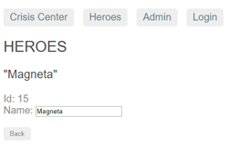
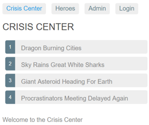

# [返回主目录](Readme.md)<!-- omit in toc --> 

# 目录 <!-- omit in toc --> 


## 路由与导航

在用户使用应用程序时，Angular 的路由器能让用户从一个视图导航到另一个视图。

## 概览

浏览器具有熟悉的导航模式：

- 在地址栏输入 URL，浏览器就会导航到相应的页面。

- 在页面中点击链接，浏览器就会导航到一个新页面。

- 点击浏览器的前进和后退按钮，浏览器就会在你的浏览历史中向前或向后导航。

Angular 的 Router（即“路由器”）借鉴了这个模型。它把浏览器中的 URL 看做一个操作指南， 据此导航到一个由客户端生成的视图，并可以把参数传给支撑视图的相应组件，帮它决定具体该展现哪些内容。 你可以为页面中的链接绑定一个路由，这样，当用户点击链接时，就会导航到应用中相应的视图。 当用户点击按钮、从下拉框中选取，或响应来自任何地方的事件时，你也可以在代码控制下进行导航。 路由器还在浏览器的历史日志中记录下这些活动，这样浏览器的前进和后退按钮也能照常工作。

## 基础知识

本章包括一系列里程碑，从一个单模块、两个页面的简单程序逐步走向带有多个子路由的多视图设计。

先对路由的一些核心概念做一个介绍，它能帮你逐步过渡到细节。

### `<base href>` 元素
大多数带路由的应用都要在index.html的 `<head>` 标签下先添加一个 `<base>` 元素，来告诉路由器该如何合成导航用的 URL。

如果 app 文件夹是该应用的根目录（就像范例应用中一样），那就把 href 的值设置为下面这样：

```html
<!-- src/index.html(base-href) -->
<base href="/">
```
### 从路由库中导入
Angular 的路由器是一个可选的服务，它用来呈现指定的 URL 所对应的视图。 它并不是 Angular 核心库的一部分，而是在它自己的 @angular/router 包中。 像其它 Angular 包一样，你可以从它导入所需的一切。
```ts
import { RouterModule, Routes } from '@angular/router';
```

### 配置
每个带路由的 Angular 应用都有一个Router（路由器）服务的单例对象。 当浏览器的 URL 变化时，路由器会查找对应的 Route（路由），并据此决定该显示哪个组件。

路由器需要先配置才会有路由信息。 下面的例子创建了五个路由定义，并用 RouterModule.forRoot() 方法来配置路由器， 并把它的返回值添加到 AppModule 的 imports 数组中。
```ts
const appRoutes: Routes = [
  { path: 'crisis-center', component: CrisisListComponent },
  { path: 'hero/:id',      component: HeroDetailComponent },
  {
    path: 'heroes',
    component: HeroListComponent,
    data: { title: 'Heroes List' }
  },
  { path: '',
    redirectTo: '/heroes',
    pathMatch: 'full'
  },
  { path: '**', component: PageNotFoundComponent }
];

@NgModule({
  imports: [
    RouterModule.forRoot(
      appRoutes,
      { enableTracing: true } // <-- debugging purposes only
    )
    // other imports here
  ],
  ...
})
export class AppModule { }
```
这里的路由数组 appRoutes 描述如何进行导航。 把它传给 RouterModule.forRoot() 方法并传给本模块的 imports 数组就可以配置路由器。

每个 Route 都会把一个 URL 的 path 映射到一个组件。 注意，path 不能以斜杠（/）开头。 路由器会为解析和构建最终的 URL，这样当你在应用的多个视图之间导航时，可以任意使用相对路径和绝对路径。

第二个路由中的 :id 是一个路由参数的令牌(Token)。比如 /hero/42 这个 URL 中，“42”就是 id 参数的值。 此 URL 对应的 HeroDetailComponent 组件将据此查找和展现 id 为 42 的英雄。 在本章中稍后的部分，你将会学习关于路由参数的更多知识。

第三个路由中的 data 属性用来存放于每个具体路由有关的任意信息。该数据可以被任何一个激活路由访问，并能用来保存诸如 页标题、面包屑以及其它静态只读数据。本章稍后的部分，你将使用resolve 守卫来获取动态数据。

第四个路由中的空路径（''）表示应用的默认路径，当 URL 为空时就会访问那里，因此它通常会作为起点。 这个默认路由会重定向到 URL /heroes，并显示 HeroesListComponent。

最后一个路由中的 ** 路径是一个通配符。当所请求的 URL 不匹配前面定义的路由表中的任何路径时，路由器就会选择此路由。 这个特性可用于显示“404 - Not Found”页，或自动重定向到其它路由。

这些路由的定义顺序是刻意如此设计的。路由器使用先匹配者优先的策略来匹配路由，所以，具体路由应该放在通用路由的前面。在上面的配置中，带静态路径的路由被放在了前面，后面是空路径路由，因此它会作为默认路由。而通配符路由被放在最后面，这是因为它能匹配上每一个 URL，因此应该只有在前面找不到其它能匹配的路由时才匹配它。

如果你想要看到在导航的生命周期中发生过哪些事件，可以使用路由器默认配置中的 enableTracing 选项。它会把每个导航生命周期中的事件输出到浏览器的控制台。 这应该只用于调试。你只需要把 enableTracing: true 选项作为第二个参数传给 RouterModule.forRoot() 方法就可以了。

### 路由出口(RouterOutlet)
RouterOutlet 是一个来自路由模块中的指令，它的用法类似于组件。 它扮演一个占位符的角色，用于在模板中标出一个位置，路由器将会把要显示在这个出口处的组件显示在这里。

```html
<router-outlet></router-outlet>
<!-- Routed components go here -->
```
有了这份配置，当本应用在浏览器中的 URL 变为 /heroes 时，路由器就会匹配到 path 为 heroes 的 Route，并在宿主视图中的RouterOutlet之后显示 HeroListComponent 组件。

### 路由器链接
现在，你已经有了配置好的一些路由，还找到了渲染它们的地方，但又该如何导航到它呢？固然，从浏览器的地址栏直接输入 URL 也能做到，但是大多数情况下，导航是某些用户操作的结果，比如点击一个 A 标签。

考虑下列模板：
```html
<h1>Angular Router</h1>
<nav>
  <a routerLink="/crisis-center" routerLinkActive="active">Crisis Center</a>
  <a routerLink="/heroes" routerLinkActive="active">Heroes</a>
</nav>
<router-outlet></router-outlet>
```

a 标签上的 RouterLink 指令让路由器得以控制这个 a 元素。 这里的导航路径是固定的，因此可以把一个字符串赋给 routerLink（“一次性”绑定）。

如果需要更加动态的导航路径，那就把它绑定到一个返回链接参数数组的模板表达式。 路由器会把这个数组解析成完整的 URL。

### 路由链接的激活状态
RouterLinkActive 指令会基于当前的 RouterState 为活动的 RouterLink 切换所绑定的 css 类。

在每个 A 标签上，你会看到一个到 RouterLinkActive 的属性绑定，形如 routerLinkActive="..."。

等号右边的模板表达式包含一些用空格分隔的 CSS 类名，当这个链接激活时，路由器将会把它们加上去（并在处于非活动状态时移除）。你还可以把 RouterLinkActive 设置为一个类组成的字符串，如 [routerLinkActive]="'active fluffy'"，或把它绑定到一个返回类似字符串的组件属性。

路由链接的激活状态会向下级联到路由树中的每个层级，所以，父子路由链接可能会同时激活。要覆盖这种行为，可以把 [routerLinkActiveOptions] 绑定为 { exact: true } 表达式，这样 RouterLink 只有当 URL 与当前 URL 精确匹配时才会激活。
### 路由器状态

在导航时的每个生命周期成功完成时，路由器会构建出一个 ActivatedRoute 组成的树，它表示路由器的当前状态。 你可以在应用中的任何地方用 Router 服务及其 routerState 属性来访问当前的 RouterState 值。

RouterState 中的每个 ActivatedRoute 都提供了从任意激活路由开始向上或向下遍历路由树的一种方式，以获得关于父、子、兄弟路由的信息。

### 激活的路由

该路由的路径和参数可以通过注入进来的一个名叫ActivatedRoute的路由服务来获取。 它有一大堆有用的信息，包括：

属性|说明
-|-
url|路由路径的 Observable 对象，是一个由路由路径中的各个部分组成的字符串数组。
data|一个 Observable，其中包含提供给路由的 data 对象。也包含由解析守卫（resolve guard）解析而来的值。
paramMap|一个 Observable，其中包含一个由当前路由的必要参数和可选参数组成的map对象。用这个 map 可以获取来自同名参数的单一值或多重值。
queryParamMap|一个 Observable，其中包含一个对所有路由都有效的查询参数组成的map对象。 用这个 map 可以获取来自查询参数的单一值或多重值。
fragment|一个适用于所有路由的 URL 的 fragment（片段）的 Observable。
outlet|要把该路由渲染到的 RouterOutlet 的名字。对于无名路由，它的路由名是 primary，而不是空串。
routeConfig|用于该路由的路由配置信息，其中包含原始路径。
parent|当该路由是一个子路由时，表示该路由的父级 ActivatedRoute。
firstChild|包含该路由的子路由列表中的第一个 ActivatedRoute。
children|包含当前路由下所有已激活的子路由。

### 路由事件
在每次导航中，Router 都会通过 Router.events 属性发布一些导航事件。这些事件的范围涵盖了从开始导航到结束导航之间的很多时间点。下表中列出了全部导航事件：
路由器事件|说明
-|-
NavigationStart|本事件会在导航开始时触发。
RouteConfigLoadStart|本事件会在 Router 惰性加载 某个路由配置之前触发。
RouteConfigLoadEnd|本事件会在惰性加载了某个路由后触发。
RoutesRecognized|本事件会在路由器解析完 URL，并识别出了相应的路由时触发
GuardsCheckStart|本事件会在路由器开始 Guard 阶段之前触发。
ChildActivationStart|本事件会在路由器开始激活路由的子路由时触发。
ActivationStart|本事件会在路由器开始激活某个路由时触发。
GuardsCheckEnd|本事件会在路由器成功完成了 Guard 阶段时触发。
ResolveStart|本事件会在 Router 开始解析（Resolve）阶段时触发。
ResolveEnd|本事件会在路由器成功完成了路由的解析（Resolve）阶段时触发。
ChildActivationEnd|本事件会在路由器激活了路由的子路由时触发。
ActivationEnd|本事件会在路由器激活了某个路由时触发。
NavigationEnd|本事件会在导航成功结束之后触发。
NavigationCancel|本事件会在导航被取消之后触发。 这可能是因为在导航期间某个路由守卫返回了 false。
NavigationError|这个事件会在导航由于意料之外的错误而失败时触发。
Scroll|本事件代表一个滚动事件。

当启用了 enableTracing 选项时，这些事件也同时会记录到控制台中。

### 总结一下
该应用有一个配置过的路由器。 外壳组件中有一个 RouterOutlet，它能显示路由器所生成的视图。 它还有一些 RouterLink，用户可以点击它们，来通过路由器进行导航。

下面是一些路由器中的关键词汇及其含义：
路由器部件|含义
-|-
Router（路由器）|为激活的 URL 显示应用组件。管理从一个组件到另一个组件的导航
RouterModule|一个独立的 NgModule，用于提供所需的服务提供者，以及用来在应用视图之间进行导航的指令。
Routes（路由数组）|定义了一个路由数组，每一个都会把一个 URL 路径映射到一个组件。
Route（路由）|定义路由器该如何根据 URL 模式（pattern）来导航到组件。大多数路由都由路径和组件类构成。
RouterOutlet（路由出口）|该指令（`<router-outlet>`）用来标记出路由器该在哪里显示视图。
RouterLink（路由链接）|这个指令把可点击的 HTML 元素绑定到某个路由。点击带有 routerLink 指令（绑定到字符串或链接参数数组）的元素时就会触发一次导航。
RouterLinkActive（活动路由链接）|当 HTML 元素上或元素内的routerLink变为激活或非激活状态时，该指令为这个 HTML 元素添加或移除 CSS 类。
ActivatedRoute（激活的路由）|为每个路由组件提供的一个服务，它包含特定于路由的信息，比如路由参数、静态数据、解析数据、全局查询参数和全局碎片（fragment）。
RouterState（路由器状态）|路由器的当前状态包含了一棵由程序中激活的路由构成的树。它包含一些用于遍历路由树的快捷方法。
链接参数数组|这个数组会被路由器解释成一个路由操作指南。你可以把一个RouterLink绑定到该数组，或者把它作为参数传给Router.navigate方法。
路由组件|一个带有RouterOutlet的 Angular 组件，它根据路由器的导航来显示相应的视图。


## 范例应用

本章要讲的是如何开发一个带路由的多页面应用。 接下来会重点讲它的设计决策，并描述路由的关键特性，比如：

- 把应用的各个特性组织成模块。

- 导航到组件（Heroes 链接到“英雄列表”组件）。

- 包含一个路由参数（当路由到“英雄详情”时，把该英雄的 id 传进去）。

- 子路由（危机中心特性有一组自己的路由）。

- CanActivate 守卫（检查路由的访问权限）。

- CanActivateChild 守卫（检查子路由的访问权限）。

- CanDeactivate 守卫（询问是否丢弃未保存的更改）。

- Resolve 守卫（预先获取路由数据）。

- 惰性加载特性模块。

- CanLoad 守卫（在加载特性模块之前进行检查）。


如果打算一步步构建出本应用，本章就会经过一系列里程碑。 但是，本章并不是一个教程，它隐藏了构造 Angular 应用的细节，那些细节会在本文档的其它地方展开。

### 范例程序的动图
假设本程序会用来帮助“英雄管理局”运行他们的业务。 英雄们需要找工作，而“英雄管理局”为他们寻找待解决的危机。

本应用具有三个主要的特性区：

1. 危机中心用于维护要指派给英雄的危机列表。

2. 英雄区用于维护管理局雇佣的英雄列表。

3. 管理区会管理危机和英雄的列表。

等应用热身完毕，你就会看到一排导航按钮，以及一个英雄列表视图。


选择其中之一，该应用就会把你带到此英雄的编辑页面。



修改完名字，再点击“后退”按钮，应用又回到了英雄列表页，其中显示的英雄名已经变了。注意，对名字的修改会立即生效。

另外你也可以点击浏览器本身的后退按钮，这样也同样会回到英雄列表页。 在 Angular 应用中导航也会和标准的 Web 导航一样更新浏览器中的历史。

现在，点击危机中心链接，前往危机列表页。



选择其中之一，该应用就会把你带到此危机的编辑页面。 危机详情是当前页的子组件，就在列表的紧下方。

修改危机的名称。 注意，危机列表中的相应名称并没有修改。


这和英雄详情页略有不同。英雄详情会立即保存你所做的更改。 而危机详情页中，你的更改都是临时的 —— 除非按“保存”按钮保存它们，或者按“取消”按钮放弃它们。 这两个按钮都会导航回危机中心，显示危机列表。

先不要点击这些按钮。 而是点击浏览器的后退按钮，或者点击“Heroes”链接。

这时会弹出一个对话框。


你可以回答“确定”以放弃这些更改，或者回答“取消”来继续编辑。

这种行为的幕后是路由器的 CanDeactivate 守卫。 该守卫让你有机会进行清理工作或在离开当前视图之前请求用户的许可。

Admin 和 Login 按钮用于演示路由器的其它能力，本章稍后的部分会讲解它们。这里只是个简短的讲解。

这就开始本应用的第一个里程碑。


