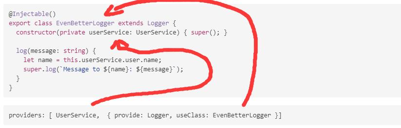

# [返回主目录](Readme.md)<!-- omit in toc --> 

# 目录 <!-- omit in toc --> 
- [Angular 注入树](#angular-注入树)
- [Angular中的依赖注入](#angular中的依赖注入)
- [Angular中的注入器层次结构](#angular中的注入器层次结构)
- [摇树优化](#摇树优化)
- [注入方式](#注入方式)
- [解析规则](#解析规则)
- [解析修饰符](#解析修饰符)
  - [@Optional()](#optional)
  - [@Host()](#host)
  - [@Self()](#self)
  - [@SkipSelf](#skipself)
- [依赖提供者 DI Provider](#依赖提供者-di-provider)
- [Providers属性与Provider字面量](#providers属性与provider字面量)
  - [userClass 替代类提供者](#userclass-替代类提供者)
  - [useValue 值提供者](#usevalue-值提供者)
  - [Factory providers 工厂提供者](#factory-providers-工厂提供者)


## Angular 注入树

按照树从高到底分为：
1. NullInjector()
2. ModuleInjector,来自PlatformModule
3. root ModuleInjector
4. NgModuleInjector
5. DirectiveInjector、ComponentInjector

当Angular需要进行依赖注入时，会从注入树中由低到高寻找依赖，无论在那一层找到依赖即停止寻找。如果找到最高层NullInjector()就会抛出error。

## Angular中的依赖注入

在Angular中依赖注入主要应用于服务类。设置依赖注入的方式分为一下几种：
1. @Injectable({ providedIn:'root' })，Angular服务的默认方式。其会在root ModuleInjector级别提供依赖注入关系。
2. NgModule的@NgModule()装饰器中, providers元数据设置。其会在NgModuleInjector级配提供依赖注入关系
3. Component的@Component()装饰器中或Directive的@Directive装饰器中， providers 或 viewProviders 属性来配置 。其会在ComponentInjector级提供依赖注入关系。


## Angular中的注入器层次结构

Angular中有两个注入器层次结构：
1. ModuleInjector层次结构。包含使用@Injectable()或@NgModule()注入树，隶属于此层次。
2. ElementInjector层次结构。包含DOM元素隐式创建和@Directive()或@Component()的providers属性配置的注入树，隶属于此结构层次。默认情况下此结构层次为空。

## 摇树优化

所谓摇树优化，指Angular会在构建应用时自动删除应用中未使用的服务依赖，进而缩小捆绑包大小。

Angular只会对@Injectable()进行摇树优化。

## 注入方式
默认为构造函数注入。例如在一个组件中注入：
```ts
 constructor(private heroService: HeroesService) { }
```
当Angular解析到HeroesService的注入器，则会注入该服务的实例。

## 解析规则

Angular为组件或指令解析令牌时分类两个阶段：
1. 针对ElementInjector层次结构与其父级
2. 针对ModuleInjector层次结构与其父级

解析顺序是从ElementInjector到ModuleInjector。
首次找到解析结果将停止解析然后通过注入器注入依赖关系。如果都没有找到解析结果则抛出异常。

## 解析修饰符
使用解析修饰符，可以控制和修改Angular默认的解析顺序与解析的开始与结束位置。解析修饰符放在构造函数注入的服务名称之前：
```ts
constructor(@Optional() public optional: OptionalService) {}
constructor(@Self() @Optional() public leaf: LeafService) {}
constructor(@SkipSelf() public leaf: LeafService) { }
constructor(@Optional() @SkipSelf() parent: Person) {}
constructor(@Host() @Optional() public flower: FlowerService) { }
```

解析修饰符包括：

### @Optional()
@Optional(), 可选服务，当被@Optional()修饰时，最终解析不到服务依赖。不会抛出错误，只会抛出null。
### @Host()
@Host()，可设置Angular解析终点为当前ElementInject与其父ElementInject
### @Self()
@Self()，可设置Angular解析终点为当前ElementInject。
### @SkipSelf
@SkipSelf()，跳过当前ElementInjector，从其父级开始解析直到NullInjector()树为止，其间如果找到解析结果则停止解析注入依赖，如果未找到解析结果，则抛出错误。


## 依赖提供者 DI Provider

依赖提供者DI Provider分类两类：
1. 可摇树优化的DI Provider，使用@Injectable({ providedIn:'root' })配置的DI Provider
2. 不可摇树优化的DI Providerr，所有使用元数据providers属性配置的DI Provider

## Providers属性与Provider字面量

Providers数组属性可以直接设置需要注入的依赖，例如：
```ts
providers: [Logger]
```
还可以在providers数组属性中使用provider字面量实现一些高级功能。

### userClass 替代类提供者
使用另一个类替换需要注入的实例
```ts
providers: [{ provide: Logger, useClass: BetterLogger }]
```
请求的依赖为Logger，而Angular会使用BetterLogger的实例注入。BetterLogger类继承自Logger类

```ts
@Injectable()
export class EvenBetterLogger extends Logger {
  constructor(private userService: UserService) { super(); }

  log(message: string) {
    let name = this.userService.user.name;
    super.log(`Message to ${name}: ${message}`);
  }
}
```
```ts
providers: [ UserService,  { provide: Logger, useClass: EvenBetterLogger }]
```

上例中，混合使用了基础DI Provider和provide字面量。

### useValue 值提供者
useValue会将已经创建的实例进行依赖注入。例如：
```ts
// 创建一个实例
export const HERO_DI_CONFIG: AppConfig = {
  apiEndpoint: 'api.heroes.com',
  title: 'Dependency Injection'
};
// 定义一个AppConfig的令牌
import { InjectionToken } from '@angular/core';

export const APP_CONFIG = new InjectionToken<AppConfig>('app.config');

// 设置依赖注入
providers: [{ provide: APP_CONFIG, useValue: HERO_DI_CONFIG }]

// 执行依赖注入
constructor(@Inject(APP_CONFIG) config: AppConfig) {
  this.title = config.title;
}
```

### Factory providers 工厂提供者
在使用不为DI而设计的第三方库时，或者需要的信息在运行时才能拿到的情况下，使用工厂提供者是一个好的选择。
```ts
providers:[{ 
    provide: HeroService,
    useFactory: heroServiceFactory,
    deps: [Logger, UserService]
  }]
```
- useFactory 字段告诉 Angular 该提供者是一个工厂函数，该函数的实现代码是 heroServiceFactory。

- deps 属性是一个提供者令牌数组。 Logger 和 UserService 类作为它们自己的类提供者令牌使用。 注入器解析这些令牌，并把与之对应的服务注入到相应的工厂函数参数表中。
```ts
// hero.service.ts
constructor(
  private logger: Logger,
  private isAuthorized: boolean) { }

getHeroes() {
  let auth = this.isAuthorized ? 'authorized ' : 'unauthorized';
  this.logger.log(`Getting heroes for ${auth} user.`);
  return HEROES.filter(hero => this.isAuthorized || !hero.isSecret);
}
```

```ts
// hero.service.provider.ts
let heroServiceFactory = (logger: Logger, userService: UserService) => {
  return new HeroService(logger, userService.user.isAuthorized);
};
```


