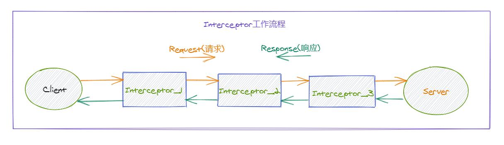
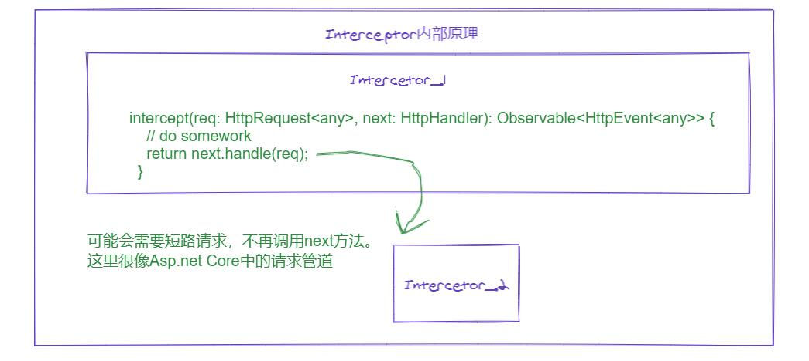

# [返回主目录](Readme.md)<!-- omit in toc --> 

# 目录 <!-- omit in toc --> 

- [HttpClient](#httpclient)
- [Angular中Http请求](#angular中http请求)
- [从服务器获取数据](#从服务器获取数据)
  - [Get请求JSON数据，返回Observable对象](#get请求json数据返回observable对象)
  - [Get请求获取完整的JSON响应信息](#get请求获取完整的json响应信息)
  - [JSONP的Get请求](#jsonp的get请求)
  - [Get请求非JSON数据](#get请求非json数据)
- [错误处理](#错误处理)
  - [获取错误详情](#获取错误详情)
  - [错误发生后重试](#错误发生后重试)
- [Http Headers(Http头)](#http-headershttp头)
  - [为请求添加Http Headers](#为请求添加http-headers)
  - [修改Http Headers](#修改http-headers)
  - [发送带有HttpHeaders的请求](#发送带有httpheaders的请求)
- [把数据发送到服务器](#把数据发送到服务器)
  - [POST请求](#post请求)
  - [DELETE请求](#delete请求)
  - [PUT请求](#put请求)
- [高级用法](#高级用法)
  - [拦截器Interceptor工作流程](#拦截器interceptor工作流程)
  - [拦截请求和响应](#拦截请求和响应)
    - [编写拦截器 Interceptor](#编写拦截器-interceptor)
    - [next对象](#next对象)
    - [使用拦截器](#使用拦截器)
    - [拦截器顺序](#拦截器顺序)
    - [HttpEvent](#httpevent)
    - [请求和响应的不可变性](#请求和响应的不可变性)
    - [修改请求和响应](#修改请求和响应)


## HttpClient
基于XMLHttpRequest接口。包含在HttpClientModule库中，路径为@angular/common/http。

使用时需要在NgModeule中导入HttpClientModule。并通过依赖注入HttpClient到需要的服务或组件中。

## Angular中Http请求
请求类型|意义
-|-
GET、JSONP GET |向特定的资源发出请求。
HEAD|HEAD请求和GET请求资源类似，但仅仅返回相应的头部，没有具体的响应体。它也不会对服务器造成其他影响
POST |向指定资源提交数据进行处理请求
DELETE|请求服务器删除Request-URI所标识的资源。
PUT|用来对已知资源进行整体更新
PATCH|用来对已知资源进行局部更新
OPTIONS|允许客户端请求一个服务所支持的请求方法


## 从服务器获取数据

### Get请求JSON数据，返回Observable对象
```ts
// server side jsondata
{
  "heroesUrl": "api/heroes",
  "textfile": "assets/textfile.txt"
}

// client side service get method
configUrl = 'assets/config.json';

getConfig() {
  return this.http.get(this.configUrl);
}

// client side get response body
config: Config;

showConfig() {
  this.configService.getConfig()
    .subscribe((data: Config) => this.config = {
        heroesUrl: data['heroesUrl'],
        textfile:  data['textfile']
        // heroesUrl: data.heroesUrl,
        // textfile:  data.textfile
    });
}
// dto
export interface Config {
  heroesUrl: string;
  textfile: string;
}
```

### Get请求获取完整的JSON响应信息
```ts
// client side service get full Respose method
getConfigResponse(): Observable<HttpResponse<Config>> {
  return this.http.get<Config>(
    this.configUrl, { observe: 'response' });
}

// client side get fll Response
showConfigResponse() {
  this.configService.getConfigResponse()
    // resp is of type `HttpResponse<Config>`
    .subscribe(resp => {
      // display its headers
      const keys = resp.headers.keys();
      this.headers = keys.map(key =>
        `${key}: ${resp.headers.get(key)}`);

      // access the body directly, which is typed as `Config`.
      this.config = { ... resp.body };
    });
}
```
### JSONP的Get请求
当服务端不支持CORS协议时(不支持跨域请求时)，可以使用HttpClient发出跨域的JSONP请求。之后返回一个Observable。订阅使用或使用async管道管理结果之前使用RxJS map运算符转换响应。
```ts
/* GET heroes whose name contains search term */
searchHeroes(term: string): Observable {
  term = term.trim();

  let heroesURL = `${this.heroesURL}?${term}`;
  return this.http.jsonp(heroesUrl, 'callback').pipe(
      catchError(this.handleError('searchHeroes', []) // then handle the error
    );
};
```

### Get请求非JSON数据
从服务器读取文本文件， 并把文件的内容记录下来，然后把这些内容使用 `Observable<string>` 的形式返回给调用者。
```ts
getTextFile(filename: string) {
  // The Observable returned by get() is of type Observable<string>
  // because a text response was specified.
  // There's no need to pass a <string> type parameter to get().
  return this.http.get(filename, {responseType: 'text'})
    .pipe(
      tap( // Log the result or error
        data => this.log(filename, data),
        error => this.logError(filename, error)
      )
    );
}
```
```ts
download() {
  this.downloaderService.getTextFile('assets/textfile.txt')
    .subscribe(results => this.contents = results);
}
```

## 错误处理
HttpClient返回的响应是一个Observable类型。通过Observable的第二个回调函数处理错误
```ts
showConfig() {
  this.configService.getConfig()
    .subscribe(
      (data: Config) => this.config = { ...data }, // success path
      error => this.error = error // error path
    );
}
```

### 获取错误详情
直接返回原始错误不友好，上例中，如果返回错误，错误的类型是HttpErrorResponse，它包含了一些有用的错误信息。

错误分为两种：
1. 服务端错误
2. 客户端错误


如果服务端返回的错误代码是404或500，它会返回一个错误的响应体。

如果客户端出现了错误，就会抛出一个Error类型的异常。

需要获取错误详情首先需要一个错误处理器
```ts
private handleError(error: HttpErrorResponse) {
  if (error.error instanceof ErrorEvent) {
    // A client-side or network error occurred. Handle it accordingly.
    console.error('An error occurred:', error.error.message);
  } else {
    // The backend returned an unsuccessful response code.
    // The response body may contain clues as to what went wrong,
    console.error(
      `Backend returned code ${error.status}, ` +
      `body was: ${error.error}`);
  }
  // return an observable with a user-facing error message
  return throwError(
    'Something bad happened; please try again later.');
};
```
这个错误处理器会处理来自客户端和服务端的错误。

之后将这个错误处理器通过管道应用到HttpClient请求中。
```ts
getConfig() {
  return this.http.get<Config>(this.configUrl)
    .pipe(
      catchError(this.handleError)
    );
}
```

### 错误发生后重试
有时错误的发生可能是暂时的，例如网络中断等情况。可以通过重试拿到正确的结果。

利用RxJS库retry操作符实现对失败的请求进行重试操作。
```ts
getConfig() {
  return this.http.get<Config>(this.configUrl)
    .pipe(
      retry(3), // retry a failed request up to 3 times
      catchError(this.handleError) // then handle the error
    );
}
```

## Http Headers(Http头)
许多请求需要包好Http Headers，例如Content-Type，声明要返回的资源类型。或者服务端需要一个授权令牌，这些也要写在Http Headers中。

### 为请求添加Http Headers
Http头，在 HttpHeaders 对象中定义。可以创建一个HttpOptions，将HttpHeaders设置在其中。
```ts
import { HttpHeaders } from '@angular/common/http';

const httpOptions = {
  headers: new HttpHeaders({
    'Content-Type':  'application/json',
    'Authorization': 'my-auth-token'
  })
};
```
### 修改Http Headers
你无法直接修改HttpHeaders，需要使用set()方法进行修改，该方法返回一个克隆后的headers。
```ts
httpOptions.headers =
  httpOptions.headers.set('Authorization', 'my-new-auth-token');
```

### 发送带有HttpHeaders的请求
将HTTPHeaders对象放在Http请求方法的第二个参数中即可。


## 把数据发送到服务器
HttpClient 的所有方法返回的可观察对象都设计为冷的。 HTTP 请求的执行都是延期执行的，让你可以用 tap 和 catchError 这样的操作符来在实际执行Http请求之前，先对这个可观察对象进行扩展。

调用 subscribe(...) 会触发这个可观察对象的执行，并导致 HttpClient 组合并把 HTTP 请求发给服务器。

### POST请求
```ts
/** POST: add a new hero to the database */
addHero (hero: Hero): Observable<Hero> {
  return this.http.post<Hero>(this.heroesUrl, hero, httpOptions)
    .pipe(
      catchError(this.handleError('addHero', hero))
    );
}
```
使用subscribe方法订阅执行post请求，服务器返回的响应中会带有这个新创建的Hero实例。
```ts
this.heroesService
  .addHero(newHero)
  .subscribe(hero => this.heroes.push(hero));
```

### DELETE请求
```ts
deleteHero (id: number): Observable<{}> {
  const url = `${this.heroesUrl}/${id}`; // DELETE api/heroes/42
  return this.http.delete(url, httpOptions)
    .pipe(
      catchError(this.handleError('deleteHero'))
    );
}
```
```ts
this.heroesService
  .deleteHero(hero.id)
  .subscribe();
```

### PUT请求
```ts
updateHero (hero: Hero): Observable<Hero> {
  return this.http.put<Hero>(this.heroesUrl, hero, httpOptions)
    .pipe(
      catchError(this.handleError('updateHero', hero))
    );
}
```
```ts
this.heroesService
  .updateHero(this.hero)
  .subscribe();
```

## 高级用法
### 拦截器Interceptor工作流程



### 拦截请求和响应
HTTP 拦截机制是 @angular/common/http 中的主要特性之一。 使用这种拦截机制，你可以声明一些拦截器，用它们监视和转换从应用发送到服务器的 HTTP 请求。 拦截器还可以用监视和转换从服务器返回到本应用的那些响应。 多个拦截器会构成一个“请求/响应处理器”的双向链表。

拦截器可以用一种常规的、标准的方式对每一次 HTTP 的请求/响应任务执行从认证到记日志等很多种隐式任务。

#### 编写拦截器 Interceptor
要实现拦截器，就要实现一个实现了 HttpInterceptor 接口中的 intercept() 方法的类。
```ts
import { Injectable } from '@angular/core';
import {
  HttpEvent, HttpInterceptor, HttpHandler, HttpRequest
} from '@angular/common/http';

import { Observable } from 'rxjs';

/** Pass untouched request through to the next request handler. */
@Injectable()
export class NoopInterceptor implements HttpInterceptor {

  intercept(req: HttpRequest<any>, next: HttpHandler): Observable<HttpEvent<any>> {
    return next.handle(req);
  }
}
```
这里是一个什么也不做的空白拦截器，它只会不做任何修改的传递这个请求。

#### next对象

next对象的调用表示程序将请求抛给下一个拦截器，如果没有下一个拦截器，则抛给HttpClient的后端处理器进行处理。

有时候可以不调用next对象，使链路短路。返回一个手工构造的服务器响应，其类型为`Observable<HttpEvent<any>>`。

#### 使用拦截器
创建好单个或多个Interceptor后，可以建立一个Interceptor索引文件。
```ts
// app/http-interceptors/index.ts

/* "Barrel" of Http Interceptors */
import { HTTP_INTERCEPTORS } from '@angular/common/http';

import { NoopInterceptor } from './noop-interceptor';

/** Http interceptor providers in outside-in order */
export const httpInterceptorProviders = [
  { provide: HTTP_INTERCEPTORS, useClass: NoopInterceptor, multi: true },
];
```
multi: true 选项,告诉Angular以后会有更多的HTTP_INTERCEPTORS注入。这个值是必须的。

之后将这个httpInterceptorProviders导入到AppModule的provides数组中
```ts
providers: [
  httpInterceptorProviders
],
```
#### 拦截器顺序
拦截器执行顺序取决于你提供的顺序执行。例如，你提供的顺序为 A → B → C。那么请求阶段的顺序就是A → B → C，而响应阶段的顺序就是C → B → A

#### HttpEvent
拦截器返回的是`Observable<HttpEvent<any>>`类型，而非`Observable<HttpResponse<any>>`类型。这是由于HttpInterceptor工作在HTTP协议比较深的层次上。

HttpEvent包括`HttpSentEvent，HttpHeaderResponse， HttpResponse<T> ，HttpProgressEvent ， HttpUserEvent<T>`。

其中HttpResoponse就包含在其中。实际上HttpResoponse属于HttpEventType.Response

#### 请求和响应的不可变性

 HttpRequest 和 HttpResponse 实例的属性却是只读（readonly）的， 因此让它们基本上是不可变的。

 其不可变的主要原因是应用可能会重试发送很多次请求之后才能成功，这就意味着这个拦截器链表可能会多次重复处理同一个请求。 如果拦截器可以修改原始的请求对象，那么重试阶段的操作就会从修改过的请求开始，而不是原始请求。

#### 修改请求和响应
由于请求和响应的不可变性。如果想要修改请求或响应，就需要首先克隆原始请求和响应。然后修改克隆体。在将其发送给next对象。
```ts
// 修改http为https
// clone request and replace 'http://' with 'https://' at the same time
const secureReq = req.clone({
  url: req.url.replace('http://', 'https://')
});
// send the cloned, "secure" request to the next handler.
return next.handle(secureReq);
```
```ts
// 修改请求体
// copy the body and trim whitespace from the name property
const newBody = { ...body, name: body.name.trim() };
// clone request and set its body
const newReq = req.clone({ body: newBody });
// send the cloned request to the next handler.
return next.handle(newReq);
```
```ts
// 清空请求体
newReq = req.clone({ ... }); // body not mentioned => preserve original body
newReq = req.clone({ body: undefined }); // 保持原样，不是清空
newReq = req.clone({ body: null }); // 清空请求体
```
```ts
// 在拦截器中更改请求头
import { AuthService } from '../auth.service';

@Injectable()
export class AuthInterceptor implements HttpInterceptor {

  constructor(private auth: AuthService) {}

  intercept(req: HttpRequest<any>, next: HttpHandler) {
    // Get the auth token from the service.
    const authToken = this.auth.getAuthorizationToken();

    // Clone the request and replace the original headers with
    // cloned headers, updated with the authorization.
    const authReq = req.clone({
      headers: req.headers.set('Authorization', authToken)
    });

    // send cloned request with header to the next handler.
    return next.handle(authReq);
  }
}
```
```ts
// 在拦截器中修改请求头的更简便的方法
import { AuthService } from '../auth.service';

@Injectable()
export class AuthInterceptor implements HttpInterceptor {

  constructor(private auth: AuthService) {}

  intercept(req: HttpRequest<any>, next: HttpHandler) {
    // Get the auth token from the service.
    const authToken = this.auth.getAuthorizationToken();
    // Clone the request and set the new header in one step.
    const authReq = req.clone({ setHeaders: { Authorization: authToken } });
    // send cloned request with header to the next handler.
    return next.handle(authReq);
  }
}
```
```ts
// 在拦截器中记录日志
import { finalize, tap } from 'rxjs/operators';
import { MessageService } from '../message.service';

@Injectable()
export class LoggingInterceptor implements HttpInterceptor {
  constructor(private messenger: MessageService) {}

  intercept(req: HttpRequest<any>, next: HttpHandler) {
    const started = Date.now();
    let ok: string;

    // extend server response observable with logging
    return next.handle(req)
      .pipe(
        tap(
          // Succeeds when there is a response; ignore other events
          event => ok = event instanceof HttpResponse ? 'succeeded' : '',
          // Operation failed; error is an HttpErrorResponse
          error => ok = 'failed'
        ),
        // Log when response observable either completes or errors
        finalize(() => {
          const elapsed = Date.now() - started;
          const msg = `${req.method} "${req.urlWithParams}"
             ${ok} in ${elapsed} ms.`;
          this.messenger.add(msg);
        })
      );
  }
}
```
RxJS 的 tap 操作符会捕获请求成功了还是失败了。 RxJS 的 finalize 操作符无论在响应成功还是失败时都会调用（这是必须的），然后把结果汇报给 MessageService。

```ts
// 在拦截器中设置缓存
@Injectable()
export class CachingInterceptor implements HttpInterceptor {
  constructor(private cache: RequestCache) {}

  intercept(req: HttpRequest<any>, next: HttpHandler) {
    // continue if not cachable.
    if (!isCachable(req)) { return next.handle(req); }

    const cachedResponse = this.cache.get(req);
    return cachedResponse ?
      of(cachedResponse) : sendRequest(req, next, this.cache);
  }
}
```
isCachable() 函数用于决定该请求是否允许缓存。
如果该请求是不可缓存的，该拦截器只会把该请求转发给链表中的下一个处理器。

如果可缓存的请求在缓存中找到了，该拦截器就会通过 of() 函数返回一个已缓存的响应体的可观察对象，然后绕过 next 处理器（以及所有其它下游拦截器）。

如果可缓存的请求在缓存中没找到，代码就会调用 sendRequest。
```ts
/**
 * Get server response observable by sending request to `next()`.
 * Will add the response to the cache on the way out.
 */
function sendRequest(
  req: HttpRequest<any>,
  next: HttpHandler,
  cache: RequestCache): Observable<HttpEvent<any>> {

  // No headers allowed in npm search request
  const noHeaderReq = req.clone({ headers: new HttpHeaders() });

  return next.handle(noHeaderReq).pipe(
    tap(event => {
      // There may be other events besides the response.
      if (event instanceof HttpResponse) {
        cache.put(req, event); // Update the cache.
      }
    })
  );
}
```
