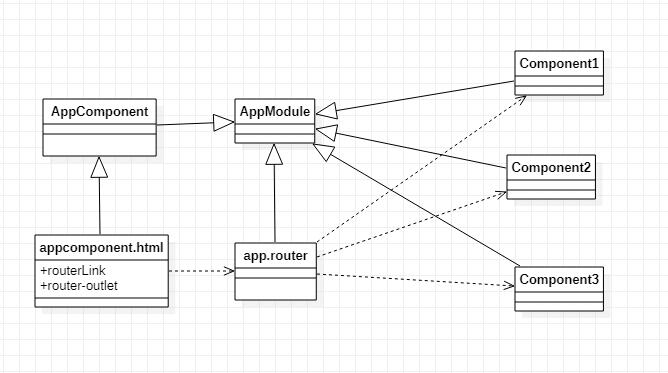
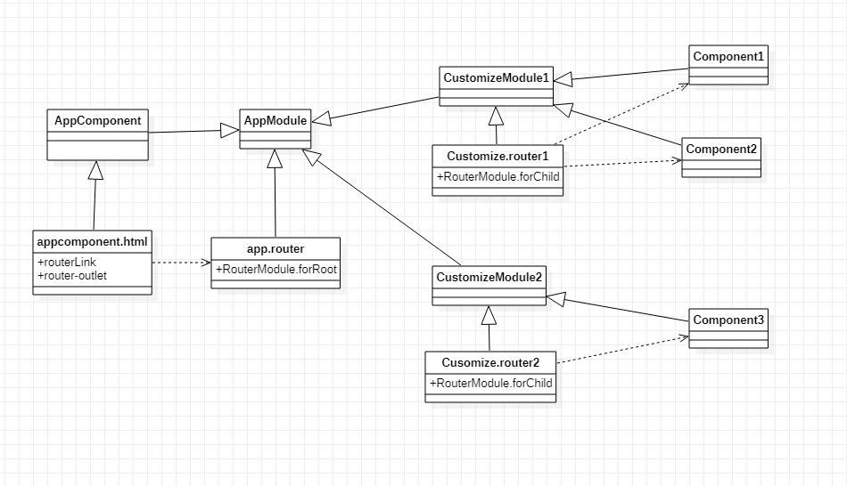
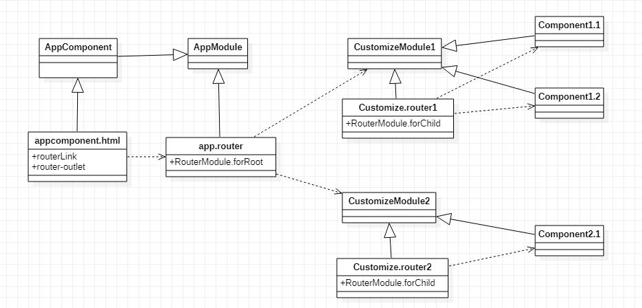
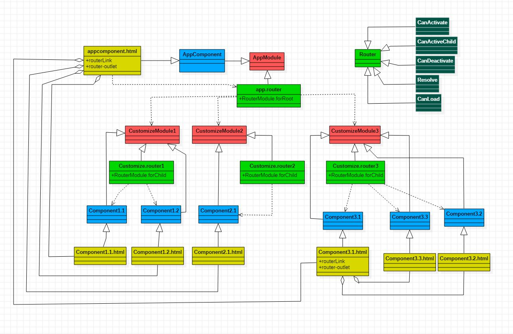

# [返回主目录](Readme.md)<!-- omit in toc --> 

# 目录 <!-- omit in toc --> 

- [概览图](#概览图)
  - [基本用法](#基本用法)
    - [1. 单模块单路由配置模式](#1-单模块单路由配置模式)
    - [2. 多模块多路由模块配置模式](#2-多模块多路由模块配置模式)
    - [3. 惰性加载模式的路由配置模式](#3-惰性加载模式的路由配置模式)
    - [4. 惰性加载模式细节的配置模式](#4-惰性加载模式细节的配置模式)
- [路由与导航基础知识](#路由与导航基础知识)
  - [`<base href>`元素](#base-href元素)
  - [路由的angular库](#路由的angular库)
  - [配置路由(简单方式)](#配置路由简单方式)
  - [路由出口`<router-outlet>`](#路由出口router-outlet)
  - [路由器链接 RouterLink指令](#路由器链接-routerlink指令)
  - [路由链接的激活状态 RouterLinkActive指令](#路由链接的激活状态-routerlinkactive指令)
  - [激活的路由 ActivatedRoute服务](#激活的路由-activatedroute服务)
  - [路由事件 Router.events](#路由事件-routerevents)
  - [关键词及含义](#关键词及含义)
- [用法](#用法)
  - [路由通配符](#路由通配符)
  - [子路由](#子路由)
  - [路由参数](#路由参数)
  - [使用ActivatedRoute、Router、ParamMap](#使用activatedrouterouterparammap)
    - [ParamMap的一些API](#parammap的一些api)
    - [使用Router](#使用router)
  - [子根路由](#子根路由)
  - [使用命名的RouterOutlet实现第二路由](#使用命名的routeroutlet实现第二路由)
  - [路由守卫](#路由守卫)
    - [路由守卫分类](#路由守卫分类)
  - [惰性加载(异步路由)](#惰性加载异步路由)
  - [预加载](#预加载)
    - [预加载所有模块](#预加载所有模块)
    - [自定义的预加载策略](#自定义的预加载策略)

## 概览图
### 基本用法
#### 1. 单模块单路由配置模式


所有的路由配置都在根组件的根路由进行配置。这种做法适用于微型项目。或初学者
#### 2. 多模块多路由模块配置模式


这种模式根路由只会负责一些通配符和无匹配URI时的导航。其他组件导航全部放在子模块中的子路由中。由根模块导入各个子模块，各个子模块导入自己的子路由并在子路由中配置好导航。划分不同的功能区域。
#### 3. 惰性加载模式的路由配置模式


这种模式下，根模块无需导入子模块，导入工作由根路由导航时，配置惰性加载导入子模块实现。这种方式好处在于系统初始时速度加快。适用于中大型项目。
#### 4. 惰性加载模式细节的配置模式



## 路由与导航基础知识

### `<base href>`元素
路由导航基于的根路径就是src/index.html中的base href中设置的路径，默认为/。
### 路由的angular库
```ts
import { RouterModule, Routes } from '@angular/router';
```
### 配置路由(简单方式)

在基于appModule中独立一个路由模块，在路由模块中配置，例如：
```ts
const appRoutes: Routes = [
  { path: 'crisis-center', component: CrisisListComponent },
  { path: 'hero/:id',      component: HeroDetailComponent },
  {
    path: 'heroes',
    component: HeroListComponent,
    data: { title: 'Heroes List' }
  },
  { path: '',
    redirectTo: '/heroes',
    pathMatch: 'full'
  },
  { path: '**', component: PageNotFoundComponent }
];

@NgModule({
  imports: [
    RouterModule.forRoot(
      appRoutes,
      { enableTracing: true } // <-- debugging purposes only
    )
    // other imports here
  ],
  ...
})
export class AppModule { }
```

### 路由出口`<router-outlet>`
路由显示导航的占位符
```html
<router-outlet></router-outlet>
<!-- Routed components go here -->
```
### 路由器链接 RouterLink指令
RouterLink指令一般用在模板上。例如a元素。将需要导航的链接和参数绑定到该指令。例如
```html
<nav>
  <a routerLink="/crisis-center" routerLinkActive="active">Crisis Center</a>
  <a routerLink="/heroes" routerLinkActive="active">Heroes</a>
  <a [routerLink]="['/hero', hero.id]">
</nav>
```

### 路由链接的激活状态 RouterLinkActive指令
RouterLinkActive指令会根据当前RouterState状态切换CSS样式。当RouterState是激活状态时，就会为宿主元素添加响应的CSS类或样式。例如：
```html
<a routerLink="/heroes" [routerLinkActive]="'active fluffy'">Heroes</a>
<a routerLink="/heroes" routerLinkActive="active">Heroes</a>
```

### 激活的路由 ActivatedRoute服务
通过依赖注入ActivatedRoute服务可以获得一堆有用的东西。如下表：
| 属性          | 说明                                                                                                                        |
| ------------- | --------------------------------------------------------------------------------------------------------------------------- |
| url           | 路由路径的 Observable 对象，是一个由路由路径中的各个部分组成的字符串数组。                                                  |
| data          | 一个 Observable，其中包含提供给路由的 data 对象。也包含由解析守卫（resolve guard）解析而来的值。                            |
| paramMap      | 一个 Observable，其中包含一个由当前路由的必要参数和可选参数组成的map对象。用这个 map 可以获取来自同名参数的单一值或多重值。 |
| queryParamMap | 一个 Observable，其中包含一个对所有路由都有效的查询参数组成的map对象。 用这个 map 可以获取来自查询参数的单一值或多重值。    |
| fragment      | 一个适用于所有路由的 URL 的 fragment（片段）的 Observable。                                                                 |
| outlet        | 要把该路由渲染到的 RouterOutlet 的名字。对于无名路由，它的路由名是 primary，而不是空串。                                    |
| routeConfig   | 用于该路由的路由配置信息，其中包含原始路径。                                                                                |
| parent        | 当该路由是一个子路由时，表示该路由的父级 ActivatedRoute。                                                                   |
| firstChild    | 包含该路由的子路由列表中的第一个 ActivatedRoute。                                                                           |
| children      | 包含当前路由下所有已激活的子路由。                                                                                          |


### 路由事件 Router.events
路由过程中，Router会通过 Router.events 属性发布一些导航事件。这些事件覆盖了从路由导航开始到结束的所有时间点。

| 路由器事件           | 说明                                                                            |
| -------------------- | ------------------------------------------------------------------------------- |
| NavigationStart      | 本事件会在导航开始时触发。                                                      |
| RouteConfigLoadStart | 本事件会在 Router 惰性加载 某个路由配置之前触发。                               |
| RouteConfigLoadEnd   | 本事件会在惰性加载了某个路由后触发。                                            |
| RoutesRecognized     | 本事件会在路由器解析完 URL，并识别出了相应的路由时触发                          |
| GuardsCheckStart     | 本事件会在路由器开始 Guard 阶段之前触发。                                       |
| ChildActivationStart | 本事件会在路由器开始激活路由的子路由时触发。                                    |
| ActivationStart      | 本事件会在路由器开始激活某个路由时触发。                                        |
| GuardsCheckEnd       | 本事件会在路由器成功完成了 Guard 阶段时触发。                                   |
| ResolveStart         | 本事件会在 Router 开始解析（Resolve）阶段时触发。                               |
| ResolveEnd           | 本事件会在路由器成功完成了路由的解析（Resolve）阶段时触发。                     |
| ChildActivationEnd   | 本事件会在路由器激活了路由的子路由时触发。                                      |
| ActivationEnd        | 本事件会在路由器激活了某个路由时触发。                                          |
| NavigationEnd        | 本事件会在导航成功结束之后触发。                                                |
| NavigationCancel     | 本事件会在导航被取消之后触发。 这可能是因为在导航期间某个路由守卫返回了 false。 |
| NavigationError      | 这个事件会在导航由于意料之外的错误而失败时触发。                                |
| Scroll               | 本事件代表一个滚动事件。                                                        |

当启用了 enableTracing 选项时，这些事件也同时会记录到控制台中。

### 关键词及含义
| 路由器部件                       | 含义                                                                                                                         |
| -------------------------------- | ---------------------------------------------------------------------------------------------------------------------------- |
| Router（路由器）                 | 为激活的 URL 显示应用组件。管理从一个组件到另一个组件的导航                                                                  |
| RouterModule                     | 一个独立的 NgModule，用于提供所需的服务提供者，以及用来在应用视图之间进行导航的指令。                                        |
| Routes（路由数组）               | 定义了一个路由数组，每一个都会把一个 URL 路径映射到一个组件。                                                                |
| Route（路由）                    | 定义路由器该如何根据 URL 模式（pattern）来导航到组件。大多数路由都由路径和组件类构成。                                       |
| RouterOutlet（路由出口）         | 该指令（`<router-outlet>`）用来标记出路由器该在哪里显示视图。                                                                |
| RouterLink（路由链接）           | 这个指令把可点击的 HTML 元素绑定到某个路由。点击带有 routerLink 指令（绑定到字符串或链接参数数组）的元素时就会触发一次导航。 |
| RouterLinkActive（活动路由链接） | 当 HTML 元素上或元素内的routerLink变为激活或非激活状态时，该指令为这个 HTML 元素添加或移除 CSS 类。                          |
| ActivatedRoute（激活的路由）     | 为每个路由组件提供的一个服务，它包含特定于路由的信息，比如路由参数、静态数据、解析数据、全局查询参数和全局碎片（fragment）。 |
| RouterState（路由器状态）        | 路由器的当前状态包含了一棵由程序中激活的路由构成的树。它包含一些用于遍历路由树的快捷方法。                                   |
| 链接参数数组                     | 这个数组会被路由器解释成一个路由操作指南。你可以把一个RouterLink绑定到该数组，或者把它作为参数传给Router.navigate方法。      |
| 路由组件                         | 一个带有RouterOutlet的 Angular 组件，它根据路由器的导航来显示相应的视图。                                                    |

## 用法

### 路由通配符
```ts
const appRoutes: Routes = [
  { path: '',   redirectTo: '/heroes', pathMatch: 'full' },
  { path: '**', component: PageNotFoundComponent }
];
```
通过''，来设置默认URI下导航路径。通过**来设置所有导航都不匹配的情况下的导航路径

注意，通配符路由一定放在Routes路由数组的最下边。路由是按照路由数组由上到下匹配的。

根路由在根组件导入时要放在import数组最下面。防止覆盖子路由。

### 子路由
通过添加特性模块加子路由的形式，把一个功能或子系统从系统中分离出来。
可以使用CLI命令快速生成特性模块与子路由模块
```shell
ng generate module [direct]/[moduleName] --module app --flat --routing
```
子路由例子：
```ts
import { NgModule }             from '@angular/core';
import { RouterModule, Routes } from '@angular/router';

import { HeroListComponent }    from './hero-list/hero-list.component';
import { HeroDetailComponent }  from './hero-detail/hero-detail.component';

const heroesRoutes: Routes = [
  { path: 'heroes',  component: HeroListComponent },
  { path: 'hero/:id', component: HeroDetailComponent }
];

@NgModule({
  imports: [
    RouterModule.forChild(heroesRoutes)
  ],
  exports: [
    RouterModule
  ]
})
export class HeroesRoutingModule { }
```
特性模块导入该子路由，根模块可以通过导入特性模块的方式或惰性加载的方式连接。

### 路由参数
通过向路由添加参数，可以使用URI向导航目标传递数据。
```ts
{ path: 'hero/:id', component: HeroDetailComponent }

<a [routerLink]="['/hero', hero.id]">
```
### 使用ActivatedRoute、Router、ParamMap
当想要在导航目标中获取路由参数时，可以使用ActivatedRoute和ParamMap。这其中涉及到RxJS的相关知识。
例如：
```ts
constructor(
  private activatedRoute: ActivatedRoute,
  private router: Router,
  private service: HeroService
) {}

ngOnInit() {
  this.hero$ = this.activatedRoute.paramMap.pipe(
    switchMap((params: ParamMap) =>
      this.service.getHero(params.get('id')))
  );
}
```
#### ParamMap的一些API
成员|说明
-|-
has(name)|如果参数名位于参数列表中，就返回 true 。
get(name)|如果这个 map 中有参数名对应的参数值（字符串），就返回它，否则返回 null。如果参数值实际上是一个数组，就返回它的第一个元素。
getAll(name)|如果这个 map 中有参数名对应的值，就返回一个字符串数组，否则返回空数组。当一个参数名可能对应多个值的时候，请使用 getAll。
keys|返回这个 map 中的所有参数名组成的字符串数组。

#### 使用Router
想在导航目标内实现再次路由，可以通过Router的navigate方法实现。该方法还可以添加以MatrixURL写法的路由参数。例如：
```ts
gotoHeroes() {
  this.router.navigate(['/heroes']);
}

gotoHeroes(hero: Hero) {
  let heroId = hero ? hero.id : null;
  this.router.navigate(['/heroes', { id: heroId, foo: 'foo' }]);
}
```
第二种方式将会生成MatrixURL格式的URL
```http
localhost:4200/heroes;id=15;foo=foo
```
想要获取MatrixURL的路由参数，可以通过如下方式：
```ts
export class HeroListComponent implements OnInit {
  selectedId: number;

  constructor(
    private route: ActivatedRoute
  ) {}

  ngOnInit() {
    this.heroes$ = this.route.paramMap.pipe(
      switchMap(params => {
        // (+) before `params.get()` turns the string into a number
        this.selectedId = +params.get('id');
      })
    );
  }
}
```

### 子根路由
所谓子根路由，就是特性模块中某个组件扮演该特性模块的根组件。

该特性模块的根组件特点为具有带有`<router-outlet></router-outlet>`的模板。

通过在该特性模块中的子路由配置，实现该模式。例如特性模块子路由配置：
```ts
const crisisCenterRoutes: Routes = [
  {
    path: 'crisis-center',
    component: CrisisCenterComponent,
    children: [
      {
        path: '',
        component: CrisisListComponent,
        children: [
          {
            path: ':id',
            component: CrisisDetailComponent
          },
          {
            path: '',
            component: CrisisCenterHomeComponent
          }
        ]
      }
    ]
  }
];
```
其中CrisisCenterComponent组件模板中带有`<router-outlet></router-outlet>`标签
```html
<h2>CRISIS CENTER</h2>
<router-outlet></router-outlet>
```
Angular在导航渲染时，会将CrisisCenterComponent组件模板的内容渲染在父组件也就是AppComponent的模板的`<router-outlet></router-outlet>`中。

而，CrisisListComponent、CrisisDetailComponent、CrisisCenterHomeComponent这些组件在导航时会被渲染在CrisisCenterComponent组件模板的`<router-outlet></router-outlet>`中。
这是由于它们被配置在了children节点下。

### 使用命名的RouterOutlet实现第二路由
可以在模板中编写多个router-outlet，使用name属性为其命名：
```html
<div >
  <router-outlet></router-outlet>
</div>
<router-outlet name="popup"></router-outlet>
```
在路由中配置需要渲染在指定名称的router-outlet的设置：
```ts
{
  path: 'compose',
  component: ComposeMessageComponent,
  outlet: 'popup'
},
```
这样即可实现ComposeMessageComponent在被导航时渲染在名称为popup的router-outlet上了。

使用routerLink导航并指定渲染到popup的router-outlet，需要添加链接参数数组,链接参数数组包含一个outlet属性对象。：
```html
<a [routerLink]="[{ outlets: { popup: ['compose'] } }]">Contact</a>
```

当想关闭该第二路由渲染时，可以在目标组件中使用该方法：
```ts
  closePopup() {
    // Providing a `null` value to the named outlet
    // clears the contents of the named outlet
    this.router.navigate([{ outlets: { popup: null }}]);
  }
```
重新导航该第二路由到null即可。

### 路由守卫

路由守卫主要作用是截断终止或继续路由导航行为。
其主要用于：
- 认证授权

- 在显示目标组件前，你可能得先获取某些数据。

- 在离开组件前，你可能要先保存修改。

- 你可能要询问用户：你是否要放弃本次更改，而不用保存它们？

路由守卫只会返回一个Observable或Promise值。这个值具有三种类型：
- true，导航继续
- false，导航终止，用户留在原地
- UrlTree，导航终止，并将用户导航到UrlTree

#### 路由守卫分类
路由守卫主要分为五类：

- **CanActivate**,来处理导航到某路由的情况。
- **CanActivateChild**,来处理导航到某子路由的情况。
- **CanDeactivate**,来处理从当前路由离开的情况.
- **CanLoad**,来处理异步导航到某特性模块的情况。
- **Resolve**,在路由激活之前获取路由数据。


路由上可以设置多个守卫。
路由会按照最深的子路由向上检查CanDeactivate() 和 CanActivateChild() 守卫。然后按照从上到下的顺序检查CanActivate()守卫。如果特性模块是异步加载的，在加载它之前还会检查 CanLoad() 守卫。 如果任何一个守卫返回 false，其它尚未完成的守卫会被取消，这样整个导航就被取消了。

生成路由守卫CLI命令
```shell
ng generate guard [guardName]
```
生成时Angular会让你选择生成哪种路由守卫：
```ts
? Which interfaces would you like to implement? (Press <space> to select, <a> to toggle all, <i> to
 invert selection)
>(*) CanActivate
 ( ) CanActivateChild
 ( ) CanDeactivate
 ( ) CanLoad
```
这四种守卫再生成后会分别实现同名的四种方法。根据业务需求在其中注入相关服务并编码。最后返回true、false或UrlTree。

守卫生成并编码完毕后，需要在路由配置中加入守卫才能生效，下面例子只是做个演示：
```ts
const routes: Routes = [
  {
    path: '',
    component: AdminComponent,
    canActivate: [AuthGuard],
    children: [
      {
        path: '',
        canActivateChild: [AuthGuard],
        canActivate:[AuthGuard],
        canLoad:[AuthGuard],
        canDeactivate:[AuthGuard],
        children: [
          { path: 'crises', component: ManageCrisesComponent },
          { path: 'heroes', component: ManageHeroesComponent },
          { path: '', component: AdminDashboardComponent }
        ]
      }
    ]
  }
];
```
### 惰性加载(异步路由)

根路由通过loadChildren参数，在引导式异步加载特性模块，进而异步加载特性模块中的特性路由。例如：
```ts
{
  path: 'admin',
  loadChildren: () => import('./admin/admin.module').then(m => m.AdminModule),
},
```
相对与惰性加载，急性加载会在应用启动时加载所有模块。当程序业务增多，体积增大后。在某一个时间点会让程序启动变得越来越慢。
惰性加载的好处在于可以快速的加载应用。而不必等待特性模块加载。使应用程序启动速度加快。对于中大型项目，好处很多。

注意，在惰性加载路由中。如果使用了路由守卫CanActivate。即使路由被阻断，也会继续加载特性模块。这并不是开发者想看到的。可以使用CanLoad守卫，针对惰性加载路由行进保护。如果被阻断，也不会惰性加载模块了。

### 预加载
预加载技术，介于急性加载与惰性加载之间。

急性加载会在应用启动后马上加载所有模块。惰性加载只会加载路由中配置为急性加载的模块。

预加载技术是在应用启动后，首先加载必要模块，之后在后台加载一些配置为预加载的惰性加载模块。

预加载技术可以实现自定义加载。选择你需要预加载的惰性加载模块。

#### 预加载所有模块
如果想让系统预加载所有模块，可以在根路由配置preloadingStrategy属性，将其值设置为PreloadAllModules。
```ts
RouterModule.forRoot(
  appRoutes,
  {
    enableTracing: true, // <-- debugging purposes only
    preloadingStrategy: PreloadAllModules
  }
)
```
这种方式会让路由预加载所有惰性加载。

#### 自定义的预加载策略
当考虑用户带宽限制，网络因素。可以考虑自定义预加载，自定义需要预加载的惰性路由。
比如为某个需要预加载的惰性路由添加data参数
```ts
{
  path: 'crisis-center',
  loadChildren: () => import('./crisis-center/crisis-center.module').then(m => m.CrisisCenterModule),
  data: { preload: true }
},
```
然后创建自定义预加载策略服务。并且让该服务实现PreloadingStrategy类
```ts
import { Injectable } from '@angular/core';
import { PreloadingStrategy, Route } from '@angular/router';
import { Observable, of } from 'rxjs';

@Injectable({
  providedIn: 'root',
})
export class SelectivePreloadingStrategyService implements PreloadingStrategy {
  preloadedModules: string[] = [];

  preload(route: Route, load: () => Observable<any>): Observable<any> {
    if (route.data && route.data['preload']) {
      // add the route path to the preloaded module array
      this.preloadedModules.push(route.path);

      // log the route path to the console
      console.log('Preloaded: ' + route.path);

      return load();
    } else {
      return of(null);
    }
  }
}
```
最后在路由中配置该服务策略
```ts
@NgModule({
  imports: [RouterModule.forRoot(routes, 
    { 
      enableTracing: false,
      preloadingStrategy: SelectivePreloadingStrategyService, 
    })
  ],
  exports: [RouterModule]
})
```


