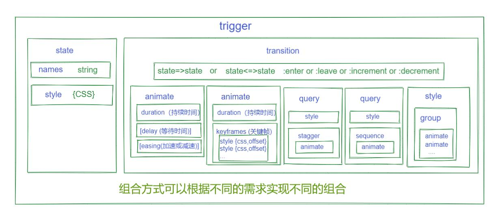

# [返回主目录](Readme.md)<!-- omit in toc --> 

# 目录 <!-- omit in toc --> 
- [简单使用方式](#简单使用方式)
- [动画API](#动画api)
- [动画状态通配符](#动画状态通配符)
- [动画概览图](#动画概览图)
- [各个函数详解](#各个函数详解)
  - [trigger()](#trigger)
  - [style()](#style)
  - [state()](#state)
  - [animate()](#animate)
  - [transition()](#transition)
  - [keyframes()](#keyframes)
  - [group()](#group)
  - [query()](#query)
  - [sequence()](#sequence)
  - [stagger()](#stagger)
  - [animation()](#animation)
  - [useAnimation()](#useanimation)
  - [animateChild()](#animatechild)

## 简单使用方式

1. 导入动画模块
    ```ts
    import { BrowserAnimationsModule } from '@angular/platform-browser/animations';
    ```
2. 把动画功能导入组件或单独文件中
    ```ts
    import { Component, HostBinding } from '@angular/core';
    import {
    trigger,
    state,
    style,
    animate,
    transition,
    // ...
    } from '@angular/animations';
    ```
3. 在组件中或单独文件中编写触发器
    ```ts
    @Component({
    selector: 'app-root',
    templateUrl: 'app.component.html',
    styleUrls: ['app.component.css'],
    animations: [
        // animation triggers go here
    ]
    })
    ```
4. 在模板中绑定触发器
    ```html
    <div [@triggerName]="expression">...</div>;
    ```  
    
## 动画API
函数名|用途
-|-
trigger()|开始动画，并充当所有其它动画函数的容器。HTML 模板可以绑定到 triggerName。使用第一个参数来声明唯一的触发器名称。要使用数组语法。
style()|定义一个或多个要用于动画中的 CSS 样式。用于在动画期间控制 HTML 元素的视觉外观。要使用对象语法。
state()|创建一组有名字的 CSS 样式，它会在成功转换到指定的状态时应用到元素上。该状态可以在其它动画函数中通过名字进行引用。
animate()|指定转场的时序信息。delay 和 easing 是可选值。其中可以包含 style() 调用。
transition()|定义两个命名状态之间的动画序列。使用数组语法。
keyframes()|允许以特定的时间间隔对样式进行顺序更改。用于 animate() 中。每个 keyframe() 中都可以包含多个 style() 调用。使用数组语法。
group()|指定要并行运行的一组动画步骤（内部动画）。 该动画只有当所有内部动画步骤都完成之后才会继续。用于 sequence() 或 transition() 中。
query()|用于找出当前元素中的一个或多个内部 HTML 元素。
sequence()|指定一个动画步骤列表，它们会逐个顺序执行。
stagger()|交错安排多元素动画的开始时间。
animation()|生成可在其它地方调用的可重用动画。与 useAnimation() 一起使用。
useAnimation()|激活一个可复用动画。和 animation() 一起使用。
animateChild()|允许子组件上的动画和父组件在同一个时间范围（timeframe）内执行。

## 动画状态通配符
通配符|含义
-|-
*|代表任何一种动画状态或值,包括void状态
void|代表空状态，主要用于进离场
:enter|代表进场状态，与 void=>* 同意
:leave|代表离场状态，与 *=>void 同意
:increment|代表数值增大时的装填
:decrement|代表数值减少时的状态

## 动画概览图



## 各个函数详解

### trigger()
创建一个有名字的动画触发器，包含一个 state() 和 transition() 的列表，当此触发器的绑定表达式发生变化时，它们就会重新求值。
```ts
trigger(name: string, definitions: AnimationMetadata[]): AnimationTriggerMetadata
```
**使用说明**

在 @Component 元数据的 animations 部分定义一个动画触发器。 在模板中，可以按名字引用该触发器，并把它绑定到一个触发器表达式，该表达式的求值结果是一个已定义的动画状态，格式如下：

[@triggerName]="expression"

动画触发器绑定会把所有值转换成字符串，然后根据其旧值和当前值匹配出一个转场动画。 对于逻辑值，可以用 '1' 或 'true' 来代表 true，用 '0' 或 'false' 来代表 false。

[API文档](https://angular.cn/api/animations/trigger)

---
### style()
声明一个包含 CSS 属性/样式的键值对象，可在动画序列中用作动画状态（state），或在调用 animate() 和 keyframes() 时作为传入的样式数据。
```ts
style(tokens: "*" | { [key: string]: string | number; } | ("*" | { [key: string]: string | number; })[]): AnimationStyleMetadata
```

**使用说明**

下面的例子创建了一些带有一组 CSS 属性值的动画样式：
```ts
// string values for CSS properties
style({ background: "red", color: "blue" })

// numerical pixel values
style({ width: 100, height: 0 })
```
下面的例子使用了自动样式，以允许此动画将组件的高度从 0 逐渐增长到其父元素的高度：
```ts
style({ height: 0 }),
animate("1s", style({ height: "*" }))
```
[API文档](https://angular.cn/api/animations/style)

---
### state()
附加到元素的触发器上，声明一个动画状态。
```ts
state(name: string, styles: AnimationStyleMetadata, options?: { params: { [name: string]: any; }; }): AnimationStateMetadata
```

**使用说明**

使用 trigger() 函数来为动画触发器注册状态。 使用 transition() 函数来在状态之间执行动画。 当某个状态在组件中激活时，它所关联的样式会永久性的作用在该元素上 —— 即使该动画已经结束了。

[API文档](https://angular.cn/api/animations/state)

---

### animate()
定义一个动画步骤，它把一些样式信息和时序信息组合在一起。
```ts
animate(timings: string | number, styles: AnimationStyleMetadata | AnimationKeyframesSequenceMetadata = null): AnimationAnimateMetadata
```


**使用说明**

在一个 sequence()（动画序列）、group()（动画分组）或 transition()（转场动画）中调用本函数， 以定义一个动画步骤，来把指定的样式数据在父动画上播放指定的时长。


[API文档](https://angular.cn/api/animations/animate)

---

### transition()
声明一个转场动画，以便在满足给定条件时运行一系列动画步骤。该条件是一个逻辑型表达式或一个函数， 该函数比较以前和现在的动画状态，如果应该开始转场则返回 true。 当满足所定义的转场动画的状态标准时，就会开始执行相关的动画。
```ts
transition(stateChangeExpr: string | ((fromState: string, toState: string, element?: any, params?: { [key: string]: any; }) => boolean), steps: AnimationMetadata | AnimationMetadata[], options: AnimationOptions = null): AnimationTransitionMetadata
```

**使用说明**

与组件关联的模板会把动画触发器绑定到某个元素上。
```html
<!-- somewhere inside of my-component-tpl.html -->
<div [@myAnimationTrigger]="myStatusExp">...</div>
```
所有转场动画以及用于供转场动画使用的命名状态，都是在动画触发器中定义的，
```ts
trigger("myAnimationTrigger", [
 // define states
 state("on", style({ background: "green" })),
 state("off", style({ background: "grey" })),
 ...]
```
注意，当你在 group() 或 transition() 中调用 sequence() 函数时，除非其内部动画步骤已经执行完了， 否则不会继续执行后续步骤。

[API文档](https://angular.cn/api/animations/transition#transition)

---

### keyframes()
可定义一组动画样式，每个样式都关联着一个可选的 offset 值。
```ts
keyframes(steps: AnimationStyleMetadata[]): AnimationKeyframesSequenceMetadata
```


**使用说明**

和 animate() 调用一起使用。关键帧动画不会直接在当前状态和目标状态之间应用动画，而是描述在动画弧线的哪个时间点上应用哪个样式。

[API文档](https://angular.cn/api/animations/keyframes)

---

### group()
定义一个可以并行运行的动画步骤列表。
```ts
group(steps: AnimationMetadata[], options: AnimationOptions = null): AnimationGroupMetadata
```

**使用说明**

当一系列样式分别需要在不同的起始时间开始动画并在不同的结束时间停止时，分组动画非常有用。

当在 sequence() 或 transition() 中调用它时，除非完成所有内部动画步骤，否则不会执行后续步骤。

[API文档](https://angular.cn/api/animations/group)

---

### query()
在动画序列中正在播放的元素中查找一个或多个内部元素。和 animateChild() 一起使用。
```ts
query(selector: string, animation: AnimationMetadata | AnimationMetadata[], options: AnimationQueryOptions = null): AnimationQueryMetadata
```

**使用说明**

多个令牌可以合并成复合查询选择器。比如：
```ts
query(':self, .record:enter, .record:leave, @subTrigger', [...])
```
query() 函数会收集多个元素，其内部是用 element.querySelectorAll 实现的。 用配置对象中的 limit 字段可以限制要收集的总数。比如：
```ts
query('div', [
  animate(...),
  animate(...)
], { limit: 1 })
```

默认情况下，当没有找到条目时就会抛出错误。设置 optional 标志可以忽略此错误。比如：
```ts
query('.some-element-that-may-not-be-there', [
  animate(...),
  animate(...)
], { optional: true })
```

[API文档](https://angular.cn/api/animations/query)

---

### sequence()
定义一个动画步骤列表，逐个依次运行它们。
```ts
sequence(steps: AnimationMetadata[], options: AnimationOptions = null): AnimationSequenceMetadata
```

**使用说明**

当你把一个步骤数组传给 transition() 调用时，这些步骤默认会顺序执行。 作为对比，group() 的调用会并行执行各个动画步骤。

当在 group() 或 transition() 调用中应用动画序列时， 只有当每个内部动画步骤都完成之后，才会继续执行下一个指令。

[API文档](https://angular.cn/api/animations/sequence)

---

### stagger()
在调用 query() 中使用可以在每个查询到的条目开始播放动画之后插入一个时间间隔。
```ts
stagger(timings: string | number, animation: AnimationMetadata | AnimationMetadata[]): AnimationStaggerMetadata
```

**使用说明**

在下面的例子中，容器元素包含一个由 ngFor 标记的列表。 该容器包含一个动画触发器，用于稍后查询每个内部条目。

每当新增条目后，就会执行一个透明度淡入动画，移除时则淡出。 无论发生了哪个动画，都会在每个条目的动画开始之后，执行交错器的效果。

```html
<!-- list.component.html -->
<button (click)="toggle()">Show / Hide Items</button>
<hr />
<div [@listAnimation]="items.length">
  <div *ngFor="let item of items">
    {{ item }}
  </div>
</div>
```
下面是组件代码：
```ts
import {trigger, transition, style, animate, query, stagger} from '@angular/animations';
@Component({
  templateUrl: 'list.component.html',
  animations: [
    trigger('listAnimation', [
    ...
    ])
  ]
})
class ListComponent {
  items = [];

  showItems() {
    this.items = [0,1,2,3,4];
  }

  hideItems() {
    this.items = [];
  }

  toggle() {
    this.items.length ? this.hideItems() : this.showItems();
   }
 }
 ```
 下面是动画交错器代码：
 ```ts
 trigger('listAnimation', [
  transition('* => *', [ // each time the binding value changes
    query(':leave', [
      stagger(100, [
        animate('0.5s', style({ opacity: 0 }))
      ])
    ]),
    query(':enter', [
      style({ opacity: 0 }),
      stagger(100, [
        animate('0.5s', style({ opacity: 1 }))
      ])
    ])
  ])
])
```

[API文档](https://angular.cn/api/animations/stagger)

---

### animation()
生成一个可复用的动画，可以在其它动画或序列中通过 useAnimation() 函数进行调用。
```ts
animation(steps: AnimationMetadata | AnimationMetadata[], options: AnimationOptions = null): AnimationReferenceMetadata
```

**使用说明**

下面的例子定义了一个可复用的动画，提供了一些默认的参数值。
```ts
var fadeAnimation = animation([
  style({ opacity: '{{ start }}' }),
  animate('{{ time }}',
  style({ opacity: '{{ end }}'}))
  ],
  { params: { time: '1000ms', start: 0, end: 1 }});
```
下面的例子通过 useAnimation() 执行了一个已定义的动画，并传入了一些参数值来改写默认参数。
```ts
useAnimation(fadeAnimation, {
  params: {
    time: '2s',
    start: 1,
    end: 0
  }
})
```
如果本调用传入的参数中缺少了任何一个参数值，则会使用其默认值代替。 如果在某个动画步骤开始播放前缺少了一个或多个参数值，则会抛出一个错误。

[API文档](https://angular.cn/api/animations/animation)

---

### useAnimation()
启动一个使用 animation() 函数创建的可复用动画。
```ts
useAnimation(animation: AnimationReferenceMetadata, options: AnimationOptions = null): AnimationAnimateRefMetadata
```

[API文档](https://angular.cn/api/animations/useAnimation)

---

### animateChild()
在一个动画序列中执行一个查询到的内部动画元素。
```ts
animateChild(options: AnimateChildOptions = null): AnimationAnimateChildMetadata
```

**使用说明**

每当 Angular 触发动画时，总是父动画优先，而子动画被阻塞。 为了执行子动画，父动画必须查询每个包含子动画的元素，并使用该函数运行它们。

注意，设计该特性是为了和 query() 一起使用的，所以它只处理使用 Angular 动画库生成的动画。 本 API 不会处理 CSS 关键帧动画和转场动画。

[API文档](https://angular.cn/api/animations/animateChild)

