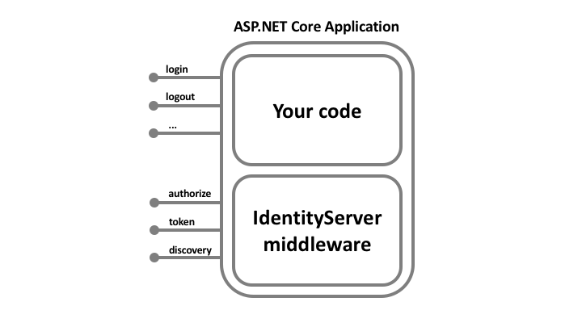

# [返回主目录](Readme.md)<!-- omit in toc --> 

# 目录 <!-- omit in toc --> 
- [Big Picture](#big-picture)
- [IdentityServer4如何提供帮助](#identityserver4如何提供帮助)

**IdentityServer4是用于ASP.NET Core的OpenID Connect和OAuth 2.0框架。**

## Big Picture

大多数现代应用程序或多或少看起来像这样：

最常见的交互是：

- 浏览器与Web应用程序通信
- Web应用程序与Web API通信（有时是自己通信，有时是代表用户）
- 基于浏览器的应用程序与Web API通信
- 本机应用程序与Web API通信
- 基于服务器的应用程序与Web API通信
- Web API与Web API通信（有时是独立的，有时是代表用户的）

通常，每一层（前端，中间层和后端）都必须保护资源并实施身份验证和/或授权-经常针对同一用户存储。

将这些基本安全功能外包给安全令牌服务可防止在那些应用程序和端点之间重复该功能。

重组应用程序以支持安全令牌服务将导致以下体系结构和协议：

## IdentityServer4如何提供帮助

IdentityServer是一种中间件，可以将符合规范的OpenID Connect和OAuth 2.0端点添加到任意ASP.NET Core应用程序中。

IdentityServer中间件向其中添加必要的协议头，以便客户端应用程序可以与之对话使用那些标准协议。

