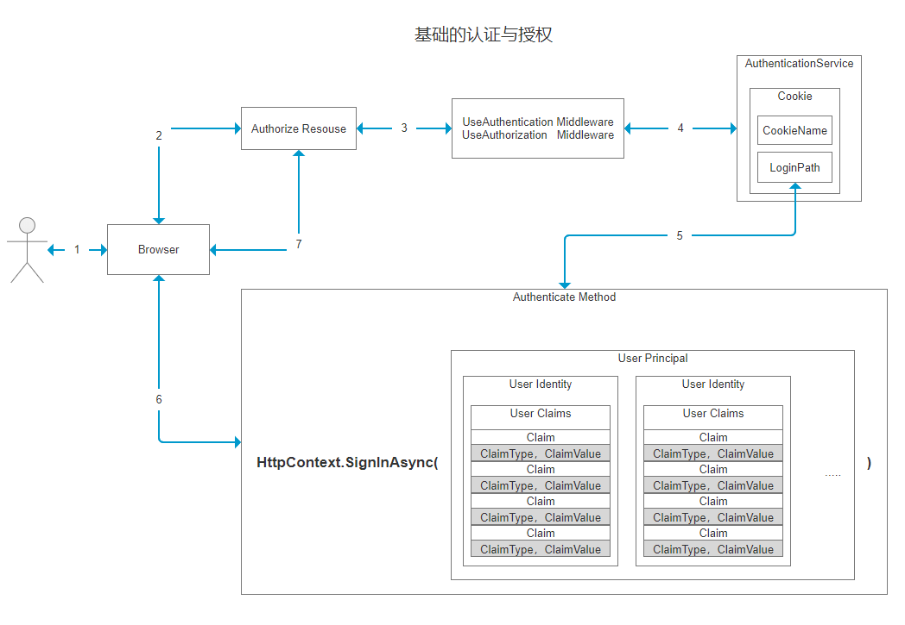
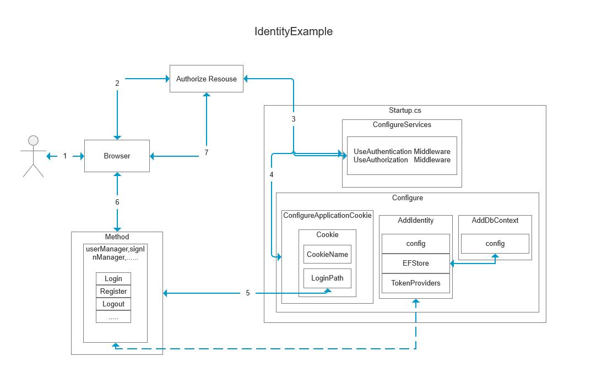

## 20200811
### 基础的认证与授权

1. 用户使用浏览器代理访问
2. 用户使用浏览器请求授权保护的资源
3. 中间件使未授权的用户跳转至认证服务
4. 认证服务配置中指定Cookie名称，与认证授权地址
5. 根据认证服务的授权地址跳转至认证方法
6. 认证方法为用户模拟一系列认证数据并将其返回给浏览器生成Cookie
7. 用户正常访问授权保护的资源

### IdentityExample

1. 用户使用浏览器代理访问
2. 用户使用浏览器请求授权保护的资源
3. 中间件使未授权的用户跳转至认证服务
4. 认证服务配置中指定Cookie名称，与认证授权地址
5. 根据认证服务的授权地址跳转至Identity的登陆方法
6. 登录成功后可以访问授保护的资源，并且可以继续执行用户管理等相关Identity管理的操作