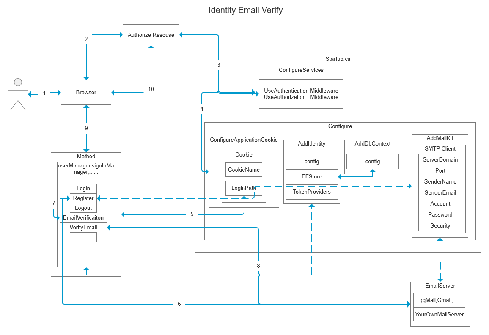
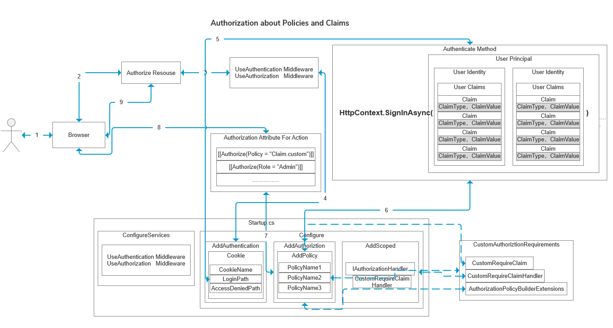
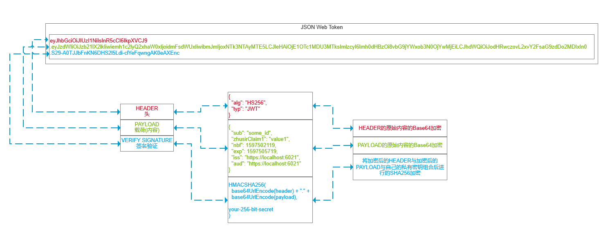
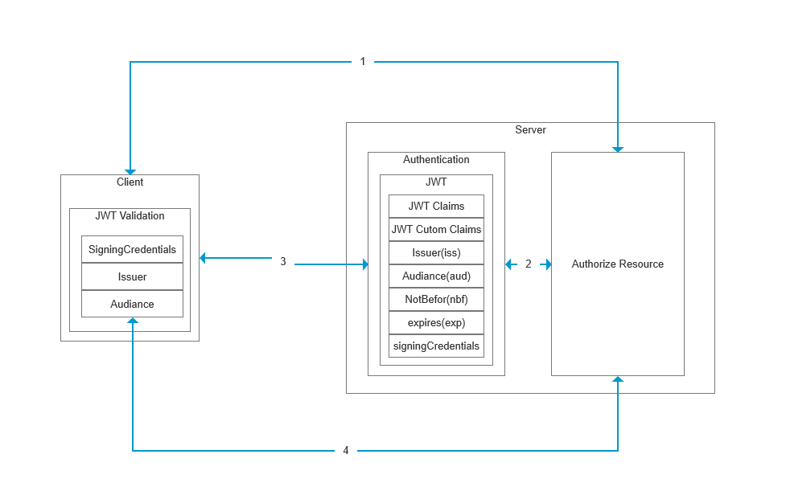
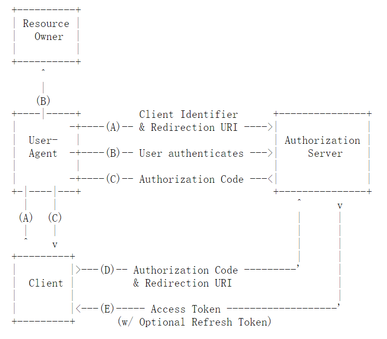
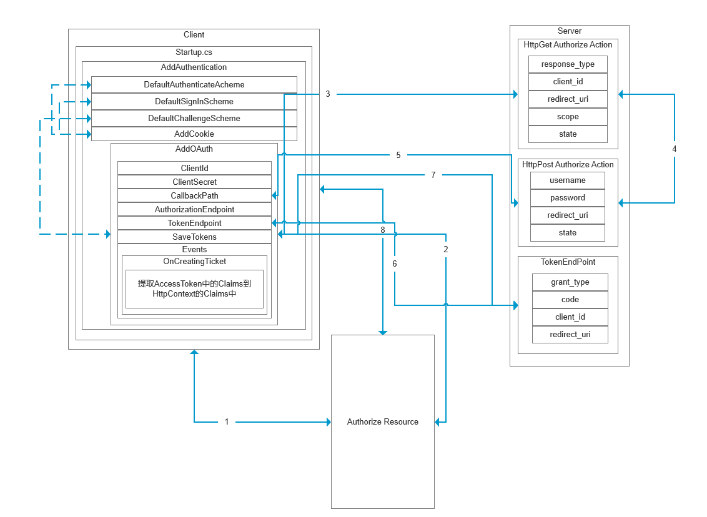

## 20200811
### 基础的认证与授权
[Basic](../../code/Authentication/Basic/)

1. 用户使用浏览器代理访问
2. 用户使用浏览器请求授权保护的资源
3. 中间件使未授权的用户跳转至认证服务
4. 认证服务配置中指定Cookie名称，与认证授权地址
5. 根据认证服务的授权地址跳转至认证方法
6. 认证方法为用户模拟一系列认证数据并将其返回给浏览器生成Cookie
7. 用户正常访问授权保护的资源

### IdentityExample
[IdentityExample](https://github.com/smallprogram/Knowledge-And-Demo/commit/610bcd467041154e6ac59578c441b68d9c13ef20)

1. 用户使用浏览器代理访问
2. 用户使用浏览器请求授权保护的资源
3. 中间件使未授权的用户跳转至认证服务
4. 认证服务配置中指定Cookie名称，与认证授权地址
5. 根据认证服务的授权地址跳转至Identity的登陆方法
6. 登录成功后可以访问授保护的资源，并且可以继续执行用户管理等相关Identity管理的操作

## 20200812
### IdentityEmailVerify
[IdentityExample](https://github.com/smallprogram/Knowledge-And-Demo/commit/a6cc4f7edf2edd1a89501f82853d1717c514457a)

1. 用户使用浏览器代理访问
2. 用户使用浏览器请求授权保护的资源
3. 中间件使未授权的用户跳转至认证服务
4. 认证服务配置中指定Cookie名称，与认证授权地址
5. 根据认证服务的授权地址跳转至Identity的登陆方法,图中为注册业务
6. 注册中使用SMTP服务器发送验证邮件
7. 提示用户验证邮件发送成功，需要验证才可继续
8. 通过验证邮件链接返回邮件验证Token
9. 登录之后即可访问受保护资源

### Authorization Policies and Claims
[Basic](https://github.com/smallprogram/Knowledge-And-Demo/commit/730c57436611bbf52ac3efeb69eef5bf94244a9f)

## 20200814
### Authorization Extras
[Basic](https://github.com/smallprogram/Knowledge-And-Demo/commit/2e393297cfb90be0c691716829cfe85d0ab813e9)

各种自定义方式的Policy授权，使用Attribute标注Action。所有的所有都是围绕着User的Claims展开的

### Authorization Razor Page
[Basic](https://github.com/smallprogram/Knowledge-And-Demo/commit/064a8a0224c05f19f0deb9c105f1cca41f7ab96a)
为Razor Page添加认证授权

## 20200815
### JWT JsonWebToken 

[Commit URI](https://github.com/smallprogram/Knowledge-And-Demo/commit/232064bc1e33b07c6fc5e44cac78d038ef972b16)
#### 默认的JWT中注册的Claims与含义

名称|含义|类型|是否必填
-|-|-|-
iss|发布者，发送JWT的委托人，通常位发布的服务器URL，区分大小写|string|可选
sub|主题，全局唯一的，|string|必填
aud|受众，目标接受人，如果接收者没有使用aud标识自身则必须拒绝该JWT|string|可选
exp|过期时间，通常不超过几分钟|NumericDate|可选
nbf|jwt在此时间之前不能被接收处理|NumericDate|可选
iat|jwt的发布时间|NumericDate|可选
jti|jwt的唯一标识id，防止重播jwt，区分大小写|string|可选

#### JWT基本流程

1. 客户端访问被保护资源
2. 服务器跳转至认证
3. 服务器返回包含JWT注册的Claims和系统自定义的Claims，客户端校验加密签名与其他Claims
4. 使用该校验通过的JWT，通过Header或Querystring的方式访问资源 

## 20200816
### OAuth2.0 Custom Implememt Authoriztion Code Flow
[Commit URI](https://github.com/smallprogram/Knowledge-And-Demo/commit/c6af87bde168848035a69188cb486addaa53f229)

1. Client访问受保护资源
2. 使用OAuth进行认证
3. 跳转OAtuh服务器，传递各种参数
4. OAuth服务器进行认证
5. 认证完成跳转至客户端callbackUri,由Client的OAuth中间件进行处理。
6. Client通过带有Authoriztion Code访问OAuth服务器Token端点
7. OAuth服务器验证Authoriztion Code，返回Access_Token(JWT)至Client。Client处理accessToken提取Claims用于授权
8. Client使用AccessToken访问受保护资源

## 20200817
### 添加API，展示基础的客户端如何使用Token访问API，并且API如何通过服务器验证Token
[Commit URI](https://github.com/smallprogram/Knowledge-And-Demo/commit/61fcb0438571f93d9ffccbbeafb1684a1f928e40)

## 20200818
### 添加RefreshToken实现
[Commit URI](https://github.com/smallprogram/Knowledge-And-Demo/commit/3726193ab8017794babef3dd19b25c570ce4a4d9)
