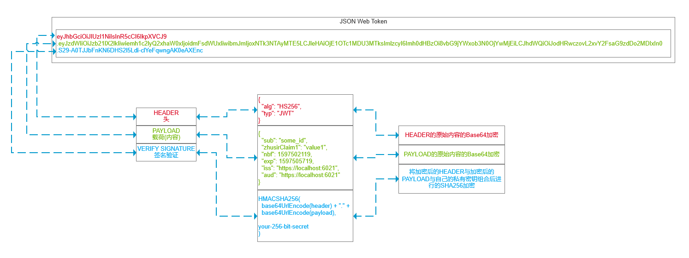

## 20200811
### 基础的认证与授权
[Basic](../../code/Authentication/Basic/)


1. 用户使用浏览器代理访问
2. 用户使用浏览器请求授权保护的资源
3. 中间件使未授权的用户跳转至认证服务
4. 认证服务配置中指定Cookie名称，与认证授权地址
5. 根据认证服务的授权地址跳转至认证方法
6. 认证方法为用户模拟一系列认证数据并将其返回给浏览器生成Cookie
7. 用户正常访问授权保护的资源

### IdentityExample
[IdentityExample](https://github.com/smallprogram/Knowledge-And-Demo/commit/610bcd467041154e6ac59578c441b68d9c13ef20)


1. 用户使用浏览器代理访问
2. 用户使用浏览器请求授权保护的资源
3. 中间件使未授权的用户跳转至认证服务
4. 认证服务配置中指定Cookie名称，与认证授权地址
5. 根据认证服务的授权地址跳转至Identity的登陆方法
6. 登录成功后可以访问授保护的资源，并且可以继续执行用户管理等相关Identity管理的操作

## 20200812
### IdentityEmailVerify
[IdentityExample](https://github.com/smallprogram/Knowledge-And-Demo/commit/a6cc4f7edf2edd1a89501f82853d1717c514457a)


1. 用户使用浏览器代理访问
2. 用户使用浏览器请求授权保护的资源
3. 中间件使未授权的用户跳转至认证服务
4. 认证服务配置中指定Cookie名称，与认证授权地址
5. 根据认证服务的授权地址跳转至Identity的登陆方法,图中为注册业务
6. 注册中使用SMTP服务器发送验证邮件
7. 提示用户验证邮件发送成功，需要验证才可继续
8. 通过验证邮件链接返回邮件验证Token
9. 登录之后即可访问受保护资源

### Authorization Policies and Claims
[Basic](https://github.com/smallprogram/Knowledge-And-Demo/commit/730c57436611bbf52ac3efeb69eef5bf94244a9f)


## 20200814
### Authorization Extras
[Basic](https://github.com/smallprogram/Knowledge-And-Demo/commit/2e393297cfb90be0c691716829cfe85d0ab813e9)

各种自定义方式的Policy授权，使用Attribute标注Action。所有的所有都是围绕着User的Claims展开的

### Authorization Razor Page
[Basic](https://github.com/smallprogram/Knowledge-And-Demo/commit/064a8a0224c05f19f0deb9c105f1cca41f7ab96a)
为Razor Page添加认证授权


## 20200815
### JWT JsonWebToken 

[Commit URI](https://github.com/smallprogram/Knowledge-And-Demo/commit/232064bc1e33b07c6fc5e44cac78d038ef972b16)
#### 默认的JWT中注册的Claims与含义

名称|含义|类型|是否必填
-|-|-|-
iss|发布者，发送JWT的委托人，通常位发布的服务器URL，区分大小写|string|可选
sub|主题，全局唯一的，|string|必填
aud|受众，目标接受人，如果接收者没有使用aud标识自身则必须拒绝该JWT|string|可选
exp|过期时间，通常不超过几分钟|NumericDate|可选
nbf|jwt在此时间之前不能被接收处理|NumericDate|可选
iat|jwt的发布时间|NumericDate|可选
jti|jwt的唯一标识id，防止重播jwt，区分大小写|string|可选

#### JWT基本流程


1. 客户端访问被保护资源
2. 服务器跳转至认证
3. 服务器返回包含JWT注册的Claims和系统自定义的Claims，客户端校验加密签名与其他Claims
4. 使用该校验通过的JWT，通过Header或Querystring的方式访问资源 

## 20200816
### OAuth2.0 Custom Implememt Authoriztion Code Flow
[Commit URI](https://github.com/smallprogram/Knowledge-And-Demo/commit/c6af87bde168848035a69188cb486addaa53f229)


1. Client访问受保护资源
2. 使用OAuth进行认证
3. 跳转OAtuh服务器，传递各种参数
4. OAuth服务器进行认证
5. 认证完成跳转至客户端callbackUri,由Client的OAuth中间件进行处理。
6. Client通过带有Authoriztion Code访问OAuth服务器Token端点
7. OAuth服务器验证Authoriztion Code，返回Access_Token(JWT)至Client。Client处理accessToken提取Claims用于授权
8. Client使用AccessToken访问受保护资源

## 20200817
### 添加API，展示基础的客户端如何使用Token访问API，并且API如何通过服务器验证Token
[Commit URI](https://github.com/smallprogram/Knowledge-And-Demo/commit/61fcb0438571f93d9ffccbbeafb1684a1f928e40)

## 20200818
### 添加RefreshToken实现
[Commit URI](https://github.com/smallprogram/Knowledge-And-Demo/commit/3726193ab8017794babef3dd19b25c570ce4a4d9)


# IdentityServer 4

## 20200818
### 加添IdentityServer4 ClientCredentials
[Commit URI](https://github.com/smallprogram/Knowledge-And-Demo/commit/c8acebc25504b2079ddcefade5f6167031570c73)


1. Client(ApiTwo)通过ClientCredentials请求AccessToken,IdentityServer 返回AccessToken。
2. Client使用AccessToken访问被保护资源
3. 被保护资源ApiOne开始验证请求者身份
4. ApiOne与IdentityServer通信验证过AccessToken,并且验证通过。
5. ApiOne返回来着Client的正常响应。

### 加添IdentityServer4 Authorization Code Flow
[Commit URI](https://github.com/smallprogram/Knowledge-And-Demo/commit/a008be69df600520c6634d9e22a3490678270a70)


1. 请求受保护资源
2. 需要OpenIdConnect认证，根据aut,clientid,responseType等确定类型与授权服务器
3. 跳转至Identity服务器确认aut,clientid,responseType等与服务器中的数据是否一致。
4. 确认通过后跳转至Identity服务器认证模块进行认证


## 20200819
### IdentityServer4 Cookies IdentityToken AccessToken Claims

#### Cookies


- 1中认证表单的Cookie，与Client与idp都没有什么关系
- 2，3，4为Client在idp认证通过后得到的Cookie，其中2，3，4为一组Cookie，由于idp返回的IdentityToken、AccessToken、RefreshToken(可选)太大，所以会分割为多个Cookie存储。
- 5是Client在idp认证通过后，idp生成的Cookie。如果该Cookie存在，当Client再次需要认证时，就会直接认证通过而不重新认证。
- 6为idp外部验证cookie，例如使用Google，facebook,微信，qq等进行外部认证通过时，这个cookie就会起到作用。
- 5和6都属于idp的cookie
- 开发时，你会看到所有cookie的Domain都是localhost，生产时，他们会是不同的Domian

#### IdentityToken(id_token)
返回的IdentityToken中Payload中所包含的内容
名称|含义|类型|可选
-|-|-|-
iss|颁发者的颁发者标识符|string|必填
sub|最终用户的颁发者中的本地唯一且从未重新分配的标识符|string|必填
aud|此IdentityToken的目标受众|string|必填
exp|此IdentityToken的过期时间|NumericDate|必填
iat|此IdentityToken的发布时间|NumericDate|必填
auth_time|用户身份验证发生的时间|NumericDate|当发出max_age请求或将auth_time请求为基本声明时，则需要此声明；否则，它是可选的
nonce|随机字符串，用于将客户端会话与ID令牌相关联，并减轻重放攻击|string|必填
acr|认证上下文类别参考值的字符串|string|可选
amr|身份验证方法参考|string|可选
azp|仅当ID令牌具有单个受众值并且该受众不同于授权方时，才需要此声明|string|可选
IdentityResources|IdentityServer可能会设置需要包含一些用户的信息，例如Profile，自定义的Claims等|string|可选

##### 简单粗暴将用户信息包含在IdentityToken中
当idp的Client设置中将AlwaysIncludeUserClaimsInIdToken = true，则IdentityResource将包含到IdentityToken中，但是这种设置会让IdentityToken变得很大，不推荐。

##### 使用userinfo端点获取用户信息
Client的OpenIdConnect设置中添加config.GetClaimsFromUserInfoEndpoint = true;后当用户认证通过，将会再次从idp的UserInfo请求用户信息，也就是IdentityResource。该信息将会追加到Client的HttpContext的Claims中。

如果在Scope或ApiResource中添加Claim，该信息将会被追加到Access_token中。当用户使用Access_token访问受保护API时，该API的User.Claims中将会包含Access_token中的Claims


## 20200820 
### 添加RefreshToken的支持
[Commit URI](https://github.com/smallprogram/Knowledge-And-Demo/commit/5731fcc31eba15620d338d6cbe9126b51e0d64e4)


### 手工实现Javascript Client下的Implicit Flow
[Commit URI](https://github.com/smallprogram/Knowledge-And-Demo/commit/428f0a74c5cf90e1b876e6693d4fea763b49f7a6)

### 使用oidc-client.js和axios.js实现Implicit Flow
[Commit URI](https://github.com/smallprogram/Knowledge-And-Demo/commit/8229260451bb5d36f1e6d91ca2869803433fd699)

## 20200821

### 实现oidc-client.js的刷新token操作
[Commit URI](https://github.com/smallprogram/Knowledge-And-Demo/commit/63cde5843f360e0381e2f6324282ed87d1d5a3bc)

### 将IdentityServer数据与Identity数据保存到数据库,并设置初始化程序
[Commit URI](https://github.com/smallprogram/Knowledge-And-Demo/commit/6ee378164bef298cd2e37a44b8e51190fc9b53ad)

### 分别在客户端与Idp中添加SigninOut
[Commit URI](https://github.com/smallprogram/Knowledge-And-Demo/commit/2b61aa0665332a7f0cbc82793a0bb48103752af2)

## 20200822
### 添加自签名证书，替代临时证书

可以通过Windows 10 WSL2,以Ubuntu 18.04 LTS为例，安装openssl

执行一下命令：
```shell
openssl req -newkey rsa:2048 -nodes -keyout IdentityServer.Sample.key -x509 -days 365 -out IdentityServer.Sample.cer
#  IdentityServer.Sample.key为私钥，使用RSA2048 x509加密的，切勿泄露 -nodes将不加密私钥文件
#  IdentityServer.Sample.cer为由私钥生成的公钥
#  有效期为365天
openssl pkcs12 -export -in cas.clientservice.cer -inkey cas.clientservice.key -out IS4.pfx
# 使用PKCS12加密打包的证书文件IS4.pfx
# 最后会提示输入密码。密码将用于Idp导入该证书使用
```
得到pfx文件后，即可在代码中替换掉原始的开发临时证书。
[Commit URI](https://github.com/smallprogram/Knowledge-And-Demo/commit/8365ecffd7002e3b9980cdd2bc35b2fba6d5b3c8)
