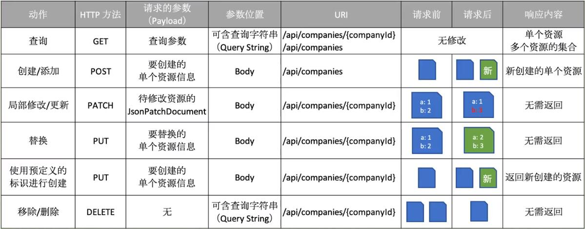

# [返回主目录](Readme.md)<!-- omit in toc --> 

# 目录 <!-- omit in toc --> 

- [Web API](#web-api)
- [MVC模式](#mvc模式)
- [MVC与API的映射关系](#mvc与api的映射关系)
  - [REST](#rest)
    - [REST的6个约束](#rest的6个约束)
    - [REST-Richardson成熟度模型](#rest-richardson成熟度模型)
- [WebAPI的对外合约](#webapi的对外合约)
  - [API消费者需要使用的三个概念](#api消费者需要使用的三个概念)
  - [资源标识](#资源标识)
    - [使用**名词**而不是动词，让人类能读懂。](#使用名词而不是动词让人类能读懂)
    - [要体现资源的结构关系](#要体现资源的结构关系)
- [Rest & HTTP GET](#rest--http-get)
  - [简介](#简介)
  - [HTTP Get](#http-get)
    - [API 资源命名](#api-资源命名)
    - [API资源层次结构](#api资源层次结构)
    - [API资源命名-过滤排序](#api资源命名-过滤排序)
    - [API资源的ID](#api资源的id)
  - [HTTP方法与资源交互](#http方法与资源交互)
  - [状态码](#状态码)
    - [2xx状态码](#2xx状态码)
    - [3xx状态码](#3xx状态码)
    - [4xx状态码](#4xx状态码)
    - [5xx状态码](#5xx状态码)
  - [HTTP GET](#http-get-1)
  - [内容协商](#内容协商)
    - [Accept Header](#accept-header)
    - [Content-Type Header](#content-type-header)

## Web API

Web API通常指“使用HTTP协议并通过网络调用的API”，由于他使用HTTP协议，所以需要通过URI信息来指定端点

Web API就是一个Web系统，通过访问RUI可以与其进行信息交互。

**大多数的Web API并不是RESTful API**

Roy Fielding为REST风格的API定制了一套约束规范或者叫做架构风格。

## MVC模式
MVC(Model-View-Controller)是一种主要用来构建UI的架构模式

强调 松耦合 关注点分离

MVC不是一个完整的应用程序架构

## MVC与API的映射关系

Model，负责处理数据逻辑

View，展示数据，在构建API时，View就是数据或资源的展示，通常使用JSON格式。

Controller，负责View与Model之间的交互。

### REST
**Representational State Transfer**  
由Roy Fielding提出  
REST是一种架构的风格，这种风格基于一套预定义的规则，这些规则描述了网络资源是如何定义和寻址的。
#### REST的6个约束
REST所关注的性能，可扩展性，简洁性，互操作性，通信可见性，组件便携性和可靠性都包含在这6个约束里
1. **客户端-服务端约束**：客户端和服务端是分离的，他们可以独自进化。
2. **无状态**：客户端和 服务端的通信必须是无状态的，状态应该包含在请求里。也就是说请求里包含服务端所需要的所有信息，以便服务端可以理解请求并可以创造上下文。
3. **分层系统**：像其他软件架构一样，REST也需要分层结构，但是不允许某层直接访问不相邻的层。
4. **统一接口**：分为4点：  
    4.1 资源标识符(URI)  
    4.2 资源的操作(也就是方法Method,HTTP动词)  
    4.3 自描述的相应(可以认为是媒体类型Media-Type)  
    4.4 状态管理(超媒体作为应用状态的引擎HATEOAS，Hypermedia as the Engine of Application State).
5. **缓存**：缓存约束派生于无状态约束，它要求从服务端返回的响应必须明确表明是可缓存的还是不可缓存的。
6. **按需编码**：这允许客户端可以从服务端访问特定的资源而无需知晓如何处理他们。服务器可以扩展或者自定义客户端的功能。  
#### REST-Richardson成熟度模型
1. **0级，Plain Old XML沼泽**：这里HTTP协议只是被永安里进行远程交互，协议的其余部分都用错了，都是RPC风格的实现(例如SOAP，尤其是使用WCF的时候)
2. **1级，资源**：每个资源都映射到一个URI上，但是HTTP方法并没有正确的使用
3. **2级，动词**：正确的使用了HTTP动词，状态码也正确使用了。同时也去掉了不必要的变种。
4. **3级，超媒体**：API支持超媒体作为应用状态的引擎HATEOAS，Hypermedia as the Engine of Application State，引入了可发现性。

## WebAPI的对外合约

### API消费者需要使用的三个概念
- 资源的标识
- HTTP方法
- 有效载荷(可选)，Payload

### 资源标识
#### 使用**名词**而不是动词，让人类能读懂。

- 例如想要获取系统中的用户。`api/getusers`是错误的。getusers是获取用户的意思，是动词。
- 正确的做法是`GET api/user`

#### 要体现资源的结构关系
- 假设后端API拥有多个资源，而用户资源与其他资源没有直接关系。那么获取用户就应该使用`api/users`。 而不是 `api/products/users`。
- 通过id获取用户应该`api/users/{userId}`，而不是`api/userId/users`。
- 遵守这种规则能够让api保持很好的可预测性和一致性。
- 假设需要获取某个公司下的所有员工。使用`api/emploess`,`api/emploees/{companyId}`的做法都是错误的。正确的做法是`GET api/companies/{companyId}/emploees`。
- 假设想过获取某个公司下的某个员工。使用`GET api/companies/{companyId}/employees/{employeeId}`。
- 假设需要进行自定义查询。就应该把过滤或排序的条件放在querystring中。`api/users?orderby=name`

## Rest & HTTP GET
### 简介
1. REST简介
2. HTTP GET Action
3. 翻页，过滤，排序

### HTTP Get
#### API 资源命名
资源应该使用名词，他是个东西，不是动作
资源应该使用的名词，例如:  
1. ~~api/getusers~~ 就是不正确的
2. GET api/users 就是正确的
3. GET api/users/{userId}  
- 其中资源名的单词建议使用复数形式
#### API资源层次结构
- 例如 api/department/{departemntId}/emoloyees,这就表示department(部门)和employee(员工)之间时主从关系
- 而 api/department/{departmentId}/emoloyees/{emoloyeeId}，表示了该部门下的某个员工。
#### API资源命名-过滤排序
过滤和排序不是资源，应该作为参数传入
- 例如 api/users?orderby=username
#### API资源的ID
**资源的URI应该永远都是一样的**
- 推荐GUID作为ID来使用
- 自增int类型的ID，在迁移到新数据库是需要特殊的设定，保证ID值不会发生变化

### HTTP方法与资源交互

- **GET**：一般用来获取资源，例如获取资源的集合，或者通过id获取单个资源
- **POST**：一般用于添加资源，请求中包含需要添加的资源信息，在响应中返回该资源
- **PUT**：一般用于整体的资源更新，请求中包含已更新的资源信息和需要更新的资源的ID，在响应中返回已更新的资源或者返回空204状态码
- **PATCH**：一般与用于资源的部分更新，请求是一个model的jsonPatchDocument,还包含需要更新资源的ID，在响应中返回已更新的资源或者返回空204状态码
- **DELETE**：一般用于删除资源，请求只需要包含资源的ID，在响应中返回204状态码。
- **HEAD**：和GET差不多，但是他不应该返回响应的body，所有没有响应的payload，主要用来获取资源的一些信息，例如查看资源是否可用等。
- **OPTIONS**：用来查询某个资源URI的可交互方式有哪些，换句话说就是，使用它可以知道某个URI是否可以执行GET或者POST动作，这些结果通常是在响应的Headers里而不是在body里，所以也没有响应的payload。

### 状态码
状态码会告诉API的消费者：  
- 请求是否如预期的成功，或者失败
- 如果出现了错误，具体出错的负责人(服务端、客户端)应该是谁  

**API主要用的到状态码：**  
-  200级别，表示成功
-  400级别，标识客户端引起的错误
-  500级别，标识服务器错误

#### 2xx状态码
- 200：OK ，会附带一些响应
- 201：Created，表示资源创建成功
- 204：No Content,成功执行，但是没有返回任何东西
#### 3xx状态码
- 用于跳转，绝大多数API都不需要使用这类状态码。
#### 4xx状态码
- 400：Bad request，表示API的消费者发送到服务器的请求是错误的
- 401：Unauthorized，表示没有权限访问
- 403：Forbidden，表示用户验证成功了，但是该用户依然无法访问该资源
- 404：Not found，表示请求的资源不存在
- 405：Method not allowed，当发送请求到某个资源时，使用的HTTP方法是不允许的，例如使用POST api/countries，而该API只实现了GET，就会返回405
- 406：Not acceptable，涉及到media type，例如API消费者请求的是application/xml格式的media type，而API只支持application/json
- 409：Conflict，表示该请求无法完成，因为请求与当前资源的状态有冲突，例如你编辑某个资源数据后，该资源又被其他人更新了，这是你再PUT你的数据就会出现409错误，有时也会出现在尝试创建资源而该资源已存在的情况。
- 415：Unsupported media type,这个和406正好返回来，例如向服务器提交数据的media type是xml，但是服务器只支持json，那么就会返回415
- 422：Unprocessable entity，表示请求的格式没问题，但是语义有错误，例如实体验证错误。 
#### 5xx状态码
- 500：Internal server error，表示服务器发生了错误

### HTTP GET
- 单个数据
  - 找到了：200
  - 没找到：404
- 集合数据
  - 至少一条数据，200
  - 没有数据，也是200

### 内容协商
#### Accept Header
如果资源支持多种展现格式，那么消费者可以选择它想要的格式
- 在请求的Accept Header指定Media Type
  - application/json,application/xml
  - 若未指定，返回默认的application/json
- 请求的media type不可用时，并且消费者不支持默认格式的时候，返回406
- 对应asp.net core中的Output formatters

#### Content-Type Header
- Media Type
  - application/json
  - application/xml
  - ....
- 代表API接收的输入格式
- 对应asp.net core里面的Input formatter