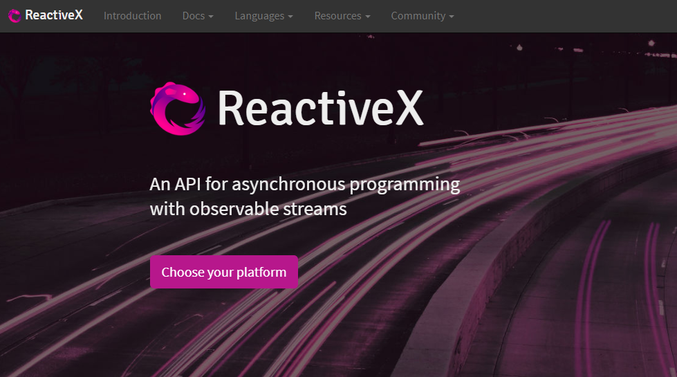

# [返回主目录](../Readme.md)<!-- omit in toc --> 

# 目录 <!-- omit in toc --> 
- [简介](#%e7%ae%80%e4%bb%8b)
- [RxJS是什么](#rxjs%e6%98%af%e4%bb%80%e4%b9%88)
- [RxJS解决什么问题](#rxjs%e8%a7%a3%e5%86%b3%e4%bb%80%e4%b9%88%e9%97%ae%e9%a2%98)
- [观察者模式 The Observer Pattern](#%e8%a7%82%e5%af%9f%e8%80%85%e6%a8%a1%e5%bc%8f-the-observer-pattern)

# 简介
1. RxJS是什么
2. 它解决什么问题
3. 怎么使用它
4. RxJS与其他框架的关系
5. RxJS的主要构建块，它如何编写响应式程序，展示一些Demo

# RxJS是什么

****RxJS中的Rx代表Reactive Extensions API(响应式扩展API或反应是扩展API)，js代表Javascript，RxJS是Reactive Extensions API的Javascript实现。****

可以登录 http://reactivex.io/ 查看 什么是Reactive Extensions API。 

反应性扩展通常称为ReactiveX，或者简写为Rx。在网站主页上的描述，可以知道它是被用于可观察流的异步编程API。这里的流指的是流入你应用程序的数据，就像水一样。页面上的背景图像显示为高速公路上的交通流量，这也象征着数据流。

ReactiveX API 旨在帮助你管理应用程序中的数据流。许多API设计用于异步处理数据，但也有一些同步的设计。

在页面的下方，ReactiveX是观察者模式，迭代器模式，函数式编程的最好结合。

当点击 Choose your platform按钮，会展示很多语言对于ReactiveX的实现。其中第二个就是RxJS。

# RxJS解决什么问题

**RxJS提供了一个单一的API来促进和简化来自多个来源的数据处理。**

**当这些来源随着时间的推移产生数据时，我们就将他们看成逐渐流入应用程序的数据流。**

这些流会有很多中形式，可以是同步数据或异步数据，也可以是HTTP请求返回到服务器的应用程序数据，也可以是用户使用客户端应用程序生成的数据。

与RxJS有关的数据可以是任何东西。它不仅限于特定于应用程序的域数据。

浏览器的DOM事件也是数据流。它们随着时间的推移而发生，包含着可能需要处理的信息

即使是简单的函数返回值，也可以被视为数据流，只是它是只有一个值的数据流。

这么多的数据流在Javascript中的处理方式都是不同的。

你可以使用回调函数或者Promise来处理异步数据。

在事件的情况下可能需要编写专门用于处理每种类型事件的函数。如果要处理数组或者其他一些数据列表可能会使用循环迭代。

最后，在函数返回值的情况下，你可能需要将值赋给某个新变量来处理。

RxJS通过提供可以与所有数据源一起使用的单个API，帮助你处理这些不同的数据源，并且提供多种处理方式。

这个API的核心是可观察的数据类型。它允许你观察流入应用程序的数据，然后使用明确定义的一组函数对其做出反应。

# 观察者模式 The Observer Pattern
观察者模式是一种常见的软件开发模式，它真正构成了Reactive Extensions API和RxJS的基础。

观察者模式和许多其他设计模式，在《设计模式》一书中被详细的记录。这本书由四位大神Erich Gamma,Richard Helm,Ralph Johnson,John Vlissides编写。英文好的可以看看原版。

观察者模式背后的思想是，你有一个被成为主体或主题(Subject)的对象，它将生成值并通知其他有兴趣接受这些值的对象。

主题维护要产看这些新值的对象列表。这些对象是观察者(Observer)。

Subject随着时间的推移将值推送给Observer，然后每个Observer可以通过执行特定于该Observer的一些代码来对这值做出反应。

假如我们有一个简单的数组，由这个Subject产生。由于Subject维护了想要接受这些值的Observer列表，因此Subject会把数组中的第一个项目推送给所有Observer。然后每个Observer独立于其他Observer对该值做出Reactive(反应)。

在某些时候，Subject将会将数组的下一个值推送给所有注册的Observer。

RxJS支持这种模式，其中单个Subject向多个Observer广播值的方式将在后边提到。

然而，RxJS中更常见的情况是之前提到的观察者对象(Observable)，将值推送给单个Observer。

接下来将针对RxJS，展示一些将要在对象上调用的方法。

**它始于Observable可观察对象，将Observer注册到Observable是通过调用Observable的subscribe方法，之后接收来自Observable推送的值。**

**需要订阅接收值得Observer需要将自己作为参数传递给subscribe方法。**

**Observable通过调用Observer对象本身得一些方法向该Observer发送值和一些其他信息。**

**Observable会调用Observer得next方法向Observer发送一个新值。**

**如果某处发生错误，Observable会调用Observer的error方法通知该Observer。**

**最后，Observable会调用Observer的complete方法通知该Observer完成了所有值的发送。**

**假如我们想从一个数组中产生一些数字。一旦Observer订阅了Observable，就可以通过next方法将第一个值作为参数传递给该Observer。**

**当第二个值准备就绪的时候，Observable会再次调用next方法并将第二个值作为参数传递给该Observer。**

**假设在这个过程中没有发生任何错误，它最后会使用数组的最后一个值调用next方法，并将该值作为参数传递给该Observer。**

**一旦发送了最后一个值，该Observable会调用Observer的complete方法让该Observer知道所有值都已经发送完了。**

**这个例子使用了一个数组当作值，但是，其实可以用任何类型的数据，比如一系列的DOM事件，Http响应等等。**

**在RxJS中，你需要编写Observer的next、error、complete方法里的逻辑内容，以适应你的应用程序处理数据的逻辑。**

