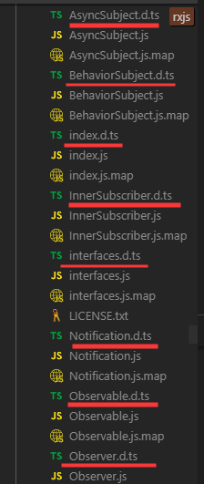
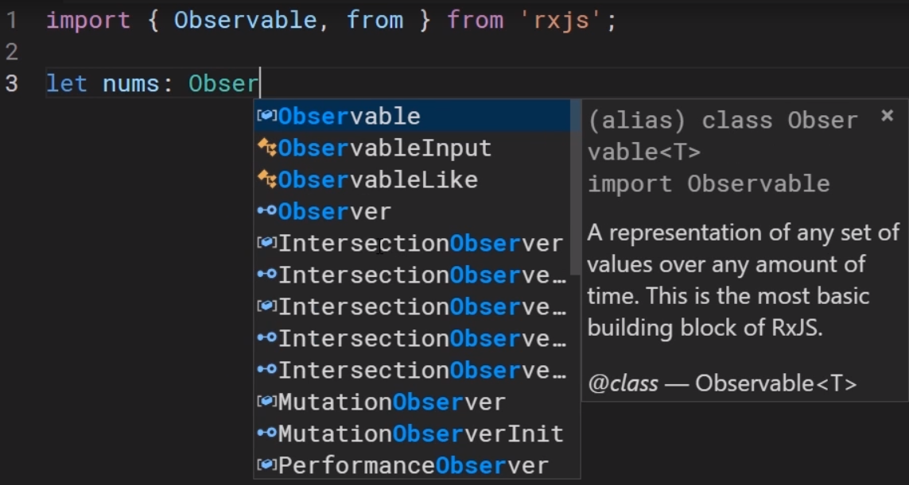
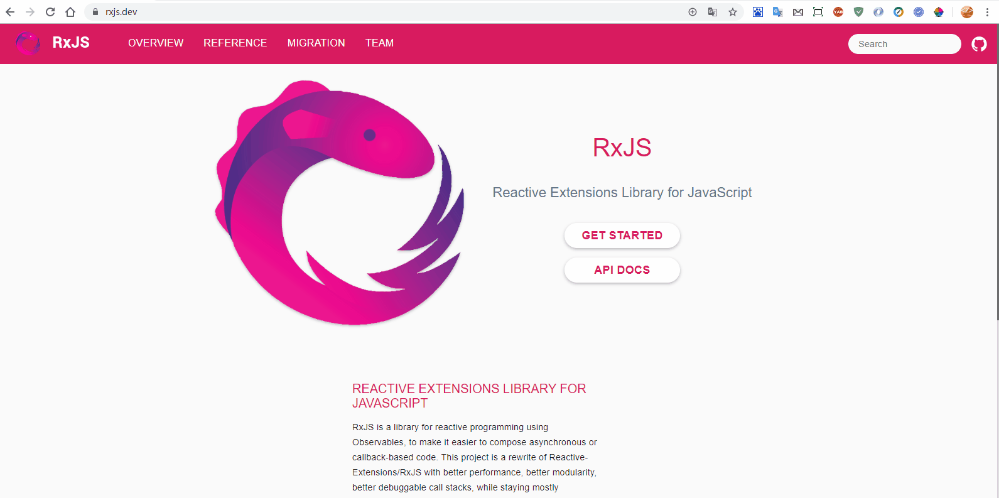

# [返回主目录](../Readme.md)<!-- omit in toc --> 

# 目录 <!-- omit in toc --> 
- [简介](#%e7%ae%80%e4%bb%8b)
- [更好的异步API](#%e6%9b%b4%e5%a5%bd%e7%9a%84%e5%bc%82%e6%ad%a5api)
  - [首先看一个典型的Javascript回调代码：](#%e9%a6%96%e5%85%88%e7%9c%8b%e4%b8%80%e4%b8%aa%e5%85%b8%e5%9e%8b%e7%9a%84javascript%e5%9b%9e%e8%b0%83%e4%bb%a3%e7%a0%81)
  - [使用promise处理异步数据](#%e4%bd%bf%e7%94%a8promise%e5%a4%84%e7%90%86%e5%bc%82%e6%ad%a5%e6%95%b0%e6%8d%ae)
  - [使用async和await处理异步数据](#%e4%bd%bf%e7%94%a8async%e5%92%8cawait%e5%a4%84%e7%90%86%e5%bc%82%e6%ad%a5%e6%95%b0%e6%8d%ae)
  - [使用RxJS处理异步数据](#%e4%bd%bf%e7%94%a8rxjs%e5%a4%84%e7%90%86%e5%bc%82%e6%ad%a5%e6%95%b0%e6%8d%ae)
- [编程语言的选择](#%e7%bc%96%e7%a8%8b%e8%af%ad%e8%a8%80%e7%9a%84%e9%80%89%e6%8b%a9)
- [RxJS Operators 操作符](#rxjs-operators-%e6%93%8d%e4%bd%9c%e7%ac%a6)
- [RxJS的维护和增强](#rxjs%e7%9a%84%e7%bb%b4%e6%8a%a4%e5%92%8c%e5%a2%9e%e5%bc%ba)

# 简介
之前介绍了RxJS可以解决的问题。这一节将介绍RsJS的一些具体的好处。

# 更好的异步API
在使用Javascript的回调函数处理异步数据，你可能需要花大量时间。或者使用promise、async、await进行此类工作。
RxJS提供了更好的解决方案。

## 首先看一个典型的Javascript回调代码：
```ts
//get some book data
router.get('/books', (req, res) => {
    processData('data.txt', (err, result) => {
        fs.writeFile('/data/books.txt', result, (err, output) => {
            res.send(output);
        });
    });
});
```
在这里，正在处理一个URL的请求，这个URL最终将触发从`(req, res) => {...}`开始的回调函数。为了简介我写成了箭头函数的形式。这个函数会继续调用另一个执行更多异步工作的函数`(err, result) => {...}`,将结果写入到文件中，接着继续调用另一个函数`(err, output) => {...}`。

**这种代码没毛病，可以工作。在一些事件处理之类的情况下，可以使用这种方式处理多个数据，但是我认为这种代码很难阅读，并且也很难追踪处理过程。**

## 使用promise处理异步数据

```ts
let bookPromise = getBookByIdAsync(5);

bookPromise
    .then(book => console.log('Data: ${book.title}'))
    .catch(err => console.log(err))
    .finally(() => console.log('All done.'))
```
首先调用了一个返回promise的函数，然后调用链接到then、catch、finally的方法，以处理它产生的任何值或错误。

**我个人非常喜欢这种写法，很容易阅读，但是它只适用异步等待单个值。一旦promise被返回，并将值传递给then函数，它的工作也就结束了。没有办法获取更多更有价值的信息，这种并不适用于需要长时间等待数据的情况。**

## 使用async和await处理异步数据
```ts
async function GetBookByID(id) {
    let book =  await RetrieveBookFromServer(id);
    console.log(book.title);
    return book;
}
```
**我个人非常喜欢这种写法，它看起来就像同步代码一样，让人更容易理解。但是实际上它只是隐式的调用了底层promise，因此它也只能处理单个值。**

## 使用RxJS处理异步数据

```ts
let booksObservable = processAllBooks();

booksObservable.subscribe(
    (book => console.log(book.title)),
    (err => console.log(err)),
    (() => console.log('All done.'))
);
```

**调用一个返回一个Observable的函数，然后调用该Observable上的subscribe函数，只要Observable返回值，就可以通过第一个函数处理该值，通过第二个函数处理异常，通过第三个函数结束。**

**从语法上讲，看起来与Promise非常类似。并且十分方便阅读。与Promise不同，Observable可以随着时间的推移产生多个值。**

**当BooksObservable产生新的值，就会反复调用第一个函数处理该值，当出现错误就会调用第二个函数处理异常，当Observable完成后将调用第三个函数结束。**

---

我想这种可读性强，能够异步处理多个数据的方式，使得RxJS远远优于其他技术。


# 编程语言的选择

你已经知道RxJS中的JS代表Javascript，RxJS适用于ES2015版Javascript中的所有功能。但是RxJS是Typescript编写的。Typescript是Javascript的超集。

Typescript的流行度在持续增长，RxJS包括了所有类型和功能的声明文件。



这意味着你可以编辑中获得出色的代码完成与提示功能。



Javascript或Typescript是使用RxJS的最佳选择，但正如之前提到的，Reactive Extensions API已经有很多语言的实现。因此一旦熟悉了RxJS中的API，那在使用其他语言(服务端代码)的时候将会更加高效的上手。

# RxJS Operators 操作符

Operators的作用是当获取数据后应该怎么处理数据。这就是RxJS的巨大优势的地方。

Operators操作符是将Observable返回的数据进行处理后返回新的Observable的函数。因为Operators返回新的Observable的特性，在写代码时可以轻松将多个操作符组合在一起，达到你想要达到的目的。



在[RxJS官网](https://rxjs-dev.firebaseapp.com/)。

点击顶部导航的Reference链接，会跳转至显示API中所有功能和类型的页面，在页面下方会展示所有Operators的部分，如你所见，这个页面很长。

目前包含100多个运算符，这些Operator可以执行你能想到的对Observable数据的任何操作。

他们可以帮你完成转换、过滤、与其他Observable对象的数据组合等更多操作。

如果你没有找到适合你业务的Operators，你也可以自己创建自定义的Operator。创建自定义的Operator十分简单，实际上只是具有特定签名的函数而已。


---
Operator是Observable的完美补充，他们共同为你提供处理应用程序中所有类型的数据的完美解决方案。

# RxJS的维护和增强
在构建应用程序时，你可能会考虑使用一下依赖库，在使用依赖库之前应该确保这些依赖库是不断更新被维护的和被升级的。

RxJS已经存在很多年，检查最新版本和历史版本，RxJS的研发团队在发布新功能方面做的很好，并且针对老版本兼容性也很高。

例如2018年RxJS发布的第6版，这是一个重要的升级版本，其中包含了大量的变化。基于该版本，RxJS研发团队还发布了一个配套的兼容包，能够让旧版本的用户轻松迁移到新版本。

Google的Angular的开发团队也将RxJS包含在Angular中，并在Angular框架中大量使用RxJS。