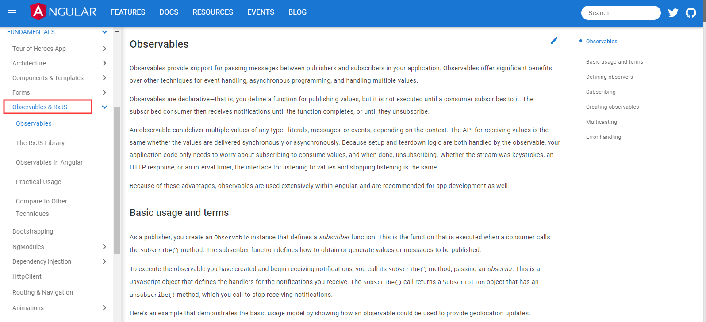
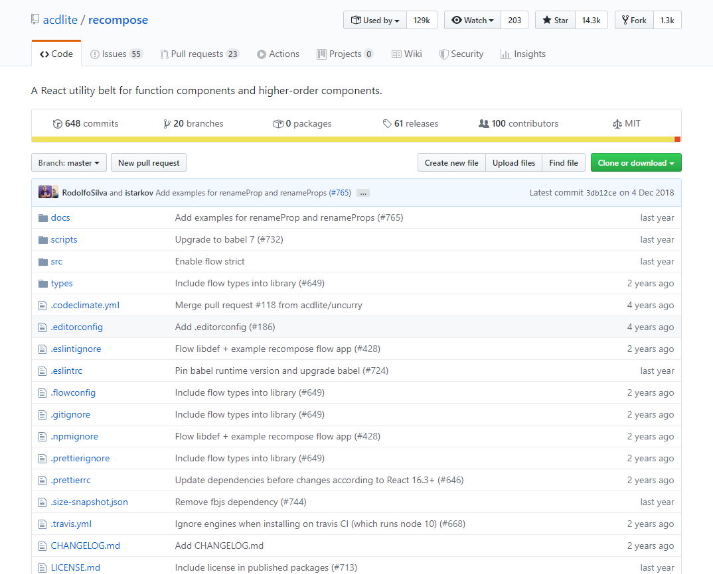
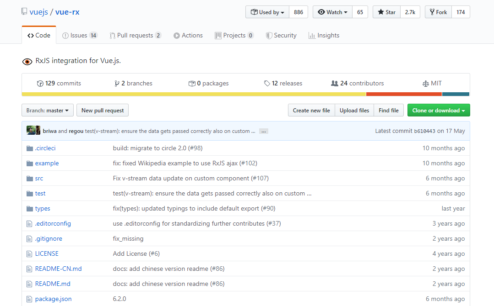
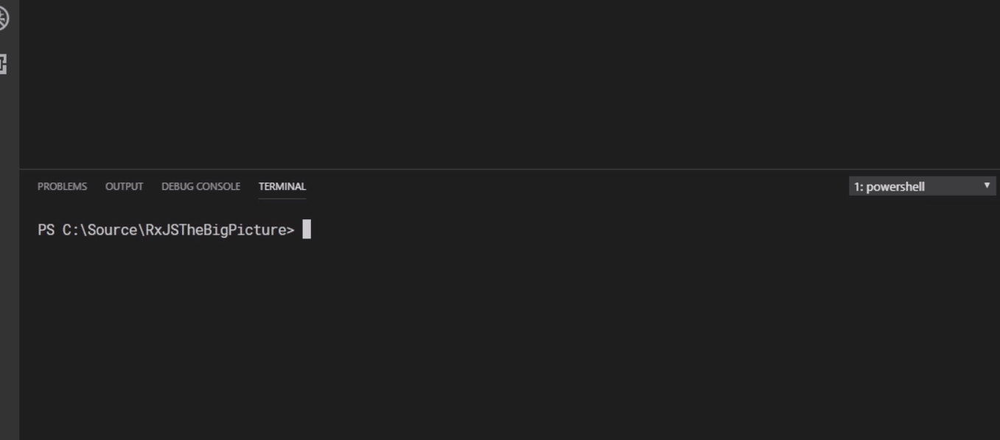
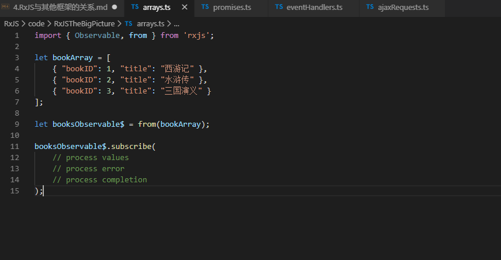

# [返回主目录](../Readme.md)<!-- omit in toc --> 

# 目录 <!-- omit in toc --> 

- [库和框架 Libraries and Frameworks](#%e5%ba%93%e5%92%8c%e6%a1%86%e6%9e%b6-libraries-and-frameworks)
- [RxJS与Angular](#rxjs%e4%b8%8eangular)
- [RxJS和React、Vue](#rxjs%e5%92%8creactvue)
  - [RxJS和React](#rxjs%e5%92%8creact)
  - [RxJS和Vue](#rxjs%e5%92%8cvue)
- [使用RxJS Step by step](#%e4%bd%bf%e7%94%a8rxjs-step-by-step)
  - [处理数组数据流](#%e5%a4%84%e7%90%86%e6%95%b0%e7%bb%84%e6%95%b0%e6%8d%ae%e6%b5%81)
  - [处理Promise数据流](#%e5%a4%84%e7%90%86promise%e6%95%b0%e6%8d%ae%e6%b5%81)
  - [处理事件数据流](#%e5%a4%84%e7%90%86%e4%ba%8b%e4%bb%b6%e6%95%b0%e6%8d%ae%e6%b5%81)
  - [处理HTTP数据流](#%e5%a4%84%e7%90%86http%e6%95%b0%e6%8d%ae%e6%b5%81)

RxJS可以单独使用，但是在现代客户端开发的过程中很少有使用单一库构建新的应用程序的例子。

之后将介绍RxJS如何配合其他框架使用。并且还会展示如何将RxJS添加到新项目中以及如何将其合并到现有项目中。


# 库和框架 Libraries and Frameworks
首先说一下库和框架。

对于我来说，库 Libraries，是功能的补充，他们能帮助解决特定的问题，但是不会决定应用程序的整体架构。

理想情况下，库需要避免与其他库发生冲突，并且允许你根据需要自定义的选择其功能。

根据这个定义RxJS绝对是一个库。像其他的一些例如经典的Jquery也是库，
RxJS能够很好的与其他库一起工作。

框架 Frameworks，相对于Libraries，规模更大，规范性更强。通常在开始构建应用程序的时候会选择单个Framework，之后使用多个Libraries补充该Framework，以帮助解决一些特定问题。

目前最流行的三个前端框架是 Angular、React、Vue。这些Frameworks都带有构建应用程序需要的大部分脚手架，并且也可以轻松使用像RxJS这样的Libraries。

之后将会展示如何在Framework中使用RxJS这种Libraries。并且阐述一下RxJS与Angular的关系。

# RxJS与Angular
RxJS默认包含在Angular中，但不是不默认包含在React和Vue中。这意味着在Angular应用程序中开始使用RxJS会相对容易一些。                                          


在Visual Studio Code中使用AngularCLI创建一个新的应用程序

使用ng new命令创建一个默认设置的、命名为AngularWithRxJS的应用程序。一旦NPM安装完成，使用VS code打开这个项目。跳转到node_modules文件夹，可以看到RxJS已经包含其中。无需再额外安装。

要使用它，可以在项目中打开一个TS代码文件，导入需要的内容。例如本例中就导入了Observable类型。也可以导入RxJS中的Operator或者其他类型。

Angular将其包含在Framework中，这是一个非常好的体验，开箱即用。

为了进一步强化RxJS在Angular中的重要性，在[Angular的官方文档](https://angular.io/guide/observables)中，有一个章节专门介绍了关于RxJS在Angular中的使用。



可以看到有一个标题为Observables & RxJS，其中包含了几页精心编辑的文档。涵盖了RxJS的一些常规功能，已经如何在Angular中使用RxJS的一些具体示例。

经常听人说RxJS是Angular的一部分。这种说法是错误的。RxJS只是包含在Angular中，但是RxJS是一个独立于Angular的完整独立的库。RxJS支持许多流行的Javascript libraries和Frameworks。

# RxJS和React、Vue
与Angular非常相似的React和Vue是非常流行的框架。这两个Framework目前默认不包含RxJS，但是你可以将它添加到项目使用。

## RxJS和React
React的组件体系结构更多的围绕状态而不是数据流构建，但是Web和Javascript的异步性质仍然是存在的，并且RxJS可以帮助React开发人员处理异步数据。




有一个流行的库经常与React一起使用，它的名字叫[recompose](https://github.com/acdlite/recompose)。它包含许多函数组件实用程序，并且包括一组Observable实用程序，这些实用程序使得React中处理数据流变得更加容易。

如上图所示，它能够帮助React开发者更好的集成RxJS。

从recompose页面上可以看到，作者正在主动停止维护这个项目，类似这个项目的功能正在由React Hooks提供。

## RxJS和Vue

在Vue中，可以使用npm将RxJS添加到项目中并开始使用它，但是，Vue团队开发了一个专门用于帮助开发人员将RxJS与Vue集成的插件。名字叫做[vue-rx](https://github.com/vuejs/vue-rx)。



这个插件为Vue.js提供了RxJS集成。自述文件中包含了很多关于安装软件包和配置应用程序的很多信息。而且还有一个example文档，展示了一些示例帮助开发者快速上手。

更多的RxJS与Framework一起使用的细节超出本节的内容。但是要知道无论你用那种Framework，这种方式是十分可行的。并且你可以利用到反应式编程和RxJS的优势。

# 使用RxJS Step by step

在设计一个全新的程序之前，开发人员都会仔细考虑选择使用哪种框架和库。但是绝大多数情况，开发人员都是对现有程序进行维护和升级。但这也不妨碍你使用RxJS为你解决你要解决的问题。

在前面的章节中，我曾写到一些关于RxJS的API如何提供一种一致的方式处理各种数据流。例如处理数组的方式，处理Promism和DOM事件的方式。

RxJS包含几个函数，可以非常简单地将一些常见的数据转换为Observable。一旦数据被转换为Observable，RxJS中的所有功能就都可以使用了。我觉得这是一种很好的功能，这意味着你不需要重新更多的代码，甚至重新整个应用程序，就可以直接使用RxJS。你可以在你认为合适的地方轻松使用它。

接下来将展示一些示例，在开始使用RxJS之前，你首先需要安装它。

最常见的方式是使用npm进行安装，在visual studio code的终端中使用命令
```ts
npm install rxjs --save-dev
```


---
看几个例子。

## 处理数组数据流

假设我们需要处理一个数组数据。



```ts
let bookArray = [
    { "bookID": 1, "title": "西游记" },
    { "bookID": 2, "title": "水浒传" },
    { "bookID": 3, "title": "三国演义" }
];
```

这里有一系列的书籍，每个书籍对象都有几个属性。可以通过迭代或使用一些数组函数如map或filter来处理这个数组。但是我们可以通过把它转换为Observable，使用RxJS完成数据处理。

首先需要从RxJS导入Observable类型以及一个名为from的函数。

```ts
import { Observable, from } from 'rxjs';

let bookArray = [
    { "bookID": 1, "title": "西游记" },
    { "bookID": 2, "title": "水浒传" },
    { "bookID": 3, "title": "三国演义" }
];
```
from函数可以非常方便的将不同的数据类型转换为Observable类型。在这个例子中，我想把bookArray转换为Observable类型。为此，我们将bookArray传递给from函数并将返回值赋值给一个新的变量。

```ts
import { Observable, from } from 'rxjs';

let bookArray = [
    { "bookID": 1, "title": "西游记" },
    { "bookID": 2, "title": "水浒传" },
    { "bookID": 3, "title": "三国演义" }
];

let booksObservable$ = from(bookArray);
```

这里RxJS有一个默认的约定，将Observable类型的变量命名结尾加上$符号，代表这个变量类型是Observable类型。在这个例子中我使用这种约定，并且在变量命名中加入Observable来更清楚的表达这是一个Observable类型。

这就是将一个普通Javascript数组转换为Observable所需要做的工作。

现在就可以通过subscribe函数订阅并处理它生成的值。

```ts
import { Observable, from } from 'rxjs';

let bookArray = [
    { "bookID": 1, "title": "西游记" },
    { "bookID": 2, "title": "水浒传" },
    { "bookID": 3, "title": "三国演义" }
];

let booksObservable$ = from(bookArray);

booksObservable$.subscribe(
    // process values
    // process error
    // process completion
);
```

订阅功能需要三个函数作为参数

第一个函数将处理由Observable生成的每个值，本示例中将处理的就是原始数组中的值。

第二个函数将处理任何发生的错误。

第三个函数将在Observable所有值生成完成时被调用。

这个例子可能过于简单，但是我只是想展示一下数组转换为Observable的例子。之后就可以使用RxJS中那一百好几的Operator来帮助我们处理数据并得到我想要得到的结果。并且可以将这些数据与其他Observable生成的数据结合起来，使用统一的RxJS提供的API进行处理。

## 处理Promise数据流

如何将Promise转换为Observable。

```ts
let booksPromise = getBookByIdAsync(5);
```
比如在项目中有一个函数返回一个Promise。我可以使用Promise上的方法来处理结果。但是这次依然使用from方法将此promise转换为Observable。from函数具有几个重载，其中一个重载就是的参数接收的就是promise类型。

只需要将promise传递给from函数，就可以得到一个Observable，并将其赋值给一个变量。然后使用之前的RxJS相同的API来订阅并处理这个Observable。

```ts
import { Observable, from } from 'rxjs';

let booksPromise = getBookByIdAsync(5);

let booksObservable$ = from(booksPromise);

booksObservable$.subscribe(
    // process values
    // process error
    // process completion
);
```
在这个例子中，如果成功解析了promise，则Observable将生成值，并且传递给第一个函数进行处理。如果没有成功解析promise，则会产生错误并交给第二个函数进行处理，并在之后调用第三个函数结束。

## 处理事件数据流

RxJS还提供了一个函数，可以轻松的、逐步的处理事件数据流。

```ts
import { Observable, fromEvent } from 'rxjs';

let okButton = document.getElementById('okButton');
```
这里调用getElementById来获取页面上的okButton的引用。添加import导入RxJS中名为fromEvent的函数。

```ts
import { Observable, fromEvent } from 'rxjs';

let okButton = document.getElementById('okButton');

let clicksObservable$ = fromEvent(okButton, 'click');

clicksObservable$.subscribe(
    // process values
    // process error
    // process completion (unnecessary)
);
```

如果不使用RxJS，我们可能需要使用Javascript API的addEventListener来处理特定事件。在本例中我们不采用这种方式，而是采用RxJS的fromEvent函数将感兴趣的DOM元素和我们想要生成的Observable的事件名称传递给它。

现在就可以使用之前多次出现的相同的API来订阅并处理该Observable，这个Observable的数据时来自okButton的点击事件。每次单击该按钮时，事件对象将作为值传递给subscribe的第一个函数，可以在第一个函数中处理。如果有错误发生，第二个函数将会处理错误，在这种情况下，其实第三个函数是没有必要的。因为事件数据流实际上是无限的。在取消订阅或者用户退出程序之前，这个Observable会一直等待新的事件发生。

## 处理HTTP数据流

几乎每一个Web应用都会对服务器进行Ajax调用。你可以使用专门的Libraries或者Framework内置的工具手工执行此类操作，但是，获得的结果一般都不是可观察的。

RxJS可以很容易的将这些响应转换为Observable对象。
```ts
import { Observable } from "rxjs";
import { ajax } from "rxjs/ajax";

let httpObservable$ = ajax.getJSON('/api/books');

httpObservable$.subscribe(
    // process values
    // process error
    // process completion
);
```

首先，需要导入RxJS中的ajax对象，这个ajax对象包含了一些方法，例如上面代码中使用的getJSON方法，它将向指定的URL发出Http Request。

getJSON函数会立即返回一个Observable，当HTTP Response出现时，这个Observable对象就会产生一个值，之后就可以通过像处理其他Observable一样的方式处理这些值了。

---

以上这些示例是RxJS处理的四种常见类型的数据。下一节将介绍RxJS中的一些主要构造块。并且将会展示更多的代码示例。


