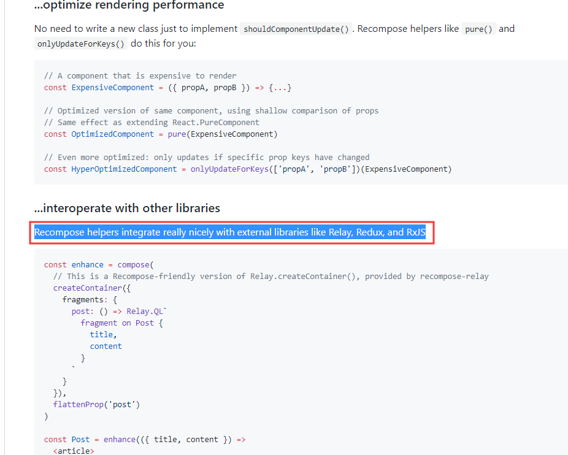

# [返回主目录](../Readme.md)<!-- omit in toc --> 

# 目录 <!-- omit in toc --> 

RxJS可以单独使用，但是在现代客户端开发的过程中很少有使用单一库构建新的应用程序的例子。

之后将介绍RxJS如何配合其他框架使用。并且还会展示如何将RxJS添加到新项目中以及如何将其合并到现有项目中。

# 库和框架 Libraries and Frameworks
首先说一下库和框架。

对于我来说，库 Libraries，是功能的补充，他们能帮助解决特定的问题，但是不会决定应用程序的整体架构。

理想情况下，库需要避免与其他库发生冲突，并且允许你根据需要自定义的选择其功能。

根据这个定义RxJS绝对是一个库。像其他的一些例如经典的Jquery也是库，
RxJS能够很好的与其他库一起工作。

框架 Frameworks，相对于Libraries，规模更大，规范性更强。通常在开始构建应用程序的时候会选择单个Framework，之后使用多个Libraries补充该Framework，以帮助解决一些特定问题。

目前最流行的三个前端框架是 Angular、React、Vue。这些Frameworks都带有构建应用程序需要的大部分脚手架，并且也可以轻松使用像RxJS这样的Libraries。

之后将会展示如何在Framework中使用RxJS这种Libraries。并且阐述一下RxJS与Angular的关系。

# RxJS与Angular
RxJS默认包含在Angular中，但不是不默认包含在React和Vue中。这意味着在Angular应用程序中开始使用RxJS会相对容易一些。                                          

在Visual Studio Code中使用AngularCLI创建一个新的应用程序

使用ng new命令创建一个默认设置的、命名为AngularWithRxJS的应用程序。一旦NPM安装完成，使用VS code打开这个项目。跳转到node_modules文件夹，可以看到RxJS已经包含其中。无需再额外安装。

要使用它，可以在项目中打开一个TS代码文件，导入需要的内容。例如本例中就导入了Observable类型。也可以导入RxJS中的Operator或者其他类型。

Angular将其包含在Framework中，这是一个非常好的体验，开箱即用。

为了进一步强化RxJS在Angular中的重要性，在[Angular的官方文档](https://angular.io/guide/observables)中，有一个章节专门介绍了关于RxJS在Angular中的使用。

可以看到有一个标题为Observables & RxJS，其中包含了几页精心编辑的文档。涵盖了RxJS的一些常规功能，已经如何在Angular中使用RxJS的一些具体示例。

经常听人说RxJS是Angular的一部分。这种说法是错误的。RxJS只是包含在Angular中，但是RxJS是一个独立于Angular的完整独立的库。RxJS支持许多流行的Javascript libraries和Frameworks。

# RxJS和React、Vue
与Angular非常相似的React和Vue是非常流行的框架。这两个Framework目前默认不包含RxJS，但是你可以将它添加到项目使用。

## RxJS和React
React的组件体系结构更多的围绕状态而不是数据流构建，但是Web和Javascript的异步性质仍然是存在的，并且RxJS可以帮助React开发人员处理异步数据。

有一个流行的库经常与React一起使用，它的名字叫[recompose](https://github.com/acdlite/recompose)。它包含许多函数组件实用程序，并且包括一组Observable实用程序，这些实用程序使得React中处理数据流变得更加容易。

如上图所示，它能够帮助React开发者更好的集成RxJS。

从recompose页面上可以看到，作者正在主动停止维护这个项目，类似这个项目的功能正在由React Hooks提供。

## RxJS和Vue

在Vue中，可以使用npm将RxJS添加到项目中并开始使用它，但是，Vue团队开发了一个专门用于帮助开发人员将RxJS与Vue集成的插件。名字叫做[vue-rx](https://github.com/vuejs/vue-rx)。

这个插件为Vue.js提供了RxJS集成。自述文件中包含了很多关于安装软件包和配置应用程序的很多信息。而且还有一个example文档，展示了一些示例帮助开发者快速上手。

更多的RxJS与Framework一起使用的细节超出本节的内容。但是要知道无论你用那种Framework，这种方式是十分可行的。并且你可以利用到反应式编程和RxJS的优势。

下一节将展示RxJS的一些特定功能，这些功能会有助于解决日常开发中涉及到的问题。