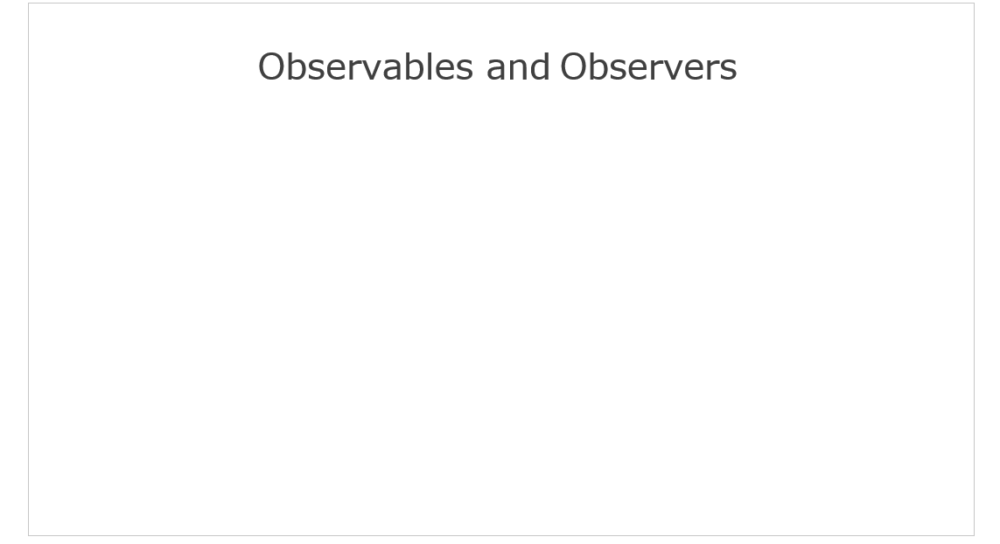

# [返回主目录](../Readme.md)<!-- omit in toc --> 

# 目录 <!-- omit in toc --> 


# 简介
RxJS包含很多特性和功能，我没法在概述中涵盖所有东西，但是至少能让你大概齐了解大部分的库和主要的构建块。

我认为RxJS可以分为五个方面。分别是
- Observable 可观察对象
- Observer 观察者
- Operator 操作符
- Subject 主题
- Scheduler 调度器


其中最重要的两个是Observable可观察对象和Observer观察者。在[第二节](2.介绍Reactive编程和RxJS.md)已经详细讨论过。之后将继续介绍具体代码的编写。

一旦获得了Observable，就可以使用Operator对Observable生成的值进行各种操作。从而得到你最终想要的结果。之后将展示一些Operator的代码，并展示多个Operator链接在一起的示例。

最后将会唠唠一些RxJS高端的东西。Subject(主题)和Scheduler(调度器),Subject允许你为多个Observer生成值，Scheduler可以对Observable的执行进行细粒度的控制。

OK，首先从Observable和Observer开始。

# Observables和Observers

## 最基础的使用方式

大多数开发者使用RxJS的第一个函数是subscribe订阅函数，使用Observer订阅Observable，并编写处理Observable生成的数据所需要的函数。



上边的动图展示了Observable和Observer的关系。

Observer实际上是一个非常简单的对象，它实现了包含next,error,complete的三个方法。就这些东西。如果你创建了一个对象包含了这三种方法，那这个对象就是Observer对象。

当你想从Observable对象获取数据时，使用Observable的subscribe方法，并将Observer对象当作参数传递给这个方法进而实现订阅。

当Observable对象有数据、错误、完成消息时，会直接调用Observer相对应的方法。

使用一段简单的代码进行介绍

```ts
import { Observable, from } from 'rxjs';

let nums$ = from([-2, -1, 0, 1, 2]);

let observer = {
    next: value => console.log(value),
    error: err => console.log(`ERROR: ${err}`),
    complete: () => console.log('All done.')
};

nums$.subscribe(observer);
//-2， -1， 0， 1， 2

```
这里创建一个非常简单的Observable对象，它所产生的数据仅仅是一个数组对象。

创建一个Observer对象，它具有三个方法next、error、complete。
- 这里的next方法只是简单的把Observable产生的值记录在控制台上。
- error方法当Observable出现错误时会将错误信息记录在控制台上，并且带有ERROR的前缀。
- complete方法不接受任何参数，可以在这个方法编写一些清理业务逻辑，这里我仅仅是在控制台记录All done.表示Observable对象的值已经生成完毕。

之后需要执行订阅操作才能让Observable执行并产生数组中的值。通过调用Observable的subscribe方法，并将Observer当作参数传递。之后数组中的每一个值都将传递到Observer的next方法上，本例中将会依次打印到控制台中。

## 使用subscriber创建自定义的Observable

如果第一次使用RxJS,可以遵循这种做法写代码。当然也可以从某个框架函数返回Observable对象，或者从数组或事件创建Observable对象。但是在需要精确控制数据生成方式的时候，就需要自己创建自定义的Observable对象。

要创建自定义的Observable对象就要用到一个称为subscriber(订阅者)的对象。这个subscriber对象恰好实现与Observer对象相同的接口。

```ts
import { Observable } from 'rxjs';

let customObservable = Observable.create(subscriber => {
    if(newValue) {
        subscriber.next(newValue);
    }

    if(newError) {
        subscriber.error(newError);
    }

    if(done) {
        subscriber.complete();
    }
});
```
导入Observable之后，可以通过其create方法创建自定义的Observable对象。create方法接受一个函数，该函数将负责向Observer发送值、错误、完成信息的工作。

代码中，将一个名字叫做subscriber的参数传递给create方法，这个subscriber参数与Observer对象实现相同的接口。具有名为next、error、complete的方法。在这个函数内部，可以写任何逻辑在里面，你想写啥就写啥要实现啥就写啥。最后使用subscriber对象把需要处理的数据发送给Observer。

如果产生新值的时候，只需要调用subscriber的next方法，并把新值传递给这个方法。如果遇到错误，则调用subscriber的error函数处理。当确定Observable值已经生成完毕后，就直接调用subscriber的complete方法。这些方法的调用都会在后台调用订阅该Observable的Observer上的对应方法。

# Operators
Operators操作符，是处理Observable生成值的函数，Operators也是RxJS库构建块之一，没有Operators，RxJS就不会这么流行。

```ts
import { Observable, from } from 'rxjs';
import { filter, map } from 'rxjs/operators';

let nums$ = from ([-2, -1, 0, 1, 2]);

let observer = {
    next: value => console.log(value),
    error: err => console.log(`ERROR: ${err}`),
    complete: () => console.log('All done.')
};

//nums$.subscribe(observer);

nums$.pipe(
    filter(num => num > 0)
)
.subscribe(observer);

// 1, 2

nums$.pipe(
    filter(num => num > 0),
    map(positiveNum => positiveNum * 3)
)
.subscribe(observer);

// 3, 6
```

在使用Operators之前，必须要先导入它，所有的Operators均在rxjs/operators目录下，本例中导入了filter和map这两个Operators。

使用from创建一个数组的Observable对象，之后再创建一个Observer，并使用subscribe方法订阅了Observable以开始接收值。(注释的内容)

但是，如果我想对来自Observable的数据进行处理，就要使用Operators，在使用Operators之前可以用pipe管道函数。

在pipe管道函数中，可以想使用函数一样使用Operators，代码中使用了filter Operator。其意思是只允许大于0的值通过filter函数。pipe管道函数会调用函数内所有的Operators，并将处理后的数据生成一个新的Observable对象返回回去，之后就可以在这个新的Observable对象上使用subscribe函数进行订阅操作，把这些值传递给Observer。在代码中，最后的结果将是`1, 2`。

如果我想对原始Observable应用多个Operators，只需要在第一个Operators之后添加逗号，然后继续添加新的Operators即可。代码中，使用filter operator之后继续使用map operator，然过滤后的值，每个都乘以3。在订阅后，得到的值就是`3, 6`。

RxJS有100多个Operators，如果你需要自定义行为，也可以创建自己的Operators。