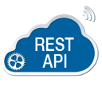

# 简介
这是一个知识库，包含一些自己编写的知识、代码示例和收集整理的配套资料

        </img>
        </img>
        </img>
        </img>
        </img>
        </img>
        </img>
        </img>
        </img>

## 相关知识目录

> [Angular 知识库](../Angular/docs/Readme.md)

> [Angular 干货](../Angular干货/docs/Readme.md)

> [RxJS](../RxJS/docs/Readme.md)

> [MarkDown相关](../Markdown/docs/readme.md) 

> [RESTful API](../RESTfulAPI/docs/readme.md)

  
